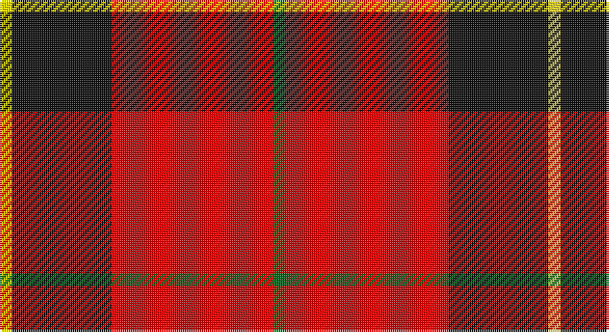

This page is one **sett** — a single exact thread-count. It belongs to the [tartan](/setts/g1r13k8ly1/)
(the same proportion at any scale), whose colour order is pattern [GRKY](/stripes/grky/).

Part of the [Billy Apple®](/tartans/billy-apple/) tartan — the named design grouping this sett with its other cloths.

Sourced from register-of-tartans.  It is a [4 stripe tartan](/stripes/stripes4/).

Original link https://www.tartanregister.gov.uk/tartanDetails.aspx?ref=11143

## Also known as

This cloth is also recorded under:

- Billy Apple
- Billy Apple® Red
- Billy Apple® Yellow

## Register references

External register numbers recorded for this tartan.

- Scottish Register of Tartans: [11143](https://www.tartanregister.gov.uk/tartanDetails.aspx?ref=11143)

## Thread count
Y/6 K48 R78 G/6

One full sett is **264 threads**.

## Palette

Palette: <strong>Tartan Register</strong>
<table><thead><tr><th>Colour</th><th>Threads</th><th>Shade</th><th>Base</th><th>OKLCh</th></tr></thead><tbody><tr><td>Y/</td><td style="text-align:right;font-variant-numeric:tabular-nums">6</td><td><code style="background-color:#FFE600;">#FFE600</code> <small style="color:#888">#FFE600</small></td><td>Y <code style="background-color:#F2BF00;">#F2BF00</code></td><td><small style="color:#888">oklch(91.7% 0.192 101.4)</small></td></tr><tr><td>K</td><td style="text-align:right;font-variant-numeric:tabular-nums">48</td><td><code style="background-color:#101010;">#101010</code> <small style="color:#888">#101010</small></td><td>K <code style="background-color:#000000;">#000000</code></td><td><small style="color:#888">oklch(17.3% 0.000 89.9)</small></td></tr><tr><td>R</td><td style="text-align:right;font-variant-numeric:tabular-nums">78</td><td><code style="background-color:#DC0000;">#DC0000</code> <small style="color:#888">#DC0000</small></td><td>R <code style="background-color:#CC0000;">#CC0000</code></td><td><small style="color:#888">oklch(56.2% 0.230 29.2)</small></td></tr><tr><td>G/</td><td style="text-align:right;font-variant-numeric:tabular-nums">6</td><td><code style="background-color:#006818;">#006818</code> <small style="color:#888">#006818</small></td><td>G <code style="background-color:#006100;">#006100</code></td><td><small style="color:#888">oklch(45.0% 0.142 145.0)</small></td></tr></tbody></table>

# Sample pattern

## Nearest tartans

The nearest existing variants by ΔTartan distance, with this tartan at the top so the swatches line up against it.

ΔTartan

Tartan

Sett

—

<a href="/ttd/edit/#slug=g1r13k8ly1~x6">Billy Apple® Red</a> <a class="nn-out" href="/variants/s4/g1r13k8ly1~x6/" title="open its dictionary page">↗</a>

0.97

<a href="/ttd/edit/#slug=r80k52w7o12&amp;base=g1r13k8ly1~x6">Oklahoma State University (Corporate</a> <a class="nn-out" href="/variants/s4/r80k52w7o12/" title="open its dictionary page">↗</a>

1.14

<a href="/ttd/edit/#slug=k4r26k4w2k13ly4~x2&amp;base=g1r13k8ly1~x6">Dunbar #2</a> <a class="nn-out" href="/variants/s6/k4r26k4w2k13ly4~x2/" title="open its dictionary page">↗</a>

1.16

<a href="/ttd/edit/#slug=r28k4w2k13~x2&amp;base=g1r13k8ly1~x6">Dunbar (District)</a> <a class="nn-out" href="/variants/s4/r28k4w2k13~x2/" title="open its dictionary page">↗</a>

1.17

<a href="/ttd/edit/#slug=r5w2r28k12dg16r3~x2&amp;base=g1r13k8ly1~x6">MacKintosh #4</a> <a class="nn-out" href="/variants/s6/r5w2r28k12dg16r3~x2/" title="open its dictionary page">↗</a>

1.19

<a href="/ttd/edit/#slug=r41k19r7k9w3~x2&amp;base=g1r13k8ly1~x6">MacGregor, Black (Personal)</a> <a class="nn-out" href="/variants/s5/r41k19r7k9w3~x2/" title="open its dictionary page">↗</a>

1.23

<a href="/ttd/edit/#slug=r48k12o7k5w3~x2&amp;base=g1r13k8ly1~x6">Turner (Personal)</a> <a class="nn-out" href="/variants/s5/r48k12o7k5w3~x2/" title="open its dictionary page">↗</a>

1.27

<a href="/ttd/edit/#slug=r4k8r12k1ly1~x2&amp;base=g1r13k8ly1~x6">MacKeane</a> <a class="nn-out" href="/variants/s5/r4k8r12k1ly1~x2/" title="open its dictionary page">↗</a>

1.32

<a href="/ttd/edit/#slug=r36k18r4k7w2~x2&amp;base=g1r13k8ly1~x6">Hopkins (Name)</a> <a class="nn-out" href="/variants/s5/r36k18r4k7w2~x2/" title="open its dictionary page">↗</a>

1.34

<a href="/ttd/edit/#slug=ly3k2r10k1~x4&amp;base=g1r13k8ly1~x6">Masai Shuka 26 (Artefact)</a> <a class="nn-out" href="/variants/s4/ly3k2r10k1~x4/" title="open its dictionary page">↗</a>

1.35

<a href="/ttd/edit/#slug=r52k32dg22r16ly3r16&amp;base=g1r13k8ly1~x6">Sturrock</a> <a class="nn-out" href="/variants/s6/r52k32dg22r16ly3r16/" title="open its dictionary page">↗</a>

## Neighbour map

Every grey dot is one of 14360 variants placed by the first two principal components of the ΔTartan feature space (44% of its variance). Red is this tartan; blue dots are its nearest — click one to open its page.

<svg viewBox="0 0 640 380" role="img" style="max-width:100%;height:auto;border:1px solid #e0e0e0;border-radius:4px;display:block" xmlns="http://www.w3.org/2000/svg"><image href="/nn/cloud.v1.png" width="640" height="380"/><a href="/variants/s4/r80k52w7o12/"><circle cx="288.5" cy="206.7" r="4" fill="#3465a4"><title>Oklahoma State University (Corporate</title></circle></a><a href="/variants/s6/k4r26k4w2k13ly4~x2/"><circle cx="280.3" cy="166.4" r="4" fill="#3465a4"><title>Dunbar #2</title></circle></a><a href="/variants/s4/r28k4w2k13~x2/"><circle cx="374.0" cy="210.7" r="4" fill="#3465a4"><title>Dunbar (District)</title></circle></a><a href="/variants/s6/r5w2r28k12dg16r3~x2/"><circle cx="300.2" cy="181.9" r="4" fill="#3465a4"><title>MacKintosh #4</title></circle></a><a href="/variants/s5/r41k19r7k9w3~x2/"><circle cx="381.4" cy="202.6" r="4" fill="#3465a4"><title>MacGregor, Black (Personal)</title></circle></a><a href="/variants/s5/r48k12o7k5w3~x2/"><circle cx="393.7" cy="161.5" r="4" fill="#3465a4"><title>Turner (Personal)</title></circle></a><a href="/variants/s5/r4k8r12k1ly1~x2/"><circle cx="383.5" cy="213.8" r="4" fill="#3465a4"><title>MacKeane</title></circle></a><a href="/variants/s5/r36k18r4k7w2~x2/"><circle cx="398.3" cy="190.2" r="4" fill="#3465a4"><title>Hopkins (Name)</title></circle></a><a href="/variants/s4/ly3k2r10k1~x4/"><circle cx="365.8" cy="212.9" r="4" fill="#3465a4"><title>Masai Shuka 26 (Artefact)</title></circle></a><a href="/variants/s6/r52k32dg22r16ly3r16/"><circle cx="327.4" cy="190.4" r="4" fill="#3465a4"><title>Sturrock</title></circle></a><circle cx="328.8" cy="192.0" r="5" fill="#c00000"/></svg>

ID: /variants/s4/g1r13k8ly1~x6/
