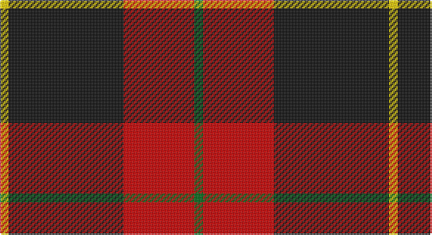

This page is one **sett** — a single exact thread-count. It belongs to the [tartan](/setts/g1r8k13ly1/)
(the same proportion at any scale), whose colour order is pattern [GRKY](/stripes/grky/).

Part of the [Billy Apple®](/tartans/billy-apple/) tartan — the named design grouping this sett with its other cloths.

Sourced from tartans-authority.  It is a [4 stripe tartan](/stripes/stripes4/).

Original link http://www.tartansauthority.com/tartan-ferret/display/11143/

## Also known as

This cloth is also recorded under:

- Billy Apple
- Billy Apple® Red
- Billy Apple® Yellow

## Register references

External register numbers recorded for this tartan.

- Scottish Register of Tartans: [11143](https://www.tartanregister.gov.uk/tartanDetails?ref=11143)
- Scottish Tartans Authority (ITI): 11143

## Thread count
Y/6 K78 R48 G/6

One full sett is **264 threads**.

## Palette

Palette: <strong>Tartan Register</strong>
<table><thead><tr><th>Colour</th><th>Threads</th><th>Shade</th><th>Base</th><th>OKLCh</th></tr></thead><tbody><tr><td>Y/</td><td style="text-align:right;font-variant-numeric:tabular-nums">6</td><td><code style="background-color:#FCCC00;">#FCCC00</code> <small style="color:#888">#FCCC00</small></td><td>Y <code style="background-color:#F2BF00;">#F2BF00</code></td><td><small style="color:#888">oklch(86.2% 0.176 91.5)</small></td></tr><tr><td>K</td><td style="text-align:right;font-variant-numeric:tabular-nums">78</td><td><code style="background-color:#101010;">#101010</code> <small style="color:#888">#101010</small></td><td>K <code style="background-color:#000000;">#000000</code></td><td><small style="color:#888">oklch(17.3% 0.000 89.9)</small></td></tr><tr><td>R</td><td style="text-align:right;font-variant-numeric:tabular-nums">48</td><td><code style="background-color:#C80000;">#C80000</code> <small style="color:#888">#C80000</small></td><td>R <code style="background-color:#CC0000;">#CC0000</code></td><td><small style="color:#888">oklch(52.3% 0.215 29.2)</small></td></tr><tr><td>G/</td><td style="text-align:right;font-variant-numeric:tabular-nums">6</td><td><code style="background-color:#006818;">#006818</code> <small style="color:#888">#006818</small></td><td>G <code style="background-color:#006100;">#006100</code></td><td><small style="color:#888">oklch(45.0% 0.142 145.0)</small></td></tr></tbody></table>

# Sample pattern

## Compared to the master

This cloth is one sett of its design; the master sett (the exemplar the design is anchored on) is below for comparison.

<figure style="margin:0"><figcaption style="color:#888;font-size:smaller">this sett</figcaption></figure>
<figure style="margin:0"><figcaption style="color:#888;font-size:smaller"><a href="/setts/g1r13k8ly1/">master sett →</a></figcaption></figure>

## Nearest tartans

The nearest existing variants by ΔTartan distance, with this tartan at the top so the swatches line up against it.

ΔTartan

Tartan

Sett

—

<a href="/ttd/edit/#slug=g1r8k13ly1~x6">Billy Apple</a> <a class="nn-out" href="/variants/s4/g1r8k13ly1~x6/" title="open its dictionary page">↗</a>

0.79

<a href="/ttd/edit/#slug=db3k32r27w2~x2&amp;base=g1r8k13ly1~x6">Templar Grand Priory USA</a> <a class="nn-out" href="/variants/s4/db3k32r27w2~x2/" title="open its dictionary page">↗</a>

1.24

<a href="/ttd/edit/#slug=k16r2k2r12w1~x2&amp;base=g1r8k13ly1~x6">MacIver</a> <a class="nn-out" href="/variants/s5/k16r2k2r12w1~x2/" title="open its dictionary page">↗</a>

1.26

<a href="/ttd/edit/#slug=db1r16k16ly1~x4&amp;base=g1r8k13ly1~x6">Skinner</a> <a class="nn-out" href="/variants/s4/db1r16k16ly1~x4/" title="open its dictionary page">↗</a>

1.27

<a href="/ttd/edit/#slug=o4k48o16r12db3~x2&amp;base=g1r8k13ly1~x6">Calgary Firefighters (Corporate)</a> <a class="nn-out" href="/variants/s5/o4k48o16r12db3~x2/" title="open its dictionary page">↗</a>

1.27

<a href="/ttd/edit/#slug=r80k52w7o12&amp;base=g1r8k13ly1~x6">Oklahoma State University (Corporate</a> <a class="nn-out" href="/variants/s4/r80k52w7o12/" title="open its dictionary page">↗</a>

1.31

<a href="/ttd/edit/#slug=g3ly5r14k36w3~x2&amp;base=g1r8k13ly1~x6">Papua New Guinea</a> <a class="nn-out" href="/variants/s5/g3ly5r14k36w3~x2/" title="open its dictionary page">↗</a>

1.33

<a href="/ttd/edit/#slug=k2r6k2r6k12ly1~x4&amp;base=g1r8k13ly1~x6">MacQueen</a> <a class="nn-out" href="/variants/s6/k2r6k2r6k12ly1~x4/" title="open its dictionary page">↗</a>

1.36

<a href="/ttd/edit/#slug=k8r1k8r11ly1r1~x4&amp;base=g1r8k13ly1~x6">Swanstrom (Personal)</a> <a class="nn-out" href="/variants/s6/k8r1k8r11ly1r1~x4/" title="open its dictionary page">↗</a>

1.36

<a href="/ttd/edit/#slug=r3k25r25k10lb3~x2&amp;base=g1r8k13ly1~x6">Bodog.com</a> <a class="nn-out" href="/variants/s5/r3k25r25k10lb3~x2/" title="open its dictionary page">↗</a>

1.38

<a href="/ttd/edit/#slug=y4k48y16r12b3~x2&amp;base=g1r8k13ly1~x6">Calgary Firefighters</a> <a class="nn-out" href="/variants/s5/y4k48y16r12b3~x2/" title="open its dictionary page">↗</a>

## Neighbour map

Every grey dot is one of 14360 variants placed by the first two principal components of the ΔTartan feature space (44% of its variance). Red is this tartan; blue dots are its nearest — click one to open its page.

<svg viewBox="0 0 640 380" role="img" style="max-width:100%;height:auto;border:1px solid #e0e0e0;border-radius:4px;display:block" xmlns="http://www.w3.org/2000/svg"><image href="/nn/cloud.v1.png" width="640" height="380"/><a href="/variants/s4/db3k32r27w2~x2/"><circle cx="314.7" cy="200.5" r="4" fill="#3465a4"><title>Templar Grand Priory USA</title></circle></a><a href="/variants/s5/k16r2k2r12w1~x2/"><circle cx="359.3" cy="196.1" r="4" fill="#3465a4"><title>MacIver</title></circle></a><a href="/variants/s4/db1r16k16ly1~x4/"><circle cx="298.4" cy="193.3" r="4" fill="#3465a4"><title>Skinner</title></circle></a><a href="/variants/s5/o4k48o16r12db3~x2/"><circle cx="335.4" cy="189.7" r="4" fill="#3465a4"><title>Calgary Firefighters (Corporate)</title></circle></a><a href="/variants/s4/r80k52w7o12/"><circle cx="288.5" cy="206.7" r="4" fill="#3465a4"><title>Oklahoma State University (Corporate</title></circle></a><a href="/variants/s5/g3ly5r14k36w3~x2/"><circle cx="298.1" cy="170.2" r="4" fill="#3465a4"><title>Papua New Guinea</title></circle></a><a href="/variants/s6/k2r6k2r6k12ly1~x4/"><circle cx="341.5" cy="217.7" r="4" fill="#3465a4"><title>MacQueen</title></circle></a><a href="/variants/s6/k8r1k8r11ly1r1~x4/"><circle cx="335.5" cy="215.7" r="4" fill="#3465a4"><title>Swanstrom (Personal)</title></circle></a><a href="/variants/s5/r3k25r25k10lb3~x2/"><circle cx="316.6" cy="238.4" r="4" fill="#3465a4"><title>Bodog.com</title></circle></a><a href="/variants/s5/y4k48y16r12b3~x2/"><circle cx="341.8" cy="193.6" r="4" fill="#3465a4"><title>Calgary Firefighters</title></circle></a><circle cx="331.5" cy="207.9" r="5" fill="#c00000"/></svg>

ID: /variants/s4/g1r8k13ly1~x6/
