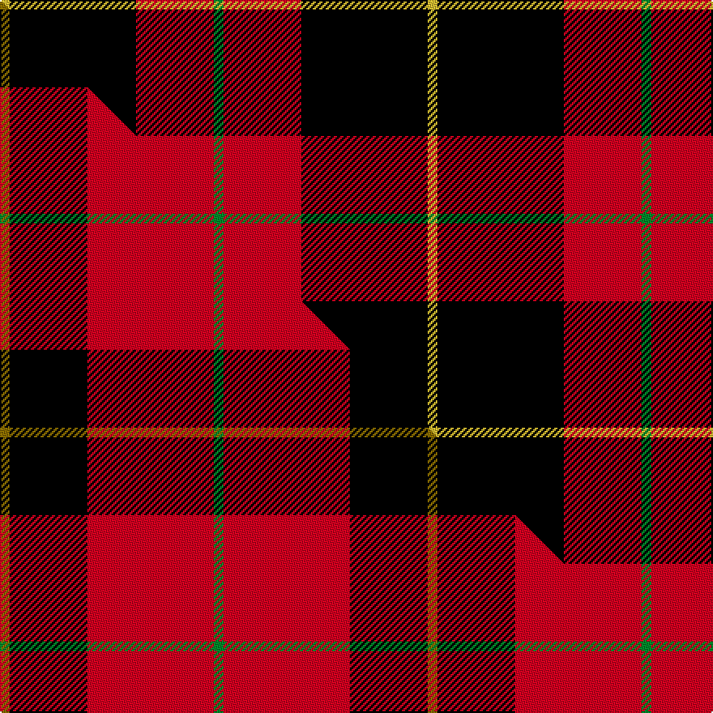

This page is one **sett** — a single exact thread-count. It belongs to the [tartan](/setts/g1r8k13ly1/)
(the same proportion at any scale), whose colour order is pattern [GRKY](/stripes/grky/).

Part of the [Billy Apple®](/tartans/billy-apple-2/) tartan — the named design grouping this sett with its other cloths.

Sourced from tartans-authority.  It is a [4 stripe tartan](/stripes/stripes4/).

Original link http://www.tartansauthority.com/tartan-ferret/display/11143/

## Register references

External register numbers recorded for this tartan.

- Scottish Register of Tartans: [11143](https://www.tartanregister.gov.uk/tartanDetails?ref=11143)
- Scottish Tartans Authority (ITI): 11143

## Thread count
LY/6 K78 R48 G/6

One full sett is **264 threads**.

## Palette
<table><thead><tr><th>Colour</th><th>Shade</th><th>OKLCh</th></tr></thead><tbody><tr><td>G</td><td><code style="background-color:#008B2A;">#008B2A</code> <small style="color:#888">#008B2A</small></td><td><small style="color:#888">oklch(55.4% 0.170 145.9)</small></td></tr><tr><td>K</td><td><code style="background-color:#000000;">#000000</code> <small style="color:#888">#000000</small></td><td><small style="color:#888">oklch(0.0% 0.000 0.0)</small></td></tr><tr><td>R</td><td><code style="background-color:#D60020;">#D60020</code> <small style="color:#888">#D60020</small></td><td><small style="color:#888">oklch(55.2% 0.224 25.5)</small></td></tr><tr><td>LY</td><td><code style="background-color:#DCBC32;">#DCBC32</code> <small style="color:#888">#DCBC32</small></td><td><small style="color:#888">oklch(80.0% 0.150 95.2)</small></td></tr></tbody></table>

# Sample pattern

## Compared to the master

This cloth is one sett of its design; the master sett (the exemplar the design is anchored on) is below for comparison.

Its **ΔTartan distance** from the master is **1.28** — the same measure the nearest-tartans table ranks by (0 is identical; a re-scale of the same cloth is near 0, a recolour or a different proportion further).

<figure class="master-compare" style="margin:0">

this sett
master sett ★

<figcaption style="color:#888;font-size:smaller">One weave of this sett against the <a href="/setts/y1k8r13g1/">master sett ★</a>, split on the diagonal: a shared proportion runs seamlessly across it with only the shades shifting; a different proportion breaks on it.</figcaption>
</figure>

## Nearest variants

The nearest existing variants by ΔTartan distance, with this cloth at the top so the swatches line up against it.

ΔTartan

Threads

Variant

Sett

—

264

<a href="/variants/s4/g1r8k13ly1~x6/">Billy Apple</a>

<a href="/ttd/edit/#slug=y1k8r13g1~x6&amp;base=g1r8k13ly1~x6" title="compare in the TTD">0.80</a>

264

<a href="/variants/s4/y1k8r13g1~x6/">Billy Apple® Red</a>

<a href="/ttd/edit/#slug=y1k8r8w1~x4&amp;base=g1r8k13ly1~x6" title="compare in the TTD">0.85</a>

136

<a href="/variants/s4/y1k8r8w1~x4/">Connel (Clan)</a>

<a href="/ttd/edit/#slug=y1k8r8w1~x2&amp;base=g1r8k13ly1~x6" title="compare in the TTD">0.85</a>

68

<a href="/variants/s4/y1k8r8w1~x2/">Connel</a>

<a href="/ttd/edit/#slug=db1r16k16y1~x4&amp;base=g1r8k13ly1~x6" title="compare in the TTD">0.91</a>

264

<a href="/variants/s4/db1r16k16y1~x4/">Skinner</a>

<a href="/ttd/edit/#slug=g3y5r13k33w2~x2&amp;base=g1r8k13ly1~x6" title="compare in the TTD">1.09</a>

214

<a href="/variants/s5/g3y5r13k33w2~x2/">Papua New Guinea Pipes and Drums</a>

<a href="/ttd/edit/#slug=db3k32r27w2~x2&amp;base=g1r8k13ly1~x6" title="compare in the TTD">1.09</a>

246

<a href="/variants/s4/db3k32r27w2~x2/">Templar Grand Priory USA</a>

<a href="/ttd/edit/#slug=g3y5r14k36w3~x2&amp;base=g1r8k13ly1~x6" title="compare in the TTD">1.10</a>

232

<a href="/variants/s5/g3y5r14k36w3~x2/">Papua New Guinea</a>

<a href="/ttd/edit/#slug=w1k10r10w1~x4&amp;base=g1r8k13ly1~x6" title="compare in the TTD">1.12</a>

168

<a href="/variants/s4/w1k10r10w1~x4/">Masai Shuka 01 (Artefact)</a>

<a href="/ttd/edit/#slug=db1r8k8lo1~x4&amp;base=g1r8k13ly1~x6" title="compare in the TTD">1.16</a>

136

<a href="/variants/s4/db1r8k8lo1~x4/">Skinner (Name)</a>

<a href="/ttd/edit/#slug=db4y4r33k30w2~x2&amp;base=g1r8k13ly1~x6" title="compare in the TTD">1.55</a>

280

<a href="/variants/s5/db4y4r33k30w2~x2/">Wormeck (2013) Germany</a>

## Neighbour map

Every grey dot is one of 13620 variants placed by the first two principal components of the ΔTartan feature space (42% of its variance). Red is this tartan; blue dots are its nearest — click one to open its page.

<svg viewBox="0 0 640 380" role="img" style="max-width:100%;height:auto;border:1px solid #e0e0e0;border-radius:4px;display:block" xmlns="http://www.w3.org/2000/svg"><image href="/nn/cloud.v1.png" width="640" height="380"/><a href="/variants/s4/y1k8r13g1~x6/"><circle cx="290.1" cy="176.1" r="4" fill="#3465a4"><title>Billy Apple® Red</title></circle></a><a href="/variants/s4/y1k8r8w1~x4/"><circle cx="209.2" cy="205.8" r="4" fill="#3465a4"><title>Connel (Clan)</title></circle></a><a href="/variants/s4/y1k8r8w1~x2/"><circle cx="209.2" cy="205.8" r="4" fill="#3465a4"><title>Connel</title></circle></a><a href="/variants/s4/db1r16k16y1~x4/"><circle cx="266.8" cy="171.4" r="4" fill="#3465a4"><title>Skinner</title></circle></a><a href="/variants/s5/g3y5r13k33w2~x2/"><circle cx="268.8" cy="136.5" r="4" fill="#3465a4"><title>Papua New Guinea Pipes and Drums</title></circle></a><a href="/variants/s4/db3k32r27w2~x2/"><circle cx="264.8" cy="173.6" r="4" fill="#3465a4"><title>Templar Grand Priory USA</title></circle></a><a href="/variants/s5/g3y5r14k36w3~x2/"><circle cx="257.3" cy="147.8" r="4" fill="#3465a4"><title>Papua New Guinea</title></circle></a><a href="/variants/s4/w1k10r10w1~x4/"><circle cx="242.6" cy="206.4" r="4" fill="#3465a4"><title>Masai Shuka 01 (Artefact)</title></circle></a><a href="/variants/s4/db1r8k8lo1~x4/"><circle cx="212.8" cy="205.9" r="4" fill="#3465a4"><title>Skinner (Name)</title></circle></a><a href="/variants/s5/db4y4r33k30w2~x2/"><circle cx="218.6" cy="142.9" r="4" fill="#3465a4"><title>Wormeck (2013) Germany</title></circle></a><circle cx="280.9" cy="177.6" r="5" fill="#c00000"/><text x="320" y="376" text-anchor="middle" font-size="11" fill="#999">ground</text><text x="11" y="190" text-anchor="middle" font-size="11" fill="#999" transform="rotate(-90 11 190)">complexity</text></svg>

ID: /variants/s4/g1r8k13ly1~x6/
