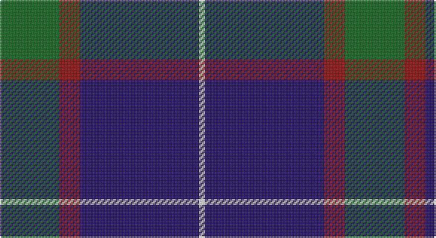

This page is one **sett** — a single exact thread-count. It belongs to the [tartan](/setts/g20r7db40w2/)
(the same proportion at any scale), whose colour order is pattern [GRBW](/stripes/grbw/).

Sourced from tartans-authority.  It is a [4 stripe tartan](/stripes/stripes4/).

Original link http://www.tartansauthority.com/tartan-ferret/display/11140/

## Register references

External register numbers recorded for this tartan.

- Scottish Register of Tartans: [11140](https://www.tartanregister.gov.uk/tartanDetails?ref=11140)
- Scottish Tartans Authority (ITI): 11140

## Thread count
G/40 DR14 DB80 W/4

One full sett is **232 threads**.

## Palette

Palette: <strong>Tartan Register</strong>
<table><thead><tr><th>Colour</th><th>Threads</th><th>Shade</th><th>Base</th><th>OKLCh</th></tr></thead><tbody><tr><td>G/</td><td style="text-align:right;font-variant-numeric:tabular-nums">40</td><td><code style="background-color:#006818;">#006818</code> <small style="color:#888">#006818</small></td><td>G <code style="background-color:#006100;">#006100</code></td><td><small style="color:#888">oklch(45.0% 0.142 145.0)</small></td></tr><tr><td>DR</td><td style="text-align:right;font-variant-numeric:tabular-nums">14</td><td><code style="background-color:#A00000;">#A00000</code> <small style="color:#888">#A00000</small></td><td>R <code style="background-color:#CC0000;">#CC0000</code></td><td><small style="color:#888">oklch(44.3% 0.182 29.2)</small></td></tr><tr><td>DB</td><td style="text-align:right;font-variant-numeric:tabular-nums">80</td><td><code style="background-color:#1C0070;">#1C0070</code> <small style="color:#888">#1C0070</small></td><td>B <code style="background-color:#2A418A;">#2A418A</code></td><td><small style="color:#888">oklch(26.3% 0.162 277.1)</small></td></tr><tr><td>W/</td><td style="text-align:right;font-variant-numeric:tabular-nums">4</td><td><code style="background-color:#FCFCFC;">#FCFCFC</code> <small style="color:#888">#FCFCFC</small></td><td>W <code style="background-color:#F7F7F7;">#F7F7F7</code></td><td><small style="color:#888">oklch(99.1% 0.000 89.9)</small></td></tr></tbody></table>

# Sample pattern

## Nearest tartans

The nearest existing variants by ΔTartan distance, with this tartan at the top so the swatches line up against it.

ΔTartan

Tartan

Sett

—

<a href="/ttd/edit/#slug=g20r7db40w2~x2">McNiff, Kevin (Personal)</a> <a class="nn-out" href="/variants/s4/g20r7db40w2~x2/" title="open its dictionary page">↗</a>

0.91

<a href="/ttd/edit/#slug=dg20r7db40w2~x2&amp;base=g20r7db40w2~x2">McNiff, Kevin (Personal)</a> <a class="nn-out" href="/variants/s4/dg20r7db40w2~x2/" title="open its dictionary page">↗</a>

0.91

<a href="/ttd/edit/#slug=r4db32k15w2~x2&amp;base=g20r7db40w2~x2">Scottish Nuclear</a> <a class="nn-out" href="/variants/s4/r4db32k15w2~x2/" title="open its dictionary page">↗</a>

1.05

<a href="/ttd/edit/#slug=r5db26k12w2~x4&amp;base=g20r7db40w2~x2">Mirror (Corporate)</a> <a class="nn-out" href="/variants/s4/r5db26k12w2~x4/" title="open its dictionary page">↗</a>

1.10

<a href="/ttd/edit/#slug=w4t28db49ly3~x2&amp;base=g20r7db40w2~x2">McKerrell of Hillhouse</a> <a class="nn-out" href="/variants/s4/w4t28db49ly3~x2/" title="open its dictionary page">↗</a>

1.16

<a href="/ttd/edit/#slug=k1ly2k3n12k18w1~x2&amp;base=g20r7db40w2~x2">Jon's Theme</a> <a class="nn-out" href="/variants/s6/k1ly2k3n12k18w1~x2/" title="open its dictionary page">↗</a>

1.36

<a href="/ttd/edit/#slug=r3k1b27k27w3~x2&amp;base=g20r7db40w2~x2">Bro-Spirit of Northmen (Corporate)</a> <a class="nn-out" href="/variants/s5/r3k1b27k27w3~x2/" title="open its dictionary page">↗</a>

1.36

<a href="/ttd/edit/#slug=db60dg16w8lo3~x2&amp;base=g20r7db40w2~x2">MaleHsuHK (Hong Kong) (Personal)</a> <a class="nn-out" href="/variants/s4/db60dg16w8lo3~x2/" title="open its dictionary page">↗</a>

1.37

<a href="/ttd/edit/#slug=w2db35k9w3k9ly2~x2&amp;base=g20r7db40w2~x2">Hannah (Personal)</a> <a class="nn-out" href="/variants/s6/w2db35k9w3k9ly2~x2/" title="open its dictionary page">↗</a>

1.40

<a href="/ttd/edit/#slug=k41lg16dg14w2~x2&amp;base=g20r7db40w2~x2">Hamworthy Association</a> <a class="nn-out" href="/variants/s4/k41lg16dg14w2~x2/" title="open its dictionary page">↗</a>

1.41

<a href="/ttd/edit/#slug=w4t34db60ly3~x2&amp;base=g20r7db40w2~x2">MacKerral Family Tartan</a> <a class="nn-out" href="/variants/s4/w4t34db60ly3~x2/" title="open its dictionary page">↗</a>

## Neighbour map

Every grey dot is one of 14360 variants placed by the first two principal components of the ΔTartan feature space (44% of its variance). Red is this tartan; blue dots are its nearest — click one to open its page.

<svg viewBox="0 0 640 380" role="img" style="max-width:100%;height:auto;border:1px solid #e0e0e0;border-radius:4px;display:block" xmlns="http://www.w3.org/2000/svg"><image href="/nn/cloud.v1.png" width="640" height="380"/><a href="/variants/s4/dg20r7db40w2~x2/"><circle cx="370.3" cy="222.1" r="4" fill="#3465a4"><title>McNiff, Kevin (Personal)</title></circle></a><a href="/variants/s4/r4db32k15w2~x2/"><circle cx="345.8" cy="209.9" r="4" fill="#3465a4"><title>Scottish Nuclear</title></circle></a><a href="/variants/s4/r5db26k12w2~x4/"><circle cx="329.8" cy="227.5" r="4" fill="#3465a4"><title>Mirror (Corporate)</title></circle></a><a href="/variants/s4/w4t28db49ly3~x2/"><circle cx="345.4" cy="211.7" r="4" fill="#3465a4"><title>McKerrell of Hillhouse</title></circle></a><a href="/variants/s6/k1ly2k3n12k18w1~x2/"><circle cx="366.0" cy="187.5" r="4" fill="#3465a4"><title>Jon's Theme</title></circle></a><a href="/variants/s5/r3k1b27k27w3~x2/"><circle cx="303.4" cy="174.7" r="4" fill="#3465a4"><title>Bro-Spirit of Northmen (Corporate)</title></circle></a><a href="/variants/s4/db60dg16w8lo3~x2/"><circle cx="420.9" cy="199.1" r="4" fill="#3465a4"><title>MaleHsuHK (Hong Kong) (Personal)</title></circle></a><a href="/variants/s6/w2db35k9w3k9ly2~x2/"><circle cx="349.3" cy="172.4" r="4" fill="#3465a4"><title>Hannah (Personal)</title></circle></a><a href="/variants/s4/k41lg16dg14w2~x2/"><circle cx="312.1" cy="214.6" r="4" fill="#3465a4"><title>Hamworthy Association</title></circle></a><a href="/variants/s4/w4t34db60ly3~x2/"><circle cx="380.2" cy="207.9" r="4" fill="#3465a4"><title>MacKerral Family Tartan</title></circle></a><circle cx="345.8" cy="212.4" r="5" fill="#c00000"/></svg>

ID: /variants/s4/g20r7db40w2~x2/
