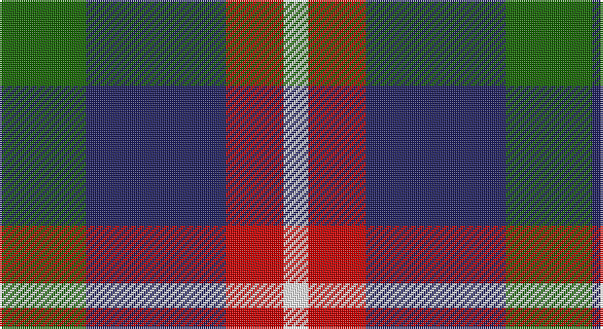

This page is one **sett** — a single exact thread-count. It belongs to the [tartan](/setts/g21db34r14w6/)
(the same proportion at any scale), whose colour order is pattern [GBRW](/stripes/gbrw/).

Part of the [Harbison](/tartans/harbison/) tartan — the named design grouping this sett with its other cloths.

Sourced from register-of-tartans.  It is a [4 stripe tartan](/stripes/stripes4/).

Original link https://www.tartanregister.gov.uk/tartanDetails.aspx?ref=11268

## Register references

External register numbers recorded for this tartan.

- Scottish Register of Tartans: [11268](https://www.tartanregister.gov.uk/tartanDetails.aspx?ref=11268)

## Thread count
G/42 DB68 R28 W/12

One full sett is **246 threads**.

## Palette

Palette: <strong>Tartan Register</strong>
<table><thead><tr><th>Colour</th><th>Threads</th><th>Shade</th><th>Base</th><th>OKLCh</th></tr></thead><tbody><tr><td>G/</td><td style="text-align:right;font-variant-numeric:tabular-nums">42</td><td><code style="background-color:#146400;">#146400</code> <small style="color:#888">#146400</small></td><td>G <code style="background-color:#006100;">#006100</code></td><td><small style="color:#888">oklch(43.9% 0.144 140.9)</small></td></tr><tr><td>DB</td><td style="text-align:right;font-variant-numeric:tabular-nums">68</td><td><code style="background-color:#202060;">#202060</code> <small style="color:#888">#202060</small></td><td>B <code style="background-color:#2A418A;">#2A418A</code></td><td><small style="color:#888">oklch(28.9% 0.111 276.9)</small></td></tr><tr><td>R</td><td style="text-align:right;font-variant-numeric:tabular-nums">28</td><td><code style="background-color:#C80000;">#C80000</code> <small style="color:#888">#C80000</small></td><td>R <code style="background-color:#CC0000;">#CC0000</code></td><td><small style="color:#888">oklch(52.3% 0.215 29.2)</small></td></tr><tr><td>W/</td><td style="text-align:right;font-variant-numeric:tabular-nums">12</td><td><code style="background-color:#FFFFFF;">#FFFFFF</code> <small style="color:#888">#FFFFFF</small></td><td>W <code style="background-color:#F7F7F7;">#F7F7F7</code></td><td><small style="color:#888">oklch(100.0% 0.000 89.9)</small></td></tr></tbody></table>

# Sample pattern

## Nearest tartans

The nearest existing variants by ΔTartan distance, with this tartan at the top so the swatches line up against it.

ΔTartan

Tartan

Sett

—

<a href="/ttd/edit/#slug=g21db34r14w6~x2">Harbison (2015)</a> <a class="nn-out" href="/variants/s4/g21db34r14w6~x2/" title="open its dictionary page">↗</a>

0.74

<a href="/ttd/edit/#slug=db3dg6ly1r3~x10&amp;base=g21db34r14w6~x2">Delroeux, John Michael (Personal)</a> <a class="nn-out" href="/variants/s4/db3dg6ly1r3~x10/" title="open its dictionary page">↗</a>

0.80

<a href="/ttd/edit/#slug=r3o16k16lb3~x4&amp;base=g21db34r14w6~x2">Thompson, Dress (Clan)</a> <a class="nn-out" href="/variants/s4/r3o16k16lb3~x4/" title="open its dictionary page">↗</a>

0.83

<a href="/ttd/edit/#slug=db21g34r14w6~x2&amp;base=g21db34r14w6~x2">Harbison (2015)</a> <a class="nn-out" href="/variants/s4/db21g34r14w6~x2/" title="open its dictionary page">↗</a>

0.93

<a href="/ttd/edit/#slug=db13r5g5w3~x8&amp;base=g21db34r14w6~x2">International Highland Games Fed.</a> <a class="nn-out" href="/variants/s4/db13r5g5w3~x8/" title="open its dictionary page">↗</a>

1.00

<a href="/ttd/edit/#slug=r5o32k31w5~x2&amp;base=g21db34r14w6~x2">Loganair</a> <a class="nn-out" href="/variants/s4/r5o32k31w5~x2/" title="open its dictionary page">↗</a>

1.03

<a href="/ttd/edit/#slug=r5o32k31w5&amp;base=g21db34r14w6~x2">Loganair Uniform Skirt Corporate Tartan</a> <a class="nn-out" href="/variants/s4/r5o32k31w5/" title="open its dictionary page">↗</a>

1.12

<a href="/ttd/edit/#slug=k4w3k4y9r1~x4&amp;base=g21db34r14w6~x2">Oban Grey</a> <a class="nn-out" href="/variants/s5/k4w3k4y9r1~x4/" title="open its dictionary page">↗</a>

1.16

<a href="/ttd/edit/#slug=k4w3k4o9r1~x4&amp;base=g21db34r14w6~x2">Oban Grey District Tartan</a> <a class="nn-out" href="/variants/s5/k4w3k4o9r1~x4/" title="open its dictionary page">↗</a>

1.21

<a href="/ttd/edit/#slug=db3r2g5r8db12w3~x2&amp;base=g21db34r14w6~x2">Edinburgh Bus Company (Corporate)</a> <a class="nn-out" href="/variants/s6/db3r2g5r8db12w3~x2/" title="open its dictionary page">↗</a>

1.23

<a href="/ttd/edit/#slug=db8k3r4ly1~x2&amp;base=g21db34r14w6~x2">Unidentified #17</a> <a class="nn-out" href="/variants/s4/db8k3r4ly1~x2/" title="open its dictionary page">↗</a>

## Neighbour map

Every grey dot is one of 14360 variants placed by the first two principal components of the ΔTartan feature space (44% of its variance). Red is this tartan; blue dots are its nearest — click one to open its page.

<svg viewBox="0 0 640 380" role="img" style="max-width:100%;height:auto;border:1px solid #e0e0e0;border-radius:4px;display:block" xmlns="http://www.w3.org/2000/svg"><image href="/nn/cloud.v1.png" width="640" height="380"/><a href="/variants/s4/db3dg6ly1r3~x10/"><circle cx="170.4" cy="258.1" r="4" fill="#3465a4"><title>Delroeux, John Michael (Personal)</title></circle></a><a href="/variants/s4/r3o16k16lb3~x4/"><circle cx="192.2" cy="254.4" r="4" fill="#3465a4"><title>Thompson, Dress (Clan)</title></circle></a><a href="/variants/s4/db21g34r14w6~x2/"><circle cx="178.1" cy="269.4" r="4" fill="#3465a4"><title>Harbison (2015)</title></circle></a><a href="/variants/s4/db13r5g5w3~x8/"><circle cx="193.9" cy="271.4" r="4" fill="#3465a4"><title>International Highland Games Fed.</title></circle></a><a href="/variants/s4/r5o32k31w5~x2/"><circle cx="209.7" cy="242.3" r="4" fill="#3465a4"><title>Loganair</title></circle></a><a href="/variants/s4/r5o32k31w5/"><circle cx="208.7" cy="240.7" r="4" fill="#3465a4"><title>Loganair Uniform Skirt Corporate Tartan</title></circle></a><a href="/variants/s5/k4w3k4y9r1~x4/"><circle cx="186.9" cy="224.9" r="4" fill="#3465a4"><title>Oban Grey</title></circle></a><a href="/variants/s5/k4w3k4o9r1~x4/"><circle cx="185.2" cy="223.7" r="4" fill="#3465a4"><title>Oban Grey District Tartan</title></circle></a><a href="/variants/s6/db3r2g5r8db12w3~x2/"><circle cx="181.6" cy="231.2" r="4" fill="#3465a4"><title>Edinburgh Bus Company (Corporate)</title></circle></a><a href="/variants/s4/db8k3r4ly1~x2/"><circle cx="237.3" cy="247.0" r="4" fill="#3465a4"><title>Unidentified #17</title></circle></a><circle cx="175.6" cy="267.1" r="5" fill="#c00000"/></svg>

ID: /variants/s4/g21db34r14w6~x2/
