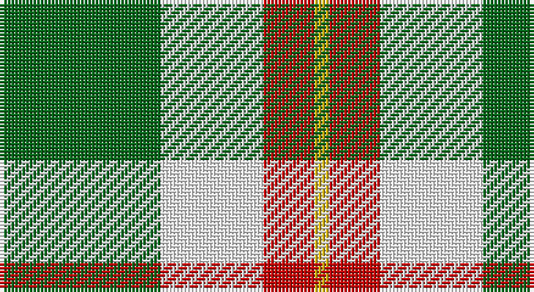

This page is one **sett** — a single exact thread-count. It belongs to the [tartan](/setts/g22w14r7ly2/)
(the same proportion at any scale), whose colour order is pattern [GWRY](/stripes/gwry/).

Part of the [Loch Lomond](/tartans/loch-lomond/) tartan — the named design grouping this sett with its other cloths.

Sourced from register-of-tartans.  It is a [4 stripe tartan](/stripes/stripes4/).

Original link https://www.tartanregister.gov.uk/tartanDetails.aspx?ref=2151

## Also known as

This cloth is also recorded under:

- Loch Lomond #2
- Loch Lomond #3

2 attestations — the source records this cloth was collapsed from (oldest owns this page)

<ul>
<li>01/01/2002 — Loch Lomond #3 (register-of-tartans, <a href="https://www.tartanregister.gov.uk/tartanDetails.aspx?ref=2151">record</a>)</li>
<li>pre 2002 — Loch Lomond #2 (Fashion) (tartans-authority, <a href="http://www.tartansauthority.com/tartan-ferret/display/953/">record</a>)</li>
</ul>

## Register references

External register numbers recorded for this tartan.

- Scottish Register of Tartans: [2151](https://www.tartanregister.gov.uk/tartanDetails.aspx?ref=2151)
- Scottish Tartans Authority (ITI): 953
- Scottish Tartans World Register: 953

## Thread count
G/44 W28 R14 Y/4

One full sett is **132 threads**.

## Palette

Palette: <strong>Tartan Register</strong>
<table><thead><tr><th>Colour</th><th>Threads</th><th>Shade</th><th>Base</th><th>OKLCh</th></tr></thead><tbody><tr><td>G/</td><td style="text-align:right;font-variant-numeric:tabular-nums">44</td><td><code style="background-color:#006818;">#006818</code> <small style="color:#888">#006818</small></td><td>G <code style="background-color:#006100;">#006100</code></td><td><small style="color:#888">oklch(45.0% 0.142 145.0)</small></td></tr><tr><td>W</td><td style="text-align:right;font-variant-numeric:tabular-nums">28</td><td><code style="background-color:#FCFCFC;">#FCFCFC</code> <small style="color:#888">#FCFCFC</small></td><td>W <code style="background-color:#F7F7F7;">#F7F7F7</code></td><td><small style="color:#888">oklch(99.1% 0.000 89.9)</small></td></tr><tr><td>R</td><td style="text-align:right;font-variant-numeric:tabular-nums">14</td><td><code style="background-color:#C80000;">#C80000</code> <small style="color:#888">#C80000</small></td><td>R <code style="background-color:#CC0000;">#CC0000</code></td><td><small style="color:#888">oklch(52.3% 0.215 29.2)</small></td></tr><tr><td>Y/</td><td style="text-align:right;font-variant-numeric:tabular-nums">4</td><td><code style="background-color:#D8B000;">#D8B000</code> <small style="color:#888">#D8B000</small></td><td>Y <code style="background-color:#F2BF00;">#F2BF00</code></td><td><small style="color:#888">oklch(77.1% 0.158 92.3)</small></td></tr></tbody></table>

# Sample pattern

## Compared to the master

This cloth is one sett of its design; the master sett (the exemplar the design is anchored on) is below for comparison.

<figure style="margin:0"><figcaption style="color:#888;font-size:smaller">this sett</figcaption></figure>
<figure style="margin:0"><figcaption style="color:#888;font-size:smaller"><a href="/setts/r28ly3r3db3r4dp8g10dpi15dp4/">master sett →</a></figcaption></figure>

## Nearest tartans

The nearest existing variants by ΔTartan distance, with this tartan at the top so the swatches line up against it.

ΔTartan

Tartan

Sett

—

<a href="/ttd/edit/#slug=g22w14r7ly2~x2">Loch Lomond #3</a> <a class="nn-out" href="/variants/s4/g22w14r7ly2~x2/" title="open its dictionary page">↗</a>

1.15

<a href="/ttd/edit/#slug=o22ly10w3k8~x2&amp;base=g22w14r7ly2~x2">Louisburg Canadian District Tartan</a> <a class="nn-out" href="/variants/s4/o22ly10w3k8~x2/" title="open its dictionary page">↗</a>

1.25

<a href="/ttd/edit/#slug=k3w3k3ly10r1~x6&amp;base=g22w14r7ly2~x2">Burberry (Genuine)</a> <a class="nn-out" href="/variants/s5/k3w3k3ly10r1~x6/" title="open its dictionary page">↗</a>

1.25

<a href="/ttd/edit/#slug=g22w14r7ly1~x2&amp;base=g22w14r7ly2~x2">Loch Lomond</a> <a class="nn-out" href="/variants/s4/g22w14r7ly1~x2/" title="open its dictionary page">↗</a>

1.39

<a href="/ttd/edit/#slug=db8ly1dg5ly12r1dg2~x6&amp;base=g22w14r7ly2~x2">McCabe (2016)</a> <a class="nn-out" href="/variants/s6/db8ly1dg5ly12r1dg2~x6/" title="open its dictionary page">↗</a>

1.40

<a href="/ttd/edit/#slug=lo5g7k1t1~x4&amp;base=g22w14r7ly2~x2">Wilson's, No 195</a> <a class="nn-out" href="/variants/s4/lo5g7k1t1~x4/" title="open its dictionary page">↗</a>

1.44

<a href="/ttd/edit/#slug=g9o7w7r1~x4&amp;base=g22w14r7ly2~x2">MacKinnon, dress</a> <a class="nn-out" href="/variants/s4/g9o7w7r1~x4/" title="open its dictionary page">↗</a>

1.44

<a href="/ttd/edit/#slug=p6lg15g15w2~x2&amp;base=g22w14r7ly2~x2">Thistle and Kudzu Scottish Society</a> <a class="nn-out" href="/variants/s4/p6lg15g15w2~x2/" title="open its dictionary page">↗</a>

1.46

<a href="/ttd/edit/#slug=dg27r9n2ly14~x4&amp;base=g22w14r7ly2~x2">Englehart, City of</a> <a class="nn-out" href="/variants/s4/dg27r9n2ly14~x4/" title="open its dictionary page">↗</a>

1.51

<a href="/ttd/edit/#slug=do4g25lo10g3lo18r4~x2&amp;base=g22w14r7ly2~x2">Unidentfied (Ligioner Highland Games</a> <a class="nn-out" href="/variants/s6/do4g25lo10g3lo18r4~x2/" title="open its dictionary page">↗</a>

1.51

<a href="/ttd/edit/#slug=dg4w35g31w4~x2&amp;base=g22w14r7ly2~x2">Lewis, Green (Dance)</a> <a class="nn-out" href="/variants/s4/dg4w35g31w4~x2/" title="open its dictionary page">↗</a>

## Neighbour map

Every grey dot is one of 14360 variants placed by the first two principal components of the ΔTartan feature space (44% of its variance). Red is this tartan; blue dots are its nearest — click one to open its page.

<svg viewBox="0 0 640 380" role="img" style="max-width:100%;height:auto;border:1px solid #e0e0e0;border-radius:4px;display:block" xmlns="http://www.w3.org/2000/svg"><image href="/nn/cloud.v1.png" width="640" height="380"/><a href="/variants/s4/o22ly10w3k8~x2/"><circle cx="200.1" cy="228.9" r="4" fill="#3465a4"><title>Louisburg Canadian District Tartan</title></circle></a><a href="/variants/s5/k3w3k3ly10r1~x6/"><circle cx="222.6" cy="195.8" r="4" fill="#3465a4"><title>Burberry (Genuine)</title></circle></a><a href="/variants/s4/g22w14r7ly1~x2/"><circle cx="267.0" cy="194.6" r="4" fill="#3465a4"><title>Loch Lomond</title></circle></a><a href="/variants/s6/db8ly1dg5ly12r1dg2~x6/"><circle cx="187.4" cy="175.9" r="4" fill="#3465a4"><title>McCabe (2016)</title></circle></a><a href="/variants/s4/lo5g7k1t1~x4/"><circle cx="236.1" cy="235.8" r="4" fill="#3465a4"><title>Wilson's, No 195</title></circle></a><a href="/variants/s4/g9o7w7r1~x4/"><circle cx="148.9" cy="247.9" r="4" fill="#3465a4"><title>MacKinnon, dress</title></circle></a><a href="/variants/s4/p6lg15g15w2~x2/"><circle cx="162.2" cy="246.5" r="4" fill="#3465a4"><title>Thistle and Kudzu Scottish Society</title></circle></a><a href="/variants/s4/dg27r9n2ly14~x4/"><circle cx="264.7" cy="219.0" r="4" fill="#3465a4"><title>Englehart, City of</title></circle></a><a href="/variants/s6/do4g25lo10g3lo18r4~x2/"><circle cx="221.4" cy="206.0" r="4" fill="#3465a4"><title>Unidentfied (Ligioner Highland Games</title></circle></a><a href="/variants/s4/dg4w35g31w4~x2/"><circle cx="280.9" cy="231.6" r="4" fill="#3465a4"><title>Lewis, Green (Dance)</title></circle></a><circle cx="213.9" cy="214.1" r="5" fill="#c00000"/></svg>

ID: /variants/s4/g22w14r7ly2~x2/
