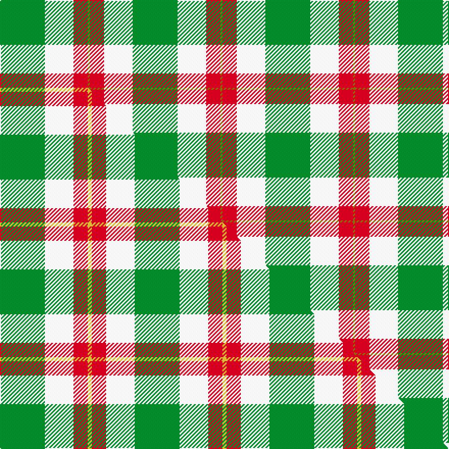

This is one **variant** — a specific cloth: this exact thread count and colourway, with its own
provenance below. It is one weaving of the [sett](/tartans/l/lo/loch-lomond-5/) (the scale-free proportion — the
same cloth at any scale or shade), whose colour order is pattern [GRWG](/stripes/grwg/).

Part of the [Loch Lomond](/tartans/l/lo/loch-lomond-5/) tartan — the named design grouping this sett with its other cloths.

Sourced from weddslist.  It is a [4 stripe tartan](/stripes/stripes4/).

Original link [http://www.weddslist.com/cgi-bin/tartans/pg.pl?source=sts](http://www.weddslist.com/cgi-bin/tartans/pg.pl?source=sts)

Dataset <small>— provenance for this record, inherited from the source manifest</small>

<dl class="dataset-prov">
<dt>source</dt><dd><a href="/sources/weddslist/">Weddslist</a></dd>
<dt>data captured from</dt><dd><a href="https://github.com/thetartan/tartan-database/blob/master/data/weddslist/data.csv">https://github.com/thetartan/tartan-database/blob/master/data/weddslist/data.csv</a></dd>
<dt>data date</dt><dd>2016-11-17 <small>(dataset default)</small></dd>
<dt>licence</dt><dd><a href="https://creativecommons.org/licenses/by-nc-nd/4.0/">CC BY-NC-ND 4.0</a></dd>
</dl>

Capture chain <small>— the hands this data passed through, oldest first; each capture carries its own licence</small>

<ol class="capture-chain">
<li><a href="https://www.weddslist.com/tartans/">Weddslist</a> <small>the living privately compiled reference</small></li>
<li><a href="https://github.com/thetartan/tartan-database">thetartan/tartan-database</a> <small>2016-2017</small> · <a href="https://creativecommons.org/licenses/by-nc-nd/4.0/">CC BY-NC-ND 4.0</a> <small>Levko Kravets's frozen compilation — the capture we vendored, and where its CC licence text came from</small></li>
<li>this dictionary <small>captured 2026-06-10 · commit 5bf86c7566</small> <small>each re-capture is a git commit to data/sources</small></li>
</ol>

## Thread count
G/44 W28 R14 Y/2

One full sett is **130 threads**.

## Palette
<table><thead><tr><th>Colour</th><th>Shade</th><th>OKLCh</th></tr></thead><tbody><tr><td>G</td><td><code style="background-color:#008B2A;">#008B2A</code> <small style="color:#888">#008B2A</small></td><td><small style="color:#888">oklch(55.4% 0.170 145.9)</small></td></tr><tr><td>W</td><td><code style="background-color:#F7F7F7;">#F7F7F7</code> <small style="color:#888">#F7F7F7</small></td><td><small style="color:#888">oklch(97.6% 0.000 89.9)</small></td></tr><tr><td>R</td><td><code style="background-color:#D60020;">#D60020</code> <small style="color:#888">#D60020</small></td><td><small style="color:#888">oklch(55.2% 0.224 25.5)</small></td></tr><tr><td>Y</td><td><code style="background-color:#8B6E00;">#8B6E00</code> <small style="color:#888">#8B6E00</small></td><td><small style="color:#888">oklch(55.1% 0.113 90.4)</small></td></tr></tbody></table>

# Sample pattern

## Compared to the master

This cloth is one sett of its design; the master sett (the exemplar the design is anchored on) is below for comparison.

Its **ΔTartan distance** from the master is **0.50** — the same measure the nearest-tartans table ranks by (0 is identical; a re-scale of the same cloth is near 0, a recolour or a different proportion further).

<figure class="master-compare" style="margin:0">

this sett
master sett ★

<figcaption style="color:#888;font-size:smaller">One weave of this sett against the <a href="/setts/g22w14r7ly2/">master sett ★</a>, split on the diagonal: a shared proportion runs seamlessly across it with only the shades shifting; a different proportion breaks on it.</figcaption>
</figure>

## Nearest tartan variants

The nearest existing variants by ΔTartan distance, with this cloth at the top so the swatches line up against it.

ΔTartan

Threads

Variant

Sett

—

130

<a href="/variants/s4/g22w14r7y1~x2/">Loch Lomond</a>

<a href="/ttd/edit/#slug=g22w14r7ly2~x2&amp;base=g22w14r7y1~x2" title="compare in the TTD">0.50</a>

132

<a href="/variants/s4/g22w14r7ly2~x2/">Loch Lomond #3</a>

<a href="/ttd/edit/#slug=w8r6y2g34db3~x2&amp;base=g22w14r7y1~x2" title="compare in the TTD">1.15</a>

190

<a href="/variants/s5/w8r6y2g34db3~x2/">Milling-Christensen</a>

<a href="/ttd/edit/#slug=g9dr7w7r1~x4&amp;base=g22w14r7y1~x2" title="compare in the TTD">1.32</a>

152

<a href="/variants/s4/g9dr7w7r1~x4/">MacKinnon Dress Trade Tartan</a>

<a href="/ttd/edit/#slug=r15w1db4y1g15~x4&amp;base=g22w14r7y1~x2" title="compare in the TTD">1.82</a>

168

<a href="/variants/s5/r15w1db4y1g15~x4/">Eglinton, Duke of (Artefact)</a>

<a href="/ttd/edit/#slug=db8g20w4r1~x5&amp;base=g22w14r7y1~x2" title="compare in the TTD">1.83</a>

285

<a href="/variants/s4/db8g20w4r1~x5/">Farooq (Personal)</a>

<a href="/ttd/edit/#slug=dp4g10w1r1~x2&amp;base=g22w14r7y1~x2" title="compare in the TTD">1.97</a>

54

<a href="/variants/s4/dp4g10w1r1~x2/">Wilson's, No 189</a>

<a href="/ttd/edit/#slug=g15y3r3dp8w2~x6&amp;base=g22w14r7y1~x2" title="compare in the TTD">1.98</a>

270

<a href="/variants/s5/g15y3r3dp8w2~x6/">ChuMac (Personal)</a>

<a href="/ttd/edit/#slug=g9o7w7r1~x4&amp;base=g22w14r7y1~x2" title="compare in the TTD">2.11</a>

152

<a href="/variants/s4/g9o7w7r1~x4/">MacKinnon, dress</a>

<a href="/ttd/edit/#slug=g9dy7w7r1~x4&amp;base=g22w14r7y1~x2" title="compare in the TTD">2.11</a>

152

<a href="/variants/s4/g9dy7w7r1~x4/">MacKinnon Dress</a>

<a href="/ttd/edit/#slug=w14dp4dy1g8db2~x2&amp;base=g22w14r7y1~x2" title="compare in the TTD">2.13</a>

84

<a href="/variants/s5/w14dp4dy1g8db2~x2/">Manx Laxey Dress Green</a>

## Neighbour map

Every grey dot is one of 13662 variants placed by the first two principal components of the ΔTartan feature space (42% of its variance). Red is this tartan; blue dots are its nearest — click one to open its page. The map is a flat projection of a many-dimensional space — [how to read it](/posts/neighbourhood-maps/).

<svg viewBox="0 0 640 380" role="img" style="max-width:100%;height:auto;border:1px solid #e0e0e0;border-radius:4px;display:block" xmlns="http://www.w3.org/2000/svg"><image href="/nn/cloud.v1.png" width="640" height="380"/><a href="/variants/s4/g22w14r7ly2~x2/"><circle cx="256.9" cy="247.1" r="4" fill="#3465a4"><title>Loch Lomond #3</title></circle></a><a href="/variants/s5/w8r6y2g34db3~x2/"><circle cx="356.7" cy="169.6" r="4" fill="#3465a4"><title>Milling-Christensen</title></circle></a><a href="/variants/s4/g9dr7w7r1~x4/"><circle cx="160.8" cy="264.0" r="4" fill="#3465a4"><title>MacKinnon Dress Trade Tartan</title></circle></a><a href="/variants/s5/r15w1db4y1g15~x4/"><circle cx="257.4" cy="189.1" r="4" fill="#3465a4"><title>Eglinton, Duke of (Artefact)</title></circle></a><a href="/variants/s4/db8g20w4r1~x5/"><circle cx="345.1" cy="203.8" r="4" fill="#3465a4"><title>Farooq (Personal)</title></circle></a><a href="/variants/s4/dp4g10w1r1~x2/"><circle cx="351.6" cy="224.8" r="4" fill="#3465a4"><title>Wilson's, No 189</title></circle></a><a href="/variants/s5/g15y3r3dp8w2~x6/"><circle cx="224.9" cy="224.7" r="4" fill="#3465a4"><title>ChuMac (Personal)</title></circle></a><a href="/variants/s4/g9o7w7r1~x4/"><circle cx="189.1" cy="274.6" r="4" fill="#3465a4"><title>MacKinnon, dress</title></circle></a><a href="/variants/s4/g9dy7w7r1~x4/"><circle cx="160.4" cy="266.6" r="4" fill="#3465a4"><title>MacKinnon Dress</title></circle></a><a href="/variants/s5/w14dp4dy1g8db2~x2/"><circle cx="232.9" cy="202.9" r="4" fill="#3465a4"><title>Manx Laxey Dress Green</title></circle></a><circle cx="282.2" cy="212.1" r="5" fill="#c00000"/><text x="320" y="376" text-anchor="middle" font-size="11" fill="#999">ground</text><text x="11" y="190" text-anchor="middle" font-size="11" fill="#999" transform="rotate(-90 11 190)">complexity</text></svg>

ID: /variants/s4/g22w14r7y1~x2/
