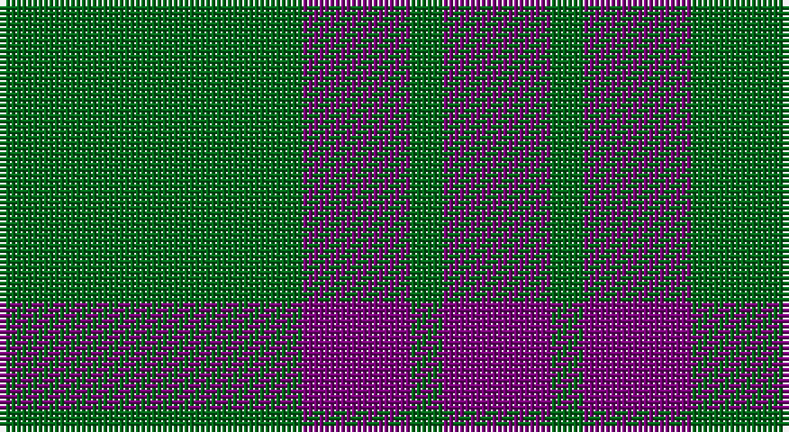

This page is one **sett** — a single exact thread-count. It belongs to the [tartan](/setts/g28dp10g3/)
(the same proportion at any scale), whose colour order is pattern [BGBG](/stripes/bgbg/).

Part of the [Elphinstone](/tartans/elphinstone/) tartan — the named design grouping this sett with its other cloths.

Sourced from house-of-tartan.  It is a [4 stripe tartan](/stripes/stripes4/).

Original link http://www.house-of-tartan.scotland.net/house/TartanViewjs.asp?colr=Def&tnam=115

## Provenance

Earliest known date: 1842 The village of Elphinstone is next to Tranent near Edinburgh in East Lothian. Sir Henry Elphinstone of Pittendriech in Midlothian was created Baron Elphinstone in 1509 and fell at Flodden Field. The Elphinstone tartan first appeared in the text of the Vestiarium Scoticum (1842). It is similar to some extent with the Montgomerie tartan and to the Montgomerie Hunting sett, suggesting a link to an early provenance. D.W. Stewart (1893) maintained that he could date the Montgomerie of Eglinton to 1707.

## Thread count
G/56 P20 G6 P/20

One full sett is **128 threads**.

## Palette

Palette: <strong>Tartan Register</strong>
<table><thead><tr><th>Colour</th><th>Threads</th><th>Shade</th><th>Base</th><th>OKLCh</th></tr></thead><tbody><tr><td>G/</td><td style="text-align:right;font-variant-numeric:tabular-nums">56</td><td><code style="background-color:#006818;">#006818</code> <small style="color:#888">#006818</small></td><td>G <code style="background-color:#006100;">#006100</code></td><td><small style="color:#888">oklch(45.0% 0.142 145.0)</small></td></tr><tr><td>P</td><td style="text-align:right;font-variant-numeric:tabular-nums">20</td><td><code style="background-color:#780078;">#780078</code> <small style="color:#888">#780078</small></td><td>B <code style="background-color:#2A418A;">#2A418A</code></td><td><small style="color:#888">oklch(40.2% 0.185 328.4)</small></td></tr><tr><td>G</td><td style="text-align:right;font-variant-numeric:tabular-nums">6</td><td><code style="background-color:#006818;">#006818</code> <small style="color:#888">#006818</small></td><td>G <code style="background-color:#006100;">#006100</code></td><td><small style="color:#888">oklch(45.0% 0.142 145.0)</small></td></tr><tr><td>P/</td><td style="text-align:right;font-variant-numeric:tabular-nums">20</td><td><code style="background-color:#780078;">#780078</code> <small style="color:#888">#780078</small></td><td>B <code style="background-color:#2A418A;">#2A418A</code></td><td><small style="color:#888">oklch(40.2% 0.185 328.4)</small></td></tr></tbody></table>

# Sample pattern

## Compared to the master

This cloth is one sett of its design; the master sett (the exemplar the design is anchored on) is below for comparison.

<figure style="margin:0"><figcaption style="color:#888;font-size:smaller">this sett</figcaption></figure>
<figure style="margin:0"><figcaption style="color:#888;font-size:smaller"><a href="/setts/g12p3g1/">master sett →</a></figcaption></figure>

## Nearest tartans

The nearest existing variants by ΔTartan distance, with this tartan at the top so the swatches line up against it.

ΔTartan

Tartan

Sett

—

<a href="/ttd/edit/#slug=g28dp10g3~x2">Elphinstone Clan Tartan</a> <a class="nn-out" href="/variants/s4/g28dp10g3~x2/" title="open its dictionary page">↗</a>

0.89

<a href="/ttd/edit/#slug=g8p4g1p2~x4&amp;base=g28dp10g3~x2">Wilson's, No 211</a> <a class="nn-out" href="/variants/s4/g8p4g1p2~x4/" title="open its dictionary page">↗</a>

1.07

<a href="/variants/s4/g6dp2g1~x4/">Elphinstone</a>

1.07

<a href="/variants/s4/g6dp2g1~x20/">Elphinstone Check (Clan)</a>

1.34

<a href="/ttd/edit/#slug=n6k17n6k17n45k4~x2&amp;base=g28dp10g3~x2">Grey Spirit (Fashion)</a> <a class="nn-out" href="/variants/s6/n6k17n6k17n45k4~x2/" title="open its dictionary page">↗</a>

1.55

<a href="/ttd/edit/#slug=n1k3n1k3n8r1~x8&amp;base=g28dp10g3~x2">Mackay (Blue)</a> <a class="nn-out" href="/variants/s6/n1k3n1k3n8r1~x8/" title="open its dictionary page">↗</a>

1.58

<a href="/variants/s4/g12p3g1~x2/">Elphinstone</a>

1.63

<a href="/ttd/edit/#slug=n6k16n6k16n45k4~x2&amp;base=g28dp10g3~x2">Grey Spirit Fashion Tartan</a> <a class="nn-out" href="/variants/s6/n6k16n6k16n45k4~x2/" title="open its dictionary page">↗</a>

1.64

<a href="/ttd/edit/#slug=dg21lo44dg86t10&amp;base=g28dp10g3~x2">Special Saffron (Fashion)</a> <a class="nn-out" href="/variants/s4/dg21lo44dg86t10/" title="open its dictionary page">↗</a>

1.65

<a href="/ttd/edit/#slug=k3n25k3n3k21n3~x2&amp;base=g28dp10g3~x2">Slanj, Grey (Corporate)</a> <a class="nn-out" href="/variants/s6/k3n25k3n3k21n3~x2/" title="open its dictionary page">↗</a>

1.71

<a href="/ttd/edit/#slug=g10k2dp5g1~x8&amp;base=g28dp10g3~x2">Bumbee #1 (Fashion)</a> <a class="nn-out" href="/variants/s4/g10k2dp5g1~x8/" title="open its dictionary page">↗</a>

## Neighbour map

Every grey dot is one of 14360 variants placed by the first two principal components of the ΔTartan feature space (44% of its variance). Red is this tartan; blue dots are its nearest — click one to open its page.

<svg viewBox="0 0 640 380" role="img" style="max-width:100%;height:auto;border:1px solid #e0e0e0;border-radius:4px;display:block" xmlns="http://www.w3.org/2000/svg"><image href="/nn/cloud.v1.png" width="640" height="380"/><a href="/variants/s4/g8p4g1p2~x4/"><circle cx="374.6" cy="282.6" r="4" fill="#3465a4"><title>Wilson's, No 211</title></circle></a><a href="/variants/s4/g6dp2g1~x4/"><circle cx="407.8" cy="315.6" r="4" fill="#3465a4"><title>Elphinstone</title></circle></a><a href="/variants/s4/g6dp2g1~x20/"><circle cx="407.8" cy="315.6" r="4" fill="#3465a4"><title>Elphinstone Check (Clan)</title></circle></a><a href="/variants/s6/n6k17n6k17n45k4~x2/"><circle cx="433.2" cy="261.7" r="4" fill="#3465a4"><title>Grey Spirit (Fashion)</title></circle></a><a href="/variants/s6/n1k3n1k3n8r1~x8/"><circle cx="361.7" cy="247.5" r="4" fill="#3465a4"><title>Mackay (Blue)</title></circle></a><a href="/variants/s4/g12p3g1~x2/"><circle cx="451.4" cy="258.3" r="4" fill="#3465a4"><title>Elphinstone</title></circle></a><a href="/variants/s6/n6k16n6k16n45k4~x2/"><circle cx="460.0" cy="269.0" r="4" fill="#3465a4"><title>Grey Spirit Fashion Tartan</title></circle></a><a href="/variants/s4/dg21lo44dg86t10/"><circle cx="371.8" cy="263.0" r="4" fill="#3465a4"><title>Special Saffron (Fashion)</title></circle></a><a href="/variants/s6/k3n25k3n3k21n3~x2/"><circle cx="400.7" cy="265.0" r="4" fill="#3465a4"><title>Slanj, Grey (Corporate)</title></circle></a><a href="/variants/s4/g10k2dp5g1~x8/"><circle cx="355.3" cy="264.8" r="4" fill="#3465a4"><title>Bumbee #1 (Fashion)</title></circle></a><circle cx="407.7" cy="288.6" r="5" fill="#c00000"/></svg>

ID: /variants/s4/g28dp10g3~x2/
