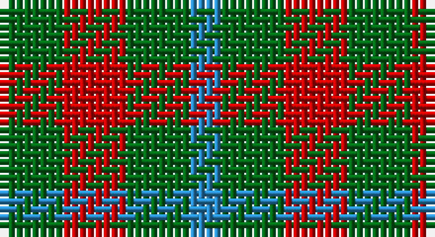

This page is one **sett** — a single exact thread-count. It belongs to the [tartan](/setts/g2r2g2t1/)
(the same proportion at any scale), whose colour order is pattern [BGRG](/stripes/bgrg/).

Sourced from register-of-tartans.  It is a [4 stripe tartan](/stripes/stripes4/).

Original link https://www.tartanregister.gov.uk/tartanDetails.aspx?ref=4738

## Register references

External register numbers recorded for this tartan.

- Scottish Register of Tartans: [4738](https://www.tartanregister.gov.uk/tartanDetails.aspx?ref=4738)
- Scottish Tartans Authority (ITI): 183
- Scottish Tartans World Register: 183

## Thread count
G/8 R8 G8 B/4

One full sett is **44 threads**.

## Palette

Palette: <strong>Tartan Register</strong>
<table><thead><tr><th>Colour</th><th>Threads</th><th>Shade</th><th>Base</th><th>OKLCh</th></tr></thead><tbody><tr><td>G/</td><td style="text-align:right;font-variant-numeric:tabular-nums">8</td><td><code style="background-color:#006818;">#006818</code> <small style="color:#888">#006818</small></td><td>G <code style="background-color:#006100;">#006100</code></td><td><small style="color:#888">oklch(45.0% 0.142 145.0)</small></td></tr><tr><td>R</td><td style="text-align:right;font-variant-numeric:tabular-nums">8</td><td><code style="background-color:#C80000;">#C80000</code> <small style="color:#888">#C80000</small></td><td>R <code style="background-color:#CC0000;">#CC0000</code></td><td><small style="color:#888">oklch(52.3% 0.215 29.2)</small></td></tr><tr><td>G</td><td style="text-align:right;font-variant-numeric:tabular-nums">8</td><td><code style="background-color:#006818;">#006818</code> <small style="color:#888">#006818</small></td><td>G <code style="background-color:#006100;">#006100</code></td><td><small style="color:#888">oklch(45.0% 0.142 145.0)</small></td></tr><tr><td>B/</td><td style="text-align:right;font-variant-numeric:tabular-nums">4</td><td><code style="background-color:#2888C4;">#2888C4</code> <small style="color:#888">#2888C4</small></td><td>B <code style="background-color:#2A418A;">#2A418A</code></td><td><small style="color:#888">oklch(60.1% 0.125 241.5)</small></td></tr></tbody></table>

# Sample pattern

## Nearest tartans

The nearest existing variants by ΔTartan distance, with this tartan at the top so the swatches line up against it.

ΔTartan

Tartan

Sett

—

<a href="/ttd/edit/#slug=g2r2g2t1~x4">Wilson's No.207</a> <a class="nn-out" href="/variants/s4/g2r2g2t1~x4/" title="open its dictionary page">↗</a>

1.31

<a href="/ttd/edit/#slug=r4g7t4~x2&amp;base=g2r2g2t1~x4">Wilson's, No 61</a> <a class="nn-out" href="/variants/s3/r4g7t4~x2/" title="open its dictionary page">↗</a>

1.42

<a href="/ttd/edit/#slug=g4k5g4r2~x2&amp;base=g2r2g2t1~x4">Wilson's No.094</a> <a class="nn-out" href="/variants/s4/g4k5g4r2~x2/" title="open its dictionary page">↗</a>

1.47

<a href="/ttd/edit/#slug=g4dp5g4t2~x2&amp;base=g2r2g2t1~x4">Wilson's No.209</a> <a class="nn-out" href="/variants/s4/g4dp5g4t2~x2/" title="open its dictionary page">↗</a>

1.51

<a href="/variants/s4/k6g5r2~x2/">Glen Lyon #1</a>

1.58

<a href="/ttd/edit/#slug=dy2t1lo1~x2&amp;base=g2r2g2t1~x4">Gearach Woodcock Tweed (Corporate)</a> <a class="nn-out" href="/variants/s3/dy2t1lo1~x2/" title="open its dictionary page">↗</a>

1.69

<a href="/ttd/edit/#slug=k5g8lo5g3lo5~x4&amp;base=g2r2g2t1~x4">Angle Dress (Fashion)</a> <a class="nn-out" href="/variants/s5/k5g8lo5g3lo5~x4/" title="open its dictionary page">↗</a>

1.69

<a href="/ttd/edit/#slug=g7k4r4~x2&amp;base=g2r2g2t1~x4">Wilson's No.202</a> <a class="nn-out" href="/variants/s3/g7k4r4~x2/" title="open its dictionary page">↗</a>

1.74

<a href="/ttd/edit/#slug=r4dg7t4~x2&amp;base=g2r2g2t1~x4">Wilson's No.061</a> <a class="nn-out" href="/variants/s3/r4dg7t4~x2/" title="open its dictionary page">↗</a>

1.79

<a href="/ttd/edit/#slug=r2g2t1~x4&amp;base=g2r2g2t1~x4">Wilson's, No 207</a> <a class="nn-out" href="/variants/s3/r2g2t1~x4/" title="open its dictionary page">↗</a>

1.83

<a href="/ttd/edit/#slug=g7t2r4~x2&amp;base=g2r2g2t1~x4">Wilson's, No 208</a> <a class="nn-out" href="/variants/s3/g7t2r4~x2/" title="open its dictionary page">↗</a>

## Neighbour map

Every grey dot is one of 14360 variants placed by the first two principal components of the ΔTartan feature space (44% of its variance). Red is this tartan; blue dots are its nearest — click one to open its page.

<svg viewBox="0 0 640 380" role="img" style="max-width:100%;height:auto;border:1px solid #e0e0e0;border-radius:4px;display:block" xmlns="http://www.w3.org/2000/svg"><image href="/nn/cloud.v1.png" width="640" height="380"/><a href="/variants/s3/r4g7t4~x2/"><circle cx="174.8" cy="366.0" r="4" fill="#3465a4"><title>Wilson's, No 61</title></circle></a><a href="/variants/s4/g4k5g4r2~x2/"><circle cx="199.9" cy="361.0" r="4" fill="#3465a4"><title>Wilson's No.094</title></circle></a><a href="/variants/s4/g4dp5g4t2~x2/"><circle cx="217.3" cy="366.0" r="4" fill="#3465a4"><title>Wilson's No.209</title></circle></a><a href="/variants/s4/k6g5r2~x2/"><circle cx="243.1" cy="362.0" r="4" fill="#3465a4"><title>Glen Lyon #1</title></circle></a><a href="/variants/s3/dy2t1lo1~x2/"><circle cx="224.3" cy="366.0" r="4" fill="#3465a4"><title>Gearach Woodcock Tweed (Corporate)</title></circle></a><a href="/variants/s5/k5g8lo5g3lo5~x4/"><circle cx="149.2" cy="342.9" r="4" fill="#3465a4"><title>Angle Dress (Fashion)</title></circle></a><a href="/variants/s3/g7k4r4~x2/"><circle cx="159.8" cy="366.0" r="4" fill="#3465a4"><title>Wilson's No.202</title></circle></a><a href="/variants/s3/r4dg7t4~x2/"><circle cx="161.6" cy="366.0" r="4" fill="#3465a4"><title>Wilson's No.061</title></circle></a><a href="/variants/s3/r2g2t1~x4/"><circle cx="158.1" cy="366.0" r="4" fill="#3465a4"><title>Wilson's, No 207</title></circle></a><a href="/variants/s3/g7t2r4~x2/"><circle cx="268.2" cy="340.3" r="4" fill="#3465a4"><title>Wilson's, No 208</title></circle></a><circle cx="226.6" cy="366.0" r="5" fill="#c00000"/></svg>

ID: /variants/s4/g2r2g2t1~x4/
