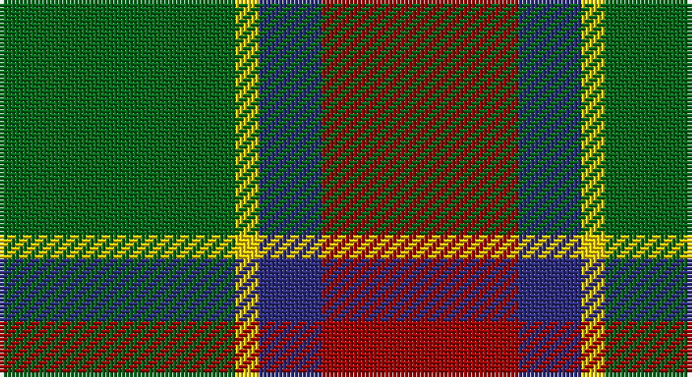

This page is one **sett** — a single exact thread-count. It belongs to the [tartan](/setts/g30ly3db8r25/)
(the same proportion at any scale), whose colour order is pattern [GYBR](/stripes/gybr/).

Sourced from tartans-authority.  It is a [4 stripe tartan](/stripes/stripes4/).

Original link http://www.tartansauthority.com/tartan-ferret/display/10665/

## Register references

External register numbers recorded for this tartan.

- Scottish Register of Tartans: [10665](https://www.tartanregister.gov.uk/tartanDetails?ref=10665)
- Scottish Tartans Authority (ITI): 10665

## Thread count
G/60 Y6 DB16 DR/50

One full sett is **154 threads**.

## Palette

Palette: <strong>Tartan Register</strong>
<table><thead><tr><th>Colour</th><th>Threads</th><th>Shade</th><th>Base</th><th>OKLCh</th></tr></thead><tbody><tr><td>G/</td><td style="text-align:right;font-variant-numeric:tabular-nums">60</td><td><code style="background-color:#006818;">#006818</code> <small style="color:#888">#006818</small></td><td>G <code style="background-color:#006100;">#006100</code></td><td><small style="color:#888">oklch(45.0% 0.142 145.0)</small></td></tr><tr><td>Y</td><td style="text-align:right;font-variant-numeric:tabular-nums">6</td><td><code style="background-color:#FCCC00;">#FCCC00</code> <small style="color:#888">#FCCC00</small></td><td>Y <code style="background-color:#F2BF00;">#F2BF00</code></td><td><small style="color:#888">oklch(86.2% 0.176 91.5)</small></td></tr><tr><td>DB</td><td style="text-align:right;font-variant-numeric:tabular-nums">16</td><td><code style="background-color:#2C2C80;">#2C2C80</code> <small style="color:#888">#2C2C80</small></td><td>B <code style="background-color:#2A418A;">#2A418A</code></td><td><small style="color:#888">oklch(35.0% 0.138 276.6)</small></td></tr><tr><td>DR/</td><td style="text-align:right;font-variant-numeric:tabular-nums">50</td><td><code style="background-color:#A00000;">#A00000</code> <small style="color:#888">#A00000</small></td><td>R <code style="background-color:#CC0000;">#CC0000</code></td><td><small style="color:#888">oklch(44.3% 0.182 29.2)</small></td></tr></tbody></table>

# Sample pattern

## Nearest tartans

The nearest existing variants by ΔTartan distance, with this tartan at the top so the swatches line up against it.

ΔTartan

Tartan

Sett

—

<a href="/ttd/edit/#slug=g30ly3db8r25~x2">Dohmen (Personal)</a> <a class="nn-out" href="/variants/s4/g30ly3db8r25~x2/" title="open its dictionary page">↗</a>

0.70

<a href="/ttd/edit/#slug=r5g7k2t1~x4&amp;base=g30ly3db8r25~x2">Wilson's No.195</a> <a class="nn-out" href="/variants/s4/r5g7k2t1~x4/" title="open its dictionary page">↗</a>

0.94

<a href="/ttd/edit/#slug=n11k4r4lo4n1~x4&amp;base=g30ly3db8r25~x2">Ikelman #2 (Personal)</a> <a class="nn-out" href="/variants/s5/n11k4r4lo4n1~x4/" title="open its dictionary page">↗</a>

1.10

<a href="/ttd/edit/#slug=g15r3p11t2~x2&amp;base=g30ly3db8r25~x2">MacNab 7</a> <a class="nn-out" href="/variants/s4/g15r3p11t2~x2/" title="open its dictionary page">↗</a>

1.25

<a href="/ttd/edit/#slug=ly2db8r8g17r1~x4&amp;base=g30ly3db8r25~x2">British Hills</a> <a class="nn-out" href="/variants/s5/ly2db8r8g17r1~x4/" title="open its dictionary page">↗</a>

1.26

<a href="/ttd/edit/#slug=k2o20k8dg18o3w2~x2&amp;base=g30ly3db8r25~x2">Celtic Combat</a> <a class="nn-out" href="/variants/s6/k2o20k8dg18o3w2~x2/" title="open its dictionary page">↗</a>

1.30

<a href="/ttd/edit/#slug=ly2dg17g4r15dg1~x2&amp;base=g30ly3db8r25~x2">Christmas</a> <a class="nn-out" href="/variants/s5/ly2dg17g4r15dg1~x2/" title="open its dictionary page">↗</a>

1.30

<a href="/ttd/edit/#slug=db6lo25dy16k2db3~x2&amp;base=g30ly3db8r25~x2">Prince of Orange #2</a> <a class="nn-out" href="/variants/s5/db6lo25dy16k2db3~x2/" title="open its dictionary page">↗</a>

1.30

<a href="/ttd/edit/#slug=r2dg17r8db8ly2~x4&amp;base=g30ly3db8r25~x2">British Hills</a> <a class="nn-out" href="/variants/s5/r2dg17r8db8ly2~x4/" title="open its dictionary page">↗</a>

1.30

<a href="/ttd/edit/#slug=r3db12r4g18r6k2~x2&amp;base=g30ly3db8r25~x2">Eyre (Personal)</a> <a class="nn-out" href="/variants/s6/r3db12r4g18r6k2~x2/" title="open its dictionary page">↗</a>

1.33

<a href="/ttd/edit/#slug=db3g6ly1r3~x10&amp;base=g30ly3db8r25~x2">Delroeux (Personal)</a> <a class="nn-out" href="/variants/s4/db3g6ly1r3~x10/" title="open its dictionary page">↗</a>

## Neighbour map

Every grey dot is one of 14360 variants placed by the first two principal components of the ΔTartan feature space (44% of its variance). Red is this tartan; blue dots are its nearest — click one to open its page.

<svg viewBox="0 0 640 380" role="img" style="max-width:100%;height:auto;border:1px solid #e0e0e0;border-radius:4px;display:block" xmlns="http://www.w3.org/2000/svg"><image href="/nn/cloud.v1.png" width="640" height="380"/><a href="/variants/s4/r5g7k2t1~x4/"><circle cx="232.3" cy="260.0" r="4" fill="#3465a4"><title>Wilson's No.195</title></circle></a><a href="/variants/s5/n11k4r4lo4n1~x4/"><circle cx="266.0" cy="232.6" r="4" fill="#3465a4"><title>Ikelman #2 (Personal)</title></circle></a><a href="/variants/s4/g15r3p11t2~x2/"><circle cx="251.6" cy="249.7" r="4" fill="#3465a4"><title>MacNab 7</title></circle></a><a href="/variants/s5/ly2db8r8g17r1~x4/"><circle cx="265.2" cy="202.6" r="4" fill="#3465a4"><title>British Hills</title></circle></a><a href="/variants/s6/k2o20k8dg18o3w2~x2/"><circle cx="236.7" cy="205.1" r="4" fill="#3465a4"><title>Celtic Combat</title></circle></a><a href="/variants/s5/ly2dg17g4r15dg1~x2/"><circle cx="301.4" cy="200.9" r="4" fill="#3465a4"><title>Christmas</title></circle></a><a href="/variants/s5/db6lo25dy16k2db3~x2/"><circle cx="276.5" cy="201.1" r="4" fill="#3465a4"><title>Prince of Orange #2</title></circle></a><a href="/variants/s5/r2dg17r8db8ly2~x4/"><circle cx="220.0" cy="222.2" r="4" fill="#3465a4"><title>British Hills</title></circle></a><a href="/variants/s6/r3db12r4g18r6k2~x2/"><circle cx="215.3" cy="224.8" r="4" fill="#3465a4"><title>Eyre (Personal)</title></circle></a><a href="/variants/s4/db3g6ly1r3~x10/"><circle cx="194.3" cy="270.5" r="4" fill="#3465a4"><title>Delroeux (Personal)</title></circle></a><circle cx="262.4" cy="247.4" r="5" fill="#c00000"/></svg>

ID: /variants/s4/g30ly3db8r25~x2/
