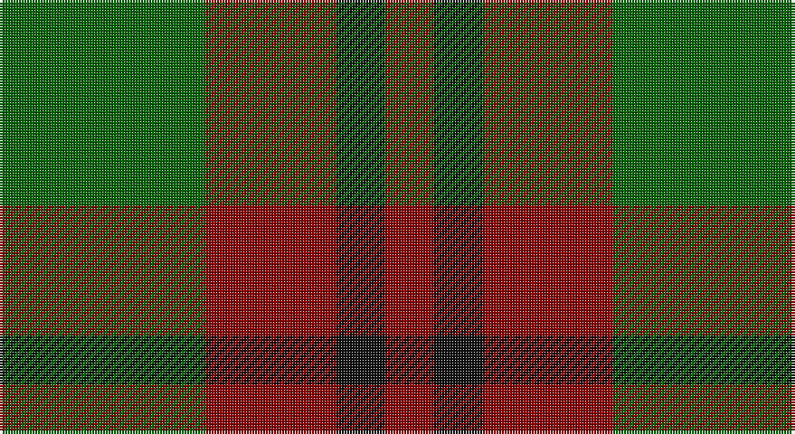

This page is one **sett** — a single exact thread-count. It belongs to the [tartan](/setts/g38r24k9r9/)
(the same proportion at any scale), whose colour order is pattern [GRKR](/stripes/grkr/).

Sourced from register-of-tartans.  It is a [4 stripe tartan](/stripes/stripes4/).

Original link https://www.tartanregister.gov.uk/tartanDetails.aspx?ref=10991

## Also known as

This cloth is also recorded under:

- Royal Guard of Oman 4th Band Squadron

2 attestations — the source records this cloth was collapsed from (oldest owns this page)

<ul>
<li>20/10/2010 — Royal Guard of Oman 4th Band Squadron (register-of-tartans, <a href="https://www.tartanregister.gov.uk/tartanDetails.aspx?ref=10991">record</a>)</li>
<li>2014 — Royal Guard of Oman 4th Band Squadro (tartans-authority, <a href="http://www.tartansauthority.com/tartan-ferret/display/10991/">record</a>)</li>
</ul>

## Register references

External register numbers recorded for this tartan.

- Scottish Register of Tartans: [10991](https://www.tartanregister.gov.uk/tartanDetails?ref=10991)
- Scottish Tartans Authority (ITI): 10991

## Thread count
G/76 DR48 K18 DR/18

One full sett is **226 threads**.

## Palette

Palette: <strong>Tartan Register</strong>
<table><thead><tr><th>Colour</th><th>Threads</th><th>Shade</th><th>Base</th><th>OKLCh</th></tr></thead><tbody><tr><td>G/</td><td style="text-align:right;font-variant-numeric:tabular-nums">76</td><td><code style="background-color:#006400;">#006400</code> <small style="color:#888">#006400</small></td><td>G <code style="background-color:#006100;">#006100</code></td><td><small style="color:#888">oklch(43.6% 0.148 142.5)</small></td></tr><tr><td>DR</td><td style="text-align:right;font-variant-numeric:tabular-nums">48</td><td><code style="background-color:#880000;">#880000</code> <small style="color:#888">#880000</small></td><td>R <code style="background-color:#CC0000;">#CC0000</code></td><td><small style="color:#888">oklch(39.4% 0.162 29.2)</small></td></tr><tr><td>K</td><td style="text-align:right;font-variant-numeric:tabular-nums">18</td><td><code style="background-color:#101010;">#101010</code> <small style="color:#888">#101010</small></td><td>K <code style="background-color:#000000;">#000000</code></td><td><small style="color:#888">oklch(17.3% 0.000 89.9)</small></td></tr><tr><td>DR/</td><td style="text-align:right;font-variant-numeric:tabular-nums">18</td><td><code style="background-color:#880000;">#880000</code> <small style="color:#888">#880000</small></td><td>R <code style="background-color:#CC0000;">#CC0000</code></td><td><small style="color:#888">oklch(39.4% 0.162 29.2)</small></td></tr></tbody></table>

# Sample pattern

## Nearest tartans

The nearest existing variants by ΔTartan distance, with this tartan at the top so the swatches line up against it.

ΔTartan

Tartan

Sett

—

<a href="/ttd/edit/#slug=g38r24k9r9~x2">Royal Guard of Oman 4th Band Squadron</a> <a class="nn-out" href="/variants/s4/g38r24k9r9~x2/" title="open its dictionary page">↗</a>

0.99

<a href="/ttd/edit/#slug=g6k2r3k1~x4&amp;base=g38r24k9r9~x2">Red Watch (Fashion) #1</a> <a class="nn-out" href="/variants/s4/g6k2r3k1~x4/" title="open its dictionary page">↗</a>

1.37

<a href="/ttd/edit/#slug=g10db2r8lo2g5~x4&amp;base=g38r24k9r9~x2">Cub Scouts of America</a> <a class="nn-out" href="/variants/s5/g10db2r8lo2g5~x4/" title="open its dictionary page">↗</a>

1.40

<a href="/ttd/edit/#slug=g2r4g2t1~x4&amp;base=g38r24k9r9~x2">Wilson's No.188</a> <a class="nn-out" href="/variants/s4/g2r4g2t1~x4/" title="open its dictionary page">↗</a>

1.46

<a href="/ttd/edit/#slug=dg6dp5r1~x4&amp;base=g38r24k9r9~x2">Wilson's No.084</a> <a class="nn-out" href="/variants/s3/dg6dp5r1~x4/" title="open its dictionary page">↗</a>

1.62

<a href="/variants/s4/g7t2r4~x2/">Wilson's No.208</a>

1.65

<a href="/ttd/edit/#slug=r1dg4r1lr1r4dg1r1~x4&amp;base=g38r24k9r9~x2">Unidentified #59</a> <a class="nn-out" href="/variants/s7/r1dg4r1lr1r4dg1r1~x4/" title="open its dictionary page">↗</a>

1.65

<a href="/ttd/edit/#slug=dg2y14dg8y3dg12lo2~x2&amp;base=g38r24k9r9~x2">Confederate Cavalry (Military)</a> <a class="nn-out" href="/variants/s6/dg2y14dg8y3dg12lo2~x2/" title="open its dictionary page">↗</a>

1.71

<a href="/ttd/edit/#slug=g7t2r4~x2&amp;base=g38r24k9r9~x2">Wilson's, No 208</a> <a class="nn-out" href="/variants/s3/g7t2r4~x2/" title="open its dictionary page">↗</a>

1.73

<a href="/ttd/edit/#slug=dg2o14dg8o3dg12r2~x2&amp;base=g38r24k9r9~x2">Confederate Artillery</a> <a class="nn-out" href="/variants/s6/dg2o14dg8o3dg12r2~x2/" title="open its dictionary page">↗</a>

1.75

<a href="/ttd/edit/#slug=k3g13k10r13k2r3~x2&amp;base=g38r24k9r9~x2">MacCormick (Dress)</a> <a class="nn-out" href="/variants/s6/k3g13k10r13k2r3~x2/" title="open its dictionary page">↗</a>

## Neighbour map

Every grey dot is one of 14360 variants placed by the first two principal components of the ΔTartan feature space (44% of its variance). Red is this tartan; blue dots are its nearest — click one to open its page.

<svg viewBox="0 0 640 380" role="img" style="max-width:100%;height:auto;border:1px solid #e0e0e0;border-radius:4px;display:block" xmlns="http://www.w3.org/2000/svg"><image href="/nn/cloud.v1.png" width="640" height="380"/><a href="/variants/s4/g6k2r3k1~x4/"><circle cx="283.4" cy="302.7" r="4" fill="#3465a4"><title>Red Watch (Fashion) #1</title></circle></a><a href="/variants/s5/g10db2r8lo2g5~x4/"><circle cx="279.2" cy="283.4" r="4" fill="#3465a4"><title>Cub Scouts of America</title></circle></a><a href="/variants/s4/g2r4g2t1~x4/"><circle cx="239.7" cy="315.1" r="4" fill="#3465a4"><title>Wilson's No.188</title></circle></a><a href="/variants/s3/dg6dp5r1~x4/"><circle cx="308.9" cy="324.5" r="4" fill="#3465a4"><title>Wilson's No.084</title></circle></a><a href="/variants/s4/g7t2r4~x2/"><circle cx="225.5" cy="317.7" r="4" fill="#3465a4"><title>Wilson's No.208</title></circle></a><a href="/variants/s7/r1dg4r1lr1r4dg1r1~x4/"><circle cx="315.7" cy="275.7" r="4" fill="#3465a4"><title>Unidentified #59</title></circle></a><a href="/variants/s6/dg2y14dg8y3dg12lo2~x2/"><circle cx="336.6" cy="274.7" r="4" fill="#3465a4"><title>Confederate Cavalry (Military)</title></circle></a><a href="/variants/s3/g7t2r4~x2/"><circle cx="268.2" cy="340.3" r="4" fill="#3465a4"><title>Wilson's, No 208</title></circle></a><a href="/variants/s6/dg2o14dg8o3dg12r2~x2/"><circle cx="319.8" cy="263.9" r="4" fill="#3465a4"><title>Confederate Artillery</title></circle></a><a href="/variants/s6/k3g13k10r13k2r3~x2/"><circle cx="228.1" cy="275.6" r="4" fill="#3465a4"><title>MacCormick (Dress)</title></circle></a><circle cx="286.4" cy="318.8" r="5" fill="#c00000"/></svg>

ID: /variants/s4/g38r24k9r9~x2/
