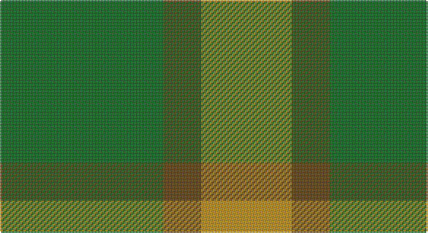

This page is one **sett** — a single exact thread-count. It belongs to the [tartan](/setts/g56dy13lo13lo5/)
(the same proportion at any scale), whose colour order is pattern [GGYY](/stripes/ggyy/).

Part of the [Colonial Marine](/tartans/colonial-marine/) tartan — the named design grouping this sett with its other cloths.

Sourced from tartans-authority.  It is a [4 stripe tartan](/stripes/stripes4/).

Original link http://www.tartansauthority.com/tartan-ferret/display/10487/

## Register references

External register numbers recorded for this tartan.

- Scottish Register of Tartans: [10487](https://www.tartanregister.gov.uk/tartanDetails?ref=10487)
- Scottish Tartans Authority (ITI): 10487

## Thread count
G/112 T26 DY26 DY/10

One full sett is **226 threads**.

## Palette

Palette: <strong>Tartan Register</strong>
<table><thead><tr><th>Colour</th><th>Threads</th><th>Shade</th><th>Base</th><th>OKLCh</th></tr></thead><tbody><tr><td>G/</td><td style="text-align:right;font-variant-numeric:tabular-nums">112</td><td><code style="background-color:#006818;">#006818</code> <small style="color:#888">#006818</small></td><td>G <code style="background-color:#006100;">#006100</code></td><td><small style="color:#888">oklch(45.0% 0.142 145.0)</small></td></tr><tr><td>T</td><td style="text-align:right;font-variant-numeric:tabular-nums">26</td><td><code style="background-color:#604000;">#604000</code> <small style="color:#888">#604000</small></td><td>G <code style="background-color:#006100;">#006100</code></td><td><small style="color:#888">oklch(39.8% 0.083 76.8)</small></td></tr><tr><td>DY</td><td style="text-align:right;font-variant-numeric:tabular-nums">26</td><td><code style="background-color:#BC8C00;">#BC8C00</code> <small style="color:#888">#BC8C00</small></td><td>Y <code style="background-color:#F2BF00;">#F2BF00</code></td><td><small style="color:#888">oklch(66.8% 0.137 84.1)</small></td></tr><tr><td>DY/</td><td style="text-align:right;font-variant-numeric:tabular-nums">10</td><td><code style="background-color:#BC8C00;">#BC8C00</code> <small style="color:#888">#BC8C00</small></td><td>Y <code style="background-color:#F2BF00;">#F2BF00</code></td><td><small style="color:#888">oklch(66.8% 0.137 84.1)</small></td></tr></tbody></table>

# Sample pattern

## Compared to the master

This cloth is one sett of its design; the master sett (the exemplar the design is anchored on) is below for comparison.

<figure style="margin:0"><figcaption style="color:#888;font-size:smaller">this sett</figcaption></figure>
<figure style="margin:0"><figcaption style="color:#888;font-size:smaller"><a href="/setts/g56dy13ly13w5/">master sett →</a></figcaption></figure>

## Nearest tartans

The nearest existing variants by ΔTartan distance, with this tartan at the top so the swatches line up against it.

ΔTartan

Tartan

Sett

—

<a href="/ttd/edit/#slug=g56dy13lo13lo5~x2">Colonial Marine (Corporate)</a> <a class="nn-out" href="/variants/s4/g56dy13lo13lo5~x2/" title="open its dictionary page">↗</a>

1.20

<a href="/ttd/edit/#slug=g9o20g46lg5~x2&amp;base=g56dy13lo13lo5~x2">O'Neill, Red (Corporate?)</a> <a class="nn-out" href="/variants/s4/g9o20g46lg5~x2/" title="open its dictionary page">↗</a>

1.23

<a href="/ttd/edit/#slug=g37o9g3dr9o3~x2&amp;base=g56dy13lo13lo5~x2">Glen Boig</a> <a class="nn-out" href="/variants/s5/g37o9g3dr9o3~x2/" title="open its dictionary page">↗</a>

1.62

<a href="/ttd/edit/#slug=g9o4ly1~x4&amp;base=g56dy13lo13lo5~x2">Ledford Family Tartan</a> <a class="nn-out" href="/variants/s3/g9o4ly1~x4/" title="open its dictionary page">↗</a>

1.68

<a href="/ttd/edit/#slug=r2g12o3g8o14g2~x2&amp;base=g56dy13lo13lo5~x2">Confederate Artillery (Military)</a> <a class="nn-out" href="/variants/s6/r2g12o3g8o14g2~x2/" title="open its dictionary page">↗</a>

1.70

<a href="/ttd/edit/#slug=g46o20g9o20g46lg5~x2&amp;base=g56dy13lo13lo5~x2">O'Neill, Red</a> <a class="nn-out" href="/variants/s6/g46o20g9o20g46lg5~x2/" title="open its dictionary page">↗</a>

1.72

<a href="/ttd/edit/#slug=g9o4ly1~x16&amp;base=g56dy13lo13lo5~x2">Ledford (Name)</a> <a class="nn-out" href="/variants/s3/g9o4ly1~x16/" title="open its dictionary page">↗</a>

1.75

<a href="/ttd/edit/#slug=g9o20g40w5~x2&amp;base=g56dy13lo13lo5~x2">O'Neill (Australia) (Name)</a> <a class="nn-out" href="/variants/s4/g9o20g40w5~x2/" title="open its dictionary page">↗</a>

1.79

<a href="/ttd/edit/#slug=dg9y4lo1~x8&amp;base=g56dy13lo13lo5~x2">Ledford</a> <a class="nn-out" href="/variants/s3/dg9y4lo1~x8/" title="open its dictionary page">↗</a>

1.79

<a href="/ttd/edit/#slug=g22k3g3gi16g6k4~x2&amp;base=g56dy13lo13lo5~x2">Campbell Simpson (Dalgliesh)</a> <a class="nn-out" href="/variants/s6/g22k3g3gi16g6k4~x2/" title="open its dictionary page">↗</a>

1.79

<a href="/ttd/edit/#slug=o20g40w5g40o20g9~x2&amp;base=g56dy13lo13lo5~x2">O'Neill (Australia)</a> <a class="nn-out" href="/variants/s6/o20g40w5g40o20g9~x2/" title="open its dictionary page">↗</a>

## Neighbour map

Every grey dot is one of 14360 variants placed by the first two principal components of the ΔTartan feature space (44% of its variance). Red is this tartan; blue dots are its nearest — click one to open its page.

<svg viewBox="0 0 640 380" role="img" style="max-width:100%;height:auto;border:1px solid #e0e0e0;border-radius:4px;display:block" xmlns="http://www.w3.org/2000/svg"><image href="/nn/cloud.v1.png" width="640" height="380"/><a href="/variants/s4/g9o20g46lg5~x2/"><circle cx="463.0" cy="289.0" r="4" fill="#3465a4"><title>O'Neill, Red (Corporate?)</title></circle></a><a href="/variants/s5/g37o9g3dr9o3~x2/"><circle cx="492.4" cy="271.6" r="4" fill="#3465a4"><title>Glen Boig</title></circle></a><a href="/variants/s3/g9o4ly1~x4/"><circle cx="415.3" cy="304.2" r="4" fill="#3465a4"><title>Ledford Family Tartan</title></circle></a><a href="/variants/s6/r2g12o3g8o14g2~x2/"><circle cx="384.8" cy="298.7" r="4" fill="#3465a4"><title>Confederate Artillery (Military)</title></circle></a><a href="/variants/s6/g46o20g9o20g46lg5~x2/"><circle cx="454.9" cy="286.6" r="4" fill="#3465a4"><title>O'Neill, Red</title></circle></a><a href="/variants/s3/g9o4ly1~x16/"><circle cx="455.0" cy="325.5" r="4" fill="#3465a4"><title>Ledford (Name)</title></circle></a><a href="/variants/s4/g9o20g40w5~x2/"><circle cx="412.5" cy="287.6" r="4" fill="#3465a4"><title>O'Neill (Australia) (Name)</title></circle></a><a href="/variants/s3/dg9y4lo1~x8/"><circle cx="421.0" cy="307.3" r="4" fill="#3465a4"><title>Ledford</title></circle></a><a href="/variants/s6/g22k3g3gi16g6k4~x2/"><circle cx="373.8" cy="286.1" r="4" fill="#3465a4"><title>Campbell Simpson (Dalgliesh)</title></circle></a><a href="/variants/s6/o20g40w5g40o20g9~x2/"><circle cx="421.3" cy="295.6" r="4" fill="#3465a4"><title>O'Neill (Australia)</title></circle></a><circle cx="458.9" cy="281.3" r="5" fill="#c00000"/></svg>

ID: /variants/s4/g56dy13lo13lo5~x2/
