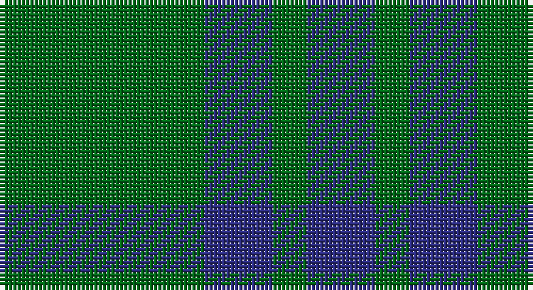

This page is one **sett** — a single exact thread-count. It belongs to the [tartan](/setts/g6db2g1/)
(the same proportion at any scale), whose colour order is pattern [BGBG](/stripes/bgbg/).

Part of the [Montgomery](/tartans/montgomery/) tartan — the named design grouping this sett with its other cloths.

Sourced from tartans-authority.  It is a [4 stripe tartan](/stripes/stripes4/).

Original link http://www.tartansauthority.com/tartan-ferret/display/114/

## Also known as

This cloth is also recorded under:

- Montgomerie of Eglinton
- Montgomrie/Montgomery of Eglinton

## Register references

External register numbers recorded for this tartan.

- Scottish Tartans Authority (ITI): 114

## Thread count
G/48 DB16 G8 DB/16

One full sett is **112 threads**.

## Palette

Palette: <strong>Tartan Register</strong>
<table><thead><tr><th>Colour</th><th>Threads</th><th>Shade</th><th>Base</th><th>OKLCh</th></tr></thead><tbody><tr><td>G/</td><td style="text-align:right;font-variant-numeric:tabular-nums">48</td><td><code style="background-color:#006818;">#006818</code> <small style="color:#888">#006818</small></td><td>G <code style="background-color:#006100;">#006100</code></td><td><small style="color:#888">oklch(45.0% 0.142 145.0)</small></td></tr><tr><td>DB</td><td style="text-align:right;font-variant-numeric:tabular-nums">16</td><td><code style="background-color:#2C2C80;">#2C2C80</code> <small style="color:#888">#2C2C80</small></td><td>B <code style="background-color:#2A418A;">#2A418A</code></td><td><small style="color:#888">oklch(35.0% 0.138 276.6)</small></td></tr><tr><td>G</td><td style="text-align:right;font-variant-numeric:tabular-nums">8</td><td><code style="background-color:#006818;">#006818</code> <small style="color:#888">#006818</small></td><td>G <code style="background-color:#006100;">#006100</code></td><td><small style="color:#888">oklch(45.0% 0.142 145.0)</small></td></tr><tr><td>DB/</td><td style="text-align:right;font-variant-numeric:tabular-nums">16</td><td><code style="background-color:#2C2C80;">#2C2C80</code> <small style="color:#888">#2C2C80</small></td><td>B <code style="background-color:#2A418A;">#2A418A</code></td><td><small style="color:#888">oklch(35.0% 0.138 276.6)</small></td></tr></tbody></table>

# Sample pattern

## Nearest tartans

The nearest existing variants by ΔTartan distance, with this tartan at the top so the swatches line up against it.

ΔTartan

Tartan

Sett

—

<a href="/ttd/edit/#slug=g6db2g1~x8">Montgomery - 1842 (VS</a> <a class="nn-out" href="/variants/s4/g6db2g1~x8/" title="open its dictionary page">↗</a>

0.00

<a href="/variants/s4/g6db2g1~x4/">Montgomery</a>

1.26

<a href="/variants/s4/g6dp2g1~x4/">Elphinstone</a>

1.26

<a href="/variants/s4/g6dp2g1~x20/">Elphinstone Check (Clan)</a>

1.56

<a href="/ttd/edit/#slug=g9n1g2k4g2~x4&amp;base=g6db2g1~x8">Peterhead (Personal)</a> <a class="nn-out" href="/variants/s5/g9n1g2k4g2~x4/" title="open its dictionary page">↗</a>

1.61

<a href="/ttd/edit/#slug=dg9y4lo1~x8&amp;base=g6db2g1~x8">Ledford</a> <a class="nn-out" href="/variants/s3/dg9y4lo1~x8/" title="open its dictionary page">↗</a>

1.66

<a href="/ttd/edit/#slug=db2dg15do3db7dg7db2~x4&amp;base=g6db2g1~x8">Green Highland, The (Fashion)</a> <a class="nn-out" href="/variants/s6/db2dg15do3db7dg7db2~x4/" title="open its dictionary page">↗</a>

1.70

<a href="/ttd/edit/#slug=g30k20g3~x2&amp;base=g6db2g1~x8">Scotch Tape (Corporate)</a> <a class="nn-out" href="/variants/s3/g30k20g3~x2/" title="open its dictionary page">↗</a>

1.77

<a href="/variants/s4/g12db3g1~x2/">Montgomerie</a>

1.82

<a href="/variants/s4/g28dp10g3~x2/">Elphinstone Clan Tartan</a>

1.93

<a href="/ttd/edit/#slug=db2dg7db7w1~x2&amp;base=g6db2g1~x8">Unidentified No 78</a> <a class="nn-out" href="/variants/s4/db2dg7db7w1~x2/" title="open its dictionary page">↗</a>

## Neighbour map

Every grey dot is one of 14360 variants placed by the first two principal components of the ΔTartan feature space (44% of its variance). Red is this tartan; blue dots are its nearest — click one to open its page.

<svg viewBox="0 0 640 380" role="img" style="max-width:100%;height:auto;border:1px solid #e0e0e0;border-radius:4px;display:block" xmlns="http://www.w3.org/2000/svg"><image href="/nn/cloud.v1.png" width="640" height="380"/><a href="/variants/s4/g6db2g1~x4/"><circle cx="426.2" cy="331.6" r="4" fill="#3465a4"><title>Montgomery</title></circle></a><a href="/variants/s4/g6dp2g1~x4/"><circle cx="407.8" cy="315.6" r="4" fill="#3465a4"><title>Elphinstone</title></circle></a><a href="/variants/s4/g6dp2g1~x20/"><circle cx="407.8" cy="315.6" r="4" fill="#3465a4"><title>Elphinstone Check (Clan)</title></circle></a><a href="/variants/s5/g9n1g2k4g2~x4/"><circle cx="461.0" cy="275.1" r="4" fill="#3465a4"><title>Peterhead (Personal)</title></circle></a><a href="/variants/s3/dg9y4lo1~x8/"><circle cx="421.0" cy="307.3" r="4" fill="#3465a4"><title>Ledford</title></circle></a><a href="/variants/s6/db2dg15do3db7dg7db2~x4/"><circle cx="389.1" cy="291.2" r="4" fill="#3465a4"><title>Green Highland, The (Fashion)</title></circle></a><a href="/variants/s3/g30k20g3~x2/"><circle cx="419.8" cy="324.6" r="4" fill="#3465a4"><title>Scotch Tape (Corporate)</title></circle></a><a href="/variants/s4/g12db3g1~x2/"><circle cx="485.4" cy="285.8" r="4" fill="#3465a4"><title>Montgomerie</title></circle></a><a href="/variants/s4/g28dp10g3~x2/"><circle cx="407.7" cy="288.6" r="4" fill="#3465a4"><title>Elphinstone Clan Tartan</title></circle></a><a href="/variants/s4/db2dg7db7w1~x2/"><circle cx="332.9" cy="305.1" r="4" fill="#3465a4"><title>Unidentified No 78</title></circle></a><circle cx="426.2" cy="331.6" r="5" fill="#c00000"/></svg>

ID: /variants/s4/g6db2g1~x8/
