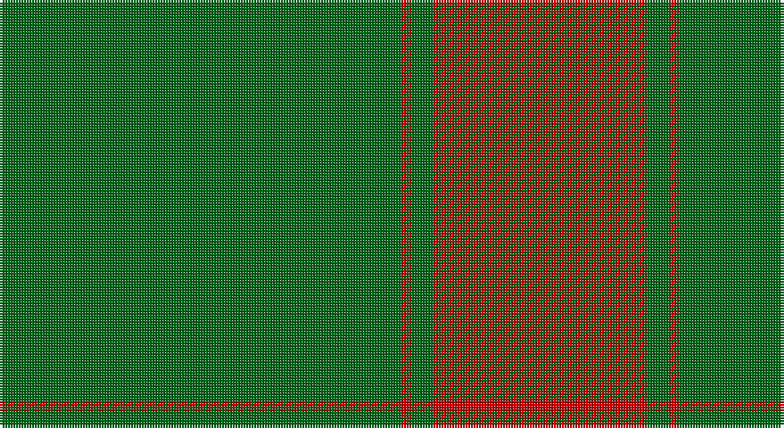

This page is one **sett** — a single exact thread-count. It belongs to the [tartan](/setts/g75r2g4r40/)
(the same proportion at any scale), whose colour order is pattern [GRGR](/stripes/grgr/).

Sourced from tartans-authority.  It is a [4 stripe tartan](/stripes/stripes4/).

Original link http://www.tartansauthority.com/tartan-ferret/display/8133/

## Register references

External register numbers recorded for this tartan.

- Scottish Register of Tartans: [8133](https://www.tartanregister.gov.uk/tartanDetails?ref=8133)
- Scottish Tartans Authority (ITI): 8133

## Thread count
G/150 R4 G8 R/80

One full sett is **254 threads**.

## Palette

Palette: <strong>Tartan Register</strong>
<table><thead><tr><th>Colour</th><th>Threads</th><th>Shade</th><th>Base</th><th>OKLCh</th></tr></thead><tbody><tr><td>G/</td><td style="text-align:right;font-variant-numeric:tabular-nums">150</td><td><code style="background-color:#006818;">#006818</code> <small style="color:#888">#006818</small></td><td>G <code style="background-color:#006100;">#006100</code></td><td><small style="color:#888">oklch(45.0% 0.142 145.0)</small></td></tr><tr><td>R</td><td style="text-align:right;font-variant-numeric:tabular-nums">4</td><td><code style="background-color:#C80000;">#C80000</code> <small style="color:#888">#C80000</small></td><td>R <code style="background-color:#CC0000;">#CC0000</code></td><td><small style="color:#888">oklch(52.3% 0.215 29.2)</small></td></tr><tr><td>G</td><td style="text-align:right;font-variant-numeric:tabular-nums">8</td><td><code style="background-color:#006818;">#006818</code> <small style="color:#888">#006818</small></td><td>G <code style="background-color:#006100;">#006100</code></td><td><small style="color:#888">oklch(45.0% 0.142 145.0)</small></td></tr><tr><td>R/</td><td style="text-align:right;font-variant-numeric:tabular-nums">80</td><td><code style="background-color:#C80000;">#C80000</code> <small style="color:#888">#C80000</small></td><td>R <code style="background-color:#CC0000;">#CC0000</code></td><td><small style="color:#888">oklch(52.3% 0.215 29.2)</small></td></tr></tbody></table>

# Sample pattern

## Nearest tartans

The nearest existing variants by ΔTartan distance, with this tartan at the top so the swatches line up against it.

ΔTartan

Tartan

Sett

—

<a href="/ttd/edit/#slug=g75r2g4r40~x2">Duke of Windsor (Royal)</a> <a class="nn-out" href="/variants/s4/g75r2g4r40~x2/" title="open its dictionary page">↗</a>

1.50

<a href="/ttd/edit/#slug=g16r1g2r11~x8&amp;base=g75r2g4r40~x2">Middleton</a> <a class="nn-out" href="/variants/s4/g16r1g2r11~x8/" title="open its dictionary page">↗</a>

1.75

<a href="/ttd/edit/#slug=g164r20g6r20g23r14g4r36&amp;base=g75r2g4r40~x2">Aukland &amp; District Pipe Band (Corp)</a> <a class="nn-out" href="/variants/s8/g164r20g6r20g23r14g4r36/" title="open its dictionary page">↗</a>

1.86

<a href="/ttd/edit/#slug=dy48lo9dy6lo9dy12lo4dy2lo16~x2&amp;base=g75r2g4r40~x2">Yellow Pencil (Corporate)</a> <a class="nn-out" href="/variants/s8/dy48lo9dy6lo9dy12lo4dy2lo16~x2/" title="open its dictionary page">↗</a>

2.02

<a href="/ttd/edit/#slug=g6r1g24r28g1r4~x2&amp;base=g75r2g4r40~x2">Erskine (Vestiarium Scoticum)</a> <a class="nn-out" href="/variants/s6/g6r1g24r28g1r4~x2/" title="open its dictionary page">↗</a>

2.03

<a href="/ttd/edit/#slug=dg68r24dg8lo18dg3lo18~x2&amp;base=g75r2g4r40~x2">MacMillan/Isetan (Corporate)</a> <a class="nn-out" href="/variants/s6/dg68r24dg8lo18dg3lo18~x2/" title="open its dictionary page">↗</a>

2.04

<a href="/ttd/edit/#slug=dg6r1dg24r28dg1r4~x2&amp;base=g75r2g4r40~x2">Erskine</a> <a class="nn-out" href="/variants/s6/dg6r1dg24r28dg1r4~x2/" title="open its dictionary page">↗</a>

2.08

<a href="/ttd/edit/#slug=r1dy7o25dy7r1~x2&amp;base=g75r2g4r40~x2">Unnamed Brown (Teddy Bear)</a> <a class="nn-out" href="/variants/s5/r1dy7o25dy7r1~x2/" title="open its dictionary page">↗</a>

2.12

<a href="/ttd/edit/#slug=g36r18g4r6k1w2~x2&amp;base=g75r2g4r40~x2">Princess Margaret Rose Tartan</a> <a class="nn-out" href="/variants/s6/g36r18g4r6k1w2~x2/" title="open its dictionary page">↗</a>

2.14

<a href="/ttd/edit/#slug=r2g2r1g12r3k1~x4&amp;base=g75r2g4r40~x2">Connell (Personal?)</a> <a class="nn-out" href="/variants/s6/r2g2r1g12r3k1~x4/" title="open its dictionary page">↗</a>

2.16

<a href="/ttd/edit/#slug=g68r24g8lo18g3lo18~x2&amp;base=g75r2g4r40~x2">MacMillan/Isetan</a> <a class="nn-out" href="/variants/s6/g68r24g8lo18g3lo18~x2/" title="open its dictionary page">↗</a>

## Neighbour map

Every grey dot is one of 14360 variants placed by the first two principal components of the ΔTartan feature space (44% of its variance). Red is this tartan; blue dots are its nearest — click one to open its page.

<svg viewBox="0 0 640 380" role="img" style="max-width:100%;height:auto;border:1px solid #e0e0e0;border-radius:4px;display:block" xmlns="http://www.w3.org/2000/svg"><image href="/nn/cloud.v1.png" width="640" height="380"/><a href="/variants/s4/g16r1g2r11~x8/"><circle cx="442.1" cy="255.6" r="4" fill="#3465a4"><title>Middleton</title></circle></a><a href="/variants/s8/g164r20g6r20g23r14g4r36/"><circle cx="541.6" cy="164.3" r="4" fill="#3465a4"><title>Aukland &amp; District Pipe Band (Corp)</title></circle></a><a href="/variants/s8/dy48lo9dy6lo9dy12lo4dy2lo16~x2/"><circle cx="475.3" cy="189.2" r="4" fill="#3465a4"><title>Yellow Pencil (Corporate)</title></circle></a><a href="/variants/s6/g6r1g24r28g1r4~x2/"><circle cx="443.6" cy="200.0" r="4" fill="#3465a4"><title>Erskine (Vestiarium Scoticum)</title></circle></a><a href="/variants/s6/dg68r24dg8lo18dg3lo18~x2/"><circle cx="391.8" cy="206.1" r="4" fill="#3465a4"><title>MacMillan/Isetan (Corporate)</title></circle></a><a href="/variants/s6/dg6r1dg24r28dg1r4~x2/"><circle cx="433.2" cy="195.6" r="4" fill="#3465a4"><title>Erskine</title></circle></a><a href="/variants/s5/r1dy7o25dy7r1~x2/"><circle cx="474.1" cy="200.6" r="4" fill="#3465a4"><title>Unnamed Brown (Teddy Bear)</title></circle></a><a href="/variants/s6/g36r18g4r6k1w2~x2/"><circle cx="421.0" cy="152.3" r="4" fill="#3465a4"><title>Princess Margaret Rose Tartan</title></circle></a><a href="/variants/s6/r2g2r1g12r3k1~x4/"><circle cx="444.9" cy="218.2" r="4" fill="#3465a4"><title>Connell (Personal?)</title></circle></a><a href="/variants/s6/g68r24g8lo18g3lo18~x2/"><circle cx="367.0" cy="192.8" r="4" fill="#3465a4"><title>MacMillan/Isetan</title></circle></a><circle cx="513.0" cy="218.2" r="5" fill="#c00000"/></svg>

ID: /variants/s4/g75r2g4r40~x2/
