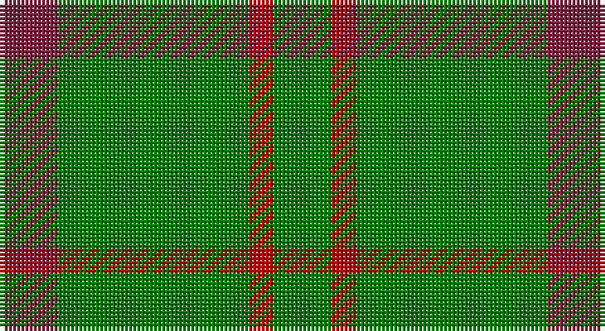

This page is one **sett** — a single exact thread-count. It belongs to the [tartan](/setts/g7r3g23m7/)
(the same proportion at any scale), whose colour order is pattern [GRGR](/stripes/grgr/).

Part of the [Highland Spring](/tartans/highland-spring/) tartan — the named design grouping this sett with its other cloths.

Sourced from weddslist.  It is a [4 stripe tartan](/stripes/stripes4/).

Original link http://www.weddslist.com/cgi-bin/tartans/pg.pl?source=sts

## Also known as

This cloth is also recorded under:

- Highland Spring Corporate Prom

## Thread count
DR/14 G46 R6 G/14

One full sett is **132 threads**.

## Palette

Palette: <strong>custom</strong>
<table><thead><tr><th>Colour</th><th>Threads</th><th>Shade</th><th>Base</th><th>OKLCh</th></tr></thead><tbody><tr><td>DR/</td><td style="text-align:right;font-variant-numeric:tabular-nums">14</td><td><code style="background-color:#802040;">#802040</code> <small style="color:#888">#802040</small></td><td>R <code style="background-color:#CC0000;">#CC0000</code></td><td><small style="color:#888">oklch(40.8% 0.132 5.2)</small></td></tr><tr><td>G</td><td style="text-align:right;font-variant-numeric:tabular-nums">46</td><td><code style="background-color:#008000;">#008000</code> <small style="color:#888">#008000</small></td><td>G <code style="background-color:#006100;">#006100</code></td><td><small style="color:#888">oklch(52.0% 0.177 142.5)</small></td></tr><tr><td>R</td><td style="text-align:right;font-variant-numeric:tabular-nums">6</td><td><code style="background-color:#C00000;">#C00000</code> <small style="color:#888">#C00000</small></td><td>R <code style="background-color:#CC0000;">#CC0000</code></td><td><small style="color:#888">oklch(50.7% 0.208 29.2)</small></td></tr><tr><td>G/</td><td style="text-align:right;font-variant-numeric:tabular-nums">14</td><td><code style="background-color:#008000;">#008000</code> <small style="color:#888">#008000</small></td><td>G <code style="background-color:#006100;">#006100</code></td><td><small style="color:#888">oklch(52.0% 0.177 142.5)</small></td></tr></tbody></table>

# Sample pattern

## Compared to the master

This cloth is one sett of its design; the master sett (the exemplar the design is anchored on) is below for comparison.

<figure style="margin:0"><figcaption style="color:#888;font-size:smaller">this sett</figcaption></figure>
<figure style="margin:0"><figcaption style="color:#888;font-size:smaller"><a href="/setts/dp3g1dp9r3/">master sett →</a></figcaption></figure>

## Nearest tartans

The nearest existing variants by ΔTartan distance, with this tartan at the top so the swatches line up against it.

ΔTartan

Tartan

Sett

—

<a href="/ttd/edit/#slug=g7r3g23m7~x2">Highland Spring (Green)</a> <a class="nn-out" href="/variants/s4/g7r3g23m7~x2/" title="open its dictionary page">↗</a>

1.01

<a href="/ttd/edit/#slug=dp7g23r3g7~x2&amp;base=g7r3g23m7~x2">Highland Spring (1997) (Corporate)</a> <a class="nn-out" href="/variants/s4/dp7g23r3g7~x2/" title="open its dictionary page">↗</a>

1.19

<a href="/ttd/edit/#slug=g9o20g46lg5~x2&amp;base=g7r3g23m7~x2">O'Neill, Red (Corporate?)</a> <a class="nn-out" href="/variants/s4/g9o20g46lg5~x2/" title="open its dictionary page">↗</a>

1.21

<a href="/ttd/edit/#slug=g9o20g40w5~x2&amp;base=g7r3g23m7~x2">O'Neill (Australia) (Name)</a> <a class="nn-out" href="/variants/s4/g9o20g40w5~x2/" title="open its dictionary page">↗</a>

1.28

<a href="/ttd/edit/#slug=g81r10ly20~x2&amp;base=g7r3g23m7~x2">McMoosie</a> <a class="nn-out" href="/variants/s3/g81r10ly20~x2/" title="open its dictionary page">↗</a>

1.34

<a href="/ttd/edit/#slug=g23r3g7r3g23dp7~x2&amp;base=g7r3g23m7~x2">Highland Spring (1997)</a> <a class="nn-out" href="/variants/s6/g23r3g7r3g23dp7~x2/" title="open its dictionary page">↗</a>

1.36

<a href="/ttd/edit/#slug=g12db3ly1~x4&amp;base=g7r3g23m7~x2">Unidentified, pattern</a> <a class="nn-out" href="/variants/s3/g12db3ly1~x4/" title="open its dictionary page">↗</a>

1.37

<a href="/ttd/edit/#slug=g9r2t2~x4&amp;base=g7r3g23m7~x2">Wilson's, No 212</a> <a class="nn-out" href="/variants/s3/g9r2t2~x4/" title="open its dictionary page">↗</a>

1.37

<a href="/ttd/edit/#slug=g9lo20g40w5~x2&amp;base=g7r3g23m7~x2">O'Neill</a> <a class="nn-out" href="/variants/s4/g9lo20g40w5~x2/" title="open its dictionary page">↗</a>

1.49

<a href="/ttd/edit/#slug=g49w4lo11~x2&amp;base=g7r3g23m7~x2">Hibernian S3</a> <a class="nn-out" href="/variants/s3/g49w4lo11~x2/" title="open its dictionary page">↗</a>

1.51

<a href="/ttd/edit/#slug=g46o20g9o20g46lg5~x2&amp;base=g7r3g23m7~x2">O'Neill, Red</a> <a class="nn-out" href="/variants/s6/g46o20g9o20g46lg5~x2/" title="open its dictionary page">↗</a>

## Neighbour map

Every grey dot is one of 14360 variants placed by the first two principal components of the ΔTartan feature space (44% of its variance). Red is this tartan; blue dots are its nearest — click one to open its page.

<svg viewBox="0 0 640 380" role="img" style="max-width:100%;height:auto;border:1px solid #e0e0e0;border-radius:4px;display:block" xmlns="http://www.w3.org/2000/svg"><image href="/nn/cloud.v1.png" width="640" height="380"/><a href="/variants/s4/dp7g23r3g7~x2/"><circle cx="471.0" cy="290.0" r="4" fill="#3465a4"><title>Highland Spring (1997) (Corporate)</title></circle></a><a href="/variants/s4/g9o20g46lg5~x2/"><circle cx="463.0" cy="289.0" r="4" fill="#3465a4"><title>O'Neill, Red (Corporate?)</title></circle></a><a href="/variants/s4/g9o20g40w5~x2/"><circle cx="412.5" cy="287.6" r="4" fill="#3465a4"><title>O'Neill (Australia) (Name)</title></circle></a><a href="/variants/s3/g81r10ly20~x2/"><circle cx="440.5" cy="274.4" r="4" fill="#3465a4"><title>McMoosie</title></circle></a><a href="/variants/s6/g23r3g7r3g23dp7~x2/"><circle cx="515.0" cy="278.5" r="4" fill="#3465a4"><title>Highland Spring (1997)</title></circle></a><a href="/variants/s3/g12db3ly1~x4/"><circle cx="495.0" cy="275.6" r="4" fill="#3465a4"><title>Unidentified, pattern</title></circle></a><a href="/variants/s3/g9r2t2~x4/"><circle cx="414.2" cy="319.4" r="4" fill="#3465a4"><title>Wilson's, No 212</title></circle></a><a href="/variants/s4/g9lo20g40w5~x2/"><circle cx="404.7" cy="281.8" r="4" fill="#3465a4"><title>O'Neill</title></circle></a><a href="/variants/s3/g49w4lo11~x2/"><circle cx="491.3" cy="257.5" r="4" fill="#3465a4"><title>Hibernian S3</title></circle></a><a href="/variants/s6/g46o20g9o20g46lg5~x2/"><circle cx="454.9" cy="286.6" r="4" fill="#3465a4"><title>O'Neill, Red</title></circle></a><circle cx="473.4" cy="289.1" r="5" fill="#c00000"/></svg>

ID: /variants/s4/g7r3g23m7~x2/
