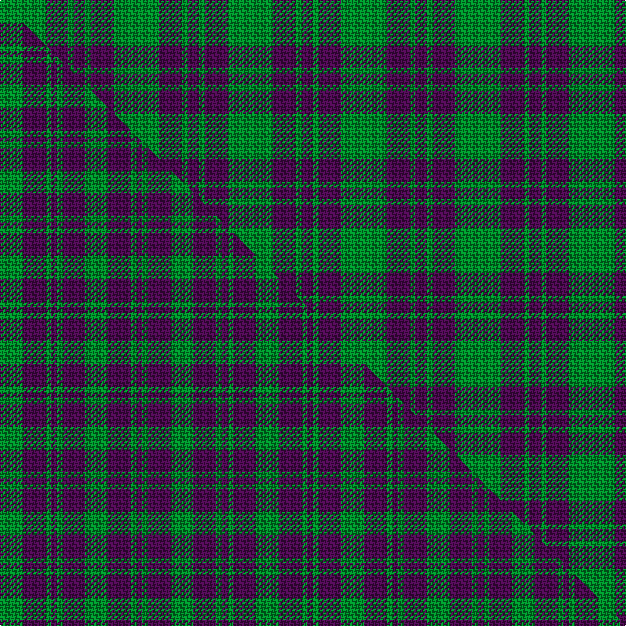

This is one **variant** — a specific cloth: this exact thread count and colourway, with its own
provenance below. It is one weaving of the [sett](/setts/g8dp4g1dp2/) (the scale-free proportion — the
same cloth at any scale or shade), whose colour order is pattern [BGBG](/stripes/bgbg/).

Part of the [Wilson's No 211](/tartans/wilson-s-no-211/) tartan — the named design grouping this sett with its other cloths.

Sourced from weddslist.  It is a [4 stripe tartan](/stripes/stripes4/).

Original link [http://www.weddslist.com/cgi-bin/tartans/pg.pl?source=sts](http://www.weddslist.com/cgi-bin/tartans/pg.pl?source=sts)

Dataset <small>— provenance for this record, inherited from the source manifest</small>

<dl class="dataset-prov">
<dt>source</dt><dd><a href="/sources/weddslist/">Weddslist</a></dd>
<dt>data captured from</dt><dd><a href="https://github.com/thetartan/tartan-database/blob/master/data/weddslist/data.csv">https://github.com/thetartan/tartan-database/blob/master/data/weddslist/data.csv</a></dd>
<dt>data date</dt><dd>2016-11-17 <small>(dataset default)</small></dd>
<dt>licence</dt><dd><a href="https://creativecommons.org/licenses/by-nc-nd/4.0/">CC BY-NC-ND 4.0</a></dd>
</dl>

Capture chain <small>— the hands this data passed through, oldest first; each capture carries its own licence</small>

<ol class="capture-chain">
<li><a href="https://www.weddslist.com/tartans/">Weddslist</a> <small>the living privately compiled reference</small></li>
<li><a href="https://github.com/thetartan/tartan-database">thetartan/tartan-database</a> <small>2016-2017</small> · <a href="https://creativecommons.org/licenses/by-nc-nd/4.0/">CC BY-NC-ND 4.0</a> <small>Levko Kravets's frozen compilation — the capture we vendored, and where its CC licence text came from</small></li>
<li>this dictionary <small>captured 2026-06-10 · commit 5bf86c7566</small> <small>each re-capture is a git commit to data/sources</small></li>
</ol>

## Thread count
G/32 DP16 G4 DP/8

One full sett is **80 threads**.

## Palette
<table><thead><tr><th>Colour</th><th>Shade</th><th>OKLCh</th></tr></thead><tbody><tr><td>G</td><td><code style="background-color:#008B2A;">#008B2A</code> <small style="color:#888">#008B2A</small></td><td><small style="color:#888">oklch(55.4% 0.170 145.9)</small></td></tr><tr><td>DP</td><td><code style="background-color:#4B0B4F;">#4B0B4F</code> <small style="color:#888">#4B0B4F</small></td><td><small style="color:#888">oklch(30.1% 0.125 325.4)</small></td></tr></tbody></table>

# Sample pattern

## Compared to the master

This cloth is one sett of its design; the master sett (the exemplar the design is anchored on) is below for comparison.

Its **ΔTartan distance** from the master is **0.58** — the same measure the nearest-tartans table ranks by (0 is identical; a re-scale of the same cloth is near 0, a recolour or a different proportion further).

<figure class="master-compare" style="margin:0">

this sett
master sett ★

<figcaption style="color:#888;font-size:smaller">One weave of this sett against the <a href="/setts/g4dp4g1dp1/">master sett ★</a>, split on the diagonal: a shared proportion runs seamlessly across it with only the shades shifting; a different proportion breaks on it.</figcaption>
</figure>

## Nearest tartan variants

The nearest existing variants by ΔTartan distance, with this cloth at the top so the swatches line up against it.

ΔTartan

Threads

Variant

Sett

—

80

<a href="/variants/s4/g8dp4g1dp2~x4/">Wilson's, No 211</a>

<a href="/ttd/edit/#slug=g4dp4g1dp1~x4&amp;base=g8dp4g1dp2~x4" title="compare in the TTD">0.58</a>

60

<a href="/variants/s4/g4dp4g1dp1~x4/">Wilson's No 211</a>

<a href="/ttd/edit/#slug=dp23dg8dp23dg35w5~x2&amp;base=g8dp4g1dp2~x4" title="compare in the TTD">1.00</a>

320

<a href="/variants/s5/dp23dg8dp23dg35w5~x2/">Baru</a>

<a href="/ttd/edit/#slug=g28dp10g3~x2&amp;base=g8dp4g1dp2~x4" title="compare in the TTD">1.55</a>

102

<a href="/variants/s3/g28dp10g3~x2/">Elphinstone Clan Tartan</a>

<a href="/ttd/edit/#slug=g12dp3g1~x2&amp;base=g8dp4g1dp2~x4" title="compare in the TTD">1.75</a>

38

<a href="/variants/s3/g12dp3g1~x2/">Elphinstone</a>

<a href="/ttd/edit/#slug=g6dp2g1~x4&amp;base=g8dp4g1dp2~x4" title="compare in the TTD">1.76</a>

44

<a href="/variants/s3/g6dp2g1~x4/">Elphinstone</a>

<a href="/ttd/edit/#slug=g6dp2g1~x20&amp;base=g8dp4g1dp2~x4" title="compare in the TTD">1.76</a>

220

<a href="/variants/s3/g6dp2g1~x20/">Elphinstone Check (Clan)</a>

<a href="/ttd/edit/#slug=dp7g23r3g7~x2&amp;base=g8dp4g1dp2~x4" title="compare in the TTD">1.78</a>

132

<a href="/variants/s4/dp7g23r3g7~x2/">Highland Spring (1997) (Corporate)</a>

<a href="/ttd/edit/#slug=g22dp22g3dp11w3dp4w3~x2&amp;base=g8dp4g1dp2~x4" title="compare in the TTD">2.48</a>

222

<a href="/variants/s7/g22dp22g3dp11w3dp4w3~x2/">O'Long (Personal)</a>

<a href="/ttd/edit/#slug=g6dp5lb1~x4&amp;base=g8dp4g1dp2~x4" title="compare in the TTD">2.56</a>

68

<a href="/variants/s3/g6dp5lb1~x4/">Wilson's, No 55</a>

<a href="/ttd/edit/#slug=g6dp5lb1~x4~dp1105325&amp;base=g8dp4g1dp2~x4" title="compare in the TTD">2.57</a>

68

<a href="/variants/s3/g6dp5lb1~x4~dp1105325/">Wilson's No.055</a>

## Neighbour map

Every grey dot is one of 13621 variants placed by the first two principal components of the ΔTartan feature space (42% of its variance). Red is this tartan; blue dots are its nearest — click one to open its page.

<svg viewBox="0 0 640 380" role="img" style="max-width:100%;height:auto;border:1px solid #e0e0e0;border-radius:4px;display:block" xmlns="http://www.w3.org/2000/svg"><image href="/nn/cloud.v1.png" width="640" height="380"/><a href="/variants/s4/g4dp4g1dp1~x4/"><circle cx="346.1" cy="333.8" r="4" fill="#3465a4"><title>Wilson's No 211</title></circle></a><a href="/variants/s5/dp23dg8dp23dg35w5~x2/"><circle cx="350.5" cy="299.2" r="4" fill="#3465a4"><title>Baru</title></circle></a><a href="/variants/s3/g28dp10g3~x2/"><circle cx="422.4" cy="290.0" r="4" fill="#3465a4"><title>Elphinstone Clan Tartan</title></circle></a><a href="/variants/s3/g12dp3g1~x2/"><circle cx="484.3" cy="267.2" r="4" fill="#3465a4"><title>Elphinstone</title></circle></a><a href="/variants/s3/g6dp2g1~x4/"><circle cx="421.0" cy="309.4" r="4" fill="#3465a4"><title>Elphinstone</title></circle></a><a href="/variants/s3/g6dp2g1~x20/"><circle cx="421.0" cy="309.4" r="4" fill="#3465a4"><title>Elphinstone Check (Clan)</title></circle></a><a href="/variants/s4/dp7g23r3g7~x2/"><circle cx="463.3" cy="269.2" r="4" fill="#3465a4"><title>Highland Spring (1997) (Corporate)</title></circle></a><a href="/variants/s7/g22dp22g3dp11w3dp4w3~x2/"><circle cx="319.8" cy="240.4" r="4" fill="#3465a4"><title>O'Long (Personal)</title></circle></a><a href="/variants/s3/g6dp5lb1~x4/"><circle cx="309.5" cy="322.5" r="4" fill="#3465a4"><title>Wilson's, No 55</title></circle></a><a href="/variants/s3/g6dp5lb1~x4~dp1105325/"><circle cx="303.3" cy="320.2" r="4" fill="#3465a4"><title>Wilson's No.055</title></circle></a><circle cx="413.2" cy="296.6" r="5" fill="#c00000"/><text x="320" y="376" text-anchor="middle" font-size="11" fill="#999">ground</text><text x="11" y="190" text-anchor="middle" font-size="11" fill="#999" transform="rotate(-90 11 190)">complexity</text></svg>

ID: /variants/s4/g8dp4g1dp2~x4/
