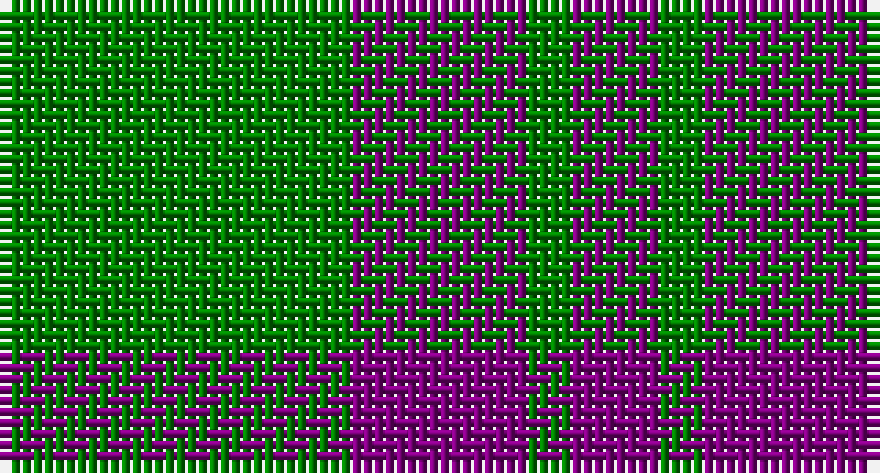

This page is one **sett** — a single exact thread-count. It belongs to the [tartan](/setts/g8p4g1p2/)
(the same proportion at any scale), whose colour order is pattern [BGBG](/stripes/bgbg/).

Part of the [Wilson's No 211](/tartans/wilson-s-no-211/) tartan — the named design grouping this sett with its other cloths.

Sourced from weddslist.  It is a [4 stripe tartan](/stripes/stripes4/).

Original link http://www.weddslist.com/cgi-bin/tartans/pg.pl?source=sts

## Also known as

This cloth is also recorded under:

- Wilson's No.116
- Wilson's No.211
- Wilson's, No 211

## Thread count
G/32 P16 G4 P/8

One full sett is **80 threads**.

## Palette

Palette: <strong>custom</strong>
<table><thead><tr><th>Colour</th><th>Threads</th><th>Shade</th><th>Base</th><th>OKLCh</th></tr></thead><tbody><tr><td>G/</td><td style="text-align:right;font-variant-numeric:tabular-nums">32</td><td><code style="background-color:#008000;">#008000</code> <small style="color:#888">#008000</small></td><td>G <code style="background-color:#006100;">#006100</code></td><td><small style="color:#888">oklch(52.0% 0.177 142.5)</small></td></tr><tr><td>P</td><td style="text-align:right;font-variant-numeric:tabular-nums">16</td><td><code style="background-color:#800080;">#800080</code> <small style="color:#888">#800080</small></td><td>B <code style="background-color:#2A418A;">#2A418A</code></td><td><small style="color:#888">oklch(42.1% 0.193 328.4)</small></td></tr><tr><td>G</td><td style="text-align:right;font-variant-numeric:tabular-nums">4</td><td><code style="background-color:#008000;">#008000</code> <small style="color:#888">#008000</small></td><td>G <code style="background-color:#006100;">#006100</code></td><td><small style="color:#888">oklch(52.0% 0.177 142.5)</small></td></tr><tr><td>P/</td><td style="text-align:right;font-variant-numeric:tabular-nums">8</td><td><code style="background-color:#800080;">#800080</code> <small style="color:#888">#800080</small></td><td>B <code style="background-color:#2A418A;">#2A418A</code></td><td><small style="color:#888">oklch(42.1% 0.193 328.4)</small></td></tr></tbody></table>

# Sample pattern

## Compared to the master

This cloth is one sett of its design; the master sett (the exemplar the design is anchored on) is below for comparison.

<figure style="margin:0"><figcaption style="color:#888;font-size:smaller">this sett</figcaption></figure>
<figure style="margin:0"><figcaption style="color:#888;font-size:smaller"><a href="/setts/dg4dp4dg1dp1/">master sett →</a></figcaption></figure>

## Nearest tartans

The nearest existing variants by ΔTartan distance, with this tartan at the top so the swatches line up against it.

ΔTartan

Tartan

Sett

—

<a href="/ttd/edit/#slug=g8p4g1p2~x4">Wilson's, No 211</a> <a class="nn-out" href="/variants/s4/g8p4g1p2~x4/" title="open its dictionary page">↗</a>

0.89

<a href="/variants/s4/g28dp10g3~x2/">Elphinstone Clan Tartan</a>

1.23

<a href="/ttd/edit/#slug=dg21lo44dg86t10&amp;base=g8p4g1p2~x4">Special Saffron (Fashion)</a> <a class="nn-out" href="/variants/s4/dg21lo44dg86t10/" title="open its dictionary page">↗</a>

1.35

<a href="/variants/s4/g6dp2g1~x4/">Elphinstone</a>

1.35

<a href="/variants/s4/g6dp2g1~x20/">Elphinstone Check (Clan)</a>

1.38

<a href="/variants/s4/g12p3g1~x2/">Elphinstone</a>

1.55

<a href="/ttd/edit/#slug=dg21lo43dg86b10&amp;base=g8p4g1p2~x4">Special, Saffron</a> <a class="nn-out" href="/variants/s4/dg21lo43dg86b10/" title="open its dictionary page">↗</a>

1.55

<a href="/ttd/edit/#slug=y8k3y17k13y6k3y4~x2&amp;base=g8p4g1p2~x4">Scott Black and Grey</a> <a class="nn-out" href="/variants/s7/y8k3y17k13y6k3y4~x2/" title="open its dictionary page">↗</a>

1.59

<a href="/ttd/edit/#slug=o8k3o17k13o6k3o4~x2&amp;base=g8p4g1p2~x4">Scott Black &amp; Grey (Corporate)</a> <a class="nn-out" href="/variants/s7/o8k3o17k13o6k3o4~x2/" title="open its dictionary page">↗</a>

1.59

<a href="/ttd/edit/#slug=dg86lo44dg21lo44dg86t10&amp;base=g8p4g1p2~x4">Special Saffron</a> <a class="nn-out" href="/variants/s6/dg86lo44dg21lo44dg86t10/" title="open its dictionary page">↗</a>

1.63

<a href="/ttd/edit/#slug=dg2o14dg8o3dg12db2~x2&amp;base=g8p4g1p2~x4">Confederate Infantry</a> <a class="nn-out" href="/variants/s6/dg2o14dg8o3dg12db2~x2/" title="open its dictionary page">↗</a>

## Neighbour map

Every grey dot is one of 14360 variants placed by the first two principal components of the ΔTartan feature space (44% of its variance). Red is this tartan; blue dots are its nearest — click one to open its page.

<svg viewBox="0 0 640 380" role="img" style="max-width:100%;height:auto;border:1px solid #e0e0e0;border-radius:4px;display:block" xmlns="http://www.w3.org/2000/svg"><image href="/nn/cloud.v1.png" width="640" height="380"/><a href="/variants/s4/g28dp10g3~x2/"><circle cx="407.7" cy="288.6" r="4" fill="#3465a4"><title>Elphinstone Clan Tartan</title></circle></a><a href="/variants/s4/dg21lo44dg86t10/"><circle cx="371.8" cy="263.0" r="4" fill="#3465a4"><title>Special Saffron (Fashion)</title></circle></a><a href="/variants/s4/g6dp2g1~x4/"><circle cx="407.8" cy="315.6" r="4" fill="#3465a4"><title>Elphinstone</title></circle></a><a href="/variants/s4/g6dp2g1~x20/"><circle cx="407.8" cy="315.6" r="4" fill="#3465a4"><title>Elphinstone Check (Clan)</title></circle></a><a href="/variants/s4/g12p3g1~x2/"><circle cx="451.4" cy="258.3" r="4" fill="#3465a4"><title>Elphinstone</title></circle></a><a href="/variants/s4/dg21lo43dg86b10/"><circle cx="378.3" cy="264.5" r="4" fill="#3465a4"><title>Special, Saffron</title></circle></a><a href="/variants/s7/y8k3y17k13y6k3y4~x2/"><circle cx="361.9" cy="274.7" r="4" fill="#3465a4"><title>Scott Black and Grey</title></circle></a><a href="/variants/s7/o8k3o17k13o6k3o4~x2/"><circle cx="355.1" cy="270.7" r="4" fill="#3465a4"><title>Scott Black &amp; Grey (Corporate)</title></circle></a><a href="/variants/s6/dg86lo44dg21lo44dg86t10/"><circle cx="354.3" cy="257.4" r="4" fill="#3465a4"><title>Special Saffron</title></circle></a><a href="/variants/s6/dg2o14dg8o3dg12db2~x2/"><circle cx="313.3" cy="263.0" r="4" fill="#3465a4"><title>Confederate Infantry</title></circle></a><circle cx="374.6" cy="282.6" r="5" fill="#c00000"/></svg>

ID: /variants/s4/g8p4g1p2~x4/
