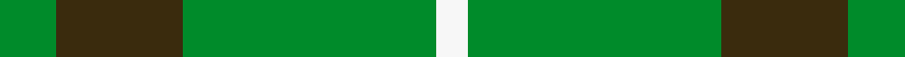

This is one **variant** — a specific cloth: this exact thread count and colourway, with its own
provenance below. It is one weaving of the [sett](/setts/g9dy20g40w5/) (the scale-free proportion — the
same cloth at any scale or shade), whose colour order is pattern [GGGW](/stripes/gggw/).

Part of the [O'Neill](/tartans/o/o/o-neill-3/) tartan — the named design grouping this sett with its other cloths.

Sourced from house-of-tartan.  It is a [4 stripe tartan](/stripes/stripes4/).

Original link [http://www.house-of-tartan.scotland.net/house/TartanViewjs.asp?colr=Def&tnam=2464](http://www.house-of-tartan.scotland.net/house/TartanViewjs.asp?colr=Def&tnam=2464)

## Provenance

Earliest known date: 1985 O'Neill is an Irish family tartan. The dark yellow stripe is mustard or dark saffron.

Dataset <small>— provenance for this record, inherited from the source manifest</small>

<dl class="dataset-prov">
<dt>source</dt><dd><a href="/sources/house-of-tartan/">House of Tartan</a></dd>
<dt>data captured from</dt><dd><a href="https://github.com/thetartan/tartan-database/blob/master/data/house-of-tartan/data.csv">https://github.com/thetartan/tartan-database/blob/master/data/house-of-tartan/data.csv</a></dd>
<dt>data date</dt><dd>1985 <small>(this record)</small></dd>
<dt>licence</dt><dd><a href="https://creativecommons.org/licenses/by-nc-nd/4.0/">CC BY-NC-ND 4.0</a></dd>
</dl>

Capture chain <small>— the hands this data passed through, oldest first; each capture carries its own licence</small>

<ol class="capture-chain">
<li><a href="http://www.house-of-tartan.scotland.net/">House of Tartan</a> <small>the weaver/retailer's database — the site is now offline; the URL is kept as the ultimate source's identity</small></li>
<li><a href="https://github.com/thetartan/tartan-database">thetartan/tartan-database</a> <small>2016-2017</small> · <a href="https://creativecommons.org/licenses/by-nc-nd/4.0/">CC BY-NC-ND 4.0</a> <small>Levko Kravets's frozen compilation — the capture we vendored, and where its CC licence text came from</small></li>
<li>this dictionary <small>captured 2026-06-10 · commit 5bf86c7566</small> <small>each re-capture is a git commit to data/sources</small></li>
</ol>

## Thread count
G/18 DY40 G80 W/10

One full sett is **268 threads**.

## Palette
<table><thead><tr><th>Colour</th><th>Shade</th><th>OKLCh</th></tr></thead><tbody><tr><td>G</td><td><code style="background-color:#008B2A;">#008B2A</code> <small style="color:#888">#008B2A</small></td><td><small style="color:#888">oklch(55.4% 0.170 145.9)</small></td></tr><tr><td>W</td><td><code style="background-color:#F7F7F7;">#F7F7F7</code> <small style="color:#888">#F7F7F7</small></td><td><small style="color:#888">oklch(97.6% 0.000 89.9)</small></td></tr><tr><td>DY</td><td><code style="background-color:#3A2B0D;">#3A2B0D</code> <small style="color:#888">#3A2B0D</small></td><td><small style="color:#888">oklch(30.0% 0.049 82.0)</small></td></tr></tbody></table>

# Sample pattern

## Nearest tartan variants

The nearest existing variants by ΔTartan distance, with this cloth at the top so the swatches line up against it.

ΔTartan

Threads

Variant

Sett

—

268

<a href="/variants/s4/g9dy20g40w5~x2/">O'Neill Irish Family Tartan</a>

<a href="/ttd/edit/#slug=dg21y43dg86lb10&amp;base=g9dy20g40w5~x2" title="compare in the TTD">0.56</a>

289

<a href="/variants/s4/dg21y43dg86lb10/">Special Saffron Tartan</a>

<a href="/ttd/edit/#slug=g9b20g40w5~x2&amp;base=g9dy20g40w5~x2" title="compare in the TTD">1.40</a>

268

<a href="/variants/s4/g9b20g40w5~x2/">O'Neill</a>

<a href="/ttd/edit/#slug=g9o20g40w5~x2&amp;base=g9dy20g40w5~x2" title="compare in the TTD">1.40</a>

268

<a href="/variants/s4/g9o20g40w5~x2/">O'Neill (Australia) (Name)</a>

<a href="/ttd/edit/#slug=dp7g23r3g7~x2&amp;base=g9dy20g40w5~x2" title="compare in the TTD">1.82</a>

132

<a href="/variants/s4/dp7g23r3g7~x2/">Highland Spring (1997) (Corporate)</a>

<a href="/ttd/edit/#slug=dr7g23r3g7~x2&amp;base=g9dy20g40w5~x2" title="compare in the TTD">1.82</a>

132

<a href="/variants/s4/dr7g23r3g7~x2/">Highland Spring (Green)</a>

<a href="/ttd/edit/#slug=dg21lo43dg86b10~dg1104144-lo2706066&amp;base=g9dy20g40w5~x2" title="compare in the TTD">1.82</a>

289

<a href="/variants/s4/dg21lo43dg86b10~dg1104144-lo2706066/">Special, Saffron</a>

<a href="/ttd/edit/#slug=dg21lo44dg86lb10&amp;base=g9dy20g40w5~x2" title="compare in the TTD">1.82</a>

291

<a href="/variants/s4/dg21lo44dg86lb10/">Special Saffron (Fashion)</a>

<a href="/ttd/edit/#slug=dy21g28db24g72w16g20&amp;base=g9dy20g40w5~x2" title="compare in the TTD">1.97</a>

321

<a href="/variants/s6/dy21g28db24g72w16g20/">Meath County, Crest Range</a>

<a href="/ttd/edit/#slug=ly21g28db24g72w16g20&amp;base=g9dy20g40w5~x2" title="compare in the TTD">1.97</a>

321

<a href="/variants/s6/ly21g28db24g72w16g20/">Meath County Crest (Fashion)</a>

<a href="/ttd/edit/#slug=g50dy25ly2dp6~x2&amp;base=g9dy20g40w5~x2" title="compare in the TTD">1.99</a>

220

<a href="/variants/s4/g50dy25ly2dp6~x2/">Highland Greenford (Personal)</a>

## Neighbour map

Every grey dot is one of 13621 variants placed by the first two principal components of the ΔTartan feature space (42% of its variance). Red is this tartan; blue dots are its nearest — click one to open its page. The map is a flat projection of a many-dimensional space — [how to read it](/posts/neighbourhood-maps/).

<svg viewBox="0 0 640 380" role="img" style="max-width:100%;height:auto;border:1px solid #e0e0e0;border-radius:4px;display:block" xmlns="http://www.w3.org/2000/svg"><image href="/nn/cloud.v1.png" width="640" height="380"/><a href="/variants/s4/dg21y43dg86lb10/"><circle cx="451.2" cy="286.0" r="4" fill="#3465a4"><title>Special Saffron Tartan</title></circle></a><a href="/variants/s4/g9b20g40w5~x2/"><circle cx="439.1" cy="295.8" r="4" fill="#3465a4"><title>O'Neill</title></circle></a><a href="/variants/s4/g9o20g40w5~x2/"><circle cx="449.4" cy="289.8" r="4" fill="#3465a4"><title>O'Neill (Australia) (Name)</title></circle></a><a href="/variants/s4/dp7g23r3g7~x2/"><circle cx="463.4" cy="269.2" r="4" fill="#3465a4"><title>Highland Spring (1997) (Corporate)</title></circle></a><a href="/variants/s4/dr7g23r3g7~x2/"><circle cx="479.4" cy="274.7" r="4" fill="#3465a4"><title>Highland Spring (Green)</title></circle></a><a href="/variants/s4/dg21lo43dg86b10~dg1104144-lo2706066/"><circle cx="414.6" cy="273.3" r="4" fill="#3465a4"><title>Special, Saffron</title></circle></a><a href="/variants/s4/dg21lo44dg86lb10/"><circle cx="392.5" cy="268.4" r="4" fill="#3465a4"><title>Special Saffron (Fashion)</title></circle></a><a href="/variants/s6/dy21g28db24g72w16g20/"><circle cx="333.3" cy="282.5" r="4" fill="#3465a4"><title>Meath County, Crest Range</title></circle></a><a href="/variants/s6/ly21g28db24g72w16g20/"><circle cx="336.5" cy="285.6" r="4" fill="#3465a4"><title>Meath County Crest (Fashion)</title></circle></a><a href="/variants/s4/g50dy25ly2dp6~x2/"><circle cx="434.0" cy="221.7" r="4" fill="#3465a4"><title>Highland Greenford (Personal)</title></circle></a><circle cx="415.5" cy="285.3" r="5" fill="#c00000"/><text x="320" y="376" text-anchor="middle" font-size="11" fill="#999">ground</text><text x="11" y="190" text-anchor="middle" font-size="11" fill="#999" transform="rotate(-90 11 190)">complexity</text></svg>

ID: /variants/s4/g9dy20g40w5~x2/
