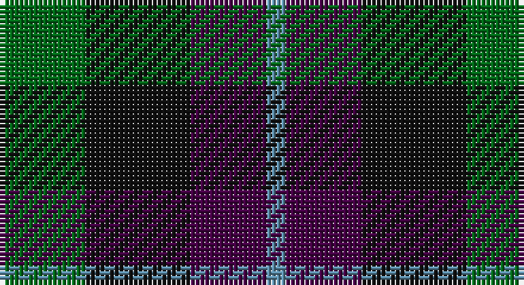

This page is one **sett** — a single exact thread-count. It belongs to the [tartan](/setts/g9k11dp8t2/)
(the same proportion at any scale), whose colour order is pattern [BBKG](/stripes/bbkg/).

Part of the [Wilson's No.228](/tartans/wilson-s-no-228/) tartan — the named design grouping this sett with its other cloths.

Sourced from register-of-tartans.  It is a [4 stripe tartan](/stripes/stripes4/).

Original link https://www.tartanregister.gov.uk/tartanDetails.aspx?ref=4755

## Also known as

This cloth is also recorded under:

- Wilson's No.228 #2

## Register references

External register numbers recorded for this tartan.

- Scottish Register of Tartans: [4755](https://www.tartanregister.gov.uk/tartanDetails.aspx?ref=4755)
- Scottish Tartans Authority (ITI): 688
- Scottish Tartans World Register: 688

## Thread count
G/18 K22 DP16 B/4

One full sett is **98 threads**.

## Palette

Palette: <strong>Tartan Register</strong>
<table><thead><tr><th>Colour</th><th>Threads</th><th>Shade</th><th>Base</th><th>OKLCh</th></tr></thead><tbody><tr><td>G/</td><td style="text-align:right;font-variant-numeric:tabular-nums">18</td><td><code style="background-color:#006818;">#006818</code> <small style="color:#888">#006818</small></td><td>G <code style="background-color:#006100;">#006100</code></td><td><small style="color:#888">oklch(45.0% 0.142 145.0)</small></td></tr><tr><td>K</td><td style="text-align:right;font-variant-numeric:tabular-nums">22</td><td><code style="background-color:#101010;">#101010</code> <small style="color:#888">#101010</small></td><td>K <code style="background-color:#000000;">#000000</code></td><td><small style="color:#888">oklch(17.3% 0.000 89.9)</small></td></tr><tr><td>DP</td><td style="text-align:right;font-variant-numeric:tabular-nums">16</td><td><code style="background-color:#440044;">#440044</code> <small style="color:#888">#440044</small></td><td>B <code style="background-color:#2A418A;">#2A418A</code></td><td><small style="color:#888">oklch(27.1% 0.125 328.4)</small></td></tr><tr><td>B/</td><td style="text-align:right;font-variant-numeric:tabular-nums">4</td><td><code style="background-color:#5C8CA8;">#5C8CA8</code> <small style="color:#888">#5C8CA8</small></td><td>B <code style="background-color:#2A418A;">#2A418A</code></td><td><small style="color:#888">oklch(61.7% 0.067 235.0)</small></td></tr></tbody></table>

# Sample pattern

## Compared to the master

This cloth is one sett of its design; the master sett (the exemplar the design is anchored on) is below for comparison.

<figure style="margin:0"><figcaption style="color:#888;font-size:smaller">this sett</figcaption></figure>
<figure style="margin:0"><figcaption style="color:#888;font-size:smaller"><a href="/setts/dp8k11dg9k11dp8t2/">master sett →</a></figcaption></figure>

## Nearest tartans

The nearest existing variants by ΔTartan distance, with this tartan at the top so the swatches line up against it.

ΔTartan

Tartan

Sett

—

<a href="/ttd/edit/#slug=g9k11dp8t2~x2">Wilson's No.228</a> <a class="nn-out" href="/variants/s4/g9k11dp8t2~x2/" title="open its dictionary page">↗</a>

0.60

<a href="/ttd/edit/#slug=db4k5dg4r1~x4&amp;base=g9k11dp8t2~x2">Unidentified pattern #3</a> <a class="nn-out" href="/variants/s4/db4k5dg4r1~x4/" title="open its dictionary page">↗</a>

0.84

<a href="/ttd/edit/#slug=dp8k11g9r2~x2&amp;base=g9k11dp8t2~x2">Norwich Collection No. 60</a> <a class="nn-out" href="/variants/s4/dp8k11g9r2~x2/" title="open its dictionary page">↗</a>

1.06

<a href="/ttd/edit/#slug=dp6k5dg5r1~x2&amp;base=g9k11dp8t2~x2">Unidentified No 60</a> <a class="nn-out" href="/variants/s4/dp6k5dg5r1~x2/" title="open its dictionary page">↗</a>

1.06

<a href="/ttd/edit/#slug=k1g3k3db3r1~x4&amp;base=g9k11dp8t2~x2">Durham District Tartan</a> <a class="nn-out" href="/variants/s5/k1g3k3db3r1~x4/" title="open its dictionary page">↗</a>

1.10

<a href="/ttd/edit/#slug=dp8k11dg9w2~x2&amp;base=g9k11dp8t2~x2">Wilson's No 220</a> <a class="nn-out" href="/variants/s4/dp8k11dg9w2~x2/" title="open its dictionary page">↗</a>

1.27

<a href="/ttd/edit/#slug=r4g12k12g2db12g3~x2&amp;base=g9k11dp8t2~x2">Gunn - 1810 (Clan)</a> <a class="nn-out" href="/variants/s6/r4g12k12g2db12g3~x2/" title="open its dictionary page">↗</a>

1.28

<a href="/ttd/edit/#slug=k6dg6ly1dg6k6dp6k1~x4&amp;base=g9k11dp8t2~x2">Abercrombie (Wilsons No 2/64)</a> <a class="nn-out" href="/variants/s7/k6dg6ly1dg6k6dp6k1~x4/" title="open its dictionary page">↗</a>

1.33

<a href="/ttd/edit/#slug=k11dg12k2dg12k12dp12w3~x2&amp;base=g9k11dp8t2~x2">Wilson's No 97</a> <a class="nn-out" href="/variants/s7/k11dg12k2dg12k12dp12w3~x2/" title="open its dictionary page">↗</a>

1.35

<a href="/ttd/edit/#slug=db4dg6w1dg6k6db6k2~x2&amp;base=g9k11dp8t2~x2">MacNeil of Colonsay</a> <a class="nn-out" href="/variants/s7/db4dg6w1dg6k6db6k2~x2/" title="open its dictionary page">↗</a>

1.39

<a href="/ttd/edit/#slug=db12k17dg19w2k5~x2&amp;base=g9k11dp8t2~x2">Wilson's Folio 131</a> <a class="nn-out" href="/variants/s5/db12k17dg19w2k5~x2/" title="open its dictionary page">↗</a>

## Neighbour map

Every grey dot is one of 14360 variants placed by the first two principal components of the ΔTartan feature space (44% of its variance). Red is this tartan; blue dots are its nearest — click one to open its page.

<svg viewBox="0 0 640 380" role="img" style="max-width:100%;height:auto;border:1px solid #e0e0e0;border-radius:4px;display:block" xmlns="http://www.w3.org/2000/svg"><image href="/nn/cloud.v1.png" width="640" height="380"/><a href="/variants/s4/db4k5dg4r1~x4/"><circle cx="169.5" cy="323.7" r="4" fill="#3465a4"><title>Unidentified pattern #3</title></circle></a><a href="/variants/s4/dp8k11g9r2~x2/"><circle cx="157.2" cy="297.7" r="4" fill="#3465a4"><title>Norwich Collection No. 60</title></circle></a><a href="/variants/s4/dp6k5dg5r1~x2/"><circle cx="170.6" cy="302.8" r="4" fill="#3465a4"><title>Unidentified No 60</title></circle></a><a href="/variants/s5/k1g3k3db3r1~x4/"><circle cx="130.3" cy="319.2" r="4" fill="#3465a4"><title>Durham District Tartan</title></circle></a><a href="/variants/s4/dp8k11dg9w2~x2/"><circle cx="142.2" cy="295.5" r="4" fill="#3465a4"><title>Wilson's No 220</title></circle></a><a href="/variants/s6/r4g12k12g2db12g3~x2/"><circle cx="167.6" cy="264.9" r="4" fill="#3465a4"><title>Gunn - 1810 (Clan)</title></circle></a><a href="/variants/s7/k6dg6ly1dg6k6dp6k1~x4/"><circle cx="192.8" cy="280.0" r="4" fill="#3465a4"><title>Abercrombie (Wilsons No 2/64)</title></circle></a><a href="/variants/s7/k11dg12k2dg12k12dp12w3~x2/"><circle cx="165.1" cy="276.2" r="4" fill="#3465a4"><title>Wilson's No 97</title></circle></a><a href="/variants/s7/db4dg6w1dg6k6db6k2~x2/"><circle cx="161.7" cy="281.1" r="4" fill="#3465a4"><title>MacNeil of Colonsay</title></circle></a><a href="/variants/s5/db12k17dg19w2k5~x2/"><circle cx="222.7" cy="269.4" r="4" fill="#3465a4"><title>Wilson's Folio 131</title></circle></a><circle cx="167.7" cy="310.5" r="5" fill="#c00000"/></svg>

ID: /variants/s4/g9k11dp8t2~x2/
