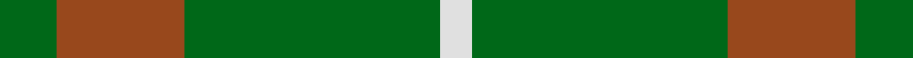

This page is one **sett** — a single exact thread-count. It belongs to the [tartan](/setts/g9o20g40w5/)
(the same proportion at any scale), whose colour order is pattern [GRGW](/stripes/grgw/).

Part of the [O'Neill](/tartans/o-neill-3/) tartan — the named design grouping this sett with its other cloths.

Sourced from tartans-authority.  It is a [4 stripe tartan](/stripes/stripes4/).

Original link http://www.tartansauthority.com/tartan-ferret/display/2464/

## Register references

External register numbers recorded for this tartan.

- Scottish Tartans Authority (ITI): 2464

## Thread count
G/18 O40 G80 W/10

One full sett is **268 threads**.

## Palette
<table><thead><tr><th>Colour</th><th>Shade</th><th>OKLCh</th></tr></thead><tbody><tr><td>G</td><td><code style="background-color:#008B2A;">#008B2A</code> <small style="color:#888">#008B2A</small></td><td><small style="color:#888">oklch(55.4% 0.170 145.9)</small></td></tr><tr><td>W</td><td><code style="background-color:#F7F7F7;">#F7F7F7</code> <small style="color:#888">#F7F7F7</small></td><td><small style="color:#888">oklch(97.6% 0.000 89.9)</small></td></tr><tr><td>O</td><td><code style="background-color:#A65C11;">#A65C11</code> <small style="color:#888">#A65C11</small></td><td><small style="color:#888">oklch(55.0% 0.125 58.3)</small></td></tr></tbody></table>

# Sample pattern

## Nearest tartan variants

The nearest existing variants by ΔTartan distance, with this cloth at the top so the swatches line up against it.

ΔTartan

Threads

Variant

Sett

—

268

<a href="/variants/s4/g9o20g40w5~x2/">O'Neill (Australia) (Name)</a>

<a href="/ttd/edit/#slug=g9o20g46lg5~x2&amp;base=g9o20g40w5~x2" title="compare in the TTD">0.47</a>

292

<a href="/variants/s4/g9o20g46lg5~x2/">O'Neill, Red (Corporate?)</a>

<a href="/ttd/edit/#slug=g9dy20g40w5~x2&amp;base=g9o20g40w5~x2" title="compare in the TTD">1.40</a>

268

<a href="/variants/s4/g9dy20g40w5~x2/">O'Neill Irish Family Tartan</a>

<a href="/ttd/edit/#slug=g9b20g40w5~x2&amp;base=g9o20g40w5~x2" title="compare in the TTD">1.40</a>

268

<a href="/variants/s4/g9b20g40w5~x2/">O'Neill</a>

<a href="/ttd/edit/#slug=g49w4lo11~x2&amp;base=g9o20g40w5~x2" title="compare in the TTD">1.67</a>

136

<a href="/variants/s3/g49w4lo11~x2/">Hibernian S3</a>

<a href="/ttd/edit/#slug=dr7g23r3g7~x2&amp;base=g9o20g40w5~x2" title="compare in the TTD">1.82</a>

132

<a href="/variants/s4/dr7g23r3g7~x2/">Highland Spring (Green)</a>

<a href="/ttd/edit/#slug=dp7g23r3g7~x2&amp;base=g9o20g40w5~x2" title="compare in the TTD">1.82</a>

132

<a href="/variants/s4/dp7g23r3g7~x2/">Highland Spring (1997) (Corporate)</a>

<a href="/ttd/edit/#slug=dg21y43dg86lb10&amp;base=g9o20g40w5~x2" title="compare in the TTD">1.82</a>

289

<a href="/variants/s4/dg21y43dg86lb10/">Special Saffron Tartan</a>

<a href="/ttd/edit/#slug=dg37o9dg3r9o3~x2&amp;base=g9o20g40w5~x2" title="compare in the TTD">2.05</a>

164

<a href="/variants/s5/dg37o9dg3r9o3~x2/">Glen Trool</a>

<a href="/ttd/edit/#slug=o20g40w5g40o20g9~x2&amp;base=g9o20g40w5~x2" title="compare in the TTD">2.05</a>

478

<a href="/variants/s6/o20g40w5g40o20g9~x2/">O'Neill (Australia)</a>

<a href="/ttd/edit/#slug=r1g8o8w1~x2&amp;base=g9o20g40w5~x2" title="compare in the TTD">2.35</a>

68

<a href="/variants/s4/r1g8o8w1~x2/">MacKinnon, hunting</a>

## Neighbour map

Every grey dot is one of 13620 variants placed by the first two principal components of the ΔTartan feature space (42% of its variance). Red is this tartan; blue dots are its nearest — click one to open its page.

<svg viewBox="0 0 640 380" role="img" style="max-width:100%;height:auto;border:1px solid #e0e0e0;border-radius:4px;display:block" xmlns="http://www.w3.org/2000/svg"><image href="/nn/cloud.v1.png" width="640" height="380"/><a href="/variants/s4/g9o20g46lg5~x2/"><circle cx="536.0" cy="299.8" r="4" fill="#3465a4"><title>O'Neill, Red (Corporate?)</title></circle></a><a href="/variants/s4/g9dy20g40w5~x2/"><circle cx="415.3" cy="284.6" r="4" fill="#3465a4"><title>O'Neill Irish Family Tartan</title></circle></a><a href="/variants/s4/g9b20g40w5~x2/"><circle cx="438.8" cy="295.2" r="4" fill="#3465a4"><title>O'Neill</title></circle></a><a href="/variants/s3/g49w4lo11~x2/"><circle cx="546.0" cy="274.5" r="4" fill="#3465a4"><title>Hibernian S3</title></circle></a><a href="/variants/s4/dr7g23r3g7~x2/"><circle cx="479.2" cy="274.1" r="4" fill="#3465a4"><title>Highland Spring (Green)</title></circle></a><a href="/variants/s4/dp7g23r3g7~x2/"><circle cx="463.1" cy="268.5" r="4" fill="#3465a4"><title>Highland Spring (1997) (Corporate)</title></circle></a><a href="/variants/s4/dg21y43dg86lb10/"><circle cx="450.9" cy="285.4" r="4" fill="#3465a4"><title>Special Saffron Tartan</title></circle></a><a href="/variants/s5/dg37o9dg3r9o3~x2/"><circle cx="445.3" cy="219.5" r="4" fill="#3465a4"><title>Glen Trool</title></circle></a><a href="/variants/s6/o20g40w5g40o20g9~x2/"><circle cx="462.4" cy="294.7" r="4" fill="#3465a4"><title>O'Neill (Australia)</title></circle></a><a href="/variants/s4/r1g8o8w1~x2/"><circle cx="333.7" cy="271.2" r="4" fill="#3465a4"><title>MacKinnon, hunting</title></circle></a><circle cx="449.1" cy="289.2" r="5" fill="#c00000"/><text x="320" y="376" text-anchor="middle" font-size="11" fill="#999">ground</text><text x="11" y="190" text-anchor="middle" font-size="11" fill="#999" transform="rotate(-90 11 190)">complexity</text></svg>

ID: /variants/s4/g9o20g40w5~x2/
