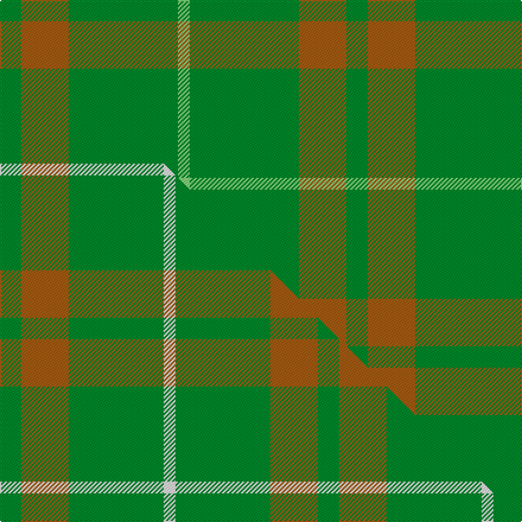

This page is one **sett** — a single exact thread-count. It belongs to the [tartan](/setts/g9o20g46lg5/)
(the same proportion at any scale), whose colour order is pattern [GRGY](/stripes/grgy/).

Part of the [O'Neill](/tartans/o-neill-3/) tartan — the named design grouping this sett with its other cloths.

Sourced from tartans-authority.  It is a [4 stripe tartan](/stripes/stripes4/).

Original link https://www.tartanregister.gov.uk/tartanDetails.aspx?ref=5535

Dataset <small>— provenance for this record, inherited from the source manifest</small>

<dl class="dataset-prov">
<dt>source</dt><dd><a href="/sources/tartans-authority/">Scottish Tartans Authority</a></dd>
<dt>data captured from</dt><dd><a href="https://github.com/thetartan/tartan-database/blob/master/data/tartans-authority/data.csv">https://github.com/thetartan/tartan-database/blob/master/data/tartans-authority/data.csv</a></dd>
<dt>data date</dt><dd>1985 <small>(this record)</small></dd>
<dt>licence</dt><dd><a href="https://creativecommons.org/licenses/by-nc-nd/4.0/">CC BY-NC-ND 4.0</a></dd>
</dl>

Capture chain <small>— the hands this data passed through, oldest first; each capture carries its own licence</small>

<ol class="capture-chain">
<li><a href="https://www.tartansauthority.com/">Scottish Tartans Authority</a> <small>the heritage body's archive — its tartan-ferret record browser is retired (links repaired to the SRT, above)</small></li>
<li><a href="https://github.com/thetartan/tartan-database">thetartan/tartan-database</a> <small>2016-2017</small> · <a href="https://creativecommons.org/licenses/by-nc-nd/4.0/">CC BY-NC-ND 4.0</a> <small>Levko Kravets's frozen compilation — the capture we vendored, and where its CC licence text came from</small></li>
<li>this dictionary <small>captured 2026-06-10 · commit 5bf86c7566</small> <small>each re-capture is a git commit to data/sources</small></li>
</ol>

## Register references

External register numbers recorded for this tartan.

- Scottish Tartans Authority (ITI): 5535

## Thread count
G/18 O40 G92 LG/10

One full sett is **292 threads**.

## Palette
<table><thead><tr><th>Colour</th><th>Shade</th><th>OKLCh</th></tr></thead><tbody><tr><td>LG</td><td><code style="background-color:#82D67A;">#82D67A</code> <small style="color:#888">#82D67A</small></td><td><small style="color:#888">oklch(80.1% 0.150 142.2)</small></td></tr><tr><td>O</td><td><code style="background-color:#A65C11;">#A65C11</code> <small style="color:#888">#A65C11</small></td><td><small style="color:#888">oklch(55.0% 0.125 58.3)</small></td></tr><tr><td>G</td><td><code style="background-color:#008B2A;">#008B2A</code> <small style="color:#888">#008B2A</small></td><td><small style="color:#888">oklch(55.4% 0.170 145.9)</small></td></tr></tbody></table>

# Sample pattern

## Compared to the master

This cloth is one sett of its design; the master sett (the exemplar the design is anchored on) is below for comparison.

Its **ΔTartan distance** from the master is **0.47** — the same measure the nearest-tartans table ranks by (0 is identical; a re-scale of the same cloth is near 0, a recolour or a different proportion further).

<figure class="master-compare" style="margin:0">

this sett
master sett ★

<figcaption style="color:#888;font-size:smaller">One weave of this sett against the <a href="/setts/g9o20g40w5/">master sett ★</a>, split on the diagonal: a shared proportion runs seamlessly across it with only the shades shifting; a different proportion breaks on it.</figcaption>
</figure>

## Nearest tartan variants

The nearest existing variants by ΔTartan distance, with this cloth at the top so the swatches line up against it.

ΔTartan

Threads

Variant

Sett

—

292

<a href="/variants/s4/g9o20g46lg5~x2/">O'Neill, Red (Corporate?)</a>

<a href="/ttd/edit/#slug=g9o20g40w5~x2&amp;base=g9o20g46lg5~x2" title="compare in the TTD">0.47</a>

268

<a href="/variants/s4/g9o20g40w5~x2/">O'Neill (Australia) (Name)</a>

<a href="/ttd/edit/#slug=g1y9g9lo1~x4&amp;base=g9o20g46lg5~x2" title="compare in the TTD">1.72</a>

152

<a href="/variants/s4/g1y9g9lo1~x4/">Spring Morning (Fashion)</a>

<a href="/ttd/edit/#slug=dg21y43dg86lb10&amp;base=g9o20g46lg5~x2" title="compare in the TTD">1.81</a>

289

<a href="/variants/s4/dg21y43dg86lb10/">Special Saffron Tartan</a>

<a href="/ttd/edit/#slug=g9b20g40w5~x2&amp;base=g9o20g46lg5~x2" title="compare in the TTD">1.85</a>

268

<a href="/variants/s4/g9b20g40w5~x2/">O'Neill</a>

<a href="/ttd/edit/#slug=g49w4lo11~x2&amp;base=g9o20g46lg5~x2" title="compare in the TTD">1.86</a>

136

<a href="/variants/s3/g49w4lo11~x2/">Hibernian S3</a>

<a href="/ttd/edit/#slug=dr7g23r3g7~x2&amp;base=g9o20g46lg5~x2" title="compare in the TTD">1.93</a>

132

<a href="/variants/s4/dr7g23r3g7~x2/">Highland Spring (Green)</a>

<a href="/ttd/edit/#slug=dp7g23r3g7~x2&amp;base=g9o20g46lg5~x2" title="compare in the TTD">1.93</a>

132

<a href="/variants/s4/dp7g23r3g7~x2/">Highland Spring (1997) (Corporate)</a>

<a href="/ttd/edit/#slug=yi9g52dy15y4~x2~yi2202111-dy1502083&amp;base=g9o20g46lg5~x2" title="compare in the TTD">1.95</a>

294

<a href="/variants/s4/yi9g52dy15y4~x2~yi2202111-dy1502083/">McGuigan, Julia (St Monans, Fife) (Personal)</a>

<a href="/ttd/edit/#slug=dg42o10dg3dr10o3~x2&amp;base=g9o20g46lg5~x2" title="compare in the TTD">2.01</a>

182

<a href="/variants/s5/dg42o10dg3dr10o3~x2/">Glen Trool (Fashion)</a>

<a href="/ttd/edit/#slug=g46o20g9o20g46lg5~x2&amp;base=g9o20g46lg5~x2" title="compare in the TTD">2.04</a>

482

<a href="/variants/s6/g46o20g9o20g46lg5~x2/">O'Neill, Red</a>

## Neighbour map

Every grey dot is one of 13620 variants placed by the first two principal components of the ΔTartan feature space (42% of its variance). Red is this tartan; blue dots are its nearest — click one to open its page.

<svg viewBox="0 0 640 380" role="img" style="max-width:100%;height:auto;border:1px solid #e0e0e0;border-radius:4px;display:block" xmlns="http://www.w3.org/2000/svg"><image href="/nn/cloud.v1.png" width="640" height="380"/><a href="/variants/s4/g9o20g40w5~x2/"><circle cx="449.1" cy="289.2" r="4" fill="#3465a4"><title>O'Neill (Australia) (Name)</title></circle></a><a href="/variants/s4/g1y9g9lo1~x4/"><circle cx="538.1" cy="341.8" r="4" fill="#3465a4"><title>Spring Morning (Fashion)</title></circle></a><a href="/variants/s4/dg21y43dg86lb10/"><circle cx="450.9" cy="285.4" r="4" fill="#3465a4"><title>Special Saffron Tartan</title></circle></a><a href="/variants/s4/g9b20g40w5~x2/"><circle cx="438.8" cy="295.2" r="4" fill="#3465a4"><title>O'Neill</title></circle></a><a href="/variants/s3/g49w4lo11~x2/"><circle cx="546.0" cy="274.5" r="4" fill="#3465a4"><title>Hibernian S3</title></circle></a><a href="/variants/s4/dr7g23r3g7~x2/"><circle cx="479.2" cy="274.1" r="4" fill="#3465a4"><title>Highland Spring (Green)</title></circle></a><a href="/variants/s4/dp7g23r3g7~x2/"><circle cx="463.1" cy="268.5" r="4" fill="#3465a4"><title>Highland Spring (1997) (Corporate)</title></circle></a><a href="/variants/s4/yi9g52dy15y4~x2~yi2202111-dy1502083/"><circle cx="557.7" cy="288.4" r="4" fill="#3465a4"><title>McGuigan, Julia (St Monans, Fife) (Personal)</title></circle></a><a href="/variants/s5/dg42o10dg3dr10o3~x2/"><circle cx="517.2" cy="237.5" r="4" fill="#3465a4"><title>Glen Trool (Fashion)</title></circle></a><a href="/variants/s6/g46o20g9o20g46lg5~x2/"><circle cx="532.5" cy="298.8" r="4" fill="#3465a4"><title>O'Neill, Red</title></circle></a><circle cx="536.0" cy="299.8" r="5" fill="#c00000"/><text x="320" y="376" text-anchor="middle" font-size="11" fill="#999">ground</text><text x="11" y="190" text-anchor="middle" font-size="11" fill="#999" transform="rotate(-90 11 190)">complexity</text></svg>

ID: /variants/s4/g9o20g46lg5~x2/
