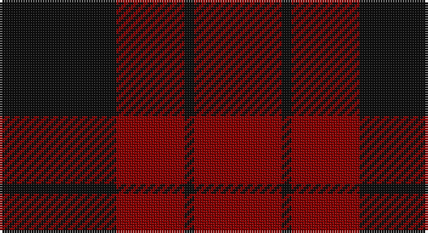

This page is one **sett** — a single exact thread-count. It belongs to the [tartan](/setts/k12r7k1r9/)
(the same proportion at any scale), whose colour order is pattern [KRKR](/stripes/krkr/).

Part of the [Lendrum](/tartans/lendrum/) tartan — the named design grouping this sett with its other cloths.

Sourced from register-of-tartans.  It is a [4 stripe tartan](/stripes/stripes4/).

Original link https://www.tartanregister.gov.uk/tartanDetails.aspx?ref=2094

## Also known as

This cloth is also recorded under:

- Lendrum or MacFarlane
- MacFarlane B & W
- MacFarlane B/W or Lendrum
- MacFarlane, Lendrum Black and White
- Wallace Dress
- Wallace dress

2 attestations — the source records this cloth was collapsed from (oldest owns this page)

<ul>
<li>01/01/2002 — Lendrum (Black & Red) or MacFarlane (register-of-tartans, <a href="https://www.tartanregister.gov.uk/tartanDetails.aspx?ref=2094">record</a>)</li>
<li>pre 2002 — Lendrum (Black & Red) (tartans-authority, <a href="http://www.tartansauthority.com/tartan-ferret/display/1190/">record</a>)</li>
</ul>

## Register references

External register numbers recorded for this tartan.

- Scottish Register of Tartans: [2094](https://www.tartanregister.gov.uk/tartanDetails.aspx?ref=2094)
- Scottish Tartans Authority (ITI): 1190
- Scottish Tartans World Register: 1190

## Thread count
K/48 DR28 K4 DR/36

One full sett is **148 threads**.

## Palette

Palette: <strong>Tartan Register</strong>
<table><thead><tr><th>Colour</th><th>Threads</th><th>Shade</th><th>Base</th><th>OKLCh</th></tr></thead><tbody><tr><td>K/</td><td style="text-align:right;font-variant-numeric:tabular-nums">48</td><td><code style="background-color:#101010;">#101010</code> <small style="color:#888">#101010</small></td><td>K <code style="background-color:#000000;">#000000</code></td><td><small style="color:#888">oklch(17.3% 0.000 89.9)</small></td></tr><tr><td>DR</td><td style="text-align:right;font-variant-numeric:tabular-nums">28</td><td><code style="background-color:#880000;">#880000</code> <small style="color:#888">#880000</small></td><td>R <code style="background-color:#CC0000;">#CC0000</code></td><td><small style="color:#888">oklch(39.4% 0.162 29.2)</small></td></tr><tr><td>K</td><td style="text-align:right;font-variant-numeric:tabular-nums">4</td><td><code style="background-color:#101010;">#101010</code> <small style="color:#888">#101010</small></td><td>K <code style="background-color:#000000;">#000000</code></td><td><small style="color:#888">oklch(17.3% 0.000 89.9)</small></td></tr><tr><td>DR/</td><td style="text-align:right;font-variant-numeric:tabular-nums">36</td><td><code style="background-color:#880000;">#880000</code> <small style="color:#888">#880000</small></td><td>R <code style="background-color:#CC0000;">#CC0000</code></td><td><small style="color:#888">oklch(39.4% 0.162 29.2)</small></td></tr></tbody></table>

# Sample pattern

## Compared to the master

This cloth is one sett of its design; the master sett (the exemplar the design is anchored on) is below for comparison.

<figure style="margin:0"><figcaption style="color:#888;font-size:smaller">this sett</figcaption></figure>
<figure style="margin:0"><figcaption style="color:#888;font-size:smaller"><a href="/setts/k7w6k1/">master sett →</a></figcaption></figure>

## Nearest tartans

The nearest existing variants by ΔTartan distance, with this tartan at the top so the swatches line up against it.

ΔTartan

Tartan

Sett

—

<a href="/ttd/edit/#slug=k12r7k1r9~x4">Lendrum (Black &amp; Red) or MacFarlane</a> <a class="nn-out" href="/variants/s4/k12r7k1r9~x4/" title="open its dictionary page">↗</a>

1.26

<a href="/ttd/edit/#slug=k3r20k20r3~x2&amp;base=k12r7k1r9~x4">Clan Anord (Corporate)</a> <a class="nn-out" href="/variants/s4/k3r20k20r3~x2/" title="open its dictionary page">↗</a>

1.43

<a href="/ttd/edit/#slug=k20r3k20r20~x2&amp;base=k12r7k1r9~x4">Wcwm 9275-1333-2</a> <a class="nn-out" href="/variants/s4/k20r3k20r20~x2/" title="open its dictionary page">↗</a>

1.81

<a href="/ttd/edit/#slug=r9k1r5g6r4k2~x4&amp;base=k12r7k1r9~x4">MacAn of Lurgyvallan (Hose)</a> <a class="nn-out" href="/variants/s6/r9k1r5g6r4k2~x4/" title="open its dictionary page">↗</a>

1.89

<a href="/ttd/edit/#slug=k2r4k7r1k2~x2&amp;base=k12r7k1r9~x4">Romsdal Tresfjord</a> <a class="nn-out" href="/variants/s5/k2r4k7r1k2~x2/" title="open its dictionary page">↗</a>

2.00

<a href="/variants/s4/r104dg39lo4~x2/">Scottish Watch</a>

2.06

<a href="/variants/s4/r10dg4lo1~x8/">Lugo (2013)</a>

2.07

<a href="/variants/s4/k30r17k3~x4/">MacFarlane Red &amp; Black (Artefact)</a>

2.07

<a href="/ttd/edit/#slug=dg16r5dg2r18k2&amp;base=k12r7k1r9~x4">MacDonald of Sleat</a> <a class="nn-out" href="/variants/s5/dg16r5dg2r18k2/" title="open its dictionary page">↗</a>

2.08

<a href="/ttd/edit/#slug=r2k4r2k4r6k1lo1~x4&amp;base=k12r7k1r9~x4">MacIan</a> <a class="nn-out" href="/variants/s7/r2k4r2k4r6k1lo1~x4/" title="open its dictionary page">↗</a>

2.08

<a href="/ttd/edit/#slug=k13r2k13r19k2~x2&amp;base=k12r7k1r9~x4">MacLeod of Raasay (Highland Society of London)</a> <a class="nn-out" href="/variants/s5/k13r2k13r19k2~x2/" title="open its dictionary page">↗</a>

## Neighbour map

Every grey dot is one of 14360 variants placed by the first two principal components of the ΔTartan feature space (44% of its variance). Red is this tartan; blue dots are its nearest — click one to open its page.

<svg viewBox="0 0 640 380" role="img" style="max-width:100%;height:auto;border:1px solid #e0e0e0;border-radius:4px;display:block" xmlns="http://www.w3.org/2000/svg"><image href="/nn/cloud.v1.png" width="640" height="380"/><a href="/variants/s4/k3r20k20r3~x2/"><circle cx="397.5" cy="311.1" r="4" fill="#3465a4"><title>Clan Anord (Corporate)</title></circle></a><a href="/variants/s4/k20r3k20r20~x2/"><circle cx="427.4" cy="348.9" r="4" fill="#3465a4"><title>Wcwm 9275-1333-2</title></circle></a><a href="/variants/s6/r9k1r5g6r4k2~x4/"><circle cx="421.0" cy="277.9" r="4" fill="#3465a4"><title>MacAn of Lurgyvallan (Hose)</title></circle></a><a href="/variants/s5/k2r4k7r1k2~x2/"><circle cx="480.5" cy="319.7" r="4" fill="#3465a4"><title>Romsdal Tresfjord</title></circle></a><a href="/variants/s4/r104dg39lo4~x2/"><circle cx="458.6" cy="249.2" r="4" fill="#3465a4"><title>Scottish Watch</title></circle></a><a href="/variants/s4/r10dg4lo1~x8/"><circle cx="348.8" cy="264.4" r="4" fill="#3465a4"><title>Lugo (2013)</title></circle></a><a href="/variants/s4/k30r17k3~x4/"><circle cx="343.2" cy="278.4" r="4" fill="#3465a4"><title>MacFarlane Red &amp; Black (Artefact)</title></circle></a><a href="/variants/s5/dg16r5dg2r18k2/"><circle cx="362.4" cy="250.4" r="4" fill="#3465a4"><title>MacDonald of Sleat</title></circle></a><a href="/variants/s7/r2k4r2k4r6k1lo1~x4/"><circle cx="309.1" cy="273.8" r="4" fill="#3465a4"><title>MacIan</title></circle></a><a href="/variants/s5/k13r2k13r19k2~x2/"><circle cx="372.9" cy="262.9" r="4" fill="#3465a4"><title>MacLeod of Raasay (Highland Society of London)</title></circle></a><circle cx="419.8" cy="308.3" r="5" fill="#c00000"/></svg>

ID: /variants/s4/k12r7k1r9~x4/
