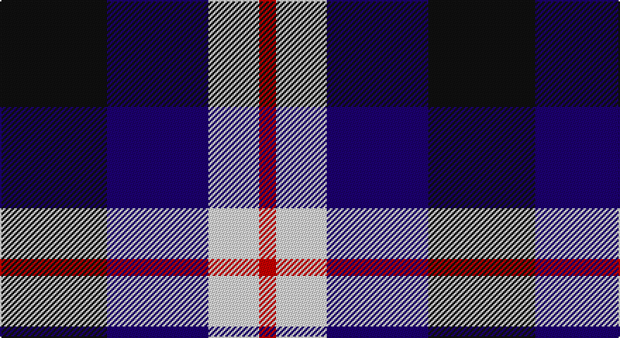

This page is one **sett** — a single exact thread-count. It belongs to the [tartan](/setts/k19db18w9r3/)
(the same proportion at any scale), whose colour order is pattern [KBWR](/stripes/kbwr/).

Sourced from tartans-authority.  It is a [4 stripe tartan](/stripes/stripes4/).

Original link http://www.tartansauthority.com/tartan-ferret/display/7536/

2 attestations — the source records this cloth was collapsed from (oldest owns this page)

<ul>
<li>1995 — Raven (Fashion) (tartans-authority, <a href="http://www.tartansauthority.com/tartan-ferret/display/7536/">record</a>)</li>
<li>undated — Raven (register-of-tartans, <a href="https://www.tartanregister.gov.uk/tartanDetails.aspx?ref=5571">record</a>)</li>
</ul>

## Register references

External register numbers recorded for this tartan.

- Scottish Register of Tartans: [5571](https://www.tartanregister.gov.uk/tartanDetails.aspx?ref=5571)
- Scottish Tartans Authority (ITI): 7536

## Thread count
K/76 DB72 LN36 R/12

One full sett is **304 threads**.

## Palette

Palette: <strong>Tartan Register</strong>
<table><thead><tr><th>Colour</th><th>Threads</th><th>Shade</th><th>Base</th><th>OKLCh</th></tr></thead><tbody><tr><td>K/</td><td style="text-align:right;font-variant-numeric:tabular-nums">76</td><td><code style="background-color:#101010;">#101010</code> <small style="color:#888">#101010</small></td><td>K <code style="background-color:#000000;">#000000</code></td><td><small style="color:#888">oklch(17.3% 0.000 89.9)</small></td></tr><tr><td>DB</td><td style="text-align:right;font-variant-numeric:tabular-nums">72</td><td><code style="background-color:#1C0070;">#1C0070</code> <small style="color:#888">#1C0070</small></td><td>B <code style="background-color:#2A418A;">#2A418A</code></td><td><small style="color:#888">oklch(26.3% 0.162 277.1)</small></td></tr><tr><td>LN</td><td style="text-align:right;font-variant-numeric:tabular-nums">36</td><td><code style="background-color:#E0E0E0;">#E0E0E0</code> <small style="color:#888">#E0E0E0</small></td><td>W <code style="background-color:#F7F7F7;">#F7F7F7</code></td><td><small style="color:#888">oklch(90.7% 0.000 89.9)</small></td></tr><tr><td>R/</td><td style="text-align:right;font-variant-numeric:tabular-nums">12</td><td><code style="background-color:#C80000;">#C80000</code> <small style="color:#888">#C80000</small></td><td>R <code style="background-color:#CC0000;">#CC0000</code></td><td><small style="color:#888">oklch(52.3% 0.215 29.2)</small></td></tr></tbody></table>

# Sample pattern

## Nearest tartans

The nearest existing variants by ΔTartan distance, with this tartan at the top so the swatches line up against it.

ΔTartan

Tartan

Sett

—

<a href="/ttd/edit/#slug=k19db18w9r3~x4">Raven (Fashion)</a> <a class="nn-out" href="/variants/s4/k19db18w9r3~x4/" title="open its dictionary page">↗</a>

1.31

<a href="/ttd/edit/#slug=p6k5g5r1~x2&amp;base=k19db18w9r3~x4">Unnamed, No 60</a> <a class="nn-out" href="/variants/s4/p6k5g5r1~x2/" title="open its dictionary page">↗</a>

1.31

<a href="/ttd/edit/#slug=b10k10b10dg26ly5~x2&amp;base=k19db18w9r3~x4">Marshall of Keith (Personal)</a> <a class="nn-out" href="/variants/s5/b10k10b10dg26ly5~x2/" title="open its dictionary page">↗</a>

1.32

<a href="/ttd/edit/#slug=r1k6y6b1~x10&amp;base=k19db18w9r3~x4">Mayer, Chris (Personal)</a> <a class="nn-out" href="/variants/s4/r1k6y6b1~x10/" title="open its dictionary page">↗</a>

1.32

<a href="/ttd/edit/#slug=k1db8r6g8k1~x4&amp;base=k19db18w9r3~x4">Edinburgh Tattoo 50th (Commemorative</a> <a class="nn-out" href="/variants/s5/k1db8r6g8k1~x4/" title="open its dictionary page">↗</a>

1.34

<a href="/ttd/edit/#slug=db10g10r5w1~x2&amp;base=k19db18w9r3~x4">Thorntons Law (Corporate)</a> <a class="nn-out" href="/variants/s4/db10g10r5w1~x2/" title="open its dictionary page">↗</a>

1.34

<a href="/ttd/edit/#slug=dp8k11dg9w2~x2&amp;base=k19db18w9r3~x4">Wilson's No 220</a> <a class="nn-out" href="/variants/s4/dp8k11dg9w2~x2/" title="open its dictionary page">↗</a>

1.34

<a href="/ttd/edit/#slug=g3db3dp4w1~x4&amp;base=k19db18w9r3~x4">Pride of the Glen</a> <a class="nn-out" href="/variants/s4/g3db3dp4w1~x4/" title="open its dictionary page">↗</a>

1.37

<a href="/ttd/edit/#slug=g21db34r14w6~x2&amp;base=k19db18w9r3~x4">Harbison (2015)</a> <a class="nn-out" href="/variants/s4/g21db34r14w6~x2/" title="open its dictionary page">↗</a>

1.42

<a href="/ttd/edit/#slug=p8k11g9w2~x2&amp;base=k19db18w9r3~x4">Wilson's, No 220</a> <a class="nn-out" href="/variants/s4/p8k11g9w2~x2/" title="open its dictionary page">↗</a>

1.42

<a href="/ttd/edit/#slug=k6lb3k8db7lo2db7lb1~x4&amp;base=k19db18w9r3~x4">St. Johnstone F.C. (Sports)</a> <a class="nn-out" href="/variants/s7/k6lb3k8db7lo2db7lb1~x4/" title="open its dictionary page">↗</a>

## Neighbour map

Every grey dot is one of 14360 variants placed by the first two principal components of the ΔTartan feature space (44% of its variance). Red is this tartan; blue dots are its nearest — click one to open its page.

<svg viewBox="0 0 640 380" role="img" style="max-width:100%;height:auto;border:1px solid #e0e0e0;border-radius:4px;display:block" xmlns="http://www.w3.org/2000/svg"><image href="/nn/cloud.v1.png" width="640" height="380"/><a href="/variants/s4/p6k5g5r1~x2/"><circle cx="121.5" cy="275.2" r="4" fill="#3465a4"><title>Unnamed, No 60</title></circle></a><a href="/variants/s5/b10k10b10dg26ly5~x2/"><circle cx="157.6" cy="265.5" r="4" fill="#3465a4"><title>Marshall of Keith (Personal)</title></circle></a><a href="/variants/s4/r1k6y6b1~x10/"><circle cx="191.3" cy="245.4" r="4" fill="#3465a4"><title>Mayer, Chris (Personal)</title></circle></a><a href="/variants/s5/k1db8r6g8k1~x4/"><circle cx="142.3" cy="233.7" r="4" fill="#3465a4"><title>Edinburgh Tattoo 50th (Commemorative</title></circle></a><a href="/variants/s4/db10g10r5w1~x2/"><circle cx="177.9" cy="242.9" r="4" fill="#3465a4"><title>Thorntons Law (Corporate)</title></circle></a><a href="/variants/s4/dp8k11dg9w2~x2/"><circle cx="142.2" cy="295.5" r="4" fill="#3465a4"><title>Wilson's No 220</title></circle></a><a href="/variants/s4/g3db3dp4w1~x4/"><circle cx="99.7" cy="298.2" r="4" fill="#3465a4"><title>Pride of the Glen</title></circle></a><a href="/variants/s4/g21db34r14w6~x2/"><circle cx="175.6" cy="267.1" r="4" fill="#3465a4"><title>Harbison (2015)</title></circle></a><a href="/variants/s4/p8k11g9w2~x2/"><circle cx="109.5" cy="277.7" r="4" fill="#3465a4"><title>Wilson's, No 220</title></circle></a><a href="/variants/s7/k6lb3k8db7lo2db7lb1~x4/"><circle cx="180.5" cy="244.1" r="4" fill="#3465a4"><title>St. Johnstone F.C. (Sports)</title></circle></a><circle cx="145.9" cy="262.6" r="5" fill="#c00000"/></svg>

ID: /variants/s4/k19db18w9r3~x4/
