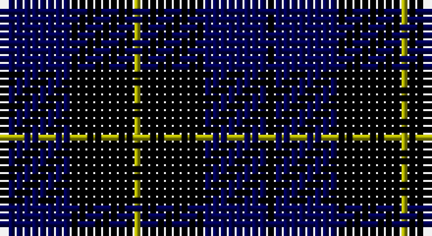

This page is one **sett** — a single exact thread-count. It belongs to the [tartan](/setts/k1db8k8ly1/)
(the same proportion at any scale), whose colour order is pattern [KBKY](/stripes/kbky/).

Part of the [Wallace](/tartans/wallace/) tartan — the named design grouping this sett with its other cloths.

Sourced from weddslist.  It is a [4 stripe tartan](/stripes/stripes4/).

Original link http://www.weddslist.com/cgi-bin/tartans/pg.pl?source=x

## Also known as

This cloth is also recorded under:

- Wallace Blue
- Wallace, Blue Wallace

## Thread count
K/1 DB8 K8 LG/1

One full sett is **34 threads**.

## Palette

Palette: <strong>Ingles Buchan</strong> <small style="color:#888">(1 of 3 colours)</small>
<table><thead><tr><th>Colour</th><th>Threads</th><th>Shade</th><th>Base</th><th>OKLCh</th></tr></thead><tbody><tr><td>K/</td><td style="text-align:right;font-variant-numeric:tabular-nums">1</td><td><code style="background-color:#000000;">#000000</code> <small style="color:#888">#000000</small></td><td>K <code style="background-color:#000000;">#000000</code></td><td><small style="color:#888">oklch(0.0% 0.000 0.0)</small></td></tr><tr><td>DB</td><td style="text-align:right;font-variant-numeric:tabular-nums">8</td><td><code style="background-color:#000052;">#000052</code> <small style="color:#888">#000052</small></td><td>B <code style="background-color:#2A418A;">#2A418A</code></td><td><small style="color:#888">oklch(19.8% 0.137 264.1)</small></td></tr><tr><td>K</td><td style="text-align:right;font-variant-numeric:tabular-nums">8</td><td><code style="background-color:#000000;">#000000</code> <small style="color:#888">#000000</small></td><td>K <code style="background-color:#000000;">#000000</code></td><td><small style="color:#888">oklch(0.0% 0.000 0.0)</small></td></tr><tr><td>LG/</td><td style="text-align:right;font-variant-numeric:tabular-nums">1</td><td><code style="background-color:#AAAA00;">#AAAA00</code> <small style="color:#888">#AAAA00</small></td><td>Y <code style="background-color:#F2BF00;">#F2BF00</code></td><td><small style="color:#888">oklch(71.4% 0.156 109.8)</small></td></tr></tbody></table>

# Sample pattern

## Compared to the master

This cloth is one sett of its design; the master sett (the exemplar the design is anchored on) is below for comparison.

<figure style="margin:0"><figcaption style="color:#888;font-size:smaller">this sett</figcaption></figure>
<figure style="margin:0"><figcaption style="color:#888;font-size:smaller"><a href="/setts/k1r8k8ly1/">master sett →</a></figcaption></figure>

## Nearest tartans

The nearest existing variants by ΔTartan distance, with this tartan at the top so the swatches line up against it.

ΔTartan

Tartan

Sett

—

<a href="/ttd/edit/#slug=k1db8k8ly1">Wallace Blue</a> <a class="nn-out" href="/variants/s4/k1db8k8ly1/" title="open its dictionary page">↗</a>

1.21

<a href="/ttd/edit/#slug=k10db10lo1~x4&amp;base=k1db8k8ly1">Mother's Pride (Corporate)</a> <a class="nn-out" href="/variants/s3/k10db10lo1~x4/" title="open its dictionary page">↗</a>

1.32

<a href="/ttd/edit/#slug=k1db7k7ly1~x10&amp;base=k1db8k8ly1">Wallace (Personal)</a> <a class="nn-out" href="/variants/s4/k1db7k7ly1~x10/" title="open its dictionary page">↗</a>

1.59

<a href="/variants/s6/ki6db50k29b6k29db6/">Scottish Express International</a>

1.68

<a href="/ttd/edit/#slug=k4dg3dp18k18lb2~x2&amp;base=k1db8k8ly1">Wcwm 1106-2</a> <a class="nn-out" href="/variants/s5/k4dg3dp18k18lb2~x2/" title="open its dictionary page">↗</a>

1.73

<a href="/ttd/edit/#slug=k21db3k12r2db12k2db12w2~x2&amp;base=k1db8k8ly1">Inverness Caledonian Thistle Football Club</a> <a class="nn-out" href="/variants/s8/k21db3k12r2db12k2db12w2~x2/" title="open its dictionary page">↗</a>

1.77

<a href="/ttd/edit/#slug=k15lo2k10db18lb3~x2&amp;base=k1db8k8ly1">College of Radiographers</a> <a class="nn-out" href="/variants/s5/k15lo2k10db18lb3~x2/" title="open its dictionary page">↗</a>

1.80

<a href="/ttd/edit/#slug=k14r4k25db30w4~x2&amp;base=k1db8k8ly1">Britannia</a> <a class="nn-out" href="/variants/s5/k14r4k25db30w4~x2/" title="open its dictionary page">↗</a>

1.90

<a href="/ttd/edit/#slug=k1db12k12g1k12db12w1~x4&amp;base=k1db8k8ly1">Marchmont</a> <a class="nn-out" href="/variants/s7/k1db12k12g1k12db12w1~x4/" title="open its dictionary page">↗</a>

1.93

<a href="/ttd/edit/#slug=k1db7k4lb1k4p1~x4&amp;base=k1db8k8ly1">Scottish Express International</a> <a class="nn-out" href="/variants/s6/k1db7k4lb1k4p1~x4/" title="open its dictionary page">↗</a>

1.94

<a href="/ttd/edit/#slug=k15y2k10db18w3~x2&amp;base=k1db8k8ly1">College of Radiographers</a> <a class="nn-out" href="/variants/s5/k15y2k10db18w3~x2/" title="open its dictionary page">↗</a>

## Neighbour map

Every grey dot is one of 14360 variants placed by the first two principal components of the ΔTartan feature space (44% of its variance). Red is this tartan; blue dots are its nearest — click one to open its page.

<svg viewBox="0 0 640 380" role="img" style="max-width:100%;height:auto;border:1px solid #e0e0e0;border-radius:4px;display:block" xmlns="http://www.w3.org/2000/svg"><image href="/nn/cloud.v1.png" width="640" height="380"/><a href="/variants/s3/k10db10lo1~x4/"><circle cx="308.2" cy="300.0" r="4" fill="#3465a4"><title>Mother's Pride (Corporate)</title></circle></a><a href="/variants/s4/k1db7k7ly1~x10/"><circle cx="308.5" cy="283.0" r="4" fill="#3465a4"><title>Wallace (Personal)</title></circle></a><a href="/variants/s6/ki6db50k29b6k29db6/"><circle cx="255.8" cy="236.0" r="4" fill="#3465a4"><title>Scottish Express International</title></circle></a><a href="/variants/s5/k4dg3dp18k18lb2~x2/"><circle cx="271.6" cy="232.6" r="4" fill="#3465a4"><title>Wcwm 1106-2</title></circle></a><a href="/variants/s8/k21db3k12r2db12k2db12w2~x2/"><circle cx="310.7" cy="228.6" r="4" fill="#3465a4"><title>Inverness Caledonian Thistle Football Club</title></circle></a><a href="/variants/s5/k15lo2k10db18lb3~x2/"><circle cx="273.6" cy="254.0" r="4" fill="#3465a4"><title>College of Radiographers</title></circle></a><a href="/variants/s5/k14r4k25db30w4~x2/"><circle cx="285.4" cy="263.8" r="4" fill="#3465a4"><title>Britannia</title></circle></a><a href="/variants/s7/k1db12k12g1k12db12w1~x4/"><circle cx="284.5" cy="219.2" r="4" fill="#3465a4"><title>Marchmont</title></circle></a><a href="/variants/s6/k1db7k4lb1k4p1~x4/"><circle cx="285.6" cy="258.2" r="4" fill="#3465a4"><title>Scottish Express International</title></circle></a><a href="/variants/s5/k15y2k10db18w3~x2/"><circle cx="250.4" cy="241.6" r="4" fill="#3465a4"><title>College of Radiographers</title></circle></a><circle cx="324.3" cy="287.3" r="5" fill="#c00000"/></svg>

ID: /variants/s4/k1db8k8ly1/
