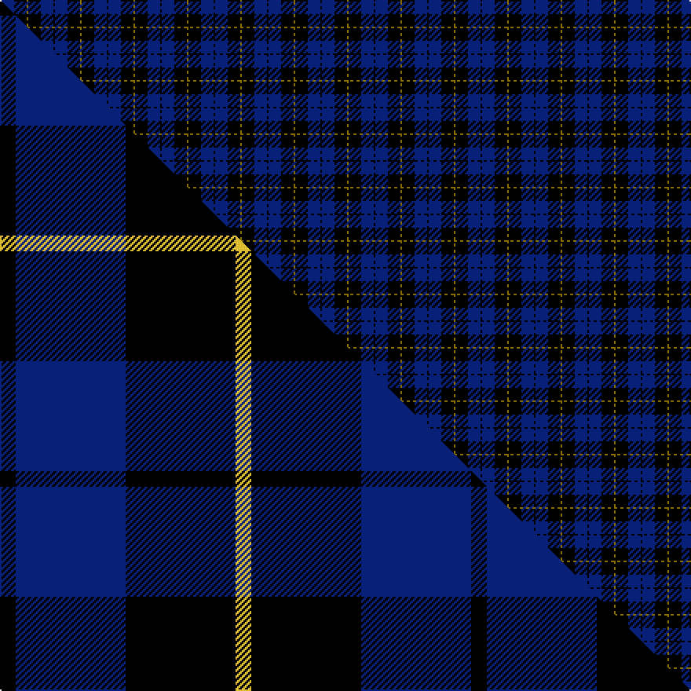

This page is one **sett** — a single exact thread-count. It belongs to the [tartan](/setts/k1db8k8y1/)
(the same proportion at any scale), whose colour order is pattern [GKBK](/stripes/gkbk/).

Part of the [Wallace](/tartans/wallace/) tartan — the named design grouping this sett with its other cloths.

Sourced from weddslist.  It is a [4 stripe tartan](/stripes/stripes4/).

Original link http://www.weddslist.com/cgi-bin/tartans/pg.pl?source=x

## Thread count
K/1 DB8 K8 Y/1

One full sett is **34 threads**.

## Palette
<table><thead><tr><th>Colour</th><th>Shade</th><th>OKLCh</th></tr></thead><tbody><tr><td>DB</td><td><code style="background-color:#082077;">#082077</code> <small style="color:#888">#082077</small></td><td><small style="color:#888">oklch(30.0% 0.149 265.1)</small></td></tr><tr><td>K</td><td><code style="background-color:#000000;">#000000</code> <small style="color:#888">#000000</small></td><td><small style="color:#888">oklch(0.0% 0.000 0.0)</small></td></tr><tr><td>Y</td><td><code style="background-color:#8B6E00;">#8B6E00</code> <small style="color:#888">#8B6E00</small></td><td><small style="color:#888">oklch(55.1% 0.113 90.4)</small></td></tr></tbody></table>

# Sample pattern

## Compared to the master

This cloth is one sett of its design; the master sett (the exemplar the design is anchored on) is below for comparison.

Its **ΔTartan distance** from the master is **0.82** — the same measure the nearest-tartans table ranks by (0 is identical; a re-scale of the same cloth is near 0, a recolour or a different proportion further).

<figure class="master-compare" style="margin:0">

this sett
master sett ★

<figcaption style="color:#888;font-size:smaller">One weave of this sett against the <a href="/setts/k1db7k7ly1/">master sett ★</a>, split on the diagonal: a shared proportion runs seamlessly across it with only the shades shifting; a different proportion breaks on it.</figcaption>
</figure>

## Nearest tartan variants

The nearest existing variants by ΔTartan distance, with this cloth at the top so the swatches line up against it.

ΔTartan

Threads

Variant

Sett

—

34

<a href="/variants/s4/k1db8k8y1/">Wallace Blue</a>

<a href="/ttd/edit/#slug=k1db7k7ly1~x10&amp;base=k1db8k8y1" title="compare in the TTD">0.16</a>

300

<a href="/variants/s4/k1db7k7ly1~x10/">Wallace (Personal)</a>

<a href="/ttd/edit/#slug=k15dy2k10db18w3~x2&amp;base=k1db8k8y1" title="compare in the TTD">0.61</a>

156

<a href="/variants/s5/k15dy2k10db18w3~x2/">College of Radiographers Corporate Tartan</a>

<a href="/ttd/edit/#slug=k15y2k10db18w3~x2&amp;base=k1db8k8y1" title="compare in the TTD">0.61</a>

156

<a href="/variants/s5/k15y2k10db18w3~x2/">College of Radiographers</a>

<a href="/ttd/edit/#slug=k3db23k17r2~x2&amp;base=k1db8k8y1" title="compare in the TTD">0.69</a>

170

<a href="/variants/s4/k3db23k17r2~x2/">Wellington Variation</a>

<a href="/ttd/edit/#slug=k15lo2k10db18lr3~x2&amp;base=k1db8k8y1" title="compare in the TTD">0.92</a>

156

<a href="/variants/s5/k15lo2k10db18lr3~x2/">College of Radiographers</a>

<a href="/ttd/edit/#slug=k14r4k25db30w4~x2&amp;base=k1db8k8y1" title="compare in the TTD">1.11</a>

272

<a href="/variants/s5/k14r4k25db30w4~x2/">Britannia</a>

<a href="/ttd/edit/#slug=k15db40k9n10~x2&amp;base=k1db8k8y1" title="compare in the TTD">1.19</a>

246

<a href="/variants/s4/k15db40k9n10~x2/">Omega Delta Sigma, National Veterans Fraternity</a>

<a href="/ttd/edit/#slug=db9k9r3db9k9y1~x4&amp;base=k1db8k8y1" title="compare in the TTD">1.62</a>

280

<a href="/variants/s6/db9k9r3db9k9y1~x4/">Old Brigade</a>

<a href="/ttd/edit/#slug=k34db13k7db14~x2&amp;base=k1db8k8y1" title="compare in the TTD">1.74</a>

176

<a href="/variants/s4/k34db13k7db14~x2/">Auchincloss (Personal)</a>

<a href="/ttd/edit/#slug=k4y1k18db18lb1db4~x4&amp;base=k1db8k8y1" title="compare in the TTD">1.87</a>

336

<a href="/variants/s6/k4y1k18db18lb1db4~x4/">Lyndon Prep (School)</a>

## Neighbour map

Every grey dot is one of 13620 variants placed by the first two principal components of the ΔTartan feature space (42% of its variance). Red is this tartan; blue dots are its nearest — click one to open its page.

<svg viewBox="0 0 640 380" role="img" style="max-width:100%;height:auto;border:1px solid #e0e0e0;border-radius:4px;display:block" xmlns="http://www.w3.org/2000/svg"><image href="/nn/cloud.v1.png" width="640" height="380"/><a href="/variants/s4/k1db7k7ly1~x10/"><circle cx="278.7" cy="246.2" r="4" fill="#3465a4"><title>Wallace (Personal)</title></circle></a><a href="/variants/s5/k15dy2k10db18w3~x2/"><circle cx="240.2" cy="217.6" r="4" fill="#3465a4"><title>College of Radiographers Corporate Tartan</title></circle></a><a href="/variants/s5/k15y2k10db18w3~x2/"><circle cx="235.5" cy="216.2" r="4" fill="#3465a4"><title>College of Radiographers</title></circle></a><a href="/variants/s4/k3db23k17r2~x2/"><circle cx="327.2" cy="226.4" r="4" fill="#3465a4"><title>Wellington Variation</title></circle></a><a href="/variants/s5/k15lo2k10db18lr3~x2/"><circle cx="244.7" cy="219.6" r="4" fill="#3465a4"><title>College of Radiographers</title></circle></a><a href="/variants/s5/k14r4k25db30w4~x2/"><circle cx="226.6" cy="217.5" r="4" fill="#3465a4"><title>Britannia</title></circle></a><a href="/variants/s4/k15db40k9n10~x2/"><circle cx="292.7" cy="279.5" r="4" fill="#3465a4"><title>Omega Delta Sigma, National Veterans Fraternity</title></circle></a><a href="/variants/s6/db9k9r3db9k9y1~x4/"><circle cx="219.8" cy="235.3" r="4" fill="#3465a4"><title>Old Brigade</title></circle></a><a href="/variants/s4/k34db13k7db14~x2/"><circle cx="378.0" cy="301.2" r="4" fill="#3465a4"><title>Auchincloss (Personal)</title></circle></a><a href="/variants/s6/k4y1k18db18lb1db4~x4/"><circle cx="311.8" cy="169.3" r="4" fill="#3465a4"><title>Lyndon Prep (School)</title></circle></a><circle cx="309.2" cy="244.5" r="5" fill="#c00000"/><text x="320" y="376" text-anchor="middle" font-size="11" fill="#999">ground</text><text x="11" y="190" text-anchor="middle" font-size="11" fill="#999" transform="rotate(-90 11 190)">complexity</text></svg>

ID: /variants/s4/k1db8k8y1/
