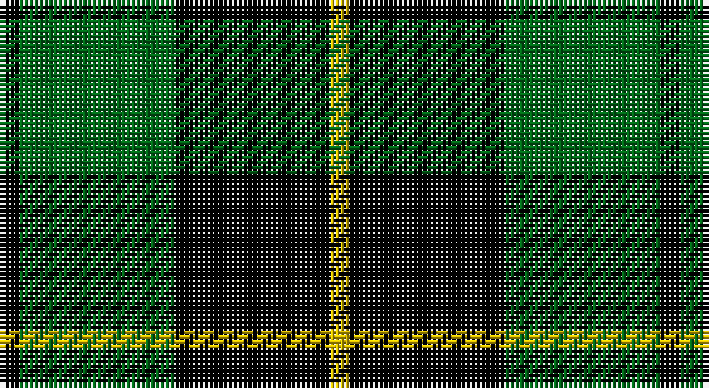

This page is one **sett** — a single exact thread-count. It belongs to the [tartan](/setts/k1g8k8ly1/)
(the same proportion at any scale), whose colour order is pattern [KGKY](/stripes/kgky/).

Sourced from tartans-authority.  It is a [4 stripe tartan](/stripes/stripes4/).

Original link http://www.tartansauthority.com/tartan-ferret/display/1101/

## Register references

External register numbers recorded for this tartan.

- Scottish Tartans Authority (ITI): 1101

## Thread count
K/4 G32 K32 Y/4

One full sett is **136 threads**.

## Palette

Palette: <strong>Tartan Register</strong> <small style="color:#888">(2 of 3 colours)</small>
<table><thead><tr><th>Colour</th><th>Threads</th><th>Shade</th><th>Base</th><th>OKLCh</th></tr></thead><tbody><tr><td>K/</td><td style="text-align:right;font-variant-numeric:tabular-nums">4</td><td><code style="background-color:#000000;">#000000</code> <small style="color:#888">#000000</small></td><td>K <code style="background-color:#000000;">#000000</code></td><td><small style="color:#888">oklch(0.0% 0.000 0.0)</small></td></tr><tr><td>G</td><td style="text-align:right;font-variant-numeric:tabular-nums">32</td><td><code style="background-color:#006818;">#006818</code> <small style="color:#888">#006818</small></td><td>G <code style="background-color:#006100;">#006100</code></td><td><small style="color:#888">oklch(45.0% 0.142 145.0)</small></td></tr><tr><td>K</td><td style="text-align:right;font-variant-numeric:tabular-nums">32</td><td><code style="background-color:#000000;">#000000</code> <small style="color:#888">#000000</small></td><td>K <code style="background-color:#000000;">#000000</code></td><td><small style="color:#888">oklch(0.0% 0.000 0.0)</small></td></tr><tr><td>Y/</td><td style="text-align:right;font-variant-numeric:tabular-nums">4</td><td><code style="background-color:#DCBC00;">#DCBC00</code> <small style="color:#888">#DCBC00</small></td><td>Y <code style="background-color:#F2BF00;">#F2BF00</code></td><td><small style="color:#888">oklch(79.9% 0.165 96.7)</small></td></tr></tbody></table>

# Sample pattern

## Nearest tartans

The nearest existing variants by ΔTartan distance, with this tartan at the top so the swatches line up against it.

ΔTartan

Tartan

Sett

—

<a href="/ttd/edit/#slug=k1g8k8ly1~x4">Wallace Htg (Clan)</a> <a class="nn-out" href="/variants/s4/k1g8k8ly1~x4/" title="open its dictionary page">↗</a>

0.49

<a href="/ttd/edit/#slug=k4g33k33ly4~x2&amp;base=k1g8k8ly1~x4">Wallace, hunting</a> <a class="nn-out" href="/variants/s4/k4g33k33ly4~x2/" title="open its dictionary page">↗</a>

0.65

<a href="/ttd/edit/#slug=k30db7g36k5~x2&amp;base=k1g8k8ly1~x4">Innes, hunting</a> <a class="nn-out" href="/variants/s4/k30db7g36k5~x2/" title="open its dictionary page">↗</a>

0.79

<a href="/ttd/edit/#slug=k32g6k12g30ly3&amp;base=k1g8k8ly1~x4">MacArthur</a> <a class="nn-out" href="/variants/s5/k32g6k12g30ly3/" title="open its dictionary page">↗</a>

0.84

<a href="/ttd/edit/#slug=k1dg8k8ly1&amp;base=k1g8k8ly1~x4">Wallace Hunting</a> <a class="nn-out" href="/variants/s4/k1dg8k8ly1/" title="open its dictionary page">↗</a>

0.91

<a href="/ttd/edit/#slug=k32dg6k12dg30ly3&amp;base=k1g8k8ly1~x4">MacArthur</a> <a class="nn-out" href="/variants/s5/k32dg6k12dg30ly3/" title="open its dictionary page">↗</a>

1.09

<a href="/ttd/edit/#slug=k19g8k10g31r3&amp;base=k1g8k8ly1~x4">MacArthur-Fox</a> <a class="nn-out" href="/variants/s5/k19g8k10g31r3/" title="open its dictionary page">↗</a>

1.12

<a href="/ttd/edit/#slug=k12db3g23k23r3~x2&amp;base=k1g8k8ly1~x4">Douglas, (Black)</a> <a class="nn-out" href="/variants/s5/k12db3g23k23r3~x2/" title="open its dictionary page">↗</a>

1.15

<a href="/ttd/edit/#slug=k8b5g44k40r6&amp;base=k1g8k8ly1~x4">Douglas, Black</a> <a class="nn-out" href="/variants/s5/k8b5g44k40r6/" title="open its dictionary page">↗</a>

1.17

<a href="/ttd/edit/#slug=g8k8ly1k8g8k1~x4&amp;base=k1g8k8ly1~x4">Wallace Hunting</a> <a class="nn-out" href="/variants/s6/g8k8ly1k8g8k1~x4/" title="open its dictionary page">↗</a>

1.22

<a href="/ttd/edit/#slug=k3g15k20ly3~x2&amp;base=k1g8k8ly1~x4">Scotch Tape 2 (Corporate)</a> <a class="nn-out" href="/variants/s4/k3g15k20ly3~x2/" title="open its dictionary page">↗</a>

## Neighbour map

Every grey dot is one of 14360 variants placed by the first two principal components of the ΔTartan feature space (44% of its variance). Red is this tartan; blue dots are its nearest — click one to open its page.

<svg viewBox="0 0 640 380" role="img" style="max-width:100%;height:auto;border:1px solid #e0e0e0;border-radius:4px;display:block" xmlns="http://www.w3.org/2000/svg"><image href="/nn/cloud.v1.png" width="640" height="380"/><a href="/variants/s4/k4g33k33ly4~x2/"><circle cx="273.0" cy="256.9" r="4" fill="#3465a4"><title>Wallace, hunting</title></circle></a><a href="/variants/s4/k30db7g36k5~x2/"><circle cx="243.2" cy="272.4" r="4" fill="#3465a4"><title>Innes, hunting</title></circle></a><a href="/variants/s5/k32g6k12g30ly3/"><circle cx="292.2" cy="246.1" r="4" fill="#3465a4"><title>MacArthur</title></circle></a><a href="/variants/s4/k1dg8k8ly1/"><circle cx="302.5" cy="273.9" r="4" fill="#3465a4"><title>Wallace Hunting</title></circle></a><a href="/variants/s5/k32dg6k12dg30ly3/"><circle cx="310.7" cy="255.5" r="4" fill="#3465a4"><title>MacArthur</title></circle></a><a href="/variants/s5/k19g8k10g31r3/"><circle cx="294.1" cy="249.5" r="4" fill="#3465a4"><title>MacArthur-Fox</title></circle></a><a href="/variants/s5/k12db3g23k23r3~x2/"><circle cx="258.6" cy="245.8" r="4" fill="#3465a4"><title>Douglas, (Black)</title></circle></a><a href="/variants/s5/k8b5g44k40r6/"><circle cx="237.4" cy="223.9" r="4" fill="#3465a4"><title>Douglas, Black</title></circle></a><a href="/variants/s6/g8k8ly1k8g8k1~x4/"><circle cx="265.1" cy="269.4" r="4" fill="#3465a4"><title>Wallace Hunting</title></circle></a><a href="/variants/s4/k3g15k20ly3~x2/"><circle cx="311.5" cy="279.8" r="4" fill="#3465a4"><title>Scotch Tape 2 (Corporate)</title></circle></a><circle cx="280.4" cy="263.1" r="5" fill="#c00000"/></svg>

ID: /variants/s4/k1g8k8ly1~x4/
