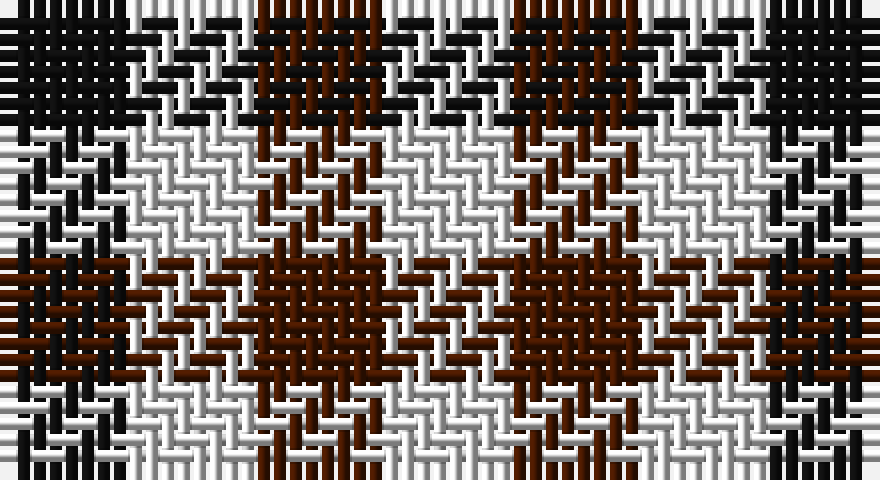

This page is one **sett** — a single exact thread-count. It belongs to the [tartan](/setts/k1w1do1/)
(the same proportion at any scale), whose colour order is pattern [KWBW](/stripes/kwbw/).

Sourced from register-of-tartans.  It is a [4 stripe tartan](/stripes/stripes4/).

Original link https://www.tartanregister.gov.uk/tartanDetails.aspx?ref=1745

2 attestations — the source records this cloth was collapsed from (oldest owns this page)

<ul>
<li>01/01/2002 — Hogg (register-of-tartans, <a href="https://www.tartanregister.gov.uk/tartanDetails.aspx?ref=1745">record</a>)</li>
<li>pre 2002 — Hogg (Clan) (tartans-authority, <a href="http://www.tartansauthority.com/tartan-ferret/display/5206/">record</a>)</li>
</ul>

## Register references

External register numbers recorded for this tartan.

- Scottish Register of Tartans: [1745](https://www.tartanregister.gov.uk/tartanDetails.aspx?ref=1745)
- Scottish Tartans Authority (ITI): 5206

## Thread count
K/8 LN8 DR8 LN/8

One full sett is **48 threads**.

## Palette

Palette: <strong>Tartan Register</strong>
<table><thead><tr><th>Colour</th><th>Threads</th><th>Shade</th><th>Base</th><th>OKLCh</th></tr></thead><tbody><tr><td>K/</td><td style="text-align:right;font-variant-numeric:tabular-nums">8</td><td><code style="background-color:#101010;">#101010</code> <small style="color:#888">#101010</small></td><td>K <code style="background-color:#000000;">#000000</code></td><td><small style="color:#888">oklch(17.3% 0.000 89.9)</small></td></tr><tr><td>LN</td><td style="text-align:right;font-variant-numeric:tabular-nums">8</td><td><code style="background-color:#E0E0E0;">#E0E0E0</code> <small style="color:#888">#E0E0E0</small></td><td>W <code style="background-color:#F7F7F7;">#F7F7F7</code></td><td><small style="color:#888">oklch(90.7% 0.000 89.9)</small></td></tr><tr><td>DR</td><td style="text-align:right;font-variant-numeric:tabular-nums">8</td><td><code style="background-color:#441800;">#441800</code> <small style="color:#888">#441800</small></td><td>B <code style="background-color:#2A418A;">#2A418A</code></td><td><small style="color:#888">oklch(27.3% 0.076 46.3)</small></td></tr><tr><td>LN/</td><td style="text-align:right;font-variant-numeric:tabular-nums">8</td><td><code style="background-color:#E0E0E0;">#E0E0E0</code> <small style="color:#888">#E0E0E0</small></td><td>W <code style="background-color:#F7F7F7;">#F7F7F7</code></td><td><small style="color:#888">oklch(90.7% 0.000 89.9)</small></td></tr></tbody></table>

# Sample pattern

## Nearest tartans

The nearest existing variants by ΔTartan distance, with this tartan at the top so the swatches line up against it.

ΔTartan

Tartan

Sett

—

<a href="/ttd/edit/#slug=k1w1do1~x8">Hogg</a> <a class="nn-out" href="/variants/s4/k1w1do1~x8/" title="open its dictionary page">↗</a>

1.46

<a href="/variants/s4/k1w1~x6/">Shepherd or Falkirk</a>

1.67

<a href="/variants/s8/k1w1k1w1db1~x12/">Buccleuch, Check</a>

1.70

<a href="/variants/s8/k1w1k1w1b1~x12/">Haig Check (Estate Check)</a>

1.83

<a href="/ttd/edit/#slug=k1w1r1~x14&amp;base=k1w1do1~x8">Dacre Estate Check</a> <a class="nn-out" href="/variants/s3/k1w1r1~x14/" title="open its dictionary page">↗</a>

1.86

<a href="/ttd/edit/#slug=k1r1w1k1w1k1db1~x16&amp;base=k1w1do1~x8">Border Bell</a> <a class="nn-out" href="/variants/s7/k1r1w1k1w1k1db1~x16/" title="open its dictionary page">↗</a>

1.86

<a href="/ttd/edit/#slug=k1r1w1k1w1k1db1~x14&amp;base=k1w1do1~x8">Bell, Border (Name)</a> <a class="nn-out" href="/variants/s7/k1r1w1k1w1k1db1~x14/" title="open its dictionary page">↗</a>

1.88

<a href="/ttd/edit/#slug=r4w4k3w4k4w4k4w4~x2&amp;base=k1w1do1~x8">Glen Feshie Check</a> <a class="nn-out" href="/variants/s8/r4w4k3w4k4w4k4w4~x2/" title="open its dictionary page">↗</a>

1.91

<a href="/ttd/edit/#slug=k1lb1o1~x6&amp;base=k1w1do1~x8">Coigach Tweed</a> <a class="nn-out" href="/variants/s3/k1lb1o1~x6/" title="open its dictionary page">↗</a>

1.95

<a href="/ttd/edit/#slug=dt1lb1w1~x8&amp;base=k1w1do1~x8">Glen Moriston Estate Check</a> <a class="nn-out" href="/variants/s3/dt1lb1w1~x8/" title="open its dictionary page">↗</a>

1.96

<a href="/variants/s4/dy1lb1~x6/">Shepherd (Brown &amp; White)</a>

## Neighbour map

Every grey dot is one of 14360 variants placed by the first two principal components of the ΔTartan feature space (44% of its variance). Red is this tartan; blue dots are its nearest — click one to open its page.

<svg viewBox="0 0 640 380" role="img" style="max-width:100%;height:auto;border:1px solid #e0e0e0;border-radius:4px;display:block" xmlns="http://www.w3.org/2000/svg"><image href="/nn/cloud.v1.png" width="640" height="380"/><a href="/variants/s4/k1w1~x6/"><circle cx="95.2" cy="366.0" r="4" fill="#3465a4"><title>Shepherd or Falkirk</title></circle></a><a href="/variants/s8/k1w1k1w1db1~x12/"><circle cx="27.1" cy="366.0" r="4" fill="#3465a4"><title>Buccleuch, Check</title></circle></a><a href="/variants/s8/k1w1k1w1b1~x12/"><circle cx="23.0" cy="366.0" r="4" fill="#3465a4"><title>Haig Check (Estate Check)</title></circle></a><a href="/variants/s3/k1w1r1~x14/"><circle cx="14.0" cy="366.0" r="4" fill="#3465a4"><title>Dacre Estate Check</title></circle></a><a href="/variants/s7/k1r1w1k1w1k1db1~x16/"><circle cx="14.0" cy="366.0" r="4" fill="#3465a4"><title>Border Bell</title></circle></a><a href="/variants/s7/k1r1w1k1w1k1db1~x14/"><circle cx="14.0" cy="366.0" r="4" fill="#3465a4"><title>Bell, Border (Name)</title></circle></a><a href="/variants/s8/r4w4k3w4k4w4k4w4~x2/"><circle cx="68.8" cy="360.0" r="4" fill="#3465a4"><title>Glen Feshie Check</title></circle></a><a href="/variants/s3/k1lb1o1~x6/"><circle cx="14.0" cy="366.0" r="4" fill="#3465a4"><title>Coigach Tweed</title></circle></a><a href="/variants/s3/dt1lb1w1~x8/"><circle cx="14.0" cy="366.0" r="4" fill="#3465a4"><title>Glen Moriston Estate Check</title></circle></a><a href="/variants/s4/dy1lb1~x6/"><circle cx="131.4" cy="366.0" r="4" fill="#3465a4"><title>Shepherd (Brown &amp; White)</title></circle></a><circle cx="35.0" cy="366.0" r="5" fill="#c00000"/></svg>

ID: /variants/s4/k1w1do1~x8/
