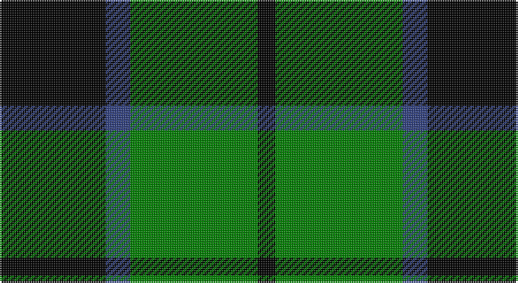

This page is one **sett** — a single exact thread-count. It belongs to the [tartan](/setts/k30db7g36k5/)
(the same proportion at any scale), whose colour order is pattern [KBGK](/stripes/kbgk/).

Part of the [Innes Hunting](/tartans/innes-hunting/) tartan — the named design grouping this sett with its other cloths.

Sourced from weddslist.  It is a [4 stripe tartan](/stripes/stripes4/).

Original link http://www.weddslist.com/cgi-bin/tartans/pg.pl?source=sts

## Also known as

This cloth is also recorded under:

- Innes Htg
- Innes, hunting

## Thread count
K/60 B14 G72 K/10

One full sett is **242 threads**.

## Palette

Palette: <strong>Ingles Buchan</strong> <small style="color:#888">(1 of 3 colours)</small>
<table><thead><tr><th>Colour</th><th>Threads</th><th>Shade</th><th>Base</th><th>OKLCh</th></tr></thead><tbody><tr><td>K/</td><td style="text-align:right;font-variant-numeric:tabular-nums">60</td><td><code style="background-color:#000000;">#000000</code> <small style="color:#888">#000000</small></td><td>K <code style="background-color:#000000;">#000000</code></td><td><small style="color:#888">oklch(0.0% 0.000 0.0)</small></td></tr><tr><td>B</td><td style="text-align:right;font-variant-numeric:tabular-nums">14</td><td><code style="background-color:#304080;">#304080</code> <small style="color:#888">#304080</small></td><td>B <code style="background-color:#2A418A;">#2A418A</code></td><td><small style="color:#888">oklch(39.4% 0.109 270.2)</small></td></tr><tr><td>G</td><td style="text-align:right;font-variant-numeric:tabular-nums">72</td><td><code style="background-color:#008000;">#008000</code> <small style="color:#888">#008000</small></td><td>G <code style="background-color:#006100;">#006100</code></td><td><small style="color:#888">oklch(52.0% 0.177 142.5)</small></td></tr><tr><td>K/</td><td style="text-align:right;font-variant-numeric:tabular-nums">10</td><td><code style="background-color:#000000;">#000000</code> <small style="color:#888">#000000</small></td><td>K <code style="background-color:#000000;">#000000</code></td><td><small style="color:#888">oklch(0.0% 0.000 0.0)</small></td></tr></tbody></table>

# Sample pattern

## Compared to the master

This cloth is one sett of its design; the master sett (the exemplar the design is anchored on) is below for comparison.

<figure style="margin:0"><figcaption style="color:#888;font-size:smaller">this sett</figcaption></figure>
<figure style="margin:0"><figcaption style="color:#888;font-size:smaller"><a href="/setts/k30lb7g36k5/">master sett →</a></figcaption></figure>

## Nearest tartans

The nearest existing variants by ΔTartan distance, with this tartan at the top so the swatches line up against it.

ΔTartan

Tartan

Sett

—

<a href="/ttd/edit/#slug=k30db7g36k5~x2">Innes, hunting</a> <a class="nn-out" href="/variants/s4/k30db7g36k5~x2/" title="open its dictionary page">↗</a>

0.65

<a href="/ttd/edit/#slug=k1g8k8ly1~x4&amp;base=k30db7g36k5~x2">Wallace Htg (Clan)</a> <a class="nn-out" href="/variants/s4/k1g8k8ly1~x4/" title="open its dictionary page">↗</a>

0.69

<a href="/ttd/edit/#slug=k4g33k33ly4~x2&amp;base=k30db7g36k5~x2">Wallace, hunting</a> <a class="nn-out" href="/variants/s4/k4g33k33ly4~x2/" title="open its dictionary page">↗</a>

1.02

<a href="/ttd/edit/#slug=g5k6t1~x4&amp;base=k30db7g36k5~x2">Wilson's, No 50</a> <a class="nn-out" href="/variants/s3/g5k6t1~x4/" title="open its dictionary page">↗</a>

1.06

<a href="/ttd/edit/#slug=k7ly1g7t1~x2&amp;base=k30db7g36k5~x2">Wilson's, No 140</a> <a class="nn-out" href="/variants/s4/k7ly1g7t1~x2/" title="open its dictionary page">↗</a>

1.09

<a href="/ttd/edit/#slug=k32g6k12g30ly3&amp;base=k30db7g36k5~x2">MacArthur</a> <a class="nn-out" href="/variants/s5/k32g6k12g30ly3/" title="open its dictionary page">↗</a>

1.10

<a href="/ttd/edit/#slug=k30lb7g36k5~x2&amp;base=k30db7g36k5~x2">Innes Hunting</a> <a class="nn-out" href="/variants/s4/k30lb7g36k5~x2/" title="open its dictionary page">↗</a>

1.12

<a href="/ttd/edit/#slug=k6ly1g6~x4&amp;base=k30db7g36k5~x2">Wilson's, No 197</a> <a class="nn-out" href="/variants/s3/k6ly1g6~x4/" title="open its dictionary page">↗</a>

1.20

<a href="/ttd/edit/#slug=g8k8ly1k8g8k1~x4&amp;base=k30db7g36k5~x2">Wallace Hunting</a> <a class="nn-out" href="/variants/s6/g8k8ly1k8g8k1~x4/" title="open its dictionary page">↗</a>

1.21

<a href="/ttd/edit/#slug=k8b5g44k40r6&amp;base=k30db7g36k5~x2">Douglas, Black</a> <a class="nn-out" href="/variants/s5/k8b5g44k40r6/" title="open its dictionary page">↗</a>

1.22

<a href="/ttd/edit/#slug=k19g8k10g31r3&amp;base=k30db7g36k5~x2">MacArthur-Fox</a> <a class="nn-out" href="/variants/s5/k19g8k10g31r3/" title="open its dictionary page">↗</a>

## Neighbour map

Every grey dot is one of 14360 variants placed by the first two principal components of the ΔTartan feature space (44% of its variance). Red is this tartan; blue dots are its nearest — click one to open its page.

<svg viewBox="0 0 640 380" role="img" style="max-width:100%;height:auto;border:1px solid #e0e0e0;border-radius:4px;display:block" xmlns="http://www.w3.org/2000/svg"><image href="/nn/cloud.v1.png" width="640" height="380"/><a href="/variants/s4/k1g8k8ly1~x4/"><circle cx="280.4" cy="263.1" r="4" fill="#3465a4"><title>Wallace Htg (Clan)</title></circle></a><a href="/variants/s4/k4g33k33ly4~x2/"><circle cx="273.0" cy="256.9" r="4" fill="#3465a4"><title>Wallace, hunting</title></circle></a><a href="/variants/s3/g5k6t1~x4/"><circle cx="238.4" cy="307.3" r="4" fill="#3465a4"><title>Wilson's, No 50</title></circle></a><a href="/variants/s4/k7ly1g7t1~x2/"><circle cx="201.7" cy="245.8" r="4" fill="#3465a4"><title>Wilson's, No 140</title></circle></a><a href="/variants/s5/k32g6k12g30ly3/"><circle cx="292.2" cy="246.1" r="4" fill="#3465a4"><title>MacArthur</title></circle></a><a href="/variants/s4/k30lb7g36k5~x2/"><circle cx="264.4" cy="278.1" r="4" fill="#3465a4"><title>Innes Hunting</title></circle></a><a href="/variants/s3/k6ly1g6~x4/"><circle cx="221.0" cy="301.9" r="4" fill="#3465a4"><title>Wilson's, No 197</title></circle></a><a href="/variants/s6/g8k8ly1k8g8k1~x4/"><circle cx="265.1" cy="269.4" r="4" fill="#3465a4"><title>Wallace Hunting</title></circle></a><a href="/variants/s5/k8b5g44k40r6/"><circle cx="237.4" cy="223.9" r="4" fill="#3465a4"><title>Douglas, Black</title></circle></a><a href="/variants/s5/k19g8k10g31r3/"><circle cx="294.1" cy="249.5" r="4" fill="#3465a4"><title>MacArthur-Fox</title></circle></a><circle cx="243.2" cy="272.4" r="5" fill="#c00000"/></svg>

ID: /variants/s4/k30db7g36k5~x2/
