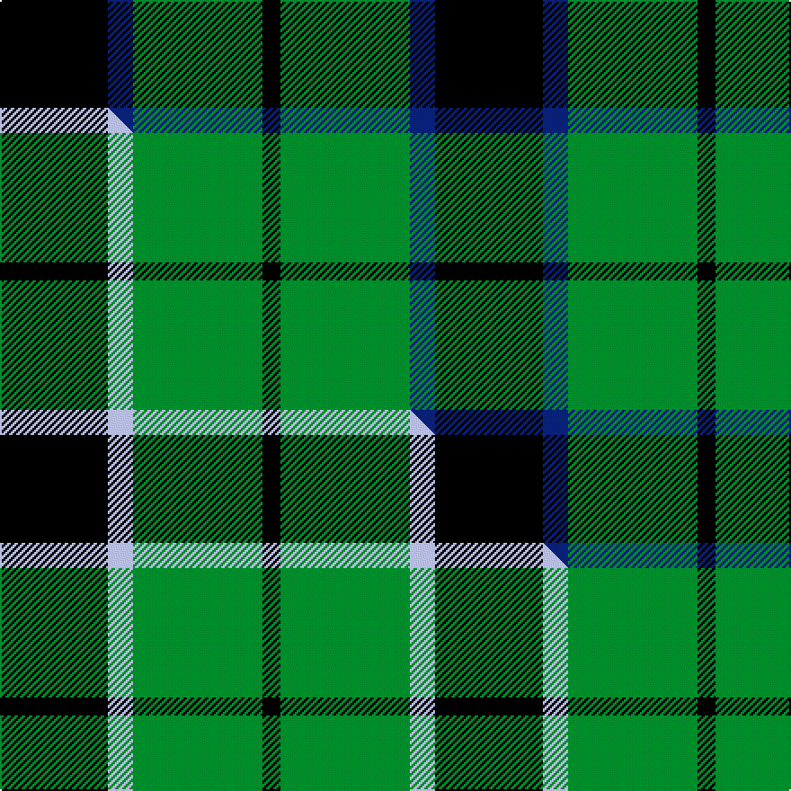

This page is one **sett** — a single exact thread-count. It belongs to the [tartan](/setts/k30db7g36k5/)
(the same proportion at any scale), whose colour order is pattern [KBGK](/stripes/kbgk/).

Part of the [Innes Hunting](/tartans/innes-hunting/) tartan — the named design grouping this sett with its other cloths.

Sourced from weddslist.  It is a [4 stripe tartan](/stripes/stripes4/).

Original link http://www.weddslist.com/cgi-bin/tartans/pg.pl?source=sts

## Thread count
K/60 DB14 G72 K/10

One full sett is **242 threads**.

## Palette
<table><thead><tr><th>Colour</th><th>Shade</th><th>OKLCh</th></tr></thead><tbody><tr><td>DB</td><td><code style="background-color:#082077;">#082077</code> <small style="color:#888">#082077</small></td><td><small style="color:#888">oklch(30.0% 0.149 265.1)</small></td></tr><tr><td>G</td><td><code style="background-color:#008B2A;">#008B2A</code> <small style="color:#888">#008B2A</small></td><td><small style="color:#888">oklch(55.4% 0.170 145.9)</small></td></tr><tr><td>K</td><td><code style="background-color:#000000;">#000000</code> <small style="color:#888">#000000</small></td><td><small style="color:#888">oklch(0.0% 0.000 0.0)</small></td></tr></tbody></table>

# Sample pattern

## Compared to the master

This cloth is one sett of its design; the master sett (the exemplar the design is anchored on) is below for comparison.

Its **ΔTartan distance** from the master is **0.44** — the same measure the nearest-tartans table ranks by (0 is identical; a re-scale of the same cloth is near 0, a recolour or a different proportion further).

<figure class="master-compare" style="margin:0">

this sett
master sett ★

<figcaption style="color:#888;font-size:smaller">One weave of this sett against the <a href="/setts/k30lb7g36k5/">master sett ★</a>, split on the diagonal: a shared proportion runs seamlessly across it with only the shades shifting; a different proportion breaks on it.</figcaption>
</figure>

## Nearest tartan variants

The nearest existing variants by ΔTartan distance, with this cloth at the top so the swatches line up against it.

ΔTartan

Threads

Variant

Sett

—

242

<a href="/variants/s4/k30db7g36k5~x2/">Innes, hunting</a>

<a href="/ttd/edit/#slug=k30lb7g36k5~x2&amp;base=k30db7g36k5~x2" title="compare in the TTD">0.00</a>

242

<a href="/variants/s4/k30lb7g36k5~x2/">Innes Hunting</a>

<a href="/ttd/edit/#slug=k6lb1g7k1~x2&amp;base=k30db7g36k5~x2" title="compare in the TTD">0.08</a>

46

<a href="/variants/s4/k6lb1g7k1~x2/">Innes (Miniature)</a>

<a href="/ttd/edit/#slug=k8t5g44k40r6&amp;base=k30db7g36k5~x2" title="compare in the TTD">0.87</a>

192

<a href="/variants/s5/k8t5g44k40r6/">Douglas, Black</a>

<a href="/ttd/edit/#slug=k12db3g23k23r3~x2&amp;base=k30db7g36k5~x2" title="compare in the TTD">0.87</a>

226

<a href="/variants/s5/k12db3g23k23r3~x2/">Douglas, (Black)</a>

<a href="/ttd/edit/#slug=k6db4g44k41w4~x2&amp;base=k30db7g36k5~x2" title="compare in the TTD">0.89</a>

376

<a href="/variants/s5/k6db4g44k41w4~x2/">Douglas (alternative threadcount)</a>

<a href="/ttd/edit/#slug=k7y1g7lb1~x2&amp;base=k30db7g36k5~x2" title="compare in the TTD">1.16</a>

48

<a href="/variants/s4/k7y1g7lb1~x2/">Wilson's, No 140</a>

<a href="/ttd/edit/#slug=k7w1g7lb1~x2&amp;base=k30db7g36k5~x2" title="compare in the TTD">1.16</a>

48

<a href="/variants/s4/k7w1g7lb1~x2/">Wilson's No.079</a>

<a href="/ttd/edit/#slug=k8y1k8g13r2~x4&amp;base=k30db7g36k5~x2" title="compare in the TTD">1.17</a>

216

<a href="/variants/s5/k8y1k8g13r2~x4/">Tolmie</a>

<a href="/ttd/edit/#slug=k6g4dg44k41w4~x2~g2408144-dg1806142&amp;base=k30db7g36k5~x2" title="compare in the TTD">1.19</a>

376

<a href="/variants/s5/k6g4dg44k41w4~x2~g2408144-dg1806142/">Raeside</a>

<a href="/ttd/edit/#slug=k1g8k8y1&amp;base=k30db7g36k5~x2" title="compare in the TTD">1.22</a>

34

<a href="/variants/s4/k1g8k8y1/">Wallace Hunting</a>

## Neighbour map

Every grey dot is one of 13620 variants placed by the first two principal components of the ΔTartan feature space (42% of its variance). Red is this tartan; blue dots are its nearest — click one to open its page.

<svg viewBox="0 0 640 380" role="img" style="max-width:100%;height:auto;border:1px solid #e0e0e0;border-radius:4px;display:block" xmlns="http://www.w3.org/2000/svg"><image href="/nn/cloud.v1.png" width="640" height="380"/><a href="/variants/s4/k30lb7g36k5~x2/"><circle cx="212.7" cy="241.7" r="4" fill="#3465a4"><title>Innes Hunting</title></circle></a><a href="/variants/s4/k6lb1g7k1~x2/"><circle cx="223.4" cy="239.2" r="4" fill="#3465a4"><title>Innes (Miniature)</title></circle></a><a href="/variants/s5/k8t5g44k40r6/"><circle cx="211.0" cy="199.6" r="4" fill="#3465a4"><title>Douglas, Black</title></circle></a><a href="/variants/s5/k12db3g23k23r3~x2/"><circle cx="232.2" cy="215.8" r="4" fill="#3465a4"><title>Douglas, (Black)</title></circle></a><a href="/variants/s5/k6db4g44k41w4~x2/"><circle cx="233.3" cy="187.4" r="4" fill="#3465a4"><title>Douglas (alternative threadcount)</title></circle></a><a href="/variants/s4/k7y1g7lb1~x2/"><circle cx="190.3" cy="230.0" r="4" fill="#3465a4"><title>Wilson's, No 140</title></circle></a><a href="/variants/s4/k7w1g7lb1~x2/"><circle cx="193.7" cy="234.9" r="4" fill="#3465a4"><title>Wilson's No.079</title></circle></a><a href="/variants/s5/k8y1k8g13r2~x4/"><circle cx="227.8" cy="199.3" r="4" fill="#3465a4"><title>Tolmie</title></circle></a><a href="/variants/s5/k6g4dg44k41w4~x2~g2408144-dg1806142/"><circle cx="241.8" cy="188.8" r="4" fill="#3465a4"><title>Raeside</title></circle></a><a href="/variants/s4/k1g8k8y1/"><circle cx="254.5" cy="234.3" r="4" fill="#3465a4"><title>Wallace Hunting</title></circle></a><circle cx="220.6" cy="243.8" r="5" fill="#c00000"/><text x="320" y="376" text-anchor="middle" font-size="11" fill="#999">ground</text><text x="11" y="190" text-anchor="middle" font-size="11" fill="#999" transform="rotate(-90 11 190)">complexity</text></svg>

ID: /variants/s4/k30db7g36k5~x2/
