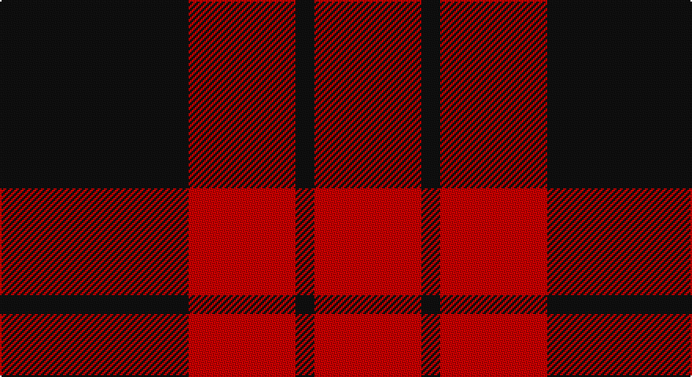

This page is one **sett** — a single exact thread-count. It belongs to the [tartan](/setts/k30r17k3/)
(the same proportion at any scale), whose colour order is pattern [KRKR](/stripes/krkr/).

Sourced from tartans-authority.  It is a [4 stripe tartan](/stripes/stripes4/).

Original link http://www.tartansauthority.com/tartan-ferret/display/8936/

## Also known as

This cloth is also recorded under:

- MacFarlane Red & Black

## Register references

External register numbers recorded for this tartan.

- Scottish Register of Tartans: [8936](https://www.tartanregister.gov.uk/tartanDetails?ref=8936)
- Scottish Tartans Authority (ITI): 8936

## Thread count
K/120 R68 K12 R/68

One full sett is **348 threads**.

## Palette

Palette: <strong>Tartan Register</strong>
<table><thead><tr><th>Colour</th><th>Threads</th><th>Shade</th><th>Base</th><th>OKLCh</th></tr></thead><tbody><tr><td>K/</td><td style="text-align:right;font-variant-numeric:tabular-nums">120</td><td><code style="background-color:#101010;">#101010</code> <small style="color:#888">#101010</small></td><td>K <code style="background-color:#000000;">#000000</code></td><td><small style="color:#888">oklch(17.3% 0.000 89.9)</small></td></tr><tr><td>R</td><td style="text-align:right;font-variant-numeric:tabular-nums">68</td><td><code style="background-color:#C80000;">#C80000</code> <small style="color:#888">#C80000</small></td><td>R <code style="background-color:#CC0000;">#CC0000</code></td><td><small style="color:#888">oklch(52.3% 0.215 29.2)</small></td></tr><tr><td>K</td><td style="text-align:right;font-variant-numeric:tabular-nums">12</td><td><code style="background-color:#101010;">#101010</code> <small style="color:#888">#101010</small></td><td>K <code style="background-color:#000000;">#000000</code></td><td><small style="color:#888">oklch(17.3% 0.000 89.9)</small></td></tr><tr><td>R/</td><td style="text-align:right;font-variant-numeric:tabular-nums">68</td><td><code style="background-color:#C80000;">#C80000</code> <small style="color:#888">#C80000</small></td><td>R <code style="background-color:#CC0000;">#CC0000</code></td><td><small style="color:#888">oklch(52.3% 0.215 29.2)</small></td></tr></tbody></table>

# Sample pattern

## Nearest tartans

The nearest existing variants by ΔTartan distance, with this tartan at the top so the swatches line up against it.

ΔTartan

Tartan

Sett

—

<a href="/ttd/edit/#slug=k30r17k3~x4">MacFarlane Red &amp; Black (Artefact)</a> <a class="nn-out" href="/variants/s4/k30r17k3~x4/" title="open its dictionary page">↗</a>

0.95

<a href="/ttd/edit/#slug=k13r2k13r19k2~x2&amp;base=k30r17k3~x4">MacLeod of Raasay (Highland Society of London)</a> <a class="nn-out" href="/variants/s5/k13r2k13r19k2~x2/" title="open its dictionary page">↗</a>

1.00

<a href="/ttd/edit/#slug=k31r4k47r47k4r31~x2&amp;base=k30r17k3~x4">Erskine (Paton)</a> <a class="nn-out" href="/variants/s6/k31r4k47r47k4r31~x2/" title="open its dictionary page">↗</a>

1.09

<a href="/ttd/edit/#slug=k5r26k26r5~x4&amp;base=k30r17k3~x4">Ettrick (District)</a> <a class="nn-out" href="/variants/s4/k5r26k26r5~x4/" title="open its dictionary page">↗</a>

1.16

<a href="/ttd/edit/#slug=r8k1r8k12r1~x2&amp;base=k30r17k3~x4">MacLeod Black &amp; Red</a> <a class="nn-out" href="/variants/s5/r8k1r8k12r1~x2/" title="open its dictionary page">↗</a>

1.31

<a href="/ttd/edit/#slug=k18r4k18r32w3~x2&amp;base=k30r17k3~x4">Munro (Black and Red)</a> <a class="nn-out" href="/variants/s5/k18r4k18r32w3~x2/" title="open its dictionary page">↗</a>

1.35

<a href="/variants/s4/k67r32k6/">Lendrum, or MacFarlane</a>

1.40

<a href="/ttd/edit/#slug=r3k25r25k10lb3~x2&amp;base=k30r17k3~x4">Bodog.com</a> <a class="nn-out" href="/variants/s5/r3k25r25k10lb3~x2/" title="open its dictionary page">↗</a>

1.41

<a href="/ttd/edit/#slug=k1r8k8ly1~x6&amp;base=k30r17k3~x4">Wallace</a> <a class="nn-out" href="/variants/s4/k1r8k8ly1~x6/" title="open its dictionary page">↗</a>

1.41

<a href="/ttd/edit/#slug=k1r8k8ly1~x4&amp;base=k30r17k3~x4">Wallace (Clan)</a> <a class="nn-out" href="/variants/s4/k1r8k8ly1~x4/" title="open its dictionary page">↗</a>

1.53

<a href="/ttd/edit/#slug=k6r3k28r28k3r6~x2&amp;base=k30r17k3~x4">Erskine, Black &amp; Red (Clan)</a> <a class="nn-out" href="/variants/s6/k6r3k28r28k3r6~x2/" title="open its dictionary page">↗</a>

## Neighbour map

Every grey dot is one of 14360 variants placed by the first two principal components of the ΔTartan feature space (44% of its variance). Red is this tartan; blue dots are its nearest — click one to open its page.

<svg viewBox="0 0 640 380" role="img" style="max-width:100%;height:auto;border:1px solid #e0e0e0;border-radius:4px;display:block" xmlns="http://www.w3.org/2000/svg"><image href="/nn/cloud.v1.png" width="640" height="380"/><a href="/variants/s5/k13r2k13r19k2~x2/"><circle cx="372.9" cy="262.9" r="4" fill="#3465a4"><title>MacLeod of Raasay (Highland Society of London)</title></circle></a><a href="/variants/s6/k31r4k47r47k4r31~x2/"><circle cx="337.6" cy="240.8" r="4" fill="#3465a4"><title>Erskine (Paton)</title></circle></a><a href="/variants/s4/k5r26k26r5~x4/"><circle cx="327.9" cy="290.2" r="4" fill="#3465a4"><title>Ettrick (District)</title></circle></a><a href="/variants/s5/r8k1r8k12r1~x2/"><circle cx="375.0" cy="237.2" r="4" fill="#3465a4"><title>MacLeod Black &amp; Red</title></circle></a><a href="/variants/s5/k18r4k18r32w3~x2/"><circle cx="300.8" cy="228.3" r="4" fill="#3465a4"><title>Munro (Black and Red)</title></circle></a><a href="/variants/s4/k67r32k6/"><circle cx="342.3" cy="265.2" r="4" fill="#3465a4"><title>Lendrum, or MacFarlane</title></circle></a><a href="/variants/s5/r3k25r25k10lb3~x2/"><circle cx="316.6" cy="238.4" r="4" fill="#3465a4"><title>Bodog.com</title></circle></a><a href="/variants/s4/k1r8k8ly1~x6/"><circle cx="304.9" cy="243.9" r="4" fill="#3465a4"><title>Wallace</title></circle></a><a href="/variants/s4/k1r8k8ly1~x4/"><circle cx="304.9" cy="243.9" r="4" fill="#3465a4"><title>Wallace (Clan)</title></circle></a><a href="/variants/s6/k6r3k28r28k3r6~x2/"><circle cx="360.7" cy="232.7" r="4" fill="#3465a4"><title>Erskine, Black &amp; Red (Clan)</title></circle></a><circle cx="343.2" cy="278.4" r="5" fill="#c00000"/></svg>

ID: /variants/s4/k30r17k3~x4/
