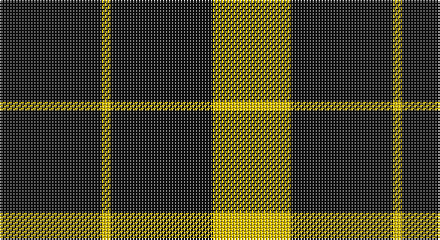

This page is one **sett** — a single exact thread-count. It belongs to the [tartan](/setts/k34ly3k34ly26/)
(the same proportion at any scale), whose colour order is pattern [KYKY](/stripes/kyky/).

Part of the [Raeburn](/tartans/raeburn/) tartan — the named design grouping this sett with its other cloths.

Sourced from register-of-tartans.  It is a [4 stripe tartan](/stripes/stripes4/).

Original link https://www.tartanregister.gov.uk/tartanDetails.aspx?ref=3436

2 attestations — the source records this cloth was collapsed from (oldest owns this page)

<ul>
<li>01/01/1930 — Raeburn (register-of-tartans, <a href="https://www.tartanregister.gov.uk/tartanDetails.aspx?ref=3436">record</a>)</li>
<li>pre 1930 — Raeburn (Name) (tartans-authority, <a href="http://www.tartansauthority.com/tartan-ferret/display/1275/">record</a>)</li>
</ul>

## Register references

External register numbers recorded for this tartan.

- Scottish Register of Tartans: [3436](https://www.tartanregister.gov.uk/tartanDetails.aspx?ref=3436)
- Scottish Tartans Authority (ITI): 1275
- Scottish Tartans World Register: 1275

## Thread count
K/68 Y6 K68 Y/52

One full sett is **268 threads**.

## Palette

Palette: <strong>Logan (The Scottish Gael, 1831)</strong>
<table><thead><tr><th>Colour</th><th>Threads</th><th>Shade</th><th>Base</th><th>OKLCh</th></tr></thead><tbody><tr><td>K/</td><td style="text-align:right;font-variant-numeric:tabular-nums">68</td><td><code style="background-color:#101010;">#101010</code> <small style="color:#888">#101010</small></td><td>K <code style="background-color:#000000;">#000000</code></td><td><small style="color:#888">oklch(17.3% 0.000 89.9)</small></td></tr><tr><td>Y</td><td style="text-align:right;font-variant-numeric:tabular-nums">6</td><td><code style="background-color:#E8C000;">#E8C000</code> <small style="color:#888">#E8C000</small></td><td>Y <code style="background-color:#F2BF00;">#F2BF00</code></td><td><small style="color:#888">oklch(81.9% 0.168 93.7)</small></td></tr><tr><td>K</td><td style="text-align:right;font-variant-numeric:tabular-nums">68</td><td><code style="background-color:#101010;">#101010</code> <small style="color:#888">#101010</small></td><td>K <code style="background-color:#000000;">#000000</code></td><td><small style="color:#888">oklch(17.3% 0.000 89.9)</small></td></tr><tr><td>Y/</td><td style="text-align:right;font-variant-numeric:tabular-nums">52</td><td><code style="background-color:#E8C000;">#E8C000</code> <small style="color:#888">#E8C000</small></td><td>Y <code style="background-color:#F2BF00;">#F2BF00</code></td><td><small style="color:#888">oklch(81.9% 0.168 93.7)</small></td></tr></tbody></table>

# Sample pattern

## Nearest tartans

The nearest existing variants by ΔTartan distance, with this tartan at the top so the swatches line up against it.

ΔTartan

Tartan

Sett

—

<a href="/ttd/edit/#slug=k34ly3k34ly26~x2">Raeburn</a> <a class="nn-out" href="/variants/s4/k34ly3k34ly26~x2/" title="open its dictionary page">↗</a>

1.41

<a href="/ttd/edit/#slug=k6ly1k6ly6~x6&amp;base=k34ly3k34ly26~x2">Raeburn</a> <a class="nn-out" href="/variants/s4/k6ly1k6ly6~x6/" title="open its dictionary page">↗</a>

1.76

<a href="/variants/s4/k7lr6k1~x2/">MacFarlane VS</a>

1.76

<a href="/variants/s4/k7lr6k1/">MacFarlane VS</a>

1.91

<a href="/ttd/edit/#slug=dg86lo44dg21lo44dg86t10&amp;base=k34ly3k34ly26~x2">Special Saffron</a> <a class="nn-out" href="/variants/s6/dg86lo44dg21lo44dg86t10/" title="open its dictionary page">↗</a>

1.92

<a href="/ttd/edit/#slug=dg21lo43dg86b10&amp;base=k34ly3k34ly26~x2">Special, Saffron</a> <a class="nn-out" href="/variants/s4/dg21lo43dg86b10/" title="open its dictionary page">↗</a>

1.94

<a href="/ttd/edit/#slug=k21w2k5w9k13g2~x4&amp;base=k34ly3k34ly26~x2">New Zealand District Tartan</a> <a class="nn-out" href="/variants/s6/k21w2k5w9k13g2~x4/" title="open its dictionary page">↗</a>

1.95

<a href="/ttd/edit/#slug=g9k18r2~x4&amp;base=k34ly3k34ly26~x2">Cowie, Justine (Personal)</a> <a class="nn-out" href="/variants/s3/g9k18r2~x4/" title="open its dictionary page">↗</a>

1.97

<a href="/ttd/edit/#slug=dg21lo44dg86t10&amp;base=k34ly3k34ly26~x2">Special Saffron (Fashion)</a> <a class="nn-out" href="/variants/s4/dg21lo44dg86t10/" title="open its dictionary page">↗</a>

1.97

<a href="/ttd/edit/#slug=k46dy7k8w20~x2&amp;base=k34ly3k34ly26~x2">Lords of Skye (Fashion?)</a> <a class="nn-out" href="/variants/s4/k46dy7k8w20~x2/" title="open its dictionary page">↗</a>

1.98

<a href="/ttd/edit/#slug=dg21ly43dg86t10&amp;base=k34ly3k34ly26~x2">Special Saffron Tartan</a> <a class="nn-out" href="/variants/s4/dg21ly43dg86t10/" title="open its dictionary page">↗</a>

## Neighbour map

Every grey dot is one of 14360 variants placed by the first two principal components of the ΔTartan feature space (44% of its variance). Red is this tartan; blue dots are its nearest — click one to open its page.

<svg viewBox="0 0 640 380" role="img" style="max-width:100%;height:auto;border:1px solid #e0e0e0;border-radius:4px;display:block" xmlns="http://www.w3.org/2000/svg"><image href="/nn/cloud.v1.png" width="640" height="380"/><a href="/variants/s4/k6ly1k6ly6~x6/"><circle cx="312.1" cy="307.4" r="4" fill="#3465a4"><title>Raeburn</title></circle></a><a href="/variants/s4/k7lr6k1~x2/"><circle cx="299.5" cy="294.4" r="4" fill="#3465a4"><title>MacFarlane VS</title></circle></a><a href="/variants/s4/k7lr6k1/"><circle cx="299.5" cy="294.4" r="4" fill="#3465a4"><title>MacFarlane VS</title></circle></a><a href="/variants/s6/dg86lo44dg21lo44dg86t10/"><circle cx="354.3" cy="257.4" r="4" fill="#3465a4"><title>Special Saffron</title></circle></a><a href="/variants/s4/dg21lo43dg86b10/"><circle cx="378.3" cy="264.5" r="4" fill="#3465a4"><title>Special, Saffron</title></circle></a><a href="/variants/s6/k21w2k5w9k13g2~x4/"><circle cx="414.8" cy="228.2" r="4" fill="#3465a4"><title>New Zealand District Tartan</title></circle></a><a href="/variants/s3/g9k18r2~x4/"><circle cx="342.6" cy="278.7" r="4" fill="#3465a4"><title>Cowie, Justine (Personal)</title></circle></a><a href="/variants/s4/dg21lo44dg86t10/"><circle cx="371.8" cy="263.0" r="4" fill="#3465a4"><title>Special Saffron (Fashion)</title></circle></a><a href="/variants/s4/k46dy7k8w20~x2/"><circle cx="334.9" cy="250.9" r="4" fill="#3465a4"><title>Lords of Skye (Fashion?)</title></circle></a><a href="/variants/s4/dg21ly43dg86t10/"><circle cx="356.7" cy="255.8" r="4" fill="#3465a4"><title>Special Saffron Tartan</title></circle></a><circle cx="389.9" cy="279.3" r="5" fill="#c00000"/></svg>

ID: /variants/s4/k34ly3k34ly26~x2/
