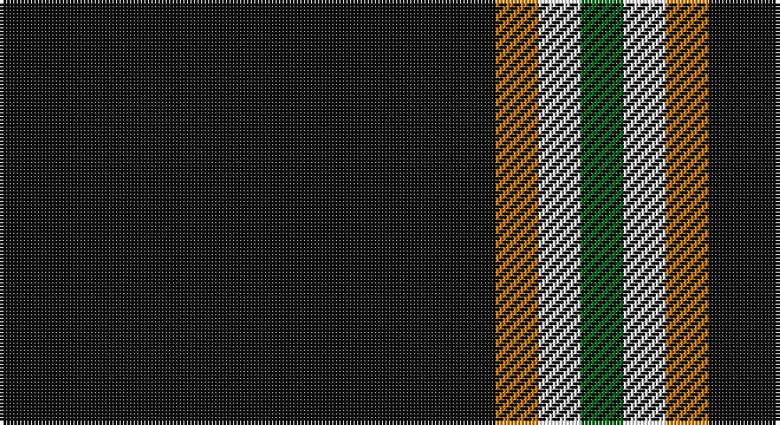

This page is one **sett** — a single exact thread-count. It belongs to the [tartan](/setts/k35lo3w3g3/)
(the same proportion at any scale), whose colour order is pattern [GWYK](/stripes/gwyk/).

Sourced from register-of-tartans.  It is a [4 stripe tartan](/stripes/stripes4/).

Original link https://www.tartanregister.gov.uk/tartanDetails.aspx?ref=928

2 attestations — the source records this cloth was collapsed from (oldest owns this page)

<ul>
<li>01/01/2007 — Dhillon (Personal) (register-of-tartans, <a href="https://www.tartanregister.gov.uk/tartanDetails.aspx?ref=928">record</a>)</li>
<li>pre 2007 — Dhillon (Personal) (tartans-authority, <a href="http://www.tartansauthority.com/tartan-ferret/display/7175/">record</a>)</li>
</ul>

## Register references

External register numbers recorded for this tartan.

- Scottish Register of Tartans: [928](https://www.tartanregister.gov.uk/tartanDetails.aspx?ref=928)
- Scottish Tartans Authority (ITI): 7175

## Thread count
K/140 O12 W12 G/12

One full sett is **200 threads**.

## Palette

Palette: <strong>Tartan Register</strong>
<table><thead><tr><th>Colour</th><th>Threads</th><th>Shade</th><th>Base</th><th>OKLCh</th></tr></thead><tbody><tr><td>K/</td><td style="text-align:right;font-variant-numeric:tabular-nums">140</td><td><code style="background-color:#101010;">#101010</code> <small style="color:#888">#101010</small></td><td>K <code style="background-color:#000000;">#000000</code></td><td><small style="color:#888">oklch(17.3% 0.000 89.9)</small></td></tr><tr><td>O</td><td style="text-align:right;font-variant-numeric:tabular-nums">12</td><td><code style="background-color:#D87C00;">#D87C00</code> <small style="color:#888">#D87C00</small></td><td>Y <code style="background-color:#F2BF00;">#F2BF00</code></td><td><small style="color:#888">oklch(67.3% 0.155 61.8)</small></td></tr><tr><td>W</td><td style="text-align:right;font-variant-numeric:tabular-nums">12</td><td><code style="background-color:#F8F8F8;">#F8F8F8</code> <small style="color:#888">#F8F8F8</small></td><td>W <code style="background-color:#F7F7F7;">#F7F7F7</code></td><td><small style="color:#888">oklch(97.9% 0.000 89.9)</small></td></tr><tr><td>G/</td><td style="text-align:right;font-variant-numeric:tabular-nums">12</td><td><code style="background-color:#006818;">#006818</code> <small style="color:#888">#006818</small></td><td>G <code style="background-color:#006100;">#006100</code></td><td><small style="color:#888">oklch(45.0% 0.142 145.0)</small></td></tr></tbody></table>

# Sample pattern

## Nearest tartans

The nearest existing variants by ΔTartan distance, with this tartan at the top so the swatches line up against it.

ΔTartan

Tartan

Sett

—

<a href="/ttd/edit/#slug=k35lo3w3g3~x4">Dhillon (Personal)</a> <a class="nn-out" href="/variants/s4/k35lo3w3g3~x4/" title="open its dictionary page">↗</a>

1.08

<a href="/ttd/edit/#slug=r3t12k50ly3~x2&amp;base=k35lo3w3g3~x4">Rogues, The (Corporate)</a> <a class="nn-out" href="/variants/s4/r3t12k50ly3~x2/" title="open its dictionary page">↗</a>

1.18

<a href="/ttd/edit/#slug=r3n12k50ly3~x2&amp;base=k35lo3w3g3~x4">Rogues (United States), The</a> <a class="nn-out" href="/variants/s4/r3n12k50ly3~x2/" title="open its dictionary page">↗</a>

1.37

<a href="/ttd/edit/#slug=ly9k4ly4k45r4~x2&amp;base=k35lo3w3g3~x4">Gwynn (Name)</a> <a class="nn-out" href="/variants/s5/ly9k4ly4k45r4~x2/" title="open its dictionary page">↗</a>

1.39

<a href="/ttd/edit/#slug=r2g2k20w1db1~x6&amp;base=k35lo3w3g3~x4">Fily, Sylvain Roger</a> <a class="nn-out" href="/variants/s5/r2g2k20w1db1~x6/" title="open its dictionary page">↗</a>

1.43

<a href="/ttd/edit/#slug=ly7k4ly4k39r4~x2&amp;base=k35lo3w3g3~x4">Welsh National #3</a> <a class="nn-out" href="/variants/s5/ly7k4ly4k39r4~x2/" title="open its dictionary page">↗</a>

1.44

<a href="/ttd/edit/#slug=r1k20lb5r1~x4&amp;base=k35lo3w3g3~x4">Dobelman (Personal)</a> <a class="nn-out" href="/variants/s4/r1k20lb5r1~x4/" title="open its dictionary page">↗</a>

1.49

<a href="/ttd/edit/#slug=k62db15w6ly4~x2&amp;base=k35lo3w3g3~x4">C-Tec N.I. Ltd</a> <a class="nn-out" href="/variants/s4/k62db15w6ly4~x2/" title="open its dictionary page">↗</a>

1.56

<a href="/ttd/edit/#slug=k10lr2w5lr4k50b2~x2&amp;base=k35lo3w3g3~x4">London Fog Black</a> <a class="nn-out" href="/variants/s6/k10lr2w5lr4k50b2~x2/" title="open its dictionary page">↗</a>

1.58

<a href="/ttd/edit/#slug=k69r14ly5~x2&amp;base=k35lo3w3g3~x4">Batson (Personal)</a> <a class="nn-out" href="/variants/s3/k69r14ly5~x2/" title="open its dictionary page">↗</a>

1.62

<a href="/ttd/edit/#slug=dt40ly10dt8r20dt100w5&amp;base=k35lo3w3g3~x4">East of Scotland Tartan Army</a> <a class="nn-out" href="/variants/s6/dt40ly10dt8r20dt100w5/" title="open its dictionary page">↗</a>

## Neighbour map

Every grey dot is one of 14360 variants placed by the first two principal components of the ΔTartan feature space (44% of its variance). Red is this tartan; blue dots are its nearest — click one to open its page.

<svg viewBox="0 0 640 380" role="img" style="max-width:100%;height:auto;border:1px solid #e0e0e0;border-radius:4px;display:block" xmlns="http://www.w3.org/2000/svg"><image href="/nn/cloud.v1.png" width="640" height="380"/><a href="/variants/s4/r3t12k50ly3~x2/"><circle cx="455.3" cy="196.8" r="4" fill="#3465a4"><title>Rogues, The (Corporate)</title></circle></a><a href="/variants/s4/r3n12k50ly3~x2/"><circle cx="465.1" cy="201.0" r="4" fill="#3465a4"><title>Rogues (United States), The</title></circle></a><a href="/variants/s5/ly9k4ly4k45r4~x2/"><circle cx="452.2" cy="202.0" r="4" fill="#3465a4"><title>Gwynn (Name)</title></circle></a><a href="/variants/s5/r2g2k20w1db1~x6/"><circle cx="475.6" cy="150.3" r="4" fill="#3465a4"><title>Fily, Sylvain Roger</title></circle></a><a href="/variants/s5/ly7k4ly4k39r4~x2/"><circle cx="444.0" cy="208.1" r="4" fill="#3465a4"><title>Welsh National #3</title></circle></a><a href="/variants/s4/r1k20lb5r1~x4/"><circle cx="478.4" cy="199.1" r="4" fill="#3465a4"><title>Dobelman (Personal)</title></circle></a><a href="/variants/s4/k62db15w6ly4~x2/"><circle cx="423.8" cy="200.2" r="4" fill="#3465a4"><title>C-Tec N.I. Ltd</title></circle></a><a href="/variants/s6/k10lr2w5lr4k50b2~x2/"><circle cx="538.4" cy="152.9" r="4" fill="#3465a4"><title>London Fog Black</title></circle></a><a href="/variants/s3/k69r14ly5~x2/"><circle cx="513.4" cy="245.9" r="4" fill="#3465a4"><title>Batson (Personal)</title></circle></a><a href="/variants/s6/dt40ly10dt8r20dt100w5/"><circle cx="517.3" cy="181.3" r="4" fill="#3465a4"><title>East of Scotland Tartan Army</title></circle></a><circle cx="489.0" cy="203.1" r="5" fill="#c00000"/></svg>

ID: /variants/s4/k35lo3w3g3~x4/
