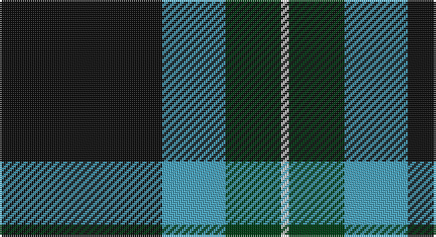

This page is one **sett** — a single exact thread-count. It belongs to the [tartan](/setts/k41lg16dg14w2/)
(the same proportion at any scale), whose colour order is pattern [KYGW](/stripes/kygw/).

Sourced from register-of-tartans.  It is a [4 stripe tartan](/stripes/stripes4/).

Original link https://www.tartanregister.gov.uk/tartanDetails.aspx?ref=11365

## Register references

External register numbers recorded for this tartan.

- Scottish Register of Tartans: [11365](https://www.tartanregister.gov.uk/tartanDetails.aspx?ref=11365)

## Thread count
K/82 B32 DG28 LN/4

One full sett is **206 threads**.

## Palette

Palette: <strong>Tartan Register</strong>
<table><thead><tr><th>Colour</th><th>Threads</th><th>Shade</th><th>Base</th><th>OKLCh</th></tr></thead><tbody><tr><td>K/</td><td style="text-align:right;font-variant-numeric:tabular-nums">82</td><td><code style="background-color:#101010;">#101010</code> <small style="color:#888">#101010</small></td><td>K <code style="background-color:#000000;">#000000</code></td><td><small style="color:#888">oklch(17.3% 0.000 89.9)</small></td></tr><tr><td>B</td><td style="text-align:right;font-variant-numeric:tabular-nums">32</td><td><code style="background-color:#48A4C0;">#48A4C0</code> <small style="color:#888">#48A4C0</small></td><td>Y <code style="background-color:#F2BF00;">#F2BF00</code></td><td><small style="color:#888">oklch(67.5% 0.096 221.0)</small></td></tr><tr><td>DG</td><td style="text-align:right;font-variant-numeric:tabular-nums">28</td><td><code style="background-color:#003C14;">#003C14</code> <small style="color:#888">#003C14</small></td><td>G <code style="background-color:#006100;">#006100</code></td><td><small style="color:#888">oklch(31.1% 0.089 148.5)</small></td></tr><tr><td>LN/</td><td style="text-align:right;font-variant-numeric:tabular-nums">4</td><td><code style="background-color:#E0E0E0;">#E0E0E0</code> <small style="color:#888">#E0E0E0</small></td><td>W <code style="background-color:#F7F7F7;">#F7F7F7</code></td><td><small style="color:#888">oklch(90.7% 0.000 89.9)</small></td></tr></tbody></table>

# Sample pattern

## Nearest tartans

The nearest existing variants by ΔTartan distance, with this tartan at the top so the swatches line up against it.

ΔTartan

Tartan

Sett

—

<a href="/ttd/edit/#slug=k41lg16dg14w2~x2">Hamworthy Association</a> <a class="nn-out" href="/variants/s4/k41lg16dg14w2~x2/" title="open its dictionary page">↗</a>

0.83

<a href="/ttd/edit/#slug=db16k6g8ly1~x2&amp;base=k41lg16dg14w2~x2">Sinclair, Sir John</a> <a class="nn-out" href="/variants/s4/db16k6g8ly1~x2/" title="open its dictionary page">↗</a>

1.06

<a href="/ttd/edit/#slug=dg30w8dt32ly1dt8~x2&amp;base=k41lg16dg14w2~x2">Boroughmuir</a> <a class="nn-out" href="/variants/s5/dg30w8dt32ly1dt8~x2/" title="open its dictionary page">↗</a>

1.29

<a href="/ttd/edit/#slug=r4g40k21lo2k21g2~x2&amp;base=k41lg16dg14w2~x2">Unidentified Furnishing #2</a> <a class="nn-out" href="/variants/s6/r4g40k21lo2k21g2~x2/" title="open its dictionary page">↗</a>

1.35

<a href="/ttd/edit/#slug=k3w2n27k31lr3~x2&amp;base=k41lg16dg14w2~x2">Kelley Oliphint (Commemorative)</a> <a class="nn-out" href="/variants/s5/k3w2n27k31lr3~x2/" title="open its dictionary page">↗</a>

1.40

<a href="/ttd/edit/#slug=g20r7db40w2~x2&amp;base=k41lg16dg14w2~x2">McNiff, Kevin (Personal)</a> <a class="nn-out" href="/variants/s4/g20r7db40w2~x2/" title="open its dictionary page">↗</a>

1.41

<a href="/ttd/edit/#slug=k62n24lo5w8~x2&amp;base=k41lg16dg14w2~x2">Perry, Alex (Personal)</a> <a class="nn-out" href="/variants/s4/k62n24lo5w8~x2/" title="open its dictionary page">↗</a>

1.43

<a href="/ttd/edit/#slug=g40k15b10k10ly3~x2&amp;base=k41lg16dg14w2~x2">U.S. Border Patrol (Corporate)</a> <a class="nn-out" href="/variants/s5/g40k15b10k10ly3~x2/" title="open its dictionary page">↗</a>

1.43

<a href="/ttd/edit/#slug=k61gi10g20w4~x2&amp;base=k41lg16dg14w2~x2">Wesley Owen 2010 (Personal)</a> <a class="nn-out" href="/variants/s4/k61gi10g20w4~x2/" title="open its dictionary page">↗</a>

1.45

<a href="/ttd/edit/#slug=w1dg10dp4lt1~x2&amp;base=k41lg16dg14w2~x2">Wilson's No.205</a> <a class="nn-out" href="/variants/s4/w1dg10dp4lt1~x2/" title="open its dictionary page">↗</a>

1.48

<a href="/ttd/edit/#slug=k2g11k26b11k2~x2&amp;base=k41lg16dg14w2~x2">Campbell of Loch Awe</a> <a class="nn-out" href="/variants/s5/k2g11k26b11k2~x2/" title="open its dictionary page">↗</a>

## Neighbour map

Every grey dot is one of 14360 variants placed by the first two principal components of the ΔTartan feature space (44% of its variance). Red is this tartan; blue dots are its nearest — click one to open its page.

<svg viewBox="0 0 640 380" role="img" style="max-width:100%;height:auto;border:1px solid #e0e0e0;border-radius:4px;display:block" xmlns="http://www.w3.org/2000/svg"><image href="/nn/cloud.v1.png" width="640" height="380"/><a href="/variants/s4/db16k6g8ly1~x2/"><circle cx="265.5" cy="227.8" r="4" fill="#3465a4"><title>Sinclair, Sir John</title></circle></a><a href="/variants/s5/dg30w8dt32ly1dt8~x2/"><circle cx="322.2" cy="194.0" r="4" fill="#3465a4"><title>Boroughmuir</title></circle></a><a href="/variants/s6/r4g40k21lo2k21g2~x2/"><circle cx="298.3" cy="185.9" r="4" fill="#3465a4"><title>Unidentified Furnishing #2</title></circle></a><a href="/variants/s5/k3w2n27k31lr3~x2/"><circle cx="328.3" cy="200.5" r="4" fill="#3465a4"><title>Kelley Oliphint (Commemorative)</title></circle></a><a href="/variants/s4/g20r7db40w2~x2/"><circle cx="345.8" cy="212.4" r="4" fill="#3465a4"><title>McNiff, Kevin (Personal)</title></circle></a><a href="/variants/s4/k62n24lo5w8~x2/"><circle cx="342.0" cy="212.9" r="4" fill="#3465a4"><title>Perry, Alex (Personal)</title></circle></a><a href="/variants/s5/g40k15b10k10ly3~x2/"><circle cx="279.6" cy="217.2" r="4" fill="#3465a4"><title>U.S. Border Patrol (Corporate)</title></circle></a><a href="/variants/s4/k61gi10g20w4~x2/"><circle cx="360.4" cy="212.1" r="4" fill="#3465a4"><title>Wesley Owen 2010 (Personal)</title></circle></a><a href="/variants/s4/w1dg10dp4lt1~x2/"><circle cx="334.0" cy="225.8" r="4" fill="#3465a4"><title>Wilson's No.205</title></circle></a><a href="/variants/s5/k2g11k26b11k2~x2/"><circle cx="350.1" cy="245.0" r="4" fill="#3465a4"><title>Campbell of Loch Awe</title></circle></a><circle cx="312.1" cy="214.6" r="5" fill="#c00000"/></svg>

ID: /variants/s4/k41lg16dg14w2~x2/
