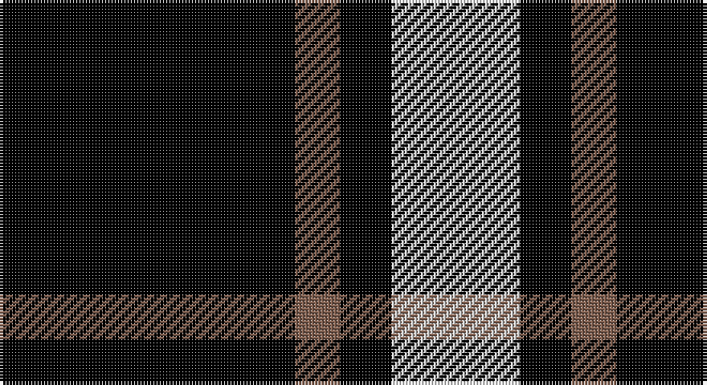

This page is one **sett** — a single exact thread-count. It belongs to the [tartan](/setts/k46o7k8w20/)
(the same proportion at any scale), whose colour order is pattern [KRKW](/stripes/krkw/).

Part of the [Lords of Skye](/tartans/lords-of-skye/) tartan — the named design grouping this sett with its other cloths.

Sourced from weddslist.  It is a [4 stripe tartan](/stripes/stripes4/).

Original link http://www.weddslist.com/cgi-bin/tartans/pg.pl?source=sts

## Also known as

This cloth is also recorded under:

- Lords, of Skye

## Thread count
K/92 LT14 K16 LN/40

One full sett is **192 threads**.

## Palette

Palette: <strong>Tartan Register</strong> <small style="color:#888">(2 of 3 colours)</small>
<table><thead><tr><th>Colour</th><th>Threads</th><th>Shade</th><th>Base</th><th>OKLCh</th></tr></thead><tbody><tr><td>K/</td><td style="text-align:right;font-variant-numeric:tabular-nums">92</td><td><code style="background-color:#000000;">#000000</code> <small style="color:#888">#000000</small></td><td>K <code style="background-color:#000000;">#000000</code></td><td><small style="color:#888">oklch(0.0% 0.000 0.0)</small></td></tr><tr><td>LT</td><td style="text-align:right;font-variant-numeric:tabular-nums">14</td><td><code style="background-color:#806050;">#806050</code> <small style="color:#888">#806050</small></td><td>R <code style="background-color:#CC0000;">#CC0000</code></td><td><small style="color:#888">oklch(51.7% 0.049 47.8)</small></td></tr><tr><td>K</td><td style="text-align:right;font-variant-numeric:tabular-nums">16</td><td><code style="background-color:#000000;">#000000</code> <small style="color:#888">#000000</small></td><td>K <code style="background-color:#000000;">#000000</code></td><td><small style="color:#888">oklch(0.0% 0.000 0.0)</small></td></tr><tr><td>LN/</td><td style="text-align:right;font-variant-numeric:tabular-nums">40</td><td><code style="background-color:#E0E0E0;">#E0E0E0</code> <small style="color:#888">#E0E0E0</small></td><td>W <code style="background-color:#F7F7F7;">#F7F7F7</code></td><td><small style="color:#888">oklch(90.7% 0.000 89.9)</small></td></tr></tbody></table>

# Sample pattern

## Compared to the master

This cloth is one sett of its design; the master sett (the exemplar the design is anchored on) is below for comparison.

<figure style="margin:0"><figcaption style="color:#888;font-size:smaller">this sett</figcaption></figure>
<figure style="margin:0"><figcaption style="color:#888;font-size:smaller"><a href="/setts/k46dy7k8w20/">master sett →</a></figcaption></figure>

## Nearest tartans

The nearest existing variants by ΔTartan distance, with this tartan at the top so the swatches line up against it.

ΔTartan

Tartan

Sett

—

<a href="/ttd/edit/#slug=k46o7k8w20~x2">Lords, of Skye</a> <a class="nn-out" href="/variants/s4/k46o7k8w20~x2/" title="open its dictionary page">↗</a>

1.08

<a href="/ttd/edit/#slug=k46dy7k8w20~x2&amp;base=k46o7k8w20~x2">Lords of Skye (Fashion?)</a> <a class="nn-out" href="/variants/s4/k46dy7k8w20~x2/" title="open its dictionary page">↗</a>

1.57

<a href="/ttd/edit/#slug=k37w9k3dg9w3~x2&amp;base=k46o7k8w20~x2">Glen Coe Trade Tartan</a> <a class="nn-out" href="/variants/s5/k37w9k3dg9w3~x2/" title="open its dictionary page">↗</a>

1.62

<a href="/ttd/edit/#slug=k17r6k2w6k17lo2~x2&amp;base=k46o7k8w20~x2">Black 1990 (Name)</a> <a class="nn-out" href="/variants/s6/k17r6k2w6k17lo2~x2/" title="open its dictionary page">↗</a>

1.63

<a href="/ttd/edit/#slug=r3lo2k10w1~x6&amp;base=k46o7k8w20~x2">St. Eloi (Corporate)</a> <a class="nn-out" href="/variants/s4/r3lo2k10w1~x6/" title="open its dictionary page">↗</a>

1.68

<a href="/ttd/edit/#slug=k21lb2k5lb9k13g2~x4&amp;base=k46o7k8w20~x2">New Zealand (2000)</a> <a class="nn-out" href="/variants/s6/k21lb2k5lb9k13g2~x4/" title="open its dictionary page">↗</a>

1.70

<a href="/ttd/edit/#slug=k21w2k5w9k13g2~x4&amp;base=k46o7k8w20~x2">New Zealand District Tartan</a> <a class="nn-out" href="/variants/s6/k21w2k5w9k13g2~x4/" title="open its dictionary page">↗</a>

1.71

<a href="/ttd/edit/#slug=k37w9k3g9w3~x2&amp;base=k46o7k8w20~x2">Glen Coe #1 (Fashion)</a> <a class="nn-out" href="/variants/s5/k37w9k3g9w3~x2/" title="open its dictionary page">↗</a>

1.74

<a href="/ttd/edit/#slug=lr3k3lr3k10r1~x6&amp;base=k46o7k8w20~x2">Burberry Blue</a> <a class="nn-out" href="/variants/s5/lr3k3lr3k10r1~x6/" title="open its dictionary page">↗</a>

1.76

<a href="/ttd/edit/#slug=k17r6k2lb6k17lo2~x2&amp;base=k46o7k8w20~x2">Black (symmetrical)</a> <a class="nn-out" href="/variants/s6/k17r6k2lb6k17lo2~x2/" title="open its dictionary page">↗</a>

1.77

<a href="/variants/s6/r3lo2k10w1~x6/">St. Eloi</a>

## Neighbour map

Every grey dot is one of 14360 variants placed by the first two principal components of the ΔTartan feature space (44% of its variance). Red is this tartan; blue dots are its nearest — click one to open its page.

<svg viewBox="0 0 640 380" role="img" style="max-width:100%;height:auto;border:1px solid #e0e0e0;border-radius:4px;display:block" xmlns="http://www.w3.org/2000/svg"><image href="/nn/cloud.v1.png" width="640" height="380"/><a href="/variants/s4/k46dy7k8w20~x2/"><circle cx="334.9" cy="250.9" r="4" fill="#3465a4"><title>Lords of Skye (Fashion?)</title></circle></a><a href="/variants/s5/k37w9k3dg9w3~x2/"><circle cx="372.6" cy="208.0" r="4" fill="#3465a4"><title>Glen Coe Trade Tartan</title></circle></a><a href="/variants/s6/k17r6k2w6k17lo2~x2/"><circle cx="371.2" cy="223.5" r="4" fill="#3465a4"><title>Black 1990 (Name)</title></circle></a><a href="/variants/s4/r3lo2k10w1~x6/"><circle cx="321.9" cy="219.5" r="4" fill="#3465a4"><title>St. Eloi (Corporate)</title></circle></a><a href="/variants/s6/k21lb2k5lb9k13g2~x4/"><circle cx="415.2" cy="235.1" r="4" fill="#3465a4"><title>New Zealand (2000)</title></circle></a><a href="/variants/s6/k21w2k5w9k13g2~x4/"><circle cx="414.8" cy="228.2" r="4" fill="#3465a4"><title>New Zealand District Tartan</title></circle></a><a href="/variants/s5/k37w9k3g9w3~x2/"><circle cx="363.1" cy="202.8" r="4" fill="#3465a4"><title>Glen Coe #1 (Fashion)</title></circle></a><a href="/variants/s5/lr3k3lr3k10r1~x6/"><circle cx="351.1" cy="237.5" r="4" fill="#3465a4"><title>Burberry Blue</title></circle></a><a href="/variants/s6/k17r6k2lb6k17lo2~x2/"><circle cx="380.7" cy="228.4" r="4" fill="#3465a4"><title>Black (symmetrical)</title></circle></a><a href="/variants/s6/r3lo2k10w1~x6/"><circle cx="376.0" cy="216.7" r="4" fill="#3465a4"><title>St. Eloi</title></circle></a><circle cx="336.8" cy="257.5" r="5" fill="#c00000"/></svg>

ID: /variants/s4/k46o7k8w20~x2/
