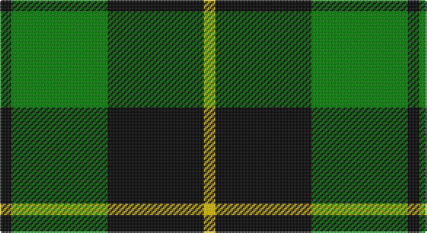

This page is one **sett** — a single exact thread-count. It belongs to the [tartan](/setts/k4g33k33ly4/)
(the same proportion at any scale), whose colour order is pattern [KGKY](/stripes/kgky/).

Part of the [Wallace Hunting](/tartans/wallace-hunting/) tartan — the named design grouping this sett with its other cloths.

Sourced from weddslist.  It is a [4 stripe tartan](/stripes/stripes4/).

Original link http://www.weddslist.com/cgi-bin/tartans/pg.pl?source=sts

## Provenance

Earliest known date: pre 2003 The design comes from the Vestiarium Scoticum (1842). The authors, the Sobieski Stuart brothers, enjoyed a popular following among the Scottish gentry in the early Victorian era, and in the spirit of the times, added mystery, romance and some spurious historical documentation to the subject of tartan. Of the better known tartans, the book offers some minor variation, but in other cases it provides the only recorded version of many tartans in use today.

## Also known as

This cloth is also recorded under:

- Wallace Htg
- Wallace, hunting

2 attestations — the source records this cloth was collapsed from (oldest owns this page)

<ul>
<li>undated — Wallace, hunting (weddslist, <a href="http://www.weddslist.com/cgi-bin/tartans/pg.pl?source=sts">record</a>)</li>
<li>undated — Wallace Hunting Clan Tartan (house-of-tartan, <a href="http://www.house-of-tartan.scotland.net/house/TartanViewjs.asp?colr=Def&tnam=1101">record</a>)</li>
</ul>

## Thread count
K/8 G66 K66 Y/8

One full sett is **280 threads**.

## Palette

Palette: <strong>Ingles Buchan</strong> <small style="color:#888">(1 of 3 colours)</small>
<table><thead><tr><th>Colour</th><th>Threads</th><th>Shade</th><th>Base</th><th>OKLCh</th></tr></thead><tbody><tr><td>K/</td><td style="text-align:right;font-variant-numeric:tabular-nums">8</td><td><code style="background-color:#000000;">#000000</code> <small style="color:#888">#000000</small></td><td>K <code style="background-color:#000000;">#000000</code></td><td><small style="color:#888">oklch(0.0% 0.000 0.0)</small></td></tr><tr><td>G</td><td style="text-align:right;font-variant-numeric:tabular-nums">66</td><td><code style="background-color:#008000;">#008000</code> <small style="color:#888">#008000</small></td><td>G <code style="background-color:#006100;">#006100</code></td><td><small style="color:#888">oklch(52.0% 0.177 142.5)</small></td></tr><tr><td>K</td><td style="text-align:right;font-variant-numeric:tabular-nums">66</td><td><code style="background-color:#000000;">#000000</code> <small style="color:#888">#000000</small></td><td>K <code style="background-color:#000000;">#000000</code></td><td><small style="color:#888">oklch(0.0% 0.000 0.0)</small></td></tr><tr><td>Y/</td><td style="text-align:right;font-variant-numeric:tabular-nums">8</td><td><code style="background-color:#F0C000;">#F0C000</code> <small style="color:#888">#F0C000</small></td><td>Y <code style="background-color:#F2BF00;">#F2BF00</code></td><td><small style="color:#888">oklch(82.7% 0.169 90.5)</small></td></tr></tbody></table>

# Sample pattern

## Compared to the master

This cloth is one sett of its design; the master sett (the exemplar the design is anchored on) is below for comparison.

<figure style="margin:0"><figcaption style="color:#888;font-size:smaller">this sett</figcaption></figure>
<figure style="margin:0"><figcaption style="color:#888;font-size:smaller"><a href="/setts/g8k8ly1k8g8k1/">master sett →</a></figcaption></figure>

## Nearest tartans

The nearest existing variants by ΔTartan distance, with this tartan at the top so the swatches line up against it.

ΔTartan

Tartan

Sett

—

<a href="/ttd/edit/#slug=k4g33k33ly4~x2">Wallace, hunting</a> <a class="nn-out" href="/variants/s4/k4g33k33ly4~x2/" title="open its dictionary page">↗</a>

0.49

<a href="/ttd/edit/#slug=k1g8k8ly1~x4&amp;base=k4g33k33ly4~x2">Wallace Htg (Clan)</a> <a class="nn-out" href="/variants/s4/k1g8k8ly1~x4/" title="open its dictionary page">↗</a>

0.69

<a href="/ttd/edit/#slug=k30db7g36k5~x2&amp;base=k4g33k33ly4~x2">Innes, hunting</a> <a class="nn-out" href="/variants/s4/k30db7g36k5~x2/" title="open its dictionary page">↗</a>

0.72

<a href="/ttd/edit/#slug=k32g6k12g30ly3&amp;base=k4g33k33ly4~x2">MacArthur</a> <a class="nn-out" href="/variants/s5/k32g6k12g30ly3/" title="open its dictionary page">↗</a>

0.86

<a href="/ttd/edit/#slug=k19g8k10g31r3&amp;base=k4g33k33ly4~x2">MacArthur-Fox</a> <a class="nn-out" href="/variants/s5/k19g8k10g31r3/" title="open its dictionary page">↗</a>

1.18

<a href="/ttd/edit/#slug=k7r3k24g28ly3~x2&amp;base=k4g33k33ly4~x2">Robert Gordon University</a> <a class="nn-out" href="/variants/s5/k7r3k24g28ly3~x2/" title="open its dictionary page">↗</a>

1.21

<a href="/ttd/edit/#slug=k7ly1g7t1~x2&amp;base=k4g33k33ly4~x2">Wilson's, No 140</a> <a class="nn-out" href="/variants/s4/k7ly1g7t1~x2/" title="open its dictionary page">↗</a>

1.22

<a href="/ttd/edit/#slug=k8b5g44k40r6&amp;base=k4g33k33ly4~x2">Douglas, Black</a> <a class="nn-out" href="/variants/s5/k8b5g44k40r6/" title="open its dictionary page">↗</a>

1.24

<a href="/ttd/edit/#slug=k32dg6k12dg30ly3&amp;base=k4g33k33ly4~x2">MacArthur</a> <a class="nn-out" href="/variants/s5/k32dg6k12dg30ly3/" title="open its dictionary page">↗</a>

1.31

<a href="/ttd/edit/#slug=k1dg8k8ly1&amp;base=k4g33k33ly4~x2">Wallace Hunting</a> <a class="nn-out" href="/variants/s4/k1dg8k8ly1/" title="open its dictionary page">↗</a>

1.32

<a href="/ttd/edit/#slug=k12db3g23k23r3~x2&amp;base=k4g33k33ly4~x2">Douglas, (Black)</a> <a class="nn-out" href="/variants/s5/k12db3g23k23r3~x2/" title="open its dictionary page">↗</a>

## Neighbour map

Every grey dot is one of 14360 variants placed by the first two principal components of the ΔTartan feature space (44% of its variance). Red is this tartan; blue dots are its nearest — click one to open its page.

<svg viewBox="0 0 640 380" role="img" style="max-width:100%;height:auto;border:1px solid #e0e0e0;border-radius:4px;display:block" xmlns="http://www.w3.org/2000/svg"><image href="/nn/cloud.v1.png" width="640" height="380"/><a href="/variants/s4/k1g8k8ly1~x4/"><circle cx="280.4" cy="263.1" r="4" fill="#3465a4"><title>Wallace Htg (Clan)</title></circle></a><a href="/variants/s4/k30db7g36k5~x2/"><circle cx="243.2" cy="272.4" r="4" fill="#3465a4"><title>Innes, hunting</title></circle></a><a href="/variants/s5/k32g6k12g30ly3/"><circle cx="292.2" cy="246.1" r="4" fill="#3465a4"><title>MacArthur</title></circle></a><a href="/variants/s5/k19g8k10g31r3/"><circle cx="294.1" cy="249.5" r="4" fill="#3465a4"><title>MacArthur-Fox</title></circle></a><a href="/variants/s5/k7r3k24g28ly3~x2/"><circle cx="232.8" cy="215.8" r="4" fill="#3465a4"><title>Robert Gordon University</title></circle></a><a href="/variants/s4/k7ly1g7t1~x2/"><circle cx="201.7" cy="245.8" r="4" fill="#3465a4"><title>Wilson's, No 140</title></circle></a><a href="/variants/s5/k8b5g44k40r6/"><circle cx="237.4" cy="223.9" r="4" fill="#3465a4"><title>Douglas, Black</title></circle></a><a href="/variants/s5/k32dg6k12dg30ly3/"><circle cx="310.7" cy="255.5" r="4" fill="#3465a4"><title>MacArthur</title></circle></a><a href="/variants/s4/k1dg8k8ly1/"><circle cx="302.5" cy="273.9" r="4" fill="#3465a4"><title>Wallace Hunting</title></circle></a><a href="/variants/s5/k12db3g23k23r3~x2/"><circle cx="258.6" cy="245.8" r="4" fill="#3465a4"><title>Douglas, (Black)</title></circle></a><circle cx="273.0" cy="256.9" r="5" fill="#c00000"/></svg>

ID: /variants/s4/k4g33k33ly4~x2/
