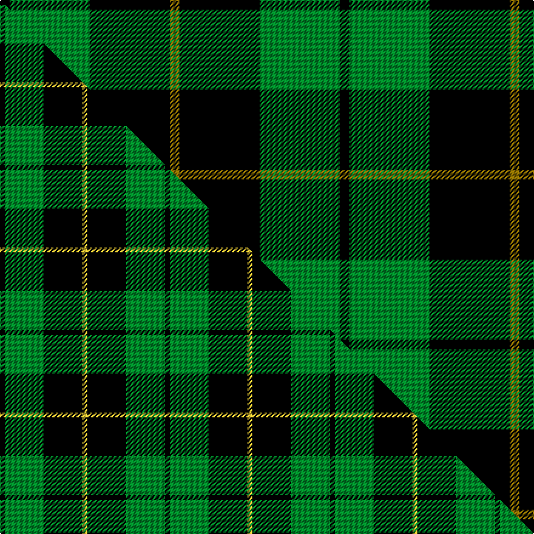

This is one **variant** — a specific cloth: this exact thread count and colourway, with its own
provenance below. It is one weaving of the [sett](/tartans/w/wa/wallace-hunting-2/) (the scale-free proportion — the
same cloth at any scale or shade), whose colour order is pattern [GKGK](/stripes/gkgk/).

Part of the [Wallace Hunting](/tartans/w/wa/wallace-hunting-2/) tartan — the named design grouping this sett with its other cloths.

Sourced from house-of-tartan.  It is a [4 stripe tartan](/stripes/stripes4/).

Original link [http://www.house-of-tartan.scotland.net/house/TartanViewjs.asp?colr=Def&tnam=1101](http://www.house-of-tartan.scotland.net/house/TartanViewjs.asp?colr=Def&tnam=1101)

## Provenance

Earliest known date: pre 2003 The design comes from the Vestiarium Scoticum (1842). The authors, the Sobieski Stuart brothers, enjoyed a popular following among the Scottish gentry in the early Victorian era, and in the spirit of the times, added mystery, romance and some spurious historical documentation to the subject of tartan. Of the better known tartans, the book offers some minor variation, but in other cases it provides the only recorded version of many tartans in use today.

2 attestations — the source records this cloth was collapsed from (oldest owns this page)

<ul>
<li>pre 2003 — Wallace Hunting Clan Tartan (house-of-tartan, <a href="http://www.house-of-tartan.scotland.net/house/TartanViewjs.asp?colr=Def&tnam=1101">record</a>) </li>
<li>undated — Wallace, hunting (weddslist, <a href="http://www.weddslist.com/cgi-bin/tartans/pg.pl?source=sts">record</a>) </li>
</ul>

Dataset <small>— provenance for this record, inherited from the source manifest</small>

<dl class="dataset-prov">
<dt>source</dt><dd><a href="/sources/house-of-tartan/">House of Tartan</a></dd>
<dt>data captured from</dt><dd><a href="https://github.com/thetartan/tartan-database/blob/master/data/house-of-tartan/data.csv">https://github.com/thetartan/tartan-database/blob/master/data/house-of-tartan/data.csv</a></dd>
<dt>data date</dt><dd>pre 2003 <small>(this record)</small></dd>
<dt>licence</dt><dd><a href="https://creativecommons.org/licenses/by-nc-nd/4.0/">CC BY-NC-ND 4.0</a></dd>
</dl>

Capture chain <small>— the hands this data passed through, oldest first; each capture carries its own licence</small>

<ol class="capture-chain">
<li><a href="http://www.house-of-tartan.scotland.net/">House of Tartan</a> <small>the weaver/retailer's database — the site is now offline; the URL is kept as the ultimate source's identity</small></li>
<li><a href="https://github.com/thetartan/tartan-database">thetartan/tartan-database</a> <small>2016-2017</small> · <a href="https://creativecommons.org/licenses/by-nc-nd/4.0/">CC BY-NC-ND 4.0</a> <small>Levko Kravets's frozen compilation — the capture we vendored, and where its CC licence text came from</small></li>
<li>this dictionary <small>captured 2026-06-10 · commit 5bf86c7566</small> <small>each re-capture is a git commit to data/sources</small></li>
</ol>

## Thread count
K/8 G66 K66 Y/8

One full sett is **280 threads**.

## Palette
<table><thead><tr><th>Colour</th><th>Shade</th><th>OKLCh</th></tr></thead><tbody><tr><td>G</td><td><code style="background-color:#008B2A;">#008B2A</code> <small style="color:#888">#008B2A</small></td><td><small style="color:#888">oklch(55.4% 0.170 145.9)</small></td></tr><tr><td>K</td><td><code style="background-color:#000000;">#000000</code> <small style="color:#888">#000000</small></td><td><small style="color:#888">oklch(0.0% 0.000 0.0)</small></td></tr><tr><td>Y</td><td><code style="background-color:#8B6E00;">#8B6E00</code> <small style="color:#888">#8B6E00</small></td><td><small style="color:#888">oklch(55.1% 0.113 90.4)</small></td></tr></tbody></table>

# Sample pattern

## Compared to the master

This cloth is one sett of its design; the master sett (the exemplar the design is anchored on) is below for comparison.

Its **ΔTartan distance** from the master is **0.07** — the same measure the nearest-tartans table ranks by (0 is identical; a re-scale of the same cloth is near 0, a recolour or a different proportion further).

<figure class="master-compare" style="margin:0">

this sett
master sett ★

<figcaption style="color:#888;font-size:smaller">One weave of this sett against the <a href="/setts/k1g8k8ly1/">master sett ★</a>, split on the diagonal: a shared proportion runs seamlessly across it with only the shades shifting; a different proportion breaks on it.</figcaption>
</figure>

## Nearest tartan variants

The nearest existing variants by ΔTartan distance, with this cloth at the top so the swatches line up against it.

ΔTartan

Threads

Variant

Sett

—

280

<a href="/variants/s4/k4g33k33y4~x2/">Wallace Hunting Clan Tartan</a>

<a href="/ttd/edit/#slug=k1g8k8y1&amp;base=k4g33k33y4~x2" title="compare in the TTD">0.04</a>

34

<a href="/variants/s4/k1g8k8y1/">Wallace Hunting</a>

<a href="/ttd/edit/#slug=k1g8k8ly1~x4&amp;base=k4g33k33y4~x2" title="compare in the TTD">0.07</a>

136

<a href="/variants/s4/k1g8k8ly1~x4/">Wallace Htg (Clan)</a>

<a href="/ttd/edit/#slug=k3g15k20y3~x2&amp;base=k4g33k33y4~x2" title="compare in the TTD">0.47</a>

152

<a href="/variants/s4/k3g15k20y3~x2/">Scotch Tape 2 (Corporate)</a>

<a href="/ttd/edit/#slug=k8t5g44k40r6&amp;base=k4g33k33y4~x2" title="compare in the TTD">0.72</a>

192

<a href="/variants/s5/k8t5g44k40r6/">Douglas, Black</a>

<a href="/ttd/edit/#slug=k8y1k8g13r2~x4&amp;base=k4g33k33y4~x2" title="compare in the TTD">0.77</a>

216

<a href="/variants/s5/k8y1k8g13r2~x4/">Tolmie</a>

<a href="/ttd/edit/#slug=k6db4g44k41w4~x2&amp;base=k4g33k33y4~x2" title="compare in the TTD">0.91</a>

376

<a href="/variants/s5/k6db4g44k41w4~x2/">Douglas (alternative threadcount)</a>

<a href="/ttd/edit/#slug=k6g4dg44k41w4~x2~g2408144-dg1806142&amp;base=k4g33k33y4~x2" title="compare in the TTD">0.92</a>

376

<a href="/variants/s5/k6g4dg44k41w4~x2~g2408144-dg1806142/">Raeside</a>

<a href="/ttd/edit/#slug=k6db4dg44k41w4~x2&amp;base=k4g33k33y4~x2" title="compare in the TTD">0.93</a>

376

<a href="/variants/s5/k6db4dg44k41w4~x2/">Douglas (Clan)</a>

<a href="/ttd/edit/#slug=k12db3g23k23r3~x2&amp;base=k4g33k33y4~x2" title="compare in the TTD">1.02</a>

226

<a href="/variants/s5/k12db3g23k23r3~x2/">Douglas, (Black)</a>

<a href="/ttd/edit/#slug=k6lb1g7k1~x2&amp;base=k4g33k33y4~x2" title="compare in the TTD">1.22</a>

46

<a href="/variants/s4/k6lb1g7k1~x2/">Innes (Miniature)</a>

## Neighbour map

Every grey dot is one of 13656 variants placed by the first two principal components of the ΔTartan feature space (42% of its variance). Red is this tartan; blue dots are its nearest — click one to open its page. The map is a flat projection of a many-dimensional space — [how to read it](/posts/neighbourhood-maps/).

<svg viewBox="0 0 640 380" role="img" style="max-width:100%;height:auto;border:1px solid #e0e0e0;border-radius:4px;display:block" xmlns="http://www.w3.org/2000/svg"><image href="/nn/cloud.v1.png" width="640" height="380"/><a href="/variants/s4/k1g8k8y1/"><circle cx="254.2" cy="233.7" r="4" fill="#3465a4"><title>Wallace Hunting</title></circle></a><a href="/variants/s4/k1g8k8ly1~x4/"><circle cx="249.7" cy="232.5" r="4" fill="#3465a4"><title>Wallace Htg (Clan)</title></circle></a><a href="/variants/s4/k3g15k20y3~x2/"><circle cx="265.6" cy="242.3" r="4" fill="#3465a4"><title>Scotch Tape 2 (Corporate)</title></circle></a><a href="/variants/s5/k8t5g44k40r6/"><circle cx="210.8" cy="199.1" r="4" fill="#3465a4"><title>Douglas, Black</title></circle></a><a href="/variants/s5/k8y1k8g13r2~x4/"><circle cx="227.5" cy="198.7" r="4" fill="#3465a4"><title>Tolmie</title></circle></a><a href="/variants/s5/k6db4g44k41w4~x2/"><circle cx="233.0" cy="186.9" r="4" fill="#3465a4"><title>Douglas (alternative threadcount)</title></circle></a><a href="/variants/s5/k6g4dg44k41w4~x2~g2408144-dg1806142/"><circle cx="241.5" cy="188.3" r="4" fill="#3465a4"><title>Raeside</title></circle></a><a href="/variants/s5/k6db4dg44k41w4~x2/"><circle cx="272.3" cy="194.9" r="4" fill="#3465a4"><title>Douglas (Clan)</title></circle></a><a href="/variants/s5/k12db3g23k23r3~x2/"><circle cx="231.9" cy="215.2" r="4" fill="#3465a4"><title>Douglas, (Black)</title></circle></a><a href="/variants/s4/k6lb1g7k1~x2/"><circle cx="223.1" cy="238.5" r="4" fill="#3465a4"><title>Innes (Miniature)</title></circle></a><circle cx="255.9" cy="232.0" r="5" fill="#c00000"/><text x="320" y="376" text-anchor="middle" font-size="11" fill="#999">ground</text><text x="11" y="190" text-anchor="middle" font-size="11" fill="#999" transform="rotate(-90 11 190)">complexity</text></svg>

ID: /variants/s4/k4g33k33y4~x2/
