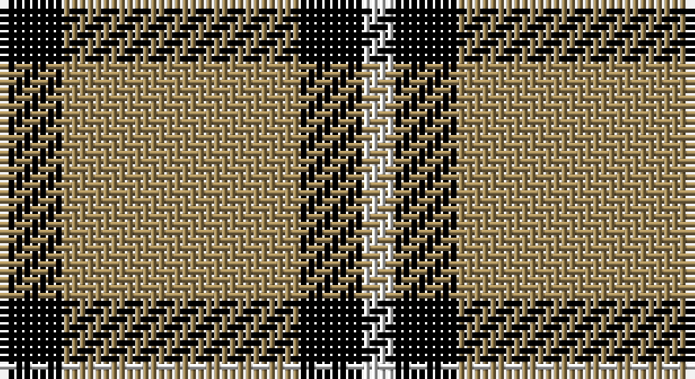

This page is one **sett** — a single exact thread-count. It belongs to the [tartan](/setts/k4lo15k4w2/)
(the same proportion at any scale), whose colour order is pattern [KYKW](/stripes/kykw/).

Part of the [Takla Makan](/tartans/takla-makan/) tartan — the named design grouping this sett with its other cloths.

Sourced from tartans-authority.  It is a [4 stripe tartan](/stripes/stripes4/).

Original link http://www.tartansauthority.com/tartan-ferret/display/5775/

## Also known as

This cloth is also recorded under:

- Takla Makan #2

## Register references

External register numbers recorded for this tartan.

- Scottish Tartans Authority (ITI): 5775

## Thread count
K/8 LT30 K8 LN/4

One full sett is **88 threads**.

## Palette

Palette: <strong>Tartan Register</strong>
<table><thead><tr><th>Colour</th><th>Threads</th><th>Shade</th><th>Base</th><th>OKLCh</th></tr></thead><tbody><tr><td>K/</td><td style="text-align:right;font-variant-numeric:tabular-nums">8</td><td><code style="background-color:#000000;">#000000</code> <small style="color:#888">#000000</small></td><td>K <code style="background-color:#000000;">#000000</code></td><td><small style="color:#888">oklch(0.0% 0.000 0.0)</small></td></tr><tr><td>LT</td><td style="text-align:right;font-variant-numeric:tabular-nums">30</td><td><code style="background-color:#A08858;">#A08858</code> <small style="color:#888">#A08858</small></td><td>Y <code style="background-color:#F2BF00;">#F2BF00</code></td><td><small style="color:#888">oklch(63.7% 0.071 84.0)</small></td></tr><tr><td>K</td><td style="text-align:right;font-variant-numeric:tabular-nums">8</td><td><code style="background-color:#000000;">#000000</code> <small style="color:#888">#000000</small></td><td>K <code style="background-color:#000000;">#000000</code></td><td><small style="color:#888">oklch(0.0% 0.000 0.0)</small></td></tr><tr><td>LN/</td><td style="text-align:right;font-variant-numeric:tabular-nums">4</td><td><code style="background-color:#E0E0E0;">#E0E0E0</code> <small style="color:#888">#E0E0E0</small></td><td>W <code style="background-color:#F7F7F7;">#F7F7F7</code></td><td><small style="color:#888">oklch(90.7% 0.000 89.9)</small></td></tr></tbody></table>

# Sample pattern

## Compared to the master

This cloth is one sett of its design; the master sett (the exemplar the design is anchored on) is below for comparison.

<figure style="margin:0"><figcaption style="color:#888;font-size:smaller">this sett</figcaption></figure>
<figure style="margin:0"><figcaption style="color:#888;font-size:smaller"><a href="/setts/db1r1w2r12db1r2db1r12w1db1r1db1lb1db1r1db1w1r6k2r7dr4r7k2r6w1db1r1db1lb1db1r1db1w1r12db1r2db1r12w2r1/">master sett →</a></figcaption></figure>

## Nearest tartans

The nearest existing variants by ΔTartan distance, with this tartan at the top so the swatches line up against it.

ΔTartan

Tartan

Sett

—

<a href="/ttd/edit/#slug=k4lo15k4w2~x2">Takla Makan #2 (Artefact)</a> <a class="nn-out" href="/variants/s4/k4lo15k4w2~x2/" title="open its dictionary page">↗</a>

0.85

<a href="/variants/s4/dg20w5r3~x2/">Juchter (Personal)</a>

1.15

<a href="/ttd/edit/#slug=k46dy7k8w20~x2&amp;base=k4lo15k4w2~x2">Lords of Skye (Fashion?)</a> <a class="nn-out" href="/variants/s4/k46dy7k8w20~x2/" title="open its dictionary page">↗</a>

1.18

<a href="/ttd/edit/#slug=k5w25r6k45w4~x2&amp;base=k4lo15k4w2~x2">Shembe Zulu Church</a> <a class="nn-out" href="/variants/s5/k5w25r6k45w4~x2/" title="open its dictionary page">↗</a>

1.21

<a href="/ttd/edit/#slug=k8ly1k8ly12r1~x4&amp;base=k4lo15k4w2~x2">MacLeod of Lewis (Vestiarium Scoticum)</a> <a class="nn-out" href="/variants/s5/k8ly1k8ly12r1~x4/" title="open its dictionary page">↗</a>

1.40

<a href="/ttd/edit/#slug=lr1ly6k6ly1~x2&amp;base=k4lo15k4w2~x2">Barclay Dress</a> <a class="nn-out" href="/variants/s4/lr1ly6k6ly1~x2/" title="open its dictionary page">↗</a>

1.40

<a href="/ttd/edit/#slug=lr1ly6k6ly1&amp;base=k4lo15k4w2~x2">Barclay Dress</a> <a class="nn-out" href="/variants/s4/lr1ly6k6ly1/" title="open its dictionary page">↗</a>

1.40

<a href="/ttd/edit/#slug=dy38w9dy3k9w3~x2&amp;base=k4lo15k4w2~x2">Loch Tummel</a> <a class="nn-out" href="/variants/s5/dy38w9dy3k9w3~x2/" title="open its dictionary page">↗</a>

1.47

<a href="/ttd/edit/#slug=k2w1k8w8k1~x8&amp;base=k4lo15k4w2~x2">Cairn (Marton Mills)</a> <a class="nn-out" href="/variants/s5/k2w1k8w8k1~x8/" title="open its dictionary page">↗</a>

1.51

<a href="/ttd/edit/#slug=k10ly2k10w2k2ly13w3~x2&amp;base=k4lo15k4w2~x2">Nooten-Boom (Personal)</a> <a class="nn-out" href="/variants/s7/k10ly2k10w2k2ly13w3~x2/" title="open its dictionary page">↗</a>

1.51

<a href="/ttd/edit/#slug=k4ly1k4ly6r1~x4&amp;base=k4lo15k4w2~x2">MacLeod Dress Clan Tartan</a> <a class="nn-out" href="/variants/s5/k4ly1k4ly6r1~x4/" title="open its dictionary page">↗</a>

## Neighbour map

Every grey dot is one of 14360 variants placed by the first two principal components of the ΔTartan feature space (44% of its variance). Red is this tartan; blue dots are its nearest — click one to open its page.

<svg viewBox="0 0 640 380" role="img" style="max-width:100%;height:auto;border:1px solid #e0e0e0;border-radius:4px;display:block" xmlns="http://www.w3.org/2000/svg"><image href="/nn/cloud.v1.png" width="640" height="380"/><a href="/variants/s4/dg20w5r3~x2/"><circle cx="305.6" cy="243.6" r="4" fill="#3465a4"><title>Juchter (Personal)</title></circle></a><a href="/variants/s4/k46dy7k8w20~x2/"><circle cx="334.9" cy="250.9" r="4" fill="#3465a4"><title>Lords of Skye (Fashion?)</title></circle></a><a href="/variants/s5/k5w25r6k45w4~x2/"><circle cx="315.9" cy="199.2" r="4" fill="#3465a4"><title>Shembe Zulu Church</title></circle></a><a href="/variants/s5/k8ly1k8ly12r1~x4/"><circle cx="296.0" cy="220.8" r="4" fill="#3465a4"><title>MacLeod of Lewis (Vestiarium Scoticum)</title></circle></a><a href="/variants/s4/lr1ly6k6ly1~x2/"><circle cx="240.9" cy="256.5" r="4" fill="#3465a4"><title>Barclay Dress</title></circle></a><a href="/variants/s4/lr1ly6k6ly1/"><circle cx="240.9" cy="256.5" r="4" fill="#3465a4"><title>Barclay Dress</title></circle></a><a href="/variants/s5/dy38w9dy3k9w3~x2/"><circle cx="381.5" cy="193.6" r="4" fill="#3465a4"><title>Loch Tummel</title></circle></a><a href="/variants/s5/k2w1k8w8k1~x8/"><circle cx="311.7" cy="238.5" r="4" fill="#3465a4"><title>Cairn (Marton Mills)</title></circle></a><a href="/variants/s7/k10ly2k10w2k2ly13w3~x2/"><circle cx="234.8" cy="220.3" r="4" fill="#3465a4"><title>Nooten-Boom (Personal)</title></circle></a><a href="/variants/s5/k4ly1k4ly6r1~x4/"><circle cx="233.8" cy="251.7" r="4" fill="#3465a4"><title>MacLeod Dress Clan Tartan</title></circle></a><circle cx="307.3" cy="236.7" r="5" fill="#c00000"/></svg>

ID: /variants/s4/k4lo15k4w2~x2/
