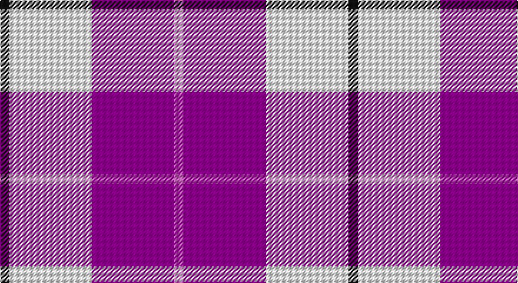

This page is one **sett** — a single exact thread-count. It belongs to the [tartan](/setts/k4w35dp35m4/)
(the same proportion at any scale), whose colour order is pattern [KWBR](/stripes/kwbr/).

Part of the [MacRae](/tartans/macrae-2/) tartan — the named design grouping this sett with its other cloths.

Sourced from tartans-authority.  It is a [4 stripe tartan](/stripes/stripes4/).

Original link http://www.tartansauthority.com/tartan-ferret/display/6564/

## Also known as

This cloth is also recorded under:

- MacRae Red
- MacRae of Conchra

## Register references

External register numbers recorded for this tartan.

- Scottish Tartans Authority (ITI): 6564

## Thread count
K/8 W70 P70 Pa/8

One full sett is **296 threads**.

## Palette

Palette: <strong>Tartan Register</strong> <small style="color:#888">(3 of 4 colours)</small>
<table><thead><tr><th>Colour</th><th>Threads</th><th>Shade</th><th>Base</th><th>OKLCh</th></tr></thead><tbody><tr><td>K/</td><td style="text-align:right;font-variant-numeric:tabular-nums">8</td><td><code style="background-color:#101010;">#101010</code> <small style="color:#888">#101010</small></td><td>K <code style="background-color:#000000;">#000000</code></td><td><small style="color:#888">oklch(17.3% 0.000 89.9)</small></td></tr><tr><td>W</td><td style="text-align:right;font-variant-numeric:tabular-nums">70</td><td><code style="background-color:#F8F8F8;">#F8F8F8</code> <small style="color:#888">#F8F8F8</small></td><td>W <code style="background-color:#F7F7F7;">#F7F7F7</code></td><td><small style="color:#888">oklch(97.9% 0.000 89.9)</small></td></tr><tr><td>P</td><td style="text-align:right;font-variant-numeric:tabular-nums">70</td><td><code style="background-color:#780078;">#780078</code> <small style="color:#888">#780078</small></td><td>B <code style="background-color:#2A418A;">#2A418A</code></td><td><small style="color:#888">oklch(40.2% 0.185 328.4)</small></td></tr><tr><td>Pa/</td><td style="text-align:right;font-variant-numeric:tabular-nums">8</td><td><code style="background-color:#B468AC;">#B468AC</code> <small style="color:#888">#B468AC</small></td><td>R <code style="background-color:#CC0000;">#CC0000</code></td><td><small style="color:#888">oklch(62.5% 0.131 330.9)</small></td></tr></tbody></table>

# Sample pattern

## Compared to the master

This cloth is one sett of its design; the master sett (the exemplar the design is anchored on) is below for comparison.

<figure style="margin:0"><figcaption style="color:#888;font-size:smaller">this sett</figcaption></figure>
<figure style="margin:0"><figcaption style="color:#888;font-size:smaller"><a href="/setts/dg20r3dg20r20db3r3db6r3db3r20db3r3db6r3db3r20w3r4db20r4/">master sett →</a></figcaption></figure>

## Nearest tartans

The nearest existing variants by ΔTartan distance, with this tartan at the top so the swatches line up against it.

ΔTartan

Tartan

Sett

—

<a href="/ttd/edit/#slug=k4w35dp35m4~x2">MacRae - 2000 (Dress, Purple)</a> <a class="nn-out" href="/variants/s4/k4w35dp35m4~x2/" title="open its dictionary page">↗</a>

1.21

<a href="/ttd/edit/#slug=k1w8db8r1~x8&amp;base=k4w35dp35m4~x2">MacRae Dress Purple</a> <a class="nn-out" href="/variants/s4/k1w8db8r1~x8/" title="open its dictionary page">↗</a>

1.29

<a href="/ttd/edit/#slug=w5k3w31p26w4p10t4~x2&amp;base=k4w35dp35m4~x2">MacPherson, dress (purple)</a> <a class="nn-out" href="/variants/s7/w5k3w31p26w4p10t4~x2/" title="open its dictionary page">↗</a>

1.31

<a href="/ttd/edit/#slug=w5k3w31dp26w4dp10t4~x2&amp;base=k4w35dp35m4~x2">MacPherson Dress Purple</a> <a class="nn-out" href="/variants/s7/w5k3w31dp26w4dp10t4~x2/" title="open its dictionary page">↗</a>

1.39

<a href="/ttd/edit/#slug=dp8db2dp24db5w26k2w8~x2&amp;base=k4w35dp35m4~x2">Lennox Purple Dress District Tartan</a> <a class="nn-out" href="/variants/s7/dp8db2dp24db5w26k2w8~x2/" title="open its dictionary page">↗</a>

1.43

<a href="/ttd/edit/#slug=r21db61ly8w21~x2&amp;base=k4w35dp35m4~x2">Kellogg College University of Oxford</a> <a class="nn-out" href="/variants/s4/r21db61ly8w21~x2/" title="open its dictionary page">↗</a>

1.71

<a href="/ttd/edit/#slug=w8k6w54db16m6db8m49w6&amp;base=k4w35dp35m4~x2">Meridia Dance</a> <a class="nn-out" href="/variants/s8/w8k6w54db16m6db8m49w6/" title="open its dictionary page">↗</a>

1.73

<a href="/ttd/edit/#slug=r7w36db36ly7~x2&amp;base=k4w35dp35m4~x2">MacRae of Conchra #3</a> <a class="nn-out" href="/variants/s4/r7w36db36ly7~x2/" title="open its dictionary page">↗</a>

1.74

<a href="/ttd/edit/#slug=b8w13r3w2k5~x2&amp;base=k4w35dp35m4~x2">Boswell Dress (Personal)</a> <a class="nn-out" href="/variants/s5/b8w13r3w2k5~x2/" title="open its dictionary page">↗</a>

1.78

<a href="/ttd/edit/#slug=r1w8dt8ly1~x4&amp;base=k4w35dp35m4~x2">MacRae of Conchra</a> <a class="nn-out" href="/variants/s4/r1w8dt8ly1~x4/" title="open its dictionary page">↗</a>

1.80

<a href="/ttd/edit/#slug=w8k4w54db18m6db8m49w6&amp;base=k4w35dp35m4~x2">Merida Dance</a> <a class="nn-out" href="/variants/s8/w8k4w54db18m6db8m49w6/" title="open its dictionary page">↗</a>

## Neighbour map

Every grey dot is one of 14360 variants placed by the first two principal components of the ΔTartan feature space (44% of its variance). Red is this tartan; blue dots are its nearest — click one to open its page.

<svg viewBox="0 0 640 380" role="img" style="max-width:100%;height:auto;border:1px solid #e0e0e0;border-radius:4px;display:block" xmlns="http://www.w3.org/2000/svg"><image href="/nn/cloud.v1.png" width="640" height="380"/><a href="/variants/s4/k1w8db8r1~x8/"><circle cx="212.0" cy="213.0" r="4" fill="#3465a4"><title>MacRae Dress Purple</title></circle></a><a href="/variants/s7/w5k3w31p26w4p10t4~x2/"><circle cx="249.2" cy="164.0" r="4" fill="#3465a4"><title>MacPherson, dress (purple)</title></circle></a><a href="/variants/s7/w5k3w31dp26w4dp10t4~x2/"><circle cx="250.4" cy="165.1" r="4" fill="#3465a4"><title>MacPherson Dress Purple</title></circle></a><a href="/variants/s7/dp8db2dp24db5w26k2w8~x2/"><circle cx="236.7" cy="160.9" r="4" fill="#3465a4"><title>Lennox Purple Dress District Tartan</title></circle></a><a href="/variants/s4/r21db61ly8w21~x2/"><circle cx="241.4" cy="223.6" r="4" fill="#3465a4"><title>Kellogg College University of Oxford</title></circle></a><a href="/variants/s8/w8k6w54db16m6db8m49w6/"><circle cx="204.6" cy="150.4" r="4" fill="#3465a4"><title>Meridia Dance</title></circle></a><a href="/variants/s4/r7w36db36ly7~x2/"><circle cx="160.8" cy="234.0" r="4" fill="#3465a4"><title>MacRae of Conchra #3</title></circle></a><a href="/variants/s5/b8w13r3w2k5~x2/"><circle cx="164.3" cy="214.5" r="4" fill="#3465a4"><title>Boswell Dress (Personal)</title></circle></a><a href="/variants/s4/r1w8dt8ly1~x4/"><circle cx="207.3" cy="213.6" r="4" fill="#3465a4"><title>MacRae of Conchra</title></circle></a><a href="/variants/s8/w8k4w54db18m6db8m49w6/"><circle cx="217.3" cy="131.7" r="4" fill="#3465a4"><title>Merida Dance</title></circle></a><circle cx="223.4" cy="198.2" r="5" fill="#c00000"/></svg>

ID: /variants/s4/k4w35dp35m4~x2/
