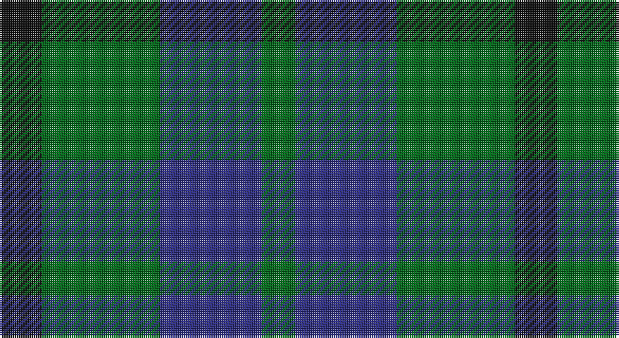

This page is one **sett** — a single exact thread-count. It belongs to the [tartan](/setts/k5g14db12g4/)
(the same proportion at any scale), whose colour order is pattern [GBGK](/stripes/gbgk/).

Sourced from tartans-authority.  It is a [4 stripe tartan](/stripes/stripes4/).

Original link http://www.tartansauthority.com/tartan-ferret/display/8861/

## Register references

External register numbers recorded for this tartan.

- Scottish Tartans Authority (ITI): 8861

## Thread count
K/20 G56 DB48 G/16

One full sett is **244 threads**.

## Palette

Palette: <strong>Tartan Register</strong>
<table><thead><tr><th>Colour</th><th>Threads</th><th>Shade</th><th>Base</th><th>OKLCh</th></tr></thead><tbody><tr><td>K/</td><td style="text-align:right;font-variant-numeric:tabular-nums">20</td><td><code style="background-color:#101010;">#101010</code> <small style="color:#888">#101010</small></td><td>K <code style="background-color:#000000;">#000000</code></td><td><small style="color:#888">oklch(17.3% 0.000 89.9)</small></td></tr><tr><td>G</td><td style="text-align:right;font-variant-numeric:tabular-nums">56</td><td><code style="background-color:#006818;">#006818</code> <small style="color:#888">#006818</small></td><td>G <code style="background-color:#006100;">#006100</code></td><td><small style="color:#888">oklch(45.0% 0.142 145.0)</small></td></tr><tr><td>DB</td><td style="text-align:right;font-variant-numeric:tabular-nums">48</td><td><code style="background-color:#2C2C80;">#2C2C80</code> <small style="color:#888">#2C2C80</small></td><td>B <code style="background-color:#2A418A;">#2A418A</code></td><td><small style="color:#888">oklch(35.0% 0.138 276.6)</small></td></tr><tr><td>G/</td><td style="text-align:right;font-variant-numeric:tabular-nums">16</td><td><code style="background-color:#006818;">#006818</code> <small style="color:#888">#006818</small></td><td>G <code style="background-color:#006100;">#006100</code></td><td><small style="color:#888">oklch(45.0% 0.142 145.0)</small></td></tr></tbody></table>

# Sample pattern

## Nearest tartans

The nearest existing variants by ΔTartan distance, with this tartan at the top so the swatches line up against it.

ΔTartan

Tartan

Sett

—

<a href="/ttd/edit/#slug=k5g14db12g4~x4">MacCurdie (Clan?)</a> <a class="nn-out" href="/variants/s4/k5g14db12g4~x4/" title="open its dictionary page">↗</a>

1.17

<a href="/ttd/edit/#slug=db53g42r14&amp;base=k5g14db12g4~x4">Agnew</a> <a class="nn-out" href="/variants/s3/db53g42r14/" title="open its dictionary page">↗</a>

1.27

<a href="/ttd/edit/#slug=db53g42r14~x2&amp;base=k5g14db12g4~x4">Agnew</a> <a class="nn-out" href="/variants/s3/db53g42r14~x2/" title="open its dictionary page">↗</a>

1.31

<a href="/ttd/edit/#slug=t2g4k5g4t1~x2&amp;base=k5g14db12g4~x4">Glen Lyon #2</a> <a class="nn-out" href="/variants/s5/t2g4k5g4t1~x2/" title="open its dictionary page">↗</a>

1.32

<a href="/ttd/edit/#slug=db6g5r1~x4&amp;base=k5g14db12g4~x4">Ferguson</a> <a class="nn-out" href="/variants/s3/db6g5r1~x4/" title="open its dictionary page">↗</a>

1.35

<a href="/ttd/edit/#slug=db4k4db4g9k2~x2&amp;base=k5g14db12g4~x4">Austin Clan</a> <a class="nn-out" href="/variants/s5/db4k4db4g9k2~x2/" title="open its dictionary page">↗</a>

1.42

<a href="/ttd/edit/#slug=db5g6r1~x4&amp;base=k5g14db12g4~x4">Wilson's No 84, Ferguson</a> <a class="nn-out" href="/variants/s3/db5g6r1~x4/" title="open its dictionary page">↗</a>

1.48

<a href="/ttd/edit/#slug=db13r2g13~x2&amp;base=k5g14db12g4~x4">Wilson's No 62, (Ferguson)</a> <a class="nn-out" href="/variants/s3/db13r2g13~x2/" title="open its dictionary page">↗</a>

1.51

<a href="/ttd/edit/#slug=g6dp5t1~x4&amp;base=k5g14db12g4~x4">Wilson's No.055</a> <a class="nn-out" href="/variants/s3/g6dp5t1~x4/" title="open its dictionary page">↗</a>

1.54

<a href="/ttd/edit/#slug=k15dt40k9o10~x2&amp;base=k5g14db12g4~x4">Omega Delta Sigma, National Veterans Fraternity</a> <a class="nn-out" href="/variants/s4/k15dt40k9o10~x2/" title="open its dictionary page">↗</a>

1.55

<a href="/ttd/edit/#slug=k5g6t1~x4&amp;base=k5g14db12g4~x4">Wilson's No.050</a> <a class="nn-out" href="/variants/s3/k5g6t1~x4/" title="open its dictionary page">↗</a>

## Neighbour map

Every grey dot is one of 14360 variants placed by the first two principal components of the ΔTartan feature space (44% of its variance). Red is this tartan; blue dots are its nearest — click one to open its page.

<svg viewBox="0 0 640 380" role="img" style="max-width:100%;height:auto;border:1px solid #e0e0e0;border-radius:4px;display:block" xmlns="http://www.w3.org/2000/svg"><image href="/nn/cloud.v1.png" width="640" height="380"/><a href="/variants/s3/db53g42r14/"><circle cx="247.8" cy="347.7" r="4" fill="#3465a4"><title>Agnew</title></circle></a><a href="/variants/s3/db53g42r14~x2/"><circle cx="252.0" cy="349.7" r="4" fill="#3465a4"><title>Agnew</title></circle></a><a href="/variants/s5/t2g4k5g4t1~x2/"><circle cx="230.4" cy="316.3" r="4" fill="#3465a4"><title>Glen Lyon #2</title></circle></a><a href="/variants/s3/db6g5r1~x4/"><circle cx="293.2" cy="325.0" r="4" fill="#3465a4"><title>Ferguson</title></circle></a><a href="/variants/s5/db4k4db4g9k2~x2/"><circle cx="209.3" cy="324.9" r="4" fill="#3465a4"><title>Austin Clan</title></circle></a><a href="/variants/s3/db5g6r1~x4/"><circle cx="291.3" cy="324.9" r="4" fill="#3465a4"><title>Wilson's No 84, Ferguson</title></circle></a><a href="/variants/s3/db13r2g13~x2/"><circle cx="288.4" cy="321.5" r="4" fill="#3465a4"><title>Wilson's No 62, (Ferguson)</title></circle></a><a href="/variants/s3/g6dp5t1~x4/"><circle cx="289.6" cy="320.4" r="4" fill="#3465a4"><title>Wilson's No.055</title></circle></a><a href="/variants/s4/k15dt40k9o10~x2/"><circle cx="319.2" cy="322.0" r="4" fill="#3465a4"><title>Omega Delta Sigma, National Veterans Fraternity</title></circle></a><a href="/variants/s3/k5g6t1~x4/"><circle cx="284.5" cy="326.7" r="4" fill="#3465a4"><title>Wilson's No.050</title></circle></a><circle cx="265.3" cy="347.3" r="5" fill="#c00000"/></svg>

ID: /variants/s4/k5g14db12g4~x4/
