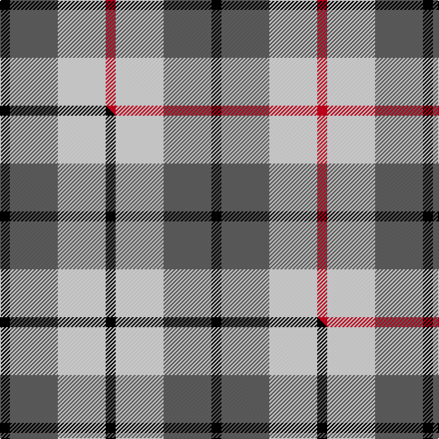

This page is one **sett** — a single exact thread-count. It belongs to the [tartan](/setts/k5n24w24r5/)
(the same proportion at any scale), whose colour order is pattern [KBWR](/stripes/kbwr/).

Part of the [City of London](/tartans/city-of-london/) tartan — the named design grouping this sett with its other cloths.

Sourced from tartans-authority.  It is a [4 stripe tartan](/stripes/stripes4/).

Original link http://www.tartansauthority.com/tartan-ferret/display/10734/

## Register references

External register numbers recorded for this tartan.

- Scottish Register of Tartans: [10734](https://www.tartanregister.gov.uk/tartanDetails?ref=10734)
- Scottish Tartans Authority (ITI): 10734

## Thread count
K/10 N48 W48 R/10

One full sett is **212 threads**.

## Palette
<table><thead><tr><th>Colour</th><th>Shade</th><th>OKLCh</th></tr></thead><tbody><tr><td>K</td><td><code style="background-color:#000000;">#000000</code> <small style="color:#888">#000000</small></td><td><small style="color:#888">oklch(0.0% 0.000 0.0)</small></td></tr><tr><td>N</td><td><code style="background-color:#636363;">#636363</code> <small style="color:#888">#636363</small></td><td><small style="color:#888">oklch(50.0% 0.000 89.9)</small></td></tr><tr><td>R</td><td><code style="background-color:#D60020;">#D60020</code> <small style="color:#888">#D60020</small></td><td><small style="color:#888">oklch(55.2% 0.224 25.5)</small></td></tr><tr><td>W</td><td><code style="background-color:#F7F7F7;">#F7F7F7</code> <small style="color:#888">#F7F7F7</small></td><td><small style="color:#888">oklch(97.6% 0.000 89.9)</small></td></tr></tbody></table>

# Sample pattern

## Compared to the master

This cloth is one sett of its design; the master sett (the exemplar the design is anchored on) is below for comparison.

Its **ΔTartan distance** from the master is **1.06** — the same measure the nearest-tartans table ranks by (0 is identical; a re-scale of the same cloth is near 0, a recolour or a different proportion further).

<figure class="master-compare" style="margin:0">

this sett
master sett ★

<figcaption style="color:#888;font-size:smaller">One weave of this sett against the <a href="/setts/k5n24w24k5/">master sett ★</a>, split on the diagonal: a shared proportion runs seamlessly across it with only the shades shifting; a different proportion breaks on it.</figcaption>
</figure>

## Nearest variants

The nearest existing variants by ΔTartan distance, with this cloth at the top so the swatches line up against it.

ΔTartan

Threads

Variant

Sett

—

212

<a href="/variants/s4/k5n24w24r5~x2/">City of London (Corporate)</a>

<a href="/ttd/edit/#slug=n20w13y24k3~x2&amp;base=k5n24w24r5~x2" title="compare in the TTD">1.45</a>

194

<a href="/variants/s4/n20w13y24k3~x2/">Spirit of Riverside (Corporate)</a>

<a href="/ttd/edit/#slug=n25k4w8r16~x4&amp;base=k5n24w24r5~x2" title="compare in the TTD">1.48</a>

260

<a href="/variants/s4/n25k4w8r16~x4/">Buckeye</a>

<a href="/ttd/edit/#slug=k1w8db8r1~x8&amp;base=k5n24w24r5~x2" title="compare in the TTD">1.76</a>

272

<a href="/variants/s4/k1w8db8r1~x8/">MacRae Dress Purple</a>

<a href="/ttd/edit/#slug=db3w25k25r3~x2&amp;base=k5n24w24r5~x2" title="compare in the TTD">1.90</a>

212

<a href="/variants/s4/db3w25k25r3~x2/">Gleneckley</a>

<a href="/ttd/edit/#slug=k4w35dp35o4~x2&amp;base=k5n24w24r5~x2" title="compare in the TTD">2.13</a>

296

<a href="/variants/s4/k4w35dp35o4~x2/">MacRae - 2000 (Dress, Purple)</a>

<a href="/ttd/edit/#slug=n22y10w3k8~x2&amp;base=k5n24w24r5~x2" title="compare in the TTD">2.14</a>

112

<a href="/variants/s4/n22y10w3k8~x2/">Louisburg Canadian District Tartan</a>

<a href="/ttd/edit/#slug=k6r33k18w20db6~x2&amp;base=k5n24w24r5~x2" title="compare in the TTD">2.19</a>

308

<a href="/variants/s5/k6r33k18w20db6~x2/">Brodie Dress</a>

<a href="/ttd/edit/#slug=k5n24w24k5~x2&amp;base=k5n24w24r5~x2" title="compare in the TTD">2.20</a>

212

<a href="/variants/s4/k5n24w24k5~x2/">City of London</a>

<a href="/ttd/edit/#slug=k3r28k10w28lb3~x2&amp;base=k5n24w24r5~x2" title="compare in the TTD">2.25</a>

276

<a href="/variants/s5/k3r28k10w28lb3~x2/">Wallace Dress, Red (Dance)</a>

<a href="/ttd/edit/#slug=r1g3dp3w1~x4&amp;base=k5n24w24r5~x2" title="compare in the TTD">2.40</a>

56

<a href="/variants/s4/r1g3dp3w1~x4/">Wilson's, No 113</a>

## Neighbour map

Every grey dot is one of 13620 variants placed by the first two principal components of the ΔTartan feature space (42% of its variance). Red is this tartan; blue dots are its nearest — click one to open its page.

<svg viewBox="0 0 640 380" role="img" style="max-width:100%;height:auto;border:1px solid #e0e0e0;border-radius:4px;display:block" xmlns="http://www.w3.org/2000/svg"><image href="/nn/cloud.v1.png" width="640" height="380"/><a href="/variants/s4/n20w13y24k3~x2/"><circle cx="177.8" cy="258.7" r="4" fill="#3465a4"><title>Spirit of Riverside (Corporate)</title></circle></a><a href="/variants/s4/n25k4w8r16~x4/"><circle cx="202.9" cy="248.0" r="4" fill="#3465a4"><title>Buckeye</title></circle></a><a href="/variants/s4/k1w8db8r1~x8/"><circle cx="195.5" cy="214.9" r="4" fill="#3465a4"><title>MacRae Dress Purple</title></circle></a><a href="/variants/s4/db3w25k25r3~x2/"><circle cx="191.8" cy="208.4" r="4" fill="#3465a4"><title>Gleneckley</title></circle></a><a href="/variants/s4/k4w35dp35o4~x2/"><circle cx="207.8" cy="206.0" r="4" fill="#3465a4"><title>MacRae - 2000 (Dress, Purple)</title></circle></a><a href="/variants/s4/n22y10w3k8~x2/"><circle cx="224.2" cy="242.2" r="4" fill="#3465a4"><title>Louisburg Canadian District Tartan</title></circle></a><a href="/variants/s5/k6r33k18w20db6~x2/"><circle cx="120.2" cy="227.8" r="4" fill="#3465a4"><title>Brodie Dress</title></circle></a><a href="/variants/s4/k5n24w24k5~x2/"><circle cx="143.1" cy="244.7" r="4" fill="#3465a4"><title>City of London</title></circle></a><a href="/variants/s5/k3r28k10w28lb3~x2/"><circle cx="161.2" cy="192.4" r="4" fill="#3465a4"><title>Wallace Dress, Red (Dance)</title></circle></a><a href="/variants/s4/r1g3dp3w1~x4/"><circle cx="139.6" cy="304.3" r="4" fill="#3465a4"><title>Wilson's, No 113</title></circle></a><circle cx="157.3" cy="249.0" r="5" fill="#c00000"/><text x="320" y="376" text-anchor="middle" font-size="11" fill="#999">ground</text><text x="11" y="190" text-anchor="middle" font-size="11" fill="#999" transform="rotate(-90 11 190)">complexity</text></svg>

ID: /variants/s4/k5n24w24r5~x2/
