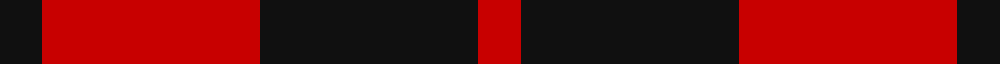
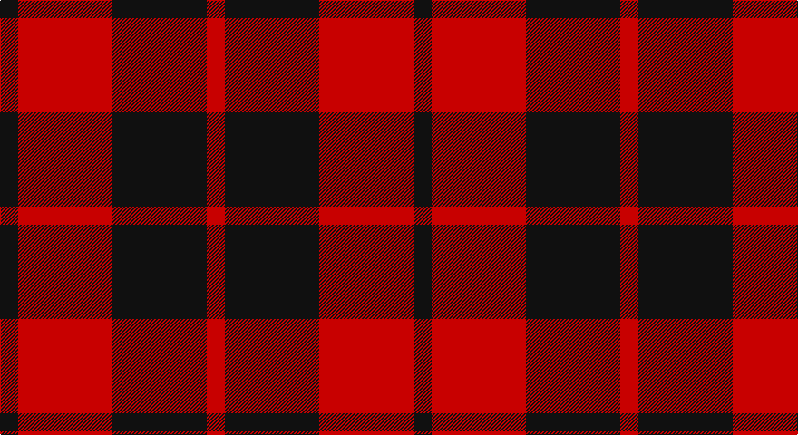

This page is one **sett** — a single exact thread-count. It belongs to the [tartan](/setts/k5r26k26r5/)
(the same proportion at any scale), whose colour order is pattern [KRKR](/stripes/krkr/).

Part of the [Ettrick](/tartans/ettrick/) tartan — the named design grouping this sett with its other cloths.

Sourced from register-of-tartans.  It is a [4 stripe tartan](/stripes/stripes4/).

Original link https://www.tartanregister.gov.uk/tartanDetails.aspx?ref=1135

2 attestations — the source records this cloth was collapsed from (oldest owns this page)

<ul>
<li>01/01/1900 — Ettrick (District) (register-of-tartans, <a href="https://www.tartanregister.gov.uk/tartanDetails.aspx?ref=1135">record</a>)</li>
<li>1900 — Ettrick (District) (tartans-authority, <a href="http://www.tartansauthority.com/tartan-ferret/display/1191/">record</a>)</li>
</ul>

## Register references

External register numbers recorded for this tartan.

- Scottish Register of Tartans: [1135](https://www.tartanregister.gov.uk/tartanDetails.aspx?ref=1135)
- Scottish Tartans Authority (ITI): 1191
- Scottish Tartans World Register: 1191

## Thread count
K/20 R104 K104 R/20

One full sett is **456 threads**.

## Palette

Palette: <strong>Tartan Register</strong>
<table><thead><tr><th>Colour</th><th>Threads</th><th>Shade</th><th>Base</th><th>OKLCh</th></tr></thead><tbody><tr><td>K/</td><td style="text-align:right;font-variant-numeric:tabular-nums">20</td><td><code style="background-color:#101010;">#101010</code> <small style="color:#888">#101010</small></td><td>K <code style="background-color:#000000;">#000000</code></td><td><small style="color:#888">oklch(17.3% 0.000 89.9)</small></td></tr><tr><td>R</td><td style="text-align:right;font-variant-numeric:tabular-nums">104</td><td><code style="background-color:#C80000;">#C80000</code> <small style="color:#888">#C80000</small></td><td>R <code style="background-color:#CC0000;">#CC0000</code></td><td><small style="color:#888">oklch(52.3% 0.215 29.2)</small></td></tr><tr><td>K</td><td style="text-align:right;font-variant-numeric:tabular-nums">104</td><td><code style="background-color:#101010;">#101010</code> <small style="color:#888">#101010</small></td><td>K <code style="background-color:#000000;">#000000</code></td><td><small style="color:#888">oklch(17.3% 0.000 89.9)</small></td></tr><tr><td>R/</td><td style="text-align:right;font-variant-numeric:tabular-nums">20</td><td><code style="background-color:#C80000;">#C80000</code> <small style="color:#888">#C80000</small></td><td>R <code style="background-color:#CC0000;">#CC0000</code></td><td><small style="color:#888">oklch(52.3% 0.215 29.2)</small></td></tr></tbody></table>

# Sample pattern

## Nearest tartans

The nearest existing variants by ΔTartan distance, with this tartan at the top so the swatches line up against it.

ΔTartan

Tartan

Sett

—

<a href="/ttd/edit/#slug=k5r26k26r5~x4">Ettrick (District)</a> <a class="nn-out" href="/variants/s4/k5r26k26r5~x4/" title="open its dictionary page">↗</a>

1.09

<a href="/variants/s4/k30r17k3~x4/">MacFarlane Red &amp; Black (Artefact)</a>

1.15

<a href="/ttd/edit/#slug=k6r31k31r6~x2&amp;base=k5r26k26r5~x4">Ettrick</a> <a class="nn-out" href="/variants/s4/k6r31k31r6~x2/" title="open its dictionary page">↗</a>

1.22

<a href="/ttd/edit/#slug=k13r2k13r19k2~x2&amp;base=k5r26k26r5~x4">MacLeod of Raasay (Highland Society of London)</a> <a class="nn-out" href="/variants/s5/k13r2k13r19k2~x2/" title="open its dictionary page">↗</a>

1.30

<a href="/ttd/edit/#slug=k1r8k8ly1~x6&amp;base=k5r26k26r5~x4">Wallace</a> <a class="nn-out" href="/variants/s4/k1r8k8ly1~x6/" title="open its dictionary page">↗</a>

1.30

<a href="/ttd/edit/#slug=k1r8k8ly1~x4&amp;base=k5r26k26r5~x4">Wallace (Clan)</a> <a class="nn-out" href="/variants/s4/k1r8k8ly1~x4/" title="open its dictionary page">↗</a>

1.37

<a href="/ttd/edit/#slug=r3k25r25k10lb3~x2&amp;base=k5r26k26r5~x4">Bodog.com</a> <a class="nn-out" href="/variants/s5/r3k25r25k10lb3~x2/" title="open its dictionary page">↗</a>

1.43

<a href="/ttd/edit/#slug=r26k18r7k4ly4~x2&amp;base=k5r26k26r5~x4">Haig &amp; Haig Whisky (Corporate)</a> <a class="nn-out" href="/variants/s5/r26k18r7k4ly4~x2/" title="open its dictionary page">↗</a>

1.45

<a href="/ttd/edit/#slug=k6r3k28r28k3r6~x2&amp;base=k5r26k26r5~x4">Erskine, Black &amp; Red (Clan)</a> <a class="nn-out" href="/variants/s6/k6r3k28r28k3r6~x2/" title="open its dictionary page">↗</a>

1.50

<a href="/ttd/edit/#slug=k3r15k11ly2k4r3~x2&amp;base=k5r26k26r5~x4">Brodie (Clan)</a> <a class="nn-out" href="/variants/s6/k3r15k11ly2k4r3~x2/" title="open its dictionary page">↗</a>

1.53

<a href="/ttd/edit/#slug=k31r4k47r47k4r31~x2&amp;base=k5r26k26r5~x4">Erskine (Paton)</a> <a class="nn-out" href="/variants/s6/k31r4k47r47k4r31~x2/" title="open its dictionary page">↗</a>

## Neighbour map

Every grey dot is one of 14360 variants placed by the first two principal components of the ΔTartan feature space (44% of its variance). Red is this tartan; blue dots are its nearest — click one to open its page.

<svg viewBox="0 0 640 380" role="img" style="max-width:100%;height:auto;border:1px solid #e0e0e0;border-radius:4px;display:block" xmlns="http://www.w3.org/2000/svg"><image href="/nn/cloud.v1.png" width="640" height="380"/><a href="/variants/s4/k30r17k3~x4/"><circle cx="343.2" cy="278.4" r="4" fill="#3465a4"><title>MacFarlane Red &amp; Black (Artefact)</title></circle></a><a href="/variants/s4/k6r31k31r6~x2/"><circle cx="307.1" cy="285.8" r="4" fill="#3465a4"><title>Ettrick</title></circle></a><a href="/variants/s5/k13r2k13r19k2~x2/"><circle cx="372.9" cy="262.9" r="4" fill="#3465a4"><title>MacLeod of Raasay (Highland Society of London)</title></circle></a><a href="/variants/s4/k1r8k8ly1~x6/"><circle cx="304.9" cy="243.9" r="4" fill="#3465a4"><title>Wallace</title></circle></a><a href="/variants/s4/k1r8k8ly1~x4/"><circle cx="304.9" cy="243.9" r="4" fill="#3465a4"><title>Wallace (Clan)</title></circle></a><a href="/variants/s5/r3k25r25k10lb3~x2/"><circle cx="316.6" cy="238.4" r="4" fill="#3465a4"><title>Bodog.com</title></circle></a><a href="/variants/s5/r26k18r7k4ly4~x2/"><circle cx="313.1" cy="239.4" r="4" fill="#3465a4"><title>Haig &amp; Haig Whisky (Corporate)</title></circle></a><a href="/variants/s6/k6r3k28r28k3r6~x2/"><circle cx="360.7" cy="232.7" r="4" fill="#3465a4"><title>Erskine, Black &amp; Red (Clan)</title></circle></a><a href="/variants/s6/k3r15k11ly2k4r3~x2/"><circle cx="287.0" cy="228.9" r="4" fill="#3465a4"><title>Brodie (Clan)</title></circle></a><a href="/variants/s6/k31r4k47r47k4r31~x2/"><circle cx="337.6" cy="240.8" r="4" fill="#3465a4"><title>Erskine (Paton)</title></circle></a><circle cx="327.9" cy="290.2" r="5" fill="#c00000"/></svg>

ID: /variants/s4/k5r26k26r5~x4/
