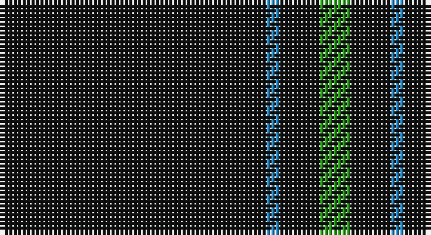

This page is one **sett** — a single exact thread-count. It belongs to the [tartan](/setts/k60t3k9g7/)
(the same proportion at any scale), whose colour order is pattern [GKBK](/stripes/gkbk/).

Sourced from tartans-authority.  It is a [4 stripe tartan](/stripes/stripes4/).

Original link http://www.tartansauthority.com/tartan-ferret/display/6018/

## Register references

External register numbers recorded for this tartan.

- Scottish Tartans Authority (ITI): 6018

## Thread count
K/60 B3 K9 G/7

One full sett is **91 threads**.

## Palette

Palette: <strong>Tartan Register</strong>
<table><thead><tr><th>Colour</th><th>Threads</th><th>Shade</th><th>Base</th><th>OKLCh</th></tr></thead><tbody><tr><td>K/</td><td style="text-align:right;font-variant-numeric:tabular-nums">60</td><td><code style="background-color:#101010;">#101010</code> <small style="color:#888">#101010</small></td><td>K <code style="background-color:#000000;">#000000</code></td><td><small style="color:#888">oklch(17.3% 0.000 89.9)</small></td></tr><tr><td>B</td><td style="text-align:right;font-variant-numeric:tabular-nums">3</td><td><code style="background-color:#2888C4;">#2888C4</code> <small style="color:#888">#2888C4</small></td><td>B <code style="background-color:#2A418A;">#2A418A</code></td><td><small style="color:#888">oklch(60.1% 0.125 241.5)</small></td></tr><tr><td>K</td><td style="text-align:right;font-variant-numeric:tabular-nums">9</td><td><code style="background-color:#101010;">#101010</code> <small style="color:#888">#101010</small></td><td>K <code style="background-color:#000000;">#000000</code></td><td><small style="color:#888">oklch(17.3% 0.000 89.9)</small></td></tr><tr><td>G/</td><td style="text-align:right;font-variant-numeric:tabular-nums">7</td><td><code style="background-color:#289C18;">#289C18</code> <small style="color:#888">#289C18</small></td><td>G <code style="background-color:#006100;">#006100</code></td><td><small style="color:#888">oklch(60.6% 0.191 141.6)</small></td></tr></tbody></table>

# Sample pattern

## Nearest tartans

The nearest existing variants by ΔTartan distance, with this tartan at the top so the swatches line up against it.

ΔTartan

Tartan

Sett

—

<a href="/ttd/edit/#slug=k60t3k9g7">Wallington (Corporate?)</a> <a class="nn-out" href="/variants/s4/k60t3k9g7/" title="open its dictionary page">↗</a>

0.83

<a href="/ttd/edit/#slug=k72w3k11db9&amp;base=k60t3k9g7">Dunnotar (School)</a> <a class="nn-out" href="/variants/s4/k72w3k11db9/" title="open its dictionary page">↗</a>

1.45

<a href="/ttd/edit/#slug=k20w2t1~x6&amp;base=k60t3k9g7">Fily (Verneuil L'tang) (Personal)</a> <a class="nn-out" href="/variants/s3/k20w2t1~x6/" title="open its dictionary page">↗</a>

1.49

<a href="/ttd/edit/#slug=k72r3k11t9k11r3k37&amp;base=k60t3k9g7">Chafyn House (School)</a> <a class="nn-out" href="/variants/s7/k72r3k11t9k11r3k37/" title="open its dictionary page">↗</a>

1.69

<a href="/ttd/edit/#slug=k31r2k10db1k1w1~x4&amp;base=k60t3k9g7">NewGeneration Alchemy (NGA) Inc</a> <a class="nn-out" href="/variants/s6/k31r2k10db1k1w1~x4/" title="open its dictionary page">↗</a>

1.73

<a href="/ttd/edit/#slug=k24dg3r3k24r2k2r2&amp;base=k60t3k9g7">Unidentified #45</a> <a class="nn-out" href="/variants/s7/k24dg3r3k24r2k2r2/" title="open its dictionary page">↗</a>

1.76

<a href="/ttd/edit/#slug=do10ly1do30y3~x4&amp;base=k60t3k9g7">Pasteur Fancy Tartan</a> <a class="nn-out" href="/variants/s4/do10ly1do30y3~x4/" title="open its dictionary page">↗</a>

1.88

<a href="/ttd/edit/#slug=k20w2lt1~x6&amp;base=k60t3k9g7">Fily (Verneuil L'tang) (Personal)</a> <a class="nn-out" href="/variants/s3/k20w2lt1~x6/" title="open its dictionary page">↗</a>

1.98

<a href="/ttd/edit/#slug=dt32r3dt4k2lo3~x2&amp;base=k60t3k9g7">MacLaine of Lochbuie Hunting</a> <a class="nn-out" href="/variants/s5/dt32r3dt4k2lo3~x2/" title="open its dictionary page">↗</a>

1.98

<a href="/ttd/edit/#slug=k4r4k20r1k20w4~x6&amp;base=k60t3k9g7">Lanoir</a> <a class="nn-out" href="/variants/s6/k4r4k20r1k20w4~x6/" title="open its dictionary page">↗</a>

2.04

<a href="/ttd/edit/#slug=dg30r2dg8r1dg5w2&amp;base=k60t3k9g7">Dewi Sant</a> <a class="nn-out" href="/variants/s6/dg30r2dg8r1dg5w2/" title="open its dictionary page">↗</a>

## Neighbour map

Every grey dot is one of 14360 variants placed by the first two principal components of the ΔTartan feature space (44% of its variance). Red is this tartan; blue dots are its nearest — click one to open its page.

<svg viewBox="0 0 640 380" role="img" style="max-width:100%;height:auto;border:1px solid #e0e0e0;border-radius:4px;display:block" xmlns="http://www.w3.org/2000/svg"><image href="/nn/cloud.v1.png" width="640" height="380"/><a href="/variants/s4/k72w3k11db9/"><circle cx="626.0" cy="233.5" r="4" fill="#3465a4"><title>Dunnotar (School)</title></circle></a><a href="/variants/s3/k20w2t1~x6/"><circle cx="599.9" cy="227.4" r="4" fill="#3465a4"><title>Fily (Verneuil L'tang) (Personal)</title></circle></a><a href="/variants/s7/k72r3k11t9k11r3k37/"><circle cx="626.0" cy="214.1" r="4" fill="#3465a4"><title>Chafyn House (School)</title></circle></a><a href="/variants/s6/k31r2k10db1k1w1~x4/"><circle cx="626.0" cy="172.5" r="4" fill="#3465a4"><title>NewGeneration Alchemy (NGA) Inc</title></circle></a><a href="/variants/s7/k24dg3r3k24r2k2r2/"><circle cx="577.4" cy="225.7" r="4" fill="#3465a4"><title>Unidentified #45</title></circle></a><a href="/variants/s4/do10ly1do30y3~x4/"><circle cx="626.0" cy="232.1" r="4" fill="#3465a4"><title>Pasteur Fancy Tartan</title></circle></a><a href="/variants/s3/k20w2lt1~x6/"><circle cx="586.9" cy="221.3" r="4" fill="#3465a4"><title>Fily (Verneuil L'tang) (Personal)</title></circle></a><a href="/variants/s5/dt32r3dt4k2lo3~x2/"><circle cx="584.8" cy="213.0" r="4" fill="#3465a4"><title>MacLaine of Lochbuie Hunting</title></circle></a><a href="/variants/s6/k4r4k20r1k20w4~x6/"><circle cx="537.3" cy="210.0" r="4" fill="#3465a4"><title>Lanoir</title></circle></a><a href="/variants/s6/dg30r2dg8r1dg5w2/"><circle cx="626.0" cy="202.3" r="4" fill="#3465a4"><title>Dewi Sant</title></circle></a><circle cx="626.0" cy="231.8" r="5" fill="#c00000"/></svg>

ID: /variants/s4/k60t3k9g7/
