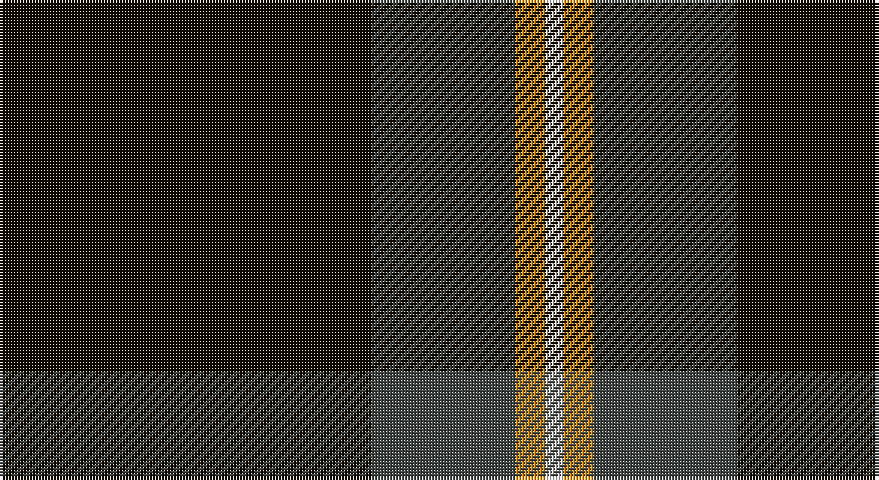

This page is one **sett** — a single exact thread-count. It belongs to the [tartan](/setts/k62dt24lo5w3/)
(the same proportion at any scale), whose colour order is pattern [KBYW](/stripes/kbyw/).

Part of the [Perry , Alex](/tartans/perry-alex/) tartan — the named design grouping this sett with its other cloths.

Sourced from register-of-tartans.  It is a [4 stripe tartan](/stripes/stripes4/).

Original link https://www.tartanregister.gov.uk/tartanDetails.aspx?ref=10410

## Also known as

This cloth is also recorded under:

- Perry, Alex

## Register references

External register numbers recorded for this tartan.

- Scottish Register of Tartans: [10410](https://www.tartanregister.gov.uk/tartanDetails.aspx?ref=10410)

## Thread count
K/124 N48 O10 W/6

One full sett is **246 threads**.

## Palette

Palette: <strong>custom</strong>
<table><thead><tr><th>Colour</th><th>Threads</th><th>Shade</th><th>Base</th><th>OKLCh</th></tr></thead><tbody><tr><td>K/</td><td style="text-align:right;font-variant-numeric:tabular-nums">124</td><td><code style="background-color:#120A01;">#120A01</code> <small style="color:#888">#120A01</small></td><td>K <code style="background-color:#000000;">#000000</code></td><td><small style="color:#888">oklch(15.2% 0.028 78.6)</small></td></tr><tr><td>N</td><td style="text-align:right;font-variant-numeric:tabular-nums">48</td><td><code style="background-color:#3F4441;">#3F4441</code> <small style="color:#888">#3F4441</small></td><td>B <code style="background-color:#2A418A;">#2A418A</code></td><td><small style="color:#888">oklch(38.1% 0.008 159.7)</small></td></tr><tr><td>O</td><td style="text-align:right;font-variant-numeric:tabular-nums">10</td><td><code style="background-color:#EF8F06;">#EF8F06</code> <small style="color:#888">#EF8F06</small></td><td>Y <code style="background-color:#F2BF00;">#F2BF00</code></td><td><small style="color:#888">oklch(73.5% 0.165 64.2)</small></td></tr><tr><td>W/</td><td style="text-align:right;font-variant-numeric:tabular-nums">6</td><td><code style="background-color:#F7F1E8;">#F7F1E8</code> <small style="color:#888">#F7F1E8</small></td><td>W <code style="background-color:#F7F7F7;">#F7F7F7</code></td><td><small style="color:#888">oklch(96.0% 0.014 78.3)</small></td></tr></tbody></table>

# Sample pattern

## Nearest tartans

The nearest existing variants by ΔTartan distance, with this tartan at the top so the swatches line up against it.

ΔTartan

Tartan

Sett

—

<a href="/ttd/edit/#slug=k62dt24lo5w3~x2">Perry (Calgary), Alex (Personal)</a> <a class="nn-out" href="/variants/s4/k62dt24lo5w3~x2/" title="open its dictionary page">↗</a>

1.02

<a href="/ttd/edit/#slug=k31r12ly2n5k2~x4&amp;base=k62dt24lo5w3~x2">Perry (2014)</a> <a class="nn-out" href="/variants/s5/k31r12ly2n5k2~x4/" title="open its dictionary page">↗</a>

1.15

<a href="/ttd/edit/#slug=k65r27w2k4ly5~x2&amp;base=k62dt24lo5w3~x2">Perry Dress (Personal)</a> <a class="nn-out" href="/variants/s5/k65r27w2k4ly5~x2/" title="open its dictionary page">↗</a>

1.19

<a href="/ttd/edit/#slug=r3n12k50ly3~x2&amp;base=k62dt24lo5w3~x2">Rogues (United States), The</a> <a class="nn-out" href="/variants/s4/r3n12k50ly3~x2/" title="open its dictionary page">↗</a>

1.26

<a href="/ttd/edit/#slug=y14k80y14ly5~x2&amp;base=k62dt24lo5w3~x2">Westgate Fashion Tartan</a> <a class="nn-out" href="/variants/s4/y14k80y14ly5~x2/" title="open its dictionary page">↗</a>

1.30

<a href="/ttd/edit/#slug=r3t12k50ly3~x2&amp;base=k62dt24lo5w3~x2">Rogues, The (Corporate)</a> <a class="nn-out" href="/variants/s4/r3t12k50ly3~x2/" title="open its dictionary page">↗</a>

1.31

<a href="/ttd/edit/#slug=k44g8k4gi13k4w3~x2&amp;base=k62dt24lo5w3~x2">Childers (Personal)</a> <a class="nn-out" href="/variants/s6/k44g8k4gi13k4w3~x2/" title="open its dictionary page">↗</a>

1.32

<a href="/ttd/edit/#slug=k88g17k8gi28k8r6~x2&amp;base=k62dt24lo5w3~x2">Childers Regimental Tartan</a> <a class="nn-out" href="/variants/s6/k88g17k8gi28k8r6~x2/" title="open its dictionary page">↗</a>

1.34

<a href="/ttd/edit/#slug=k62o24lo5dg3~x2&amp;base=k62dt24lo5w3~x2">Meaux, Luc G (Personal)</a> <a class="nn-out" href="/variants/s4/k62o24lo5dg3~x2/" title="open its dictionary page">↗</a>

1.41

<a href="/ttd/edit/#slug=k62n24lo5w8~x2&amp;base=k62dt24lo5w3~x2">Perry, Alex (Personal)</a> <a class="nn-out" href="/variants/s4/k62n24lo5w8~x2/" title="open its dictionary page">↗</a>

1.42

<a href="/ttd/edit/#slug=k62db15w6ly4~x2&amp;base=k62dt24lo5w3~x2">C-Tec N.I. Ltd</a> <a class="nn-out" href="/variants/s4/k62db15w6ly4~x2/" title="open its dictionary page">↗</a>

## Neighbour map

Every grey dot is one of 14360 variants placed by the first two principal components of the ΔTartan feature space (44% of its variance). Red is this tartan; blue dots are its nearest — click one to open its page.

<svg viewBox="0 0 640 380" role="img" style="max-width:100%;height:auto;border:1px solid #e0e0e0;border-radius:4px;display:block" xmlns="http://www.w3.org/2000/svg"><image href="/nn/cloud.v1.png" width="640" height="380"/><a href="/variants/s5/k31r12ly2n5k2~x4/"><circle cx="400.5" cy="202.6" r="4" fill="#3465a4"><title>Perry (2014)</title></circle></a><a href="/variants/s5/k65r27w2k4ly5~x2/"><circle cx="456.4" cy="164.7" r="4" fill="#3465a4"><title>Perry Dress (Personal)</title></circle></a><a href="/variants/s4/r3n12k50ly3~x2/"><circle cx="465.1" cy="201.0" r="4" fill="#3465a4"><title>Rogues (United States), The</title></circle></a><a href="/variants/s4/y14k80y14ly5~x2/"><circle cx="475.0" cy="230.3" r="4" fill="#3465a4"><title>Westgate Fashion Tartan</title></circle></a><a href="/variants/s4/r3t12k50ly3~x2/"><circle cx="455.3" cy="196.8" r="4" fill="#3465a4"><title>Rogues, The (Corporate)</title></circle></a><a href="/variants/s6/k44g8k4gi13k4w3~x2/"><circle cx="412.8" cy="193.5" r="4" fill="#3465a4"><title>Childers (Personal)</title></circle></a><a href="/variants/s6/k88g17k8gi28k8r6~x2/"><circle cx="408.9" cy="197.5" r="4" fill="#3465a4"><title>Childers Regimental Tartan</title></circle></a><a href="/variants/s4/k62o24lo5dg3~x2/"><circle cx="449.4" cy="215.9" r="4" fill="#3465a4"><title>Meaux, Luc G (Personal)</title></circle></a><a href="/variants/s4/k62n24lo5w8~x2/"><circle cx="342.0" cy="212.9" r="4" fill="#3465a4"><title>Perry, Alex (Personal)</title></circle></a><a href="/variants/s4/k62db15w6ly4~x2/"><circle cx="423.8" cy="200.2" r="4" fill="#3465a4"><title>C-Tec N.I. Ltd</title></circle></a><circle cx="420.9" cy="204.1" r="5" fill="#c00000"/></svg>

ID: /variants/s4/k62dt24lo5w3~x2/
