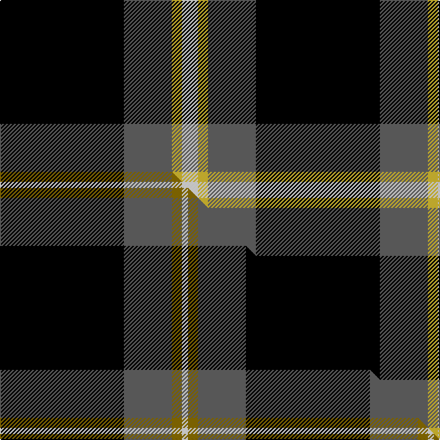

This is one **variant** — a specific cloth: this exact thread count and colourway, with its own
provenance below. It is one weaving of the [sett](/tartans/p/pe/perry-alex/) (the scale-free proportion — the
same cloth at any scale or shade), whose colour order is pattern [KBYW](/stripes/kbyw/).

Part of the [Perry , Alex](/tartans/p/pe/perry-alex/) tartan — the named design grouping this sett with its other cloths.

Sourced from tartans-authority.  It is a [4 stripe tartan](/stripes/stripes4/).

Original link <code>http://www.tartansauthority.com/tartan-ferret/display/10410/</code> — retired · [Internet Archive copy](https://web.archive.org/web/*/http://www.tartansauthority.com/tartan-ferret/display/10410/*)

Dataset <small>— provenance for this record, inherited from the source manifest</small>

<dl class="dataset-prov">
<dt>source</dt><dd><a href="/sources/tartans-authority/">Scottish Tartans Authority</a></dd>
<dt>data captured from</dt><dd><a href="https://github.com/thetartan/tartan-database/blob/master/data/tartans-authority/data.csv">https://github.com/thetartan/tartan-database/blob/master/data/tartans-authority/data.csv</a></dd>
<dt>data date</dt><dd>26th Apr 2011 <small>(this record)</small></dd>
<dt>licence</dt><dd><a href="https://creativecommons.org/licenses/by-nc-nd/4.0/">CC BY-NC-ND 4.0</a></dd>
</dl>

Capture chain <small>— the hands this data passed through, oldest first; each capture carries its own licence</small>

<ol class="capture-chain">
<li><a href="https://www.tartansauthority.com/">Scottish Tartans Authority</a> <small>the heritage body’s archive — its tartan-ferret record browser is retired; dead record links are shown unlinked, with an Internet Archive copy (ITI numbers are not SRT references)</small></li>
<li><a href="https://github.com/thetartan/tartan-database">thetartan/tartan-database</a> <small>2016-2017</small> · <a href="https://creativecommons.org/licenses/by-nc-nd/4.0/">CC BY-NC-ND 4.0</a> <small>Levko Kravets's frozen compilation — the capture we vendored, and where its CC licence text came from</small></li>
<li>this dictionary <small>captured 2026-06-10 · commit 5bf86c7566</small> <small>each re-capture is a git commit to data/sources</small></li>
</ol>

## Register references

External register numbers recorded for this tartan.

- Scottish Register of Tartans: [10410](https://www.tartanregister.gov.uk/tartanDetails?ref=10410)
- Scottish Tartans Authority (ITI): 10410

## Thread count
K/124 N48 LY10 W/16

One full sett is **256 threads**.

## Palette
<table><thead><tr><th>Colour</th><th>Shade</th><th>OKLCh</th></tr></thead><tbody><tr><td>LY</td><td><code style="background-color:#DCBC32;">#DCBC32</code> <small style="color:#888">#DCBC32</small></td><td><small style="color:#888">oklch(80.0% 0.150 95.2)</small></td></tr><tr><td>K</td><td><code style="background-color:#000000;">#000000</code> <small style="color:#888">#000000</small></td><td><small style="color:#888">oklch(0.0% 0.000 0.0)</small></td></tr><tr><td>N</td><td><code style="background-color:#636363;">#636363</code> <small style="color:#888">#636363</small></td><td><small style="color:#888">oklch(50.0% 0.000 89.9)</small></td></tr><tr><td>W</td><td><code style="background-color:#F7F7F7;">#F7F7F7</code> <small style="color:#888">#F7F7F7</small></td><td><small style="color:#888">oklch(97.6% 0.000 89.9)</small></td></tr></tbody></table>

# Sample pattern

[Sample sheet (PDF)](swatch.pdf) — the woven sample, thread count and palette on one printable A4, rendered on demand (the same sheet the TTD print page downloads).

## Compared to the master

This cloth is one sett of its design; the master sett (the exemplar the design is anchored on) is below for comparison.

Its **ΔTartan distance** from the master is **0.45** — the same measure the nearest-tartans table ranks by (0 is identical; a re-scale of the same cloth is near 0, a recolour or a different proportion further).

<figure class="master-compare" style="margin:0">

this sett
master sett ★

<figcaption style="color:#888;font-size:smaller">One weave of this sett against the <a href="/setts/k62n24y5w3/">master sett ★</a>, split on the diagonal: a shared proportion runs seamlessly across it with only the shades shifting; a different proportion breaks on it.</figcaption>
</figure>

## Nearest tartan variants

The nearest existing variants by ΔTartan distance, with this cloth at the top so the swatches line up against it.

ΔTartan

Threads

Variant

Sett

—

256

<a href="/variants/s4/k62n24ly5w8~x2/">Perry, Alex (Personal)</a>

<a href="/ttd/edit/#slug=k62n24y5w3~x2&amp;base=k62n24ly5w8~x2" title="compare in the TTD">0.45</a>

246

<a href="/variants/s4/k62n24y5w3~x2/">Perry (Calgary), Alex (Personal)</a>

<a href="/ttd/edit/#slug=k50db6r6n6w3~x2&amp;base=k62n24ly5w8~x2" title="compare in the TTD">1.48</a>

178

<a href="/variants/s5/k50db6r6n6w3~x2/">Friends of Nordegg (Corporate)</a>

<a href="/ttd/edit/#slug=k19lo1n19~x8&amp;base=k62n24ly5w8~x2" title="compare in the TTD">1.52</a>

320

<a href="/variants/s3/k19lo1n19~x8/">Wcwm 9275-1394</a>

<a href="/ttd/edit/#slug=k75y29k4ly6~x2~y59-ly8117093&amp;base=k62n24ly5w8~x2" title="compare in the TTD">1.71</a>

294

<a href="/variants/s4/k75y29k4ly6~x2~y59-ly8117093/">Perry Ancient (Personal)</a>

<a href="/ttd/edit/#slug=y3k1n24k35w3~x2&amp;base=k62n24ly5w8~x2" title="compare in the TTD">1.84</a>

252

<a href="/variants/s5/y3k1n24k35w3~x2/">George Heriots</a>

<a href="/ttd/edit/#slug=n4k48n16r12db3~x2&amp;base=k62n24ly5w8~x2" title="compare in the TTD">1.89</a>

318

<a href="/variants/s5/n4k48n16r12db3~x2/">Calgary Firefighters</a>

<a href="/ttd/edit/#slug=k46dy7k8w20~x2&amp;base=k62n24ly5w8~x2" title="compare in the TTD">1.90</a>

192

<a href="/variants/s4/k46dy7k8w20~x2/">Lords of Skye Trade Tartan</a>

<a href="/ttd/edit/#slug=k46o7k8w20~x2&amp;base=k62n24ly5w8~x2" title="compare in the TTD">1.90</a>

192

<a href="/variants/s4/k46o7k8w20~x2/">Lords, of Skye</a>

<a href="/ttd/edit/#slug=g3y5r14k36w3~x2&amp;base=k62n24ly5w8~x2" title="compare in the TTD">2.02</a>

232

<a href="/variants/s5/g3y5r14k36w3~x2/">Papua New Guinea</a>

<a href="/ttd/edit/#slug=k62db15w6y4~x2&amp;base=k62n24ly5w8~x2" title="compare in the TTD">2.06</a>

216

<a href="/variants/s4/k62db15w6y4~x2/">C-Tec N.I. Ltd</a>

## Neighbour map

Every grey dot is one of 13662 variants placed by the first two principal components of the ΔTartan feature space (42% of its variance). Red is this tartan; blue dots are its nearest — click one to open its page. The map is a flat projection of a many-dimensional space — [how to read it](/posts/neighbourhood-maps/).

<svg viewBox="0 0 640 380" role="img" style="max-width:100%;height:auto;border:1px solid #e0e0e0;border-radius:4px;display:block" xmlns="http://www.w3.org/2000/svg"><image href="/nn/cloud.v1.png" width="640" height="380"/><a href="/variants/s4/k62n24y5w3~x2/"><circle cx="362.4" cy="161.1" r="4" fill="#3465a4"><title>Perry (Calgary), Alex (Personal)</title></circle></a><a href="/variants/s5/k50db6r6n6w3~x2/"><circle cx="366.0" cy="127.4" r="4" fill="#3465a4"><title>Friends of Nordegg (Corporate)</title></circle></a><a href="/variants/s3/k19lo1n19~x8/"><circle cx="302.7" cy="226.4" r="4" fill="#3465a4"><title>Wcwm 9275-1394</title></circle></a><a href="/variants/s4/k75y29k4ly6~x2~y59-ly8117093/"><circle cx="388.8" cy="172.4" r="4" fill="#3465a4"><title>Perry Ancient (Personal)</title></circle></a><a href="/variants/s5/y3k1n24k35w3~x2/"><circle cx="310.5" cy="131.4" r="4" fill="#3465a4"><title>George Heriots</title></circle></a><a href="/variants/s5/n4k48n16r12db3~x2/"><circle cx="299.0" cy="163.4" r="4" fill="#3465a4"><title>Calgary Firefighters</title></circle></a><a href="/variants/s4/k46dy7k8w20~x2/"><circle cx="307.3" cy="226.1" r="4" fill="#3465a4"><title>Lords of Skye Trade Tartan</title></circle></a><a href="/variants/s4/k46o7k8w20~x2/"><circle cx="303.7" cy="223.3" r="4" fill="#3465a4"><title>Lords, of Skye</title></circle></a><a href="/variants/s5/g3y5r14k36w3~x2/"><circle cx="257.1" cy="147.1" r="4" fill="#3465a4"><title>Papua New Guinea</title></circle></a><a href="/variants/s4/k62db15w6y4~x2/"><circle cx="384.6" cy="163.5" r="4" fill="#3465a4"><title>C-Tec N.I. Ltd</title></circle></a><circle cx="303.2" cy="184.4" r="5" fill="#c00000"/><text x="320" y="376" text-anchor="middle" font-size="11" fill="#999">ground</text><text x="11" y="190" text-anchor="middle" font-size="11" fill="#999" transform="rotate(-90 11 190)">complexity</text></svg>

ID: /variants/s4/k62n24ly5w8~x2/
