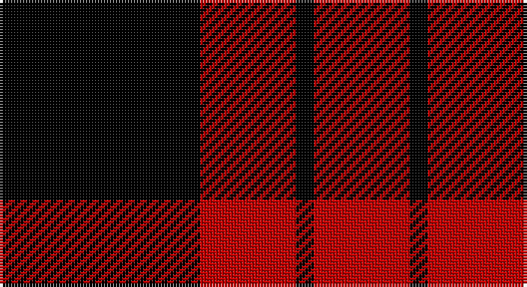

This page is one **sett** — a single exact thread-count. It belongs to the [tartan](/setts/k67r32k6/)
(the same proportion at any scale), whose colour order is pattern [KRKR](/stripes/krkr/).

Sourced from weddslist.  It is a [4 stripe tartan](/stripes/stripes4/).

Original link http://www.weddslist.com/cgi-bin/tartans/pg.pl?source=sts

## Provenance

Earliest known date: (1815-20) MacGregor-Hastie's notes say 'The sett is the same as MacFarlane Black and Red

## Also known as

This cloth is also recorded under:

- Lendrum, or MacFarlane

2 attestations — the source records this cloth was collapsed from (oldest owns this page)

<ul>
<li>undated — Lendrum, or MacFarlane (weddslist, <a href="http://www.weddslist.com/cgi-bin/tartans/pg.pl?source=sts">record</a>)</li>
<li>undated — Lendrum or MacFarlane Clan Tartan (house-of-tartan, <a href="http://www.house-of-tartan.scotland.net/house/TartanViewjs.asp?colr=Def&tnam=1190">record</a>)</li>
</ul>

## Thread count
K/67 R32 K6 R/32

One full sett is **175 threads**.

## Palette

Palette: <strong>Ingles Buchan</strong> <small style="color:#888">(1 of 2 colours)</small>
<table><thead><tr><th>Colour</th><th>Threads</th><th>Shade</th><th>Base</th><th>OKLCh</th></tr></thead><tbody><tr><td>K/</td><td style="text-align:right;font-variant-numeric:tabular-nums">67</td><td><code style="background-color:#000000;">#000000</code> <small style="color:#888">#000000</small></td><td>K <code style="background-color:#000000;">#000000</code></td><td><small style="color:#888">oklch(0.0% 0.000 0.0)</small></td></tr><tr><td>R</td><td style="text-align:right;font-variant-numeric:tabular-nums">32</td><td><code style="background-color:#C00000;">#C00000</code> <small style="color:#888">#C00000</small></td><td>R <code style="background-color:#CC0000;">#CC0000</code></td><td><small style="color:#888">oklch(50.7% 0.208 29.2)</small></td></tr><tr><td>K</td><td style="text-align:right;font-variant-numeric:tabular-nums">6</td><td><code style="background-color:#000000;">#000000</code> <small style="color:#888">#000000</small></td><td>K <code style="background-color:#000000;">#000000</code></td><td><small style="color:#888">oklch(0.0% 0.000 0.0)</small></td></tr><tr><td>R/</td><td style="text-align:right;font-variant-numeric:tabular-nums">32</td><td><code style="background-color:#C00000;">#C00000</code> <small style="color:#888">#C00000</small></td><td>R <code style="background-color:#CC0000;">#CC0000</code></td><td><small style="color:#888">oklch(50.7% 0.208 29.2)</small></td></tr></tbody></table>

# Sample pattern

## Nearest tartans

The nearest existing variants by ΔTartan distance, with this tartan at the top so the swatches line up against it.

ΔTartan

Tartan

Sett

—

<a href="/ttd/edit/#slug=k67r32k6">Lendrum, or MacFarlane</a> <a class="nn-out" href="/variants/s4/k67r32k6/" title="open its dictionary page">↗</a>

0.68

<a href="/ttd/edit/#slug=k6r1k6r9k1~x4&amp;base=k67r32k6">MacLeod of Raasay</a> <a class="nn-out" href="/variants/s5/k6r1k6r9k1~x4/" title="open its dictionary page">↗</a>

1.17

<a href="/ttd/edit/#slug=r4k1r12k12r2~x2&amp;base=k67r32k6">Campbell of Armaddie</a> <a class="nn-out" href="/variants/s5/r4k1r12k12r2~x2/" title="open its dictionary page">↗</a>

1.17

<a href="/ttd/edit/#slug=k18r4k18r32lr3~x2&amp;base=k67r32k6">Munro VS</a> <a class="nn-out" href="/variants/s5/k18r4k18r32lr3~x2/" title="open its dictionary page">↗</a>

1.17

<a href="/ttd/edit/#slug=k18r4k18r32lr3&amp;base=k67r32k6">Munro VS</a> <a class="nn-out" href="/variants/s5/k18r4k18r32lr3/" title="open its dictionary page">↗</a>

1.22

<a href="/ttd/edit/#slug=k6r31k31r6~x2&amp;base=k67r32k6">Ettrick</a> <a class="nn-out" href="/variants/s4/k6r31k31r6~x2/" title="open its dictionary page">↗</a>

1.25

<a href="/ttd/edit/#slug=k18r4k18r32lb3&amp;base=k67r32k6">Munro VS</a> <a class="nn-out" href="/variants/s5/k18r4k18r32lb3/" title="open its dictionary page">↗</a>

1.30

<a href="/ttd/edit/#slug=k1r8k8ly1~x2&amp;base=k67r32k6">Wallace</a> <a class="nn-out" href="/variants/s4/k1r8k8ly1~x2/" title="open its dictionary page">↗</a>

1.30

<a href="/ttd/edit/#slug=k13r2k13r19k2~x2&amp;base=k67r32k6">MacLeod of Raasay (Highland Society of London)</a> <a class="nn-out" href="/variants/s5/k13r2k13r19k2~x2/" title="open its dictionary page">↗</a>

1.34

<a href="/ttd/edit/#slug=k1r8k8ly1&amp;base=k67r32k6">Wallace</a> <a class="nn-out" href="/variants/s4/k1r8k8ly1/" title="open its dictionary page">↗</a>

1.35

<a href="/variants/s4/k30r17k3~x4/">MacFarlane Red &amp; Black (Artefact)</a>

## Neighbour map

Every grey dot is one of 14360 variants placed by the first two principal components of the ΔTartan feature space (44% of its variance). Red is this tartan; blue dots are its nearest — click one to open its page.

<svg viewBox="0 0 640 380" role="img" style="max-width:100%;height:auto;border:1px solid #e0e0e0;border-radius:4px;display:block" xmlns="http://www.w3.org/2000/svg"><image href="/nn/cloud.v1.png" width="640" height="380"/><a href="/variants/s5/k6r1k6r9k1~x4/"><circle cx="347.6" cy="260.7" r="4" fill="#3465a4"><title>MacLeod of Raasay</title></circle></a><a href="/variants/s5/r4k1r12k12r2~x2/"><circle cx="372.7" cy="231.0" r="4" fill="#3465a4"><title>Campbell of Armaddie</title></circle></a><a href="/variants/s5/k18r4k18r32lr3~x2/"><circle cx="296.2" cy="233.6" r="4" fill="#3465a4"><title>Munro VS</title></circle></a><a href="/variants/s5/k18r4k18r32lr3/"><circle cx="296.2" cy="233.6" r="4" fill="#3465a4"><title>Munro VS</title></circle></a><a href="/variants/s4/k6r31k31r6~x2/"><circle cx="307.1" cy="285.8" r="4" fill="#3465a4"><title>Ettrick</title></circle></a><a href="/variants/s5/k18r4k18r32lb3/"><circle cx="288.4" cy="226.4" r="4" fill="#3465a4"><title>Munro VS</title></circle></a><a href="/variants/s4/k1r8k8ly1~x2/"><circle cx="295.7" cy="247.2" r="4" fill="#3465a4"><title>Wallace</title></circle></a><a href="/variants/s5/k13r2k13r19k2~x2/"><circle cx="372.9" cy="262.9" r="4" fill="#3465a4"><title>MacLeod of Raasay (Highland Society of London)</title></circle></a><a href="/variants/s4/k1r8k8ly1/"><circle cx="288.5" cy="240.5" r="4" fill="#3465a4"><title>Wallace</title></circle></a><a href="/variants/s4/k30r17k3~x4/"><circle cx="343.2" cy="278.4" r="4" fill="#3465a4"><title>MacFarlane Red &amp; Black (Artefact)</title></circle></a><circle cx="342.3" cy="265.2" r="5" fill="#c00000"/></svg>

ID: /variants/s4/k67r32k6/
