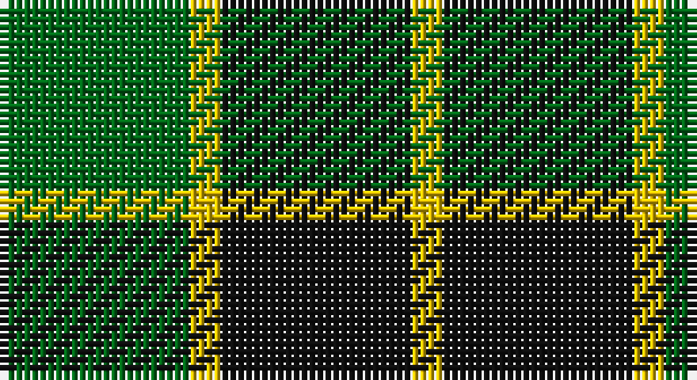

This page is one **sett** — a single exact thread-count. It belongs to the [tartan](/setts/k6ly1g6/)
(the same proportion at any scale), whose colour order is pattern [GYKY](/stripes/gyky/).

Sourced from register-of-tartans.  It is a [4 stripe tartan](/stripes/stripes4/).

Original link https://www.tartanregister.gov.uk/tartanDetails.aspx?ref=4729

## Also known as

This cloth is also recorded under:

- Wilson's, No 197

## Register references

External register numbers recorded for this tartan.

- Scottish Register of Tartans: [4729](https://www.tartanregister.gov.uk/tartanDetails.aspx?ref=4729)
- Scottish Tartans Authority (ITI): 1017
- Scottish Tartans World Register: 1017

## Thread count
G/24 Y4 K24 Y/4

One full sett is **84 threads**.

## Palette

Palette: <strong>Tartan Register</strong>
<table><thead><tr><th>Colour</th><th>Threads</th><th>Shade</th><th>Base</th><th>OKLCh</th></tr></thead><tbody><tr><td>G/</td><td style="text-align:right;font-variant-numeric:tabular-nums">24</td><td><code style="background-color:#006818;">#006818</code> <small style="color:#888">#006818</small></td><td>G <code style="background-color:#006100;">#006100</code></td><td><small style="color:#888">oklch(45.0% 0.142 145.0)</small></td></tr><tr><td>Y</td><td style="text-align:right;font-variant-numeric:tabular-nums">4</td><td><code style="background-color:#E8C000;">#E8C000</code> <small style="color:#888">#E8C000</small></td><td>Y <code style="background-color:#F2BF00;">#F2BF00</code></td><td><small style="color:#888">oklch(81.9% 0.168 93.7)</small></td></tr><tr><td>K</td><td style="text-align:right;font-variant-numeric:tabular-nums">24</td><td><code style="background-color:#101010;">#101010</code> <small style="color:#888">#101010</small></td><td>K <code style="background-color:#000000;">#000000</code></td><td><small style="color:#888">oklch(17.3% 0.000 89.9)</small></td></tr><tr><td>Y/</td><td style="text-align:right;font-variant-numeric:tabular-nums">4</td><td><code style="background-color:#E8C000;">#E8C000</code> <small style="color:#888">#E8C000</small></td><td>Y <code style="background-color:#F2BF00;">#F2BF00</code></td><td><small style="color:#888">oklch(81.9% 0.168 93.7)</small></td></tr></tbody></table>

# Sample pattern

## Nearest tartans

The nearest existing variants by ΔTartan distance, with this tartan at the top so the swatches line up against it.

ΔTartan

Tartan

Sett

—

<a href="/ttd/edit/#slug=k6ly1g6~x4">Wilson's No.197</a> <a class="nn-out" href="/variants/s4/k6ly1g6~x4/" title="open its dictionary page">↗</a>

0.87

<a href="/ttd/edit/#slug=k30lb7g36k5~x2&amp;base=k6ly1g6~x4">Innes Hunting</a> <a class="nn-out" href="/variants/s4/k30lb7g36k5~x2/" title="open its dictionary page">↗</a>

1.05

<a href="/ttd/edit/#slug=k7w1g7t1~x2&amp;base=k6ly1g6~x4">Wilson's No.079</a> <a class="nn-out" href="/variants/s4/k7w1g7t1~x2/" title="open its dictionary page">↗</a>

1.17

<a href="/ttd/edit/#slug=k9g3k3g12ly2~x4&amp;base=k6ly1g6~x4">MacArthur</a> <a class="nn-out" href="/variants/s5/k9g3k3g12ly2~x4/" title="open its dictionary page">↗</a>

1.23

<a href="/ttd/edit/#slug=k30db7g36k5~x2&amp;base=k6ly1g6~x4">Innes, hunting</a> <a class="nn-out" href="/variants/s4/k30db7g36k5~x2/" title="open its dictionary page">↗</a>

1.26

<a href="/ttd/edit/#slug=g40k10r7k10r7&amp;base=k6ly1g6~x4">Romsdal</a> <a class="nn-out" href="/variants/s5/g40k10r7k10r7/" title="open its dictionary page">↗</a>

1.29

<a href="/ttd/edit/#slug=k7ly1g7t1~x2&amp;base=k6ly1g6~x4">Wilson's, No 140</a> <a class="nn-out" href="/variants/s4/k7ly1g7t1~x2/" title="open its dictionary page">↗</a>

1.36

<a href="/ttd/edit/#slug=lr1ly6k6ly1~x2&amp;base=k6ly1g6~x4">Barclay Dress</a> <a class="nn-out" href="/variants/s4/lr1ly6k6ly1~x2/" title="open its dictionary page">↗</a>

1.36

<a href="/ttd/edit/#slug=lr1ly6k6ly1&amp;base=k6ly1g6~x4">Barclay Dress</a> <a class="nn-out" href="/variants/s4/lr1ly6k6ly1/" title="open its dictionary page">↗</a>

1.43

<a href="/ttd/edit/#slug=k3g15k20ly3~x2&amp;base=k6ly1g6~x4">Scotch Tape 2 (Corporate)</a> <a class="nn-out" href="/variants/s4/k3g15k20ly3~x2/" title="open its dictionary page">↗</a>

1.47

<a href="/ttd/edit/#slug=k6ly1g6~x4">Wilson's, No 197</a> <a class="nn-out" href="/variants/s3/k6ly1g6~x4/" title="open its dictionary page">↗</a>

## Neighbour map

Every grey dot is one of 14360 variants placed by the first two principal components of the ΔTartan feature space (44% of its variance). Red is this tartan; blue dots are its nearest — click one to open its page.

<svg viewBox="0 0 640 380" role="img" style="max-width:100%;height:auto;border:1px solid #e0e0e0;border-radius:4px;display:block" xmlns="http://www.w3.org/2000/svg"><image href="/nn/cloud.v1.png" width="640" height="380"/><a href="/variants/s4/k30lb7g36k5~x2/"><circle cx="264.4" cy="278.1" r="4" fill="#3465a4"><title>Innes Hunting</title></circle></a><a href="/variants/s4/k7w1g7t1~x2/"><circle cx="221.7" cy="252.4" r="4" fill="#3465a4"><title>Wilson's No.079</title></circle></a><a href="/variants/s5/k9g3k3g12ly2~x4/"><circle cx="282.1" cy="279.6" r="4" fill="#3465a4"><title>MacArthur</title></circle></a><a href="/variants/s4/k30db7g36k5~x2/"><circle cx="243.2" cy="272.4" r="4" fill="#3465a4"><title>Innes, hunting</title></circle></a><a href="/variants/s5/g40k10r7k10r7/"><circle cx="261.3" cy="246.1" r="4" fill="#3465a4"><title>Romsdal</title></circle></a><a href="/variants/s4/k7ly1g7t1~x2/"><circle cx="201.7" cy="245.8" r="4" fill="#3465a4"><title>Wilson's, No 140</title></circle></a><a href="/variants/s4/lr1ly6k6ly1~x2/"><circle cx="240.9" cy="256.5" r="4" fill="#3465a4"><title>Barclay Dress</title></circle></a><a href="/variants/s4/lr1ly6k6ly1/"><circle cx="240.9" cy="256.5" r="4" fill="#3465a4"><title>Barclay Dress</title></circle></a><a href="/variants/s4/k3g15k20ly3~x2/"><circle cx="311.5" cy="279.8" r="4" fill="#3465a4"><title>Scotch Tape 2 (Corporate)</title></circle></a><a href="/variants/s3/k6ly1g6~x4/"><circle cx="221.0" cy="301.9" r="4" fill="#3465a4"><title>Wilson's, No 197</title></circle></a><circle cx="224.2" cy="273.2" r="5" fill="#c00000"/></svg>

ID: /variants/s4/k6ly1g6~x4/
