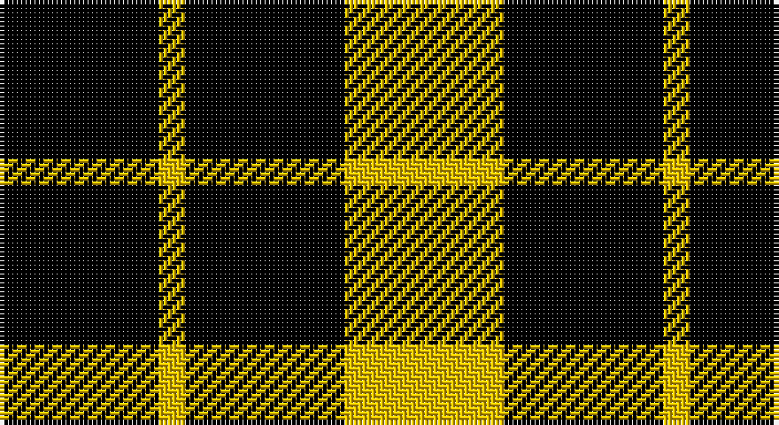

This page is one **sett** — a single exact thread-count. It belongs to the [tartan](/setts/k6ly1k6ly6/)
(the same proportion at any scale), whose colour order is pattern [KYKY](/stripes/kyky/).

Part of the [Raeburn](/tartans/raeburn/) tartan — the named design grouping this sett with its other cloths.

Sourced from weddslist.  It is a [4 stripe tartan](/stripes/stripes4/).

Original link http://www.weddslist.com/cgi-bin/tartans/pg.pl?source=sts

## Provenance

Earliest known date: 1930 Very little is known about the origin of the tartan other than that it first appeared in the trade lists of Ross's and Johnston's around 1930. It bears a family resemblance to the MacLeod illustrated in the Vestiarium Scoticum in 1842 but the yellow bands are considerably narrower and there is no central red stripe. The name derives from the old lands of Rayburn in the Parish of Dunlop in Ayrshire. Undoubtedly the most famous person of the name was Sir Henry Raeburn (1756 - 1823) to whom we are indebted for so many famous paintings including the famous 'The MacNab'. He was knighted during the Royal visit to Edinburgh of King George IV in 1822.

2 attestations — the source records this cloth was collapsed from (oldest owns this page)

<ul>
<li>undated — Raeburn (weddslist, <a href="http://www.weddslist.com/cgi-bin/tartans/pg.pl?source=sts">record</a>)</li>
<li>undated — Raeburn Family Tartan (house-of-tartan, <a href="http://www.house-of-tartan.scotland.net/house/TartanViewjs.asp?colr=Def&tnam=1275">record</a>)</li>
</ul>

## Thread count
K/36 Y6 K36 Y/36

One full sett is **156 threads**.

## Palette

Palette: <strong>Ingles Buchan</strong> <small style="color:#888">(1 of 2 colours)</small>
<table><thead><tr><th>Colour</th><th>Threads</th><th>Shade</th><th>Base</th><th>OKLCh</th></tr></thead><tbody><tr><td>K/</td><td style="text-align:right;font-variant-numeric:tabular-nums">36</td><td><code style="background-color:#000000;">#000000</code> <small style="color:#888">#000000</small></td><td>K <code style="background-color:#000000;">#000000</code></td><td><small style="color:#888">oklch(0.0% 0.000 0.0)</small></td></tr><tr><td>Y</td><td style="text-align:right;font-variant-numeric:tabular-nums">6</td><td><code style="background-color:#F0C000;">#F0C000</code> <small style="color:#888">#F0C000</small></td><td>Y <code style="background-color:#F2BF00;">#F2BF00</code></td><td><small style="color:#888">oklch(82.7% 0.169 90.5)</small></td></tr><tr><td>K</td><td style="text-align:right;font-variant-numeric:tabular-nums">36</td><td><code style="background-color:#000000;">#000000</code> <small style="color:#888">#000000</small></td><td>K <code style="background-color:#000000;">#000000</code></td><td><small style="color:#888">oklch(0.0% 0.000 0.0)</small></td></tr><tr><td>Y/</td><td style="text-align:right;font-variant-numeric:tabular-nums">36</td><td><code style="background-color:#F0C000;">#F0C000</code> <small style="color:#888">#F0C000</small></td><td>Y <code style="background-color:#F2BF00;">#F2BF00</code></td><td><small style="color:#888">oklch(82.7% 0.169 90.5)</small></td></tr></tbody></table>

# Sample pattern

## Compared to the master

This cloth is one sett of its design; the master sett (the exemplar the design is anchored on) is below for comparison.

<figure style="margin:0"><figcaption style="color:#888;font-size:smaller">this sett</figcaption></figure>
<figure style="margin:0"><figcaption style="color:#888;font-size:smaller"><a href="/setts/k34ly3k34ly26/">master sett →</a></figcaption></figure>

## Nearest tartans

The nearest existing variants by ΔTartan distance, with this tartan at the top so the swatches line up against it.

ΔTartan

Tartan

Sett

—

<a href="/ttd/edit/#slug=k6ly1k6ly6~x6">Raeburn</a> <a class="nn-out" href="/variants/s4/k6ly1k6ly6~x6/" title="open its dictionary page">↗</a>

1.41

<a href="/ttd/edit/#slug=k34ly3k34ly26~x2&amp;base=k6ly1k6ly6~x6">Raeburn</a> <a class="nn-out" href="/variants/s4/k34ly3k34ly26~x2/" title="open its dictionary page">↗</a>

1.78

<a href="/variants/s4/k7lr6k1~x2/">MacFarlane VS</a>

1.78

<a href="/variants/s4/k7lr6k1/">MacFarlane VS</a>

2.05

<a href="/ttd/edit/#slug=k23g8lo8~x4&amp;base=k6ly1k6ly6~x6">Zwijnenberg, Frans (Personal)</a> <a class="nn-out" href="/variants/s3/k23g8lo8~x4/" title="open its dictionary page">↗</a>

2.10

<a href="/ttd/edit/#slug=k23g8ly8~x4&amp;base=k6ly1k6ly6~x6">Zwijnenberg, Frans (Personal)</a> <a class="nn-out" href="/variants/s3/k23g8ly8~x4/" title="open its dictionary page">↗</a>

2.11

<a href="/ttd/edit/#slug=k46o7k8w20~x2&amp;base=k6ly1k6ly6~x6">Lords, of Skye</a> <a class="nn-out" href="/variants/s4/k46o7k8w20~x2/" title="open its dictionary page">↗</a>

2.12

<a href="/ttd/edit/#slug=g9k18r2~x4&amp;base=k6ly1k6ly6~x6">Cowie, Justine (Personal)</a> <a class="nn-out" href="/variants/s3/g9k18r2~x4/" title="open its dictionary page">↗</a>

2.16

<a href="/ttd/edit/#slug=k4g6r1~x10&amp;base=k6ly1k6ly6~x6">Kincaid, of Kincaid</a> <a class="nn-out" href="/variants/s3/k4g6r1~x10/" title="open its dictionary page">↗</a>

2.18

<a href="/ttd/edit/#slug=k46dy7k8w20~x2&amp;base=k6ly1k6ly6~x6">Lords of Skye (Fashion?)</a> <a class="nn-out" href="/variants/s4/k46dy7k8w20~x2/" title="open its dictionary page">↗</a>

2.22

<a href="/ttd/edit/#slug=k8ly1k8ly12r1~x2&amp;base=k6ly1k6ly6~x6">MacLeod of Lewis</a> <a class="nn-out" href="/variants/s5/k8ly1k8ly12r1~x2/" title="open its dictionary page">↗</a>

## Neighbour map

Every grey dot is one of 14360 variants placed by the first two principal components of the ΔTartan feature space (44% of its variance). Red is this tartan; blue dots are its nearest — click one to open its page.

<svg viewBox="0 0 640 380" role="img" style="max-width:100%;height:auto;border:1px solid #e0e0e0;border-radius:4px;display:block" xmlns="http://www.w3.org/2000/svg"><image href="/nn/cloud.v1.png" width="640" height="380"/><a href="/variants/s4/k34ly3k34ly26~x2/"><circle cx="389.9" cy="279.3" r="4" fill="#3465a4"><title>Raeburn</title></circle></a><a href="/variants/s4/k7lr6k1~x2/"><circle cx="299.5" cy="294.4" r="4" fill="#3465a4"><title>MacFarlane VS</title></circle></a><a href="/variants/s4/k7lr6k1/"><circle cx="299.5" cy="294.4" r="4" fill="#3465a4"><title>MacFarlane VS</title></circle></a><a href="/variants/s3/k23g8lo8~x4/"><circle cx="241.3" cy="325.1" r="4" fill="#3465a4"><title>Zwijnenberg, Frans (Personal)</title></circle></a><a href="/variants/s3/k23g8ly8~x4/"><circle cx="240.8" cy="320.6" r="4" fill="#3465a4"><title>Zwijnenberg, Frans (Personal)</title></circle></a><a href="/variants/s4/k46o7k8w20~x2/"><circle cx="336.8" cy="257.5" r="4" fill="#3465a4"><title>Lords, of Skye</title></circle></a><a href="/variants/s3/g9k18r2~x4/"><circle cx="342.6" cy="278.7" r="4" fill="#3465a4"><title>Cowie, Justine (Personal)</title></circle></a><a href="/variants/s3/k4g6r1~x10/"><circle cx="257.7" cy="300.5" r="4" fill="#3465a4"><title>Kincaid, of Kincaid</title></circle></a><a href="/variants/s4/k46dy7k8w20~x2/"><circle cx="334.9" cy="250.9" r="4" fill="#3465a4"><title>Lords of Skye (Fashion?)</title></circle></a><a href="/variants/s5/k8ly1k8ly12r1~x2/"><circle cx="286.1" cy="223.9" r="4" fill="#3465a4"><title>MacLeod of Lewis</title></circle></a><circle cx="312.1" cy="307.4" r="5" fill="#c00000"/></svg>

ID: /variants/s4/k6ly1k6ly6~x6/
