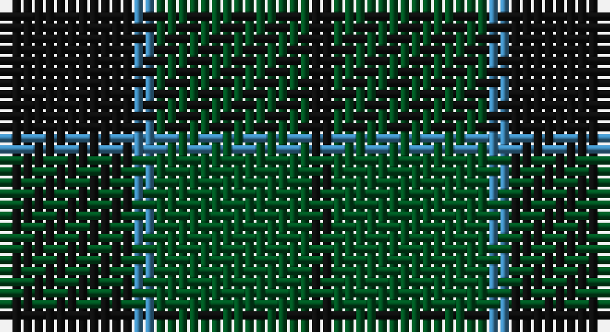

This page is one **sett** — a single exact thread-count. It belongs to the [tartan](/setts/k6t1dg7k1/)
(the same proportion at any scale), whose colour order is pattern [KBGK](/stripes/kbgk/).

Part of the [Innes](/tartans/innes/) tartan — the named design grouping this sett with its other cloths.

Sourced from register-of-tartans.  It is a [4 stripe tartan](/stripes/stripes4/).

Original link https://www.tartanregister.gov.uk/tartanDetails.aspx?ref=1827

## Also known as

This cloth is also recorded under:

- Innes 6 Colours
- Innes,
- Innes, Georgina

## Register references

External register numbers recorded for this tartan.

- Scottish Register of Tartans: [1827](https://www.tartanregister.gov.uk/tartanDetails.aspx?ref=1827)
- Scottish Tartans Authority (ITI): 235
- Scottish Tartans World Register: 235

## Thread count
K/12 B2 G14 K/2

One full sett is **46 threads**.

## Palette

Palette: <strong>Tartan Register</strong>
<table><thead><tr><th>Colour</th><th>Threads</th><th>Shade</th><th>Base</th><th>OKLCh</th></tr></thead><tbody><tr><td>K/</td><td style="text-align:right;font-variant-numeric:tabular-nums">12</td><td><code style="background-color:#101010;">#101010</code> <small style="color:#888">#101010</small></td><td>K <code style="background-color:#000000;">#000000</code></td><td><small style="color:#888">oklch(17.3% 0.000 89.9)</small></td></tr><tr><td>B</td><td style="text-align:right;font-variant-numeric:tabular-nums">2</td><td><code style="background-color:#3C82AF;">#3C82AF</code> <small style="color:#888">#3C82AF</small></td><td>B <code style="background-color:#2A418A;">#2A418A</code></td><td><small style="color:#888">oklch(58.1% 0.099 239.8)</small></td></tr><tr><td>G</td><td style="text-align:right;font-variant-numeric:tabular-nums">14</td><td><code style="background-color:#005020;">#005020</code> <small style="color:#888">#005020</small></td><td>G <code style="background-color:#006100;">#006100</code></td><td><small style="color:#888">oklch(37.7% 0.105 149.6)</small></td></tr><tr><td>K/</td><td style="text-align:right;font-variant-numeric:tabular-nums">2</td><td><code style="background-color:#101010;">#101010</code> <small style="color:#888">#101010</small></td><td>K <code style="background-color:#000000;">#000000</code></td><td><small style="color:#888">oklch(17.3% 0.000 89.9)</small></td></tr></tbody></table>

# Sample pattern

## Compared to the master

This cloth is one sett of its design; the master sett (the exemplar the design is anchored on) is below for comparison.

<figure style="margin:0"><figcaption style="color:#888;font-size:smaller">this sett</figcaption></figure>
<figure style="margin:0"><figcaption style="color:#888;font-size:smaller"><a href="/setts/k2g12r2k2r2k2r16ly2r3db6r3k1g8k1r3w2/">master sett →</a></figcaption></figure>

## Nearest tartans

The nearest existing variants by ΔTartan distance, with this tartan at the top so the swatches line up against it.

ΔTartan

Tartan

Sett

—

<a href="/ttd/edit/#slug=k6t1dg7k1~x2">Innes (Miniature)</a> <a class="nn-out" href="/variants/s4/k6t1dg7k1~x2/" title="open its dictionary page">↗</a>

1.41

<a href="/ttd/edit/#slug=dg15r3db11t2~x2&amp;base=k6t1dg7k1~x2">MacNab</a> <a class="nn-out" href="/variants/s4/dg15r3db11t2~x2/" title="open its dictionary page">↗</a>

1.52

<a href="/ttd/edit/#slug=k3g14k14g2dt14g3~x2&amp;base=k6t1dg7k1~x2">MacKay Clan Tartan</a> <a class="nn-out" href="/variants/s6/k3g14k14g2dt14g3~x2/" title="open its dictionary page">↗</a>

1.58

<a href="/variants/s4/db13r2g13~x2/">Wilson's No.062</a>

1.60

<a href="/ttd/edit/#slug=k11g16r2~x4&amp;base=k6t1dg7k1~x2">Kincaid of Kincaid (Clan)</a> <a class="nn-out" href="/variants/s3/k11g16r2~x4/" title="open its dictionary page">↗</a>

1.61

<a href="/ttd/edit/#slug=k5g23k18db21k33db3~x2&amp;base=k6t1dg7k1~x2">Black Watch (variation)</a> <a class="nn-out" href="/variants/s6/k5g23k18db21k33db3~x2/" title="open its dictionary page">↗</a>

1.63

<a href="/ttd/edit/#slug=db2dg15do3db7dg7db2~x4&amp;base=k6t1dg7k1~x2">Green Highland, The (Fashion)</a> <a class="nn-out" href="/variants/s6/db2dg15do3db7dg7db2~x4/" title="open its dictionary page">↗</a>

1.63

<a href="/ttd/edit/#slug=g6k2r3k1~x4&amp;base=k6t1dg7k1~x2">Red Watch (Fashion) #1</a> <a class="nn-out" href="/variants/s4/g6k2r3k1~x4/" title="open its dictionary page">↗</a>

1.63

<a href="/ttd/edit/#slug=dg2k12dg1k12dg12r2~x2&amp;base=k6t1dg7k1~x2">Gunn (Logan)</a> <a class="nn-out" href="/variants/s6/dg2k12dg1k12dg12r2~x2/" title="open its dictionary page">↗</a>

1.64

<a href="/ttd/edit/#slug=k3dg20k20g20k3~x2&amp;base=k6t1dg7k1~x2">MacCormick Hunting (Name)</a> <a class="nn-out" href="/variants/s5/k3dg20k20g20k3~x2/" title="open its dictionary page">↗</a>

1.64

<a href="/ttd/edit/#slug=g17r2db15~x2&amp;base=k6t1dg7k1~x2">Ferguson - 1930 (Old)</a> <a class="nn-out" href="/variants/s3/g17r2db15~x2/" title="open its dictionary page">↗</a>

## Neighbour map

Every grey dot is one of 14360 variants placed by the first two principal components of the ΔTartan feature space (44% of its variance). Red is this tartan; blue dots are its nearest — click one to open its page.

<svg viewBox="0 0 640 380" role="img" style="max-width:100%;height:auto;border:1px solid #e0e0e0;border-radius:4px;display:block" xmlns="http://www.w3.org/2000/svg"><image href="/nn/cloud.v1.png" width="640" height="380"/><a href="/variants/s4/dg15r3db11t2~x2/"><circle cx="282.6" cy="278.9" r="4" fill="#3465a4"><title>MacNab</title></circle></a><a href="/variants/s6/k3g14k14g2dt14g3~x2/"><circle cx="250.8" cy="292.7" r="4" fill="#3465a4"><title>MacKay Clan Tartan</title></circle></a><a href="/variants/s4/db13r2g13~x2/"><circle cx="272.9" cy="285.6" r="4" fill="#3465a4"><title>Wilson's No.062</title></circle></a><a href="/variants/s3/k11g16r2~x4/"><circle cx="338.8" cy="314.8" r="4" fill="#3465a4"><title>Kincaid of Kincaid (Clan)</title></circle></a><a href="/variants/s6/k5g23k18db21k33db3~x2/"><circle cx="346.5" cy="290.3" r="4" fill="#3465a4"><title>Black Watch (variation)</title></circle></a><a href="/variants/s6/db2dg15do3db7dg7db2~x4/"><circle cx="389.1" cy="291.2" r="4" fill="#3465a4"><title>Green Highland, The (Fashion)</title></circle></a><a href="/variants/s4/g6k2r3k1~x4/"><circle cx="283.4" cy="302.7" r="4" fill="#3465a4"><title>Red Watch (Fashion) #1</title></circle></a><a href="/variants/s6/dg2k12dg1k12dg12r2~x2/"><circle cx="403.1" cy="269.8" r="4" fill="#3465a4"><title>Gunn (Logan)</title></circle></a><a href="/variants/s5/k3dg20k20g20k3~x2/"><circle cx="276.8" cy="321.4" r="4" fill="#3465a4"><title>MacCormick Hunting (Name)</title></circle></a><a href="/variants/s3/g17r2db15~x2/"><circle cx="326.6" cy="314.4" r="4" fill="#3465a4"><title>Ferguson - 1930 (Old)</title></circle></a><circle cx="336.5" cy="309.1" r="5" fill="#c00000"/></svg>

ID: /variants/s4/k6t1dg7k1~x2/
