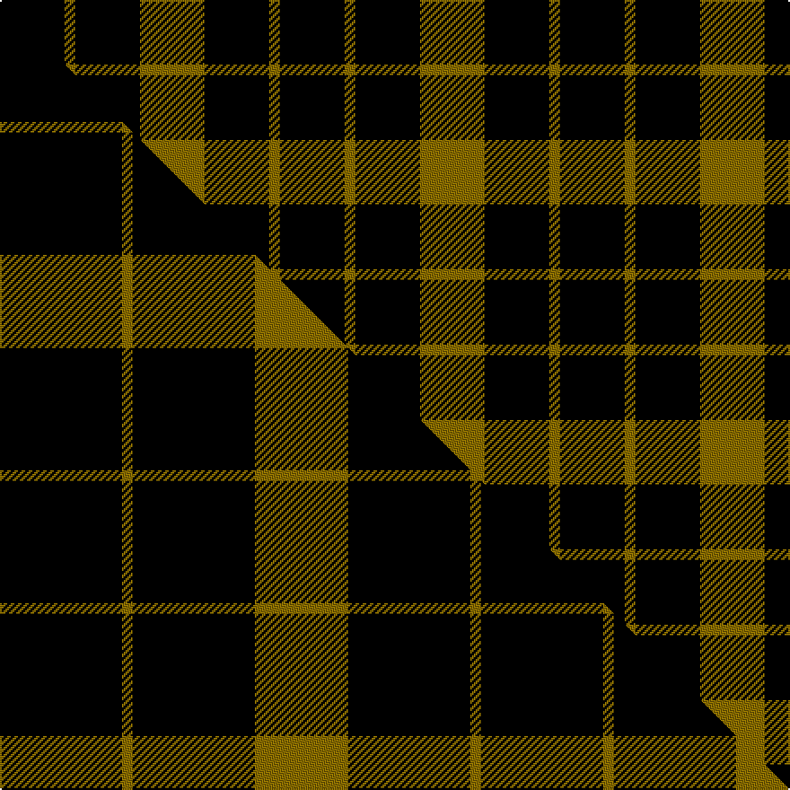

This page is one **sett** — a single exact thread-count. It belongs to the [tartan](/setts/k6y1k6y6/)
(the same proportion at any scale), whose colour order is pattern [GKGK](/stripes/gkgk/).

Part of the [Raeburn](/tartans/raeburn/) tartan — the named design grouping this sett with its other cloths.

Sourced from weddslist.  It is a [4 stripe tartan](/stripes/stripes4/).

Original link http://www.weddslist.com/cgi-bin/tartans/pg.pl?source=sts

## Provenance

Earliest known date: 1930 Very little is known about the origin of the tartan other than that it first appeared in the trade lists of Ross's and Johnston's around 1930. It bears a family resemblance to the MacLeod illustrated in the Vestiarium Scoticum in 1842 but the yellow bands are considerably narrower and there is no central red stripe. The name derives from the old lands of Rayburn in the Parish of Dunlop in Ayrshire. Undoubtedly the most famous person of the name was Sir Henry Raeburn (1756 - 1823) to whom we are indebted for so many famous paintings including the famous 'The MacNab'. He was knighted during the Royal visit to Edinburgh of King George IV in 1822.

2 attestations — the source records this cloth was collapsed from (oldest owns this page)

<ul>
<li>undated — Raeburn (weddslist, <a href="http://www.weddslist.com/cgi-bin/tartans/pg.pl?source=sts">record</a>) </li>
<li>undated — Raeburn Family Tartan (house-of-tartan, <a href="http://www.house-of-tartan.scotland.net/house/TartanViewjs.asp?colr=Def&tnam=1275">record</a>) </li>
</ul>

## Thread count
K/36 Y6 K36 Y/36

One full sett is **156 threads**.

## Palette
<table><thead><tr><th>Colour</th><th>Shade</th><th>OKLCh</th></tr></thead><tbody><tr><td>K</td><td><code style="background-color:#000000;">#000000</code> <small style="color:#888">#000000</small></td><td><small style="color:#888">oklch(0.0% 0.000 0.0)</small></td></tr><tr><td>Y</td><td><code style="background-color:#8B6E00;">#8B6E00</code> <small style="color:#888">#8B6E00</small></td><td><small style="color:#888">oklch(55.1% 0.113 90.4)</small></td></tr></tbody></table>

# Sample pattern

## Compared to the master

This cloth is one sett of its design; the master sett (the exemplar the design is anchored on) is below for comparison.

Its **ΔTartan distance** from the master is **1.28** — the same measure the nearest-tartans table ranks by (0 is identical; a re-scale of the same cloth is near 0, a recolour or a different proportion further).

<figure class="master-compare" style="margin:0">

this sett
master sett ★

<figcaption style="color:#888;font-size:smaller">One weave of this sett against the <a href="/setts/k34y3k34y26/">master sett ★</a>, split on the diagonal: a shared proportion runs seamlessly across it with only the shades shifting; a different proportion breaks on it.</figcaption>
</figure>

## Nearest variants

The nearest existing variants by ΔTartan distance, with this cloth at the top so the swatches line up against it.

ΔTartan

Threads

Variant

Sett

—

156

<a href="/variants/s4/k6y1k6y6~x6/">Raeburn</a>

<a href="/ttd/edit/#slug=k34y3k34y26~x2&amp;base=k6y1k6y6~x6" title="compare in the TTD">0.59</a>

268

<a href="/variants/s4/k34y3k34y26~x2/">Raeburn</a>

<a href="/ttd/edit/#slug=k34ly3k34ly26~x2&amp;base=k6y1k6y6~x6" title="compare in the TTD">0.59</a>

268

<a href="/variants/s4/k34ly3k34ly26~x2/">Raeburn (Name)</a>

<a href="/ttd/edit/#slug=k4y1k4y6r1~x4&amp;base=k6y1k6y6~x6" title="compare in the TTD">0.79</a>

108

<a href="/variants/s5/k4y1k4y6r1~x4/">MacLeod Dress Clan Tartan</a>

<a href="/ttd/edit/#slug=k8y1k8y12r1~x4&amp;base=k6y1k6y6~x6" title="compare in the TTD">0.85</a>

204

<a href="/variants/s5/k8y1k8y12r1~x4/">MacLeod of Lewis (Vestiarium Scoticum)</a>

<a href="/ttd/edit/#slug=k8y1k8y12r1~x2&amp;base=k6y1k6y6~x6" title="compare in the TTD">0.85</a>

102

<a href="/variants/s5/k8y1k8y12r1~x2/">MacLeod of Lewis</a>

<a href="/ttd/edit/#slug=k5y1k1~x12&amp;base=k6y1k6y6~x6" title="compare in the TTD">0.85</a>

96

<a href="/variants/s3/k5y1k1~x12/">Justus</a>

<a href="/ttd/edit/#slug=y20k15y20w3~x2&amp;base=k6y1k6y6~x6" title="compare in the TTD">1.70</a>

186

<a href="/variants/s4/y20k15y20w3~x2/">Silvicola</a>

<a href="/ttd/edit/#slug=y1k6y6w1~x2&amp;base=k6y1k6y6~x6" title="compare in the TTD">1.89</a>

52

<a href="/variants/s4/y1k6y6w1~x2/">Barclay Dress</a>

<a href="/ttd/edit/#slug=y1k6y6w1&amp;base=k6y1k6y6~x6" title="compare in the TTD">1.89</a>

26

<a href="/variants/s4/y1k6y6w1/">Barclay Dress</a>

<a href="/ttd/edit/#slug=y1k6y6w1~x8&amp;base=k6y1k6y6~x6" title="compare in the TTD">1.89</a>

208

<a href="/variants/s4/y1k6y6w1~x8/">Barclay Dress Clan Tartan</a>

## Neighbour map

Every grey dot is one of 13620 variants placed by the first two principal components of the ΔTartan feature space (42% of its variance). Red is this tartan; blue dots are its nearest — click one to open its page.

<svg viewBox="0 0 640 380" role="img" style="max-width:100%;height:auto;border:1px solid #e0e0e0;border-radius:4px;display:block" xmlns="http://www.w3.org/2000/svg"><image href="/nn/cloud.v1.png" width="640" height="380"/><a href="/variants/s4/k34y3k34y26~x2/"><circle cx="379.4" cy="253.3" r="4" fill="#3465a4"><title>Raeburn</title></circle></a><a href="/variants/s4/k34ly3k34ly26~x2/"><circle cx="362.8" cy="252.2" r="4" fill="#3465a4"><title>Raeburn (Name)</title></circle></a><a href="/variants/s5/k4y1k4y6r1~x4/"><circle cx="230.2" cy="245.5" r="4" fill="#3465a4"><title>MacLeod Dress Clan Tartan</title></circle></a><a href="/variants/s5/k8y1k8y12r1~x4/"><circle cx="280.7" cy="207.6" r="4" fill="#3465a4"><title>MacLeod of Lewis (Vestiarium Scoticum)</title></circle></a><a href="/variants/s5/k8y1k8y12r1~x2/"><circle cx="280.7" cy="207.6" r="4" fill="#3465a4"><title>MacLeod of Lewis</title></circle></a><a href="/variants/s3/k5y1k1~x12/"><circle cx="416.8" cy="248.3" r="4" fill="#3465a4"><title>Justus</title></circle></a><a href="/variants/s4/y20k15y20w3~x2/"><circle cx="322.5" cy="267.7" r="4" fill="#3465a4"><title>Silvicola</title></circle></a><a href="/variants/s4/y1k6y6w1~x2/"><circle cx="237.6" cy="245.4" r="4" fill="#3465a4"><title>Barclay Dress</title></circle></a><a href="/variants/s4/y1k6y6w1/"><circle cx="237.6" cy="245.4" r="4" fill="#3465a4"><title>Barclay Dress</title></circle></a><a href="/variants/s4/y1k6y6w1~x8/"><circle cx="237.6" cy="245.4" r="4" fill="#3465a4"><title>Barclay Dress Clan Tartan</title></circle></a><circle cx="311.9" cy="286.1" r="5" fill="#c00000"/><text x="320" y="376" text-anchor="middle" font-size="11" fill="#999">ground</text><text x="11" y="190" text-anchor="middle" font-size="11" fill="#999" transform="rotate(-90 11 190)">complexity</text></svg>

ID: /variants/s4/k6y1k6y6~x6/
