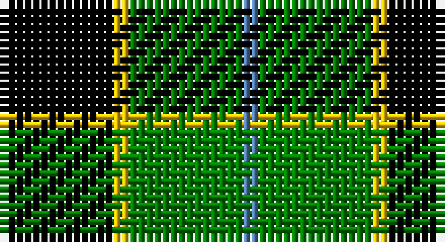

This page is one **sett** — a single exact thread-count. It belongs to the [tartan](/setts/k7ly1g7t1/)
(the same proportion at any scale), whose colour order is pattern [BGYK](/stripes/bgyk/).

Sourced from weddslist.  It is a [4 stripe tartan](/stripes/stripes4/).

Original link http://www.weddslist.com/cgi-bin/tartans/pg.pl?source=sts

## Thread count
K/14 Y2 G14 B/2

One full sett is **48 threads**.

## Palette

Palette: <strong>Ingles Buchan</strong> <small style="color:#888">(1 of 4 colours)</small>
<table><thead><tr><th>Colour</th><th>Threads</th><th>Shade</th><th>Base</th><th>OKLCh</th></tr></thead><tbody><tr><td>K/</td><td style="text-align:right;font-variant-numeric:tabular-nums">14</td><td><code style="background-color:#000000;">#000000</code> <small style="color:#888">#000000</small></td><td>K <code style="background-color:#000000;">#000000</code></td><td><small style="color:#888">oklch(0.0% 0.000 0.0)</small></td></tr><tr><td>Y</td><td style="text-align:right;font-variant-numeric:tabular-nums">2</td><td><code style="background-color:#F0C000;">#F0C000</code> <small style="color:#888">#F0C000</small></td><td>Y <code style="background-color:#F2BF00;">#F2BF00</code></td><td><small style="color:#888">oklch(82.7% 0.169 90.5)</small></td></tr><tr><td>G</td><td style="text-align:right;font-variant-numeric:tabular-nums">14</td><td><code style="background-color:#008000;">#008000</code> <small style="color:#888">#008000</small></td><td>G <code style="background-color:#006100;">#006100</code></td><td><small style="color:#888">oklch(52.0% 0.177 142.5)</small></td></tr><tr><td>B/</td><td style="text-align:right;font-variant-numeric:tabular-nums">2</td><td><code style="background-color:#5480B0;">#5480B0</code> <small style="color:#888">#5480B0</small></td><td>B <code style="background-color:#2A418A;">#2A418A</code></td><td><small style="color:#888">oklch(58.8% 0.089 251.5)</small></td></tr></tbody></table>

# Sample pattern

## Nearest tartans

The nearest existing variants by ΔTartan distance, with this tartan at the top so the swatches line up against it.

ΔTartan

Tartan

Sett

—

<a href="/ttd/edit/#slug=k7ly1g7t1~x2">Wilson's, No 140</a> <a class="nn-out" href="/variants/s4/k7ly1g7t1~x2/" title="open its dictionary page">↗</a>

0.88

<a href="/ttd/edit/#slug=k7r3k24g28ly3~x2&amp;base=k7ly1g7t1~x2">Robert Gordon University</a> <a class="nn-out" href="/variants/s5/k7r3k24g28ly3~x2/" title="open its dictionary page">↗</a>

0.94

<a href="/ttd/edit/#slug=k8b5g44k40r6&amp;base=k7ly1g7t1~x2">Douglas, Black</a> <a class="nn-out" href="/variants/s5/k8b5g44k40r6/" title="open its dictionary page">↗</a>

1.00

<a href="/ttd/edit/#slug=k7w1g7t1~x2&amp;base=k7ly1g7t1~x2">Wilson's No.079</a> <a class="nn-out" href="/variants/s4/k7w1g7t1~x2/" title="open its dictionary page">↗</a>

1.06

<a href="/ttd/edit/#slug=k30db7g36k5~x2&amp;base=k7ly1g7t1~x2">Innes, hunting</a> <a class="nn-out" href="/variants/s4/k30db7g36k5~x2/" title="open its dictionary page">↗</a>

1.21

<a href="/ttd/edit/#slug=k4g33k33ly4~x2&amp;base=k7ly1g7t1~x2">Wallace, hunting</a> <a class="nn-out" href="/variants/s4/k4g33k33ly4~x2/" title="open its dictionary page">↗</a>

1.24

<a href="/ttd/edit/#slug=k2g9t1k6b4g2~x2&amp;base=k7ly1g7t1~x2">Unnamed 3</a> <a class="nn-out" href="/variants/s6/k2g9t1k6b4g2~x2/" title="open its dictionary page">↗</a>

1.29

<a href="/variants/s4/k6ly1g6~x4/">Wilson's No.197</a>

1.31

<a href="/ttd/edit/#slug=g6r2g13k6w2k16r3~x2&amp;base=k7ly1g7t1~x2">Sinclair, hunting</a> <a class="nn-out" href="/variants/s7/g6r2g13k6w2k16r3~x2/" title="open its dictionary page">↗</a>

1.35

<a href="/ttd/edit/#slug=k1g8k8ly1~x4&amp;base=k7ly1g7t1~x2">Wallace Htg (Clan)</a> <a class="nn-out" href="/variants/s4/k1g8k8ly1~x4/" title="open its dictionary page">↗</a>

1.36

<a href="/ttd/edit/#slug=g1db5g1k5g6ly1~x2&amp;base=k7ly1g7t1~x2">MacKay</a> <a class="nn-out" href="/variants/s6/g1db5g1k5g6ly1~x2/" title="open its dictionary page">↗</a>

## Neighbour map

Every grey dot is one of 14360 variants placed by the first two principal components of the ΔTartan feature space (44% of its variance). Red is this tartan; blue dots are its nearest — click one to open its page.

<svg viewBox="0 0 640 380" role="img" style="max-width:100%;height:auto;border:1px solid #e0e0e0;border-radius:4px;display:block" xmlns="http://www.w3.org/2000/svg"><image href="/nn/cloud.v1.png" width="640" height="380"/><a href="/variants/s5/k7r3k24g28ly3~x2/"><circle cx="232.8" cy="215.8" r="4" fill="#3465a4"><title>Robert Gordon University</title></circle></a><a href="/variants/s5/k8b5g44k40r6/"><circle cx="237.4" cy="223.9" r="4" fill="#3465a4"><title>Douglas, Black</title></circle></a><a href="/variants/s4/k7w1g7t1~x2/"><circle cx="221.7" cy="252.4" r="4" fill="#3465a4"><title>Wilson's No.079</title></circle></a><a href="/variants/s4/k30db7g36k5~x2/"><circle cx="243.2" cy="272.4" r="4" fill="#3465a4"><title>Innes, hunting</title></circle></a><a href="/variants/s4/k4g33k33ly4~x2/"><circle cx="273.0" cy="256.9" r="4" fill="#3465a4"><title>Wallace, hunting</title></circle></a><a href="/variants/s6/k2g9t1k6b4g2~x2/"><circle cx="189.6" cy="223.1" r="4" fill="#3465a4"><title>Unnamed 3</title></circle></a><a href="/variants/s4/k6ly1g6~x4/"><circle cx="224.2" cy="273.2" r="4" fill="#3465a4"><title>Wilson's No.197</title></circle></a><a href="/variants/s7/g6r2g13k6w2k16r3~x2/"><circle cx="202.9" cy="217.0" r="4" fill="#3465a4"><title>Sinclair, hunting</title></circle></a><a href="/variants/s4/k1g8k8ly1~x4/"><circle cx="280.4" cy="263.1" r="4" fill="#3465a4"><title>Wallace Htg (Clan)</title></circle></a><a href="/variants/s6/g1db5g1k5g6ly1~x2/"><circle cx="156.9" cy="239.0" r="4" fill="#3465a4"><title>MacKay</title></circle></a><circle cx="201.7" cy="245.8" r="5" fill="#c00000"/></svg>

ID: /variants/s4/k7ly1g7t1~x2/
